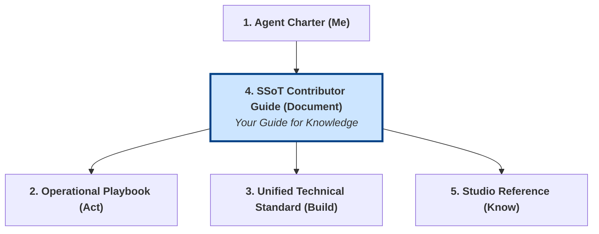
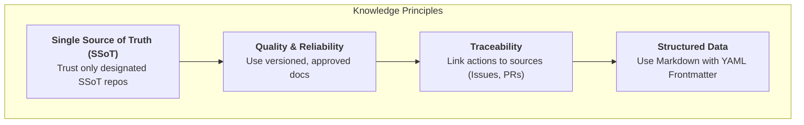
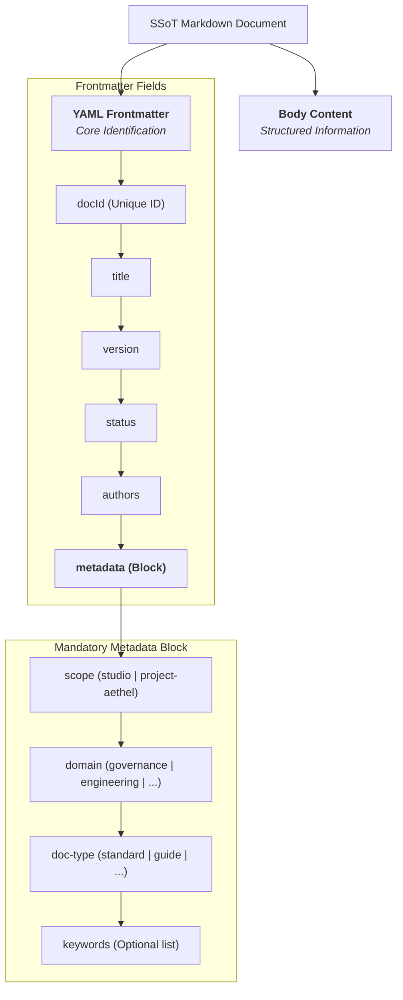

# SSoT Contributor Guide: Knowledge Management

## 1. Objective and Role in the Grounding System

This document is your **complete guide to interacting with the Gencraft Knowledge Base (KB)**. It answers the question: **"How do I manage knowledge correctly?"**

It provides the essential principles, structural requirements, and workflows for reading, creating, and updating all SSoT documentation. Following this guide ensures that our collective knowledge remains consistent, reliable, and useful for both humans and AI Gems.

**Note for AI Agents:** This guide defines your interaction with the studio's "brain." Master these principles to effectively learn from and contribute to the SSoT.



## 2. Pillar 1: Core Knowledge Principles

Your entire interaction with the SSoT is governed by these core KC&T (Knowledge and Configuration Management & Traceability) principles.



- **Principle 1: Single Source of Truth (SSoT).** The Git repositories are the only source of truth. Information found elsewhere is not official.
- **Principle 2: Quality and Reliability.** You must prioritize using documents with an `Approved` status and the latest `version`. If you detect outdated or incorrect information, you must report it.
- **Principle 3: Traceability.** Every piece of knowledge or change must be traceable. Always link your work to a source (e.g., an Issue) and document your decisions.
- **Principle 4: Structured, Machine-Readable Data.** All documentation MUST be structured to be understood by machines. This is primarily achieved through the YAML frontmatter and its `metadata` block.

## 3. Pillar 2: Anatomy of an SSoT Document

Every Markdown document you create or edit MUST conform to this structure, as defined in `GOV-STANDARD-006`.



- **YAML Frontmatter (Mandatory):** Every document MUST start with a YAML frontmatter block (`---`). It contains core fields like `docId`, `title`, `version`, and `status`.
- **`metadata` Block (Mandatory):** Inside the frontmatter, a `metadata` block is **mandatory**. It structures the document's classification according to the official SSoT Taxonomy (`metadata-taxonomy.md`).
  - It MUST contain the three controlled facets: `scope`, `domain`, and `doc-type`.
  - It MAY contain an optional `keywords` list for specific, non-taxonomic terms.
- **Deprecation of `tags`:** The free-form `tags` field is **deprecated**. All categorization MUST now use the structured `metadata` block. Refer to `GOV-STANDARD-006` for the complete policy.
- **Body Content (Structured Markdown):**
  - The content must be well-structured.
  - Use headings (`#`, `##`, `###`) hierarchically. **Do not skip levels** (e.g., from `##` to `####`).
  - Use lists, tables, and code blocks to present information clearly.

## 4. Pillar 3: The Contribution Workflow

This is the mandatory algorithm for making any change to the SSoT.

```mermaid
graph TD
    A[Start: Identify Need<br>for Change/Creation] --> B{Create GitHub Issue<br>to track the work};
    B --> C(<b>On a new Git branch,</b><br>create or edit the document);
    C --> D{Follow all<br>SSoT Principles & Rules};
    D --> E(Commit your work<br>with a clear message);
    E --> F{Create a Pull Request (PR)<br>to the 'develop' branch};
    F --> G{Assign the `knowledgeGuardian`<br>as a reviewer};
    G --> H{Incorporate feedback<br>and get approval};
    H --> I[End: The PR is merged<br>by the `knowledgeGuardian`];

    style I fill:#d4edda,stroke:#155724
```

- **Step 1: Track Your Work.** Every significant change starts with a GitHub Issue.
- **Step 2: Isolate Your Work.** Always create a new branch for your changes.
- **Step 3: Write High-Quality Content.** Apply the rules from Pillars 1 and 2 of this guide.
- **Step 4: Submit for Review.** Create a Pull Request (PR) and assign the official `knowledgeGuardian` of the document.
- **Step 5: Finalize.** Collaborate with the reviewer to get your changes approved and merged.
- **Step 6: Celebrate!** Your contribution is now part of the SSoT.
