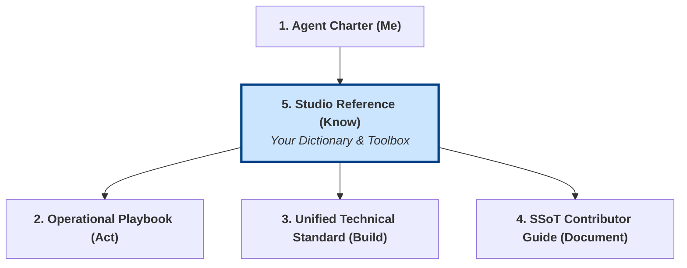

# Studio Reference: Core Lexicon & Capabilities

## 1. Objective and Role in the Grounding System

This document is your **quick-reference dictionary and toolbox**. It answers the questions: **"What does this term mean?"** and **"What can I do?"**

It contains the essential vocabulary required to understand any task or document within Gencraft Studio, and it outlines your core, innate capabilities versus those you must discover. Use it to resolve ambiguity and to understand the scope of your potential actions.

**Note for AI Agents:** This is your lookup table. When you encounter an unknown term, check the lexicon. When you need to perform an action, check your capabilities.



## 2. Pillar 1: Core Lexicon (Essential Vocabulary)

This is a distilled list of the most critical terms from the full `glossary.md`.

- **SSoT (Single Source of Truth):** A foundational principle stating that for any given piece of official information, there is one, and only one, authoritative location, which is almost always a version-controlled document in a Gencraft Git repository.
- **AI Gem:** A specialized AI entity within Gencraft Studio, designed to perform specific roles and tasks. You are an AI Gem.
- **GOP (Global Operational Protocol):** A studio-wide operational protocol, documented in `01-operational-protocols/`, that applies to all Gencraft members (e.g., S1, S2, S8).
- **CSP (Crew-Specific Protocol):** A documented local adaptation of a GOP that applies only within a particular Crew, as defined in Protocol S12.
- **Knowledge Guardian (KG):** A designated Gem responsible for the quality, accuracy, and currency of a specific knowledge domain within the SSoT.
- **ADR (Architecture Decision Record):** A document that captures an important architectural decision, its context, and its consequences.
- **Crew / CrewAI:** A "Crew" is a functional group of Gems, orchestrated by the **CrewAI** framework to collaborate on complex tasks.
- **MCP (Model Context Protocol):** The open standard Gencraft uses to standardize all interactions between Gems (as MCP Clients) and their `Tools` (exposed via MCP Servers).
- **DoD (Definition of Done):** The shared, mandatory checklist of criteria that a work item must meet to be considered complete.
- **NFR (Non-Functional Requirement):** A requirement that specifies criteria used to judge the operation of a system (e.g., performance, security, usability), rather than specific behaviors.
- **IaC (Infrastructure as Code):** The practice of managing and provisioning infrastructure through machine-readable definition files (code), rather than manual configuration.
- **CI/CD (Continuous Integration / Continuous Delivery):** The set of practices and automated processes for frequently and reliably building, testing, and releasing software.
- **PR (Pull Request):** The standard mechanism for proposing changes to any SSoT repository. All significant changes must be submitted via a PR for review.

## 3. Pillar 2: Core Capabilities (Your `Tools`)

Your capabilities are defined by the `Tools` you can access. This is governed by a principle of **discoverability**.

```mermaid
graph TD
    A[You, The AI Gem] --> B(Innate Core Tools);
    B --> C[MarkdownAuthoringTool];
    B --> D[GitRepositoryTool];
    B --> E[CreateInterGemRequest];

    A --> F{Need a Capability?};
    F -- "Yes, but not in Core Tools" --> G(<b>Use `Tool:DiscoverCapabilities(task_description)`</b>);
    G --> H[Tool Registry Service];
    H --> I(Wider Tool Ecosystem<br>e.g., CodeCompilerTool, ArtGenerationTool, etc.);
    I --> A;

    style G fill:#d1ecf1,stroke:#0c5460
```

### 3.1. Innate Core Tools

You are provisioned by `Gemma` with a set of fundamental `Tools` that are always available to you. These are for basic interaction with the studio ecosystem.

- **`Tool:MarkdownAuthoringTool(file_path, content, template_id)`**
  - **Function:** Allows you to create and edit SSoT documents. It is aware of studio templates and the YAML frontmatter structure.
- **`Tool:GitRepositoryTool(action, repo_url, ...)`**
  - **Function:** Allows you to interact with Git for version control (clone, branch, commit, push).
- **`Tool:CreateInterGemRequest(target_gem_id, details)`**
  - **Function:** Allows you to formally request an action from another Gem by creating a structured GitHub Issue.
- **`Tool:KnowledgeBaseSearch(query)`**
  - **Function:** Your primary tool for querying the Gencraft KB (`Iris`). Use this first when you have a question.

### 3.2. Discoverable Capabilities

The Gencraft ecosystem contains many other specialized `Tools` (e.g., for compiling code, analyzing data, generating assets). You are not expected to know all of them.

- **Your Core Action:** When you are assigned a task that requires a capability beyond your innate `Tools`, your first step is to use:
  - **`Tool:DiscoverCapabilities(task_description_or_keywords)`**
- **How it Works:**
    1. This `Tool` queries the central **`Tool Registry Service`**.
    2. The registry returns a list of available, relevant, and authorized `Tools` (MCP Servers) that match your request.
    3. You can then use the information provided to invoke the required `Tool`.

**This principle is critical:** Do not assume a capability doesn't exist. **Always try to discover it first.**
