# Three-Layer Enforcement Architecture

Shows how governance rules are enforced across three independent layers: local hooks (L1), GitHub Actions CI (L2), and the wi-lifecycle skill (L3).

> **Source:** `GOV-PROT-003.wi-lifecycle-contract.md` + `gcs-plt-gemop/workspace/settings.json`

## Architecture Diagram

```mermaid
graph LR
    DEV([Developer\nor AI Agent]) -- "Edit/Write/Bash\ngit commit" --> L1

    subgraph L1["L1 — Claude Code Hooks (local)"]
        direction TB
        MG["Migration Guard\nmigration-guard.py\n\nBlocks edits if repo has\nno AGENTS.md or lifecycle\nstamp is wrong phase"]
        GS["Git Safety Check\ngit-safety-check.sh\n\nEnforces WI-N.M commit\nmessage format"]
        DU["Date Updater\ndate-updater.py\n\nUpdates last_updated_date\non edited SSoT files"]
        PL["Persona Linter\npersona-linter.sh\n\nChecks gem persona files\nfor required sections"]
    end

    L1 -- "PR created\non GitHub" --> L2

    subgraph L2["L2 — GitHub Actions CI (remote)"]
        direction TB
        SSOT["SSoT Linter\ngcd-ops-scripts/\nreusable-ssot-linter.yml\n\nValidates frontmatter,\nstorage rules, validation rules"]
        GL["Gitleaks\nSecret Scanner\n\nBlocks PRs with\ncommitted secrets"]
        TEST["Test Suite\n./test.sh\n\nUnit + integration tests\n≥80% coverage gate"]
        CS["Commitlint\nConventional Commits\nformat gate"]
    end

    L2 -- "PR approved\n+ CI green" --> L3

    subgraph L3["L3 — wi-lifecycle Skill (AI-level)"]
        direction TB
        REFINE["Gate 2: Refine\nGherkin ACs\nTestability Notes\n[DESIGN] sub-issue linked"]
        DESIGN["Gate 3a: Design\n[DESIGN] approved by\nnon-self reviewer\nAdversary review PASS"]
        IMPL["Gate 3b: Implement\n[IMPL] approved\nSelf-approval forbidden\nTDD cycles documented"]
        CLOSE["Gate 4: Close\nAll ACs ticked\nCode/Security/Data reviews\nADR if wire/auth/data changed"]
    end

    L3 -- "Closes #N\nwritten" --> MERGED([PR Merged\nto main])

    style L1 fill:#dbeafe,stroke:#1d4ed8
    style L2 fill:#dcfce7,stroke:#16a34a
    style L3 fill:#fef3c7,stroke:#d97706
    style MERGED fill:#d1fae5,stroke:#065f46
```

## Which Layer Catches What?

| Violation Type | Layer | Tool | Config / File |
|---------------|-------|------|---------------|
| Edit without lifecycle stamp | L1 | Migration Guard | `gcs-plt-gemop/hooks/migration-guard.py` |
| Wrong commit message format | L1 | Git Safety Check | `gcs-plt-gemop/hooks/git-safety-check.sh` |
| SSoT frontmatter missing fields | L2 | SSoT Linter | `gcd-shared-actions/reusable-ssot-linter.yml` |
| Secrets committed to git | L2 | Gitleaks | `.gitleaks.toml` per repo |
| Test coverage below 80% | L2 | Jest / pytest | `jest.config.js` / `pytest.ini` |
| Non-Gherkin ACs at Refine gate | L3 | wi-lifecycle skill | `GOV-PROT-003.wi-lifecycle-contract.md` |
| Self-approval on [DESIGN]/[IMPL] | L3 | wi-lifecycle skill | `GOV-PROT-003` §Gate 3 |
| PR merged without security review | L3 | wi-lifecycle close gate | `GOV-PROT-003` §Gate 4 |

## Enforcement Hierarchy

- **L1 is local and fast** — catches violations before a commit is even created. Configured in `.claude/settings.json` (symlink to `gcs-plt-gemop/workspace/settings.json`).
- **L2 is remote and authoritative** — catches violations before code lands on main. Cannot be bypassed locally.
- **L3 is process-level** — enforces quality gates that tools cannot check automatically (human judgment, design completeness, ethical review).

A violation caught at L1 is cheapest to fix. A violation reaching L3 has already consumed review cycles — the earlier the catch, the lower the cost.
