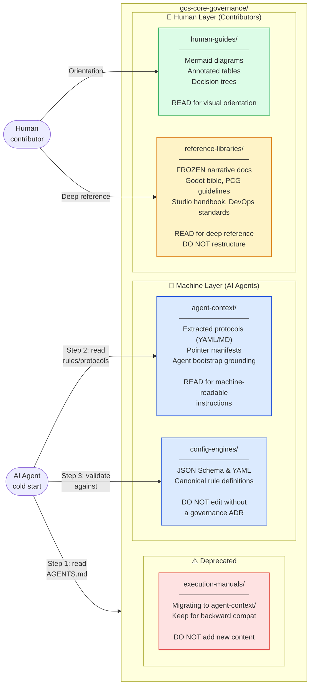

# Agent vs Human Folder Map

Shows which folder in `gcs-core-governance` serves each audience and purpose.

## Folder Architecture Diagram

## Folder Purpose Table

| Folder | Primary Audience | Content Type | Edit Policy |
|--------|-----------------|-------------|-------------|
| `config-engines/` | AI Agents + Tooling | JSON Schema, YAML rule files | Open governance issue first; PR required |
| `agent-context/` | AI Agents | Extracted protocols, pointer manifests | Update when `config-engines/` changes |
| `human-guides/` | Human Contributors | Mermaid diagrams, annotated tables | Update when `config-engines/` changes |
| `reference-libraries/` | Human Contributors | Long-form narrative Markdown | FROZEN — additive README files only |
| `execution-manuals/` | (Deprecated) | Old agent runbooks | No new content; migrate to `agent-context/` |

## Navigation by Question

| I want to… | Go to… |
|-----------|--------|
| Find the storage routing rule for my document type | `config-engines/metadata-schemas/storage-rules.yml` |
| Understand routing visually without reading YAML | `human-guides/document-routing.md` |
| Get a machine-readable routing table (AI) | `agent-context/protocols/document-routing.md` |
| See the WI lifecycle as a flowchart | `human-guides/wi-lifecycle-flow.md` |
| Get the lifecycle gates in YAML (AI) | `agent-context/protocols/wi-lifecycle-gates.yml` |
| Deep-read Godot 4 patterns | `reference-libraries/godot-bible/` |
| Deep-read operational protocols S1–S20 | `reference-libraries/studio-handbook/01-operational-protocols/` |
| Find all repo prefixes and their purpose | `human-guides/repo-map.md` |
| Bootstrap a new AI agent persona | `agent-context/grounding/agent-bootstrap.md` |
