# Repository Map and Audience Guide

Visual map of all GenCr@ft Studio repositories grouped by prefix layer.

> **Source:** Derived from `README.md` and `AGENTS.md` of this workspace (canonical)

## Architecture Overview

```mermaid
block-beta
  columns 3

  block:gcd["gcd- · DevOps Tooling"]:1
    gcd_ops["gcd-ops-scripts\n(SSoT linters)"]
    gcd_onboard["gcd-onboarding-scripts\n(dev setup)"]
    gcd_actions["gcd-shared-actions\n(GitHub Actions)"]
  end

  block:gcl["gcl- · Shared Libraries"]:1
    gcl_auth["gcl-srv-authentication\n(RS256 JWT, RTR)"]
    gcl_persist["gcl-srv-persistence\n(Prisma + PostgreSQL)"]
    gcl_voxel["gcl-voxel-engine\n(server voxel authority)"]
    gcl_ui["gcl-ui-components\n(shared UI)"]
  end

  block:gcp["gcp- · Product (Aethel)"]:1
    gcp_client["gcp-aethel-client\n(Godot 4.5)"]
    gcp_server["gcp-aethel-server\n(NestJS)"]
    gcp_pcg["gcp-aethel-pcg\n(Rust/WASM)"]
    gcp_arch["gcp-aethel-architecture\n(ADRs, C4)"]
    gcp_gdd["gcp-aethel-docs-gdd\n(Game Design Doc)"]
    gcp_backlog["gcp-aethel-backlog\n(project backlog)"]
  end

  block:gcs["gcs- · Studio Standards"]:1
    gcs_gov["gcs-core-governance\n(SSoT rules)"]
    gcs_eng["gcs-engineering-handbook\n(engineering manifesto)"]
    gcs_sec["gcs-security-core\n(security standards)"]
    gcs_pm["gcs-project-management\n(processes)"]
    gcs_plt["gcs-plt-*\n(platform: gemop, gembp,\ntools, architecture)"]
  end

  block:gct["gct- · Templates"]:1
    gct_repo["gct-repo-template-standard\n(repo bootstrap)"]
    gct_svc["gct-service-template-py\n(service template)"]
    gct_ssot["gct-ssot-templates\n(document templates)"]
  end

  block:iac["IaC"]:1
    gencraft_iac["gencraft-iac\n(OpenTofu / GCP)"]
    gencraft_api["gcl-api-contracts\n(OpenAPI specs)"]
  end
```

## Prefix Legend

| Prefix | Layer | Technology | Examples |
|--------|-------|-----------|---------|
| `gcd-` | DevOps / Developer Tooling | Python, Bash, GitHub Actions | ops-scripts, onboarding, shared-actions |
| `gcl-` | Shared Libraries & Microservices | TypeScript/NestJS, Rust | auth, persistence, voxel-engine, ui-components |
| `gcp-` | Product (Aethel game) | Godot 4.5, TypeScript, Rust | client, server, pcg, architecture, docs |
| `gcs-` | Studio-wide Standards & Handbooks | Markdown, JSON Schema | core-governance, engineering-handbook, security-core |
| `gct-` | Templates | Markdown, YAML | repo-template, service-template, ssot-templates |

## Repository Status Quick Reference

| Repo | Status | Primary Language | Key Role |
|------|--------|-----------------|---------|
| `gcp-aethel-client` | Active | GDScript | Game client |
| `gcp-aethel-server` | Active | TypeScript | Game server (NestJS) |
| `gcp-aethel-pcg` | Active | Rust | Procedural generation |
| `gcl-srv-authentication` | Active | TypeScript | Auth microservice |
| `gcl-srv-persistence` | Active | TypeScript | Data microservice |
| `gcl-voxel-engine` | Active | TypeScript | Voxel authority library |
| `gcs-core-governance` | Active | YAML, JSON Schema, Markdown | Studio SSoT rules |
| `gencraft-iac` | Active | OpenTofu (HCL) | Cloud infrastructure |
| `gcl-ui-components` | On Ice | TypeScript | UI library (3 activation gates) |

> **Full list:** See `gcs-project-management/workspaces/` STATUS files for current activation status per repo.
