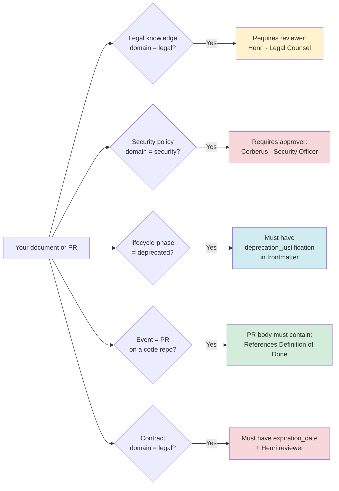

# Validation Rules Summary

Human-readable annotated summary of all active studio validation rules.

> **Source:** `config-engines/metadata-schemas/validation-rules.yml` (canonical — this file is a visual summary only)

## Rules at a Glance

## Annotated Rules Table

| Rule ID | Applies When | Enforcement | Who Approves | Frontmatter Required |
|---------|-------------|-------------|--------------|---------------------|
| GOV_RULE_001 | Knowledge doc + domain=legal + category=to-govern | PR review gate | Henri (Legal Counsel) | — |
| GOV_RULE_002 | Knowledge doc + type=standard + domain=engineering | PR review gate | Isaac (Senior Architect) | — |
| GOV_RULE_003 | Knowledge doc + type=policy + domain=security | PR approval gate | Cerberus (Security Officer) | — |
| GOV_RULE_004 | Any artifact with `lifecycle-phase: deprecated` | SSoT linter CI | — | `deprecation_justification:` |
| GOV_RULE_005 | Pull Request on a code repository | PR body check | — | PR body must include `"References Definition of Done (PRO-STAN-001)"` |
| GOV_RULE_006 | Knowledge doc + type=contract + domain=legal | PR review + frontmatter | Henri (Legal Counsel) | `expiration_date:` |

## What Triggers a Validation Failure?

| Scenario | Rule Triggered | Fix |
|----------|---------------|-----|
| New security policy PR merged without Cerberus approval | GOV_RULE_003 | Add Cerberus as required reviewer |
| Deprecated doc missing justification | GOV_RULE_004 | Add `deprecation_justification: "Replaced by {docId}"` |
| PR to a code repo body has no DoD reference | GOV_RULE_005 | Add `References Definition of Done (PRO-STAN-001)` to PR body |
| Legal contract doc missing expiry | GOV_RULE_006 | Add `expiration_date: "YYYY-MM-DD"` to frontmatter |

## Enforcement Layers

Rules are enforced at two layers:

1. **CI (GitHub Actions)** — `gcd-ops-scripts` SSoT linter runs on every PR targeting main
2. **Pre-commit hook** — locally installed via `./onboard.sh` in each repo

> If a validation fails in CI but you believe it is a false positive, open an issue in `gcs-core-governance` with label `governance`.
