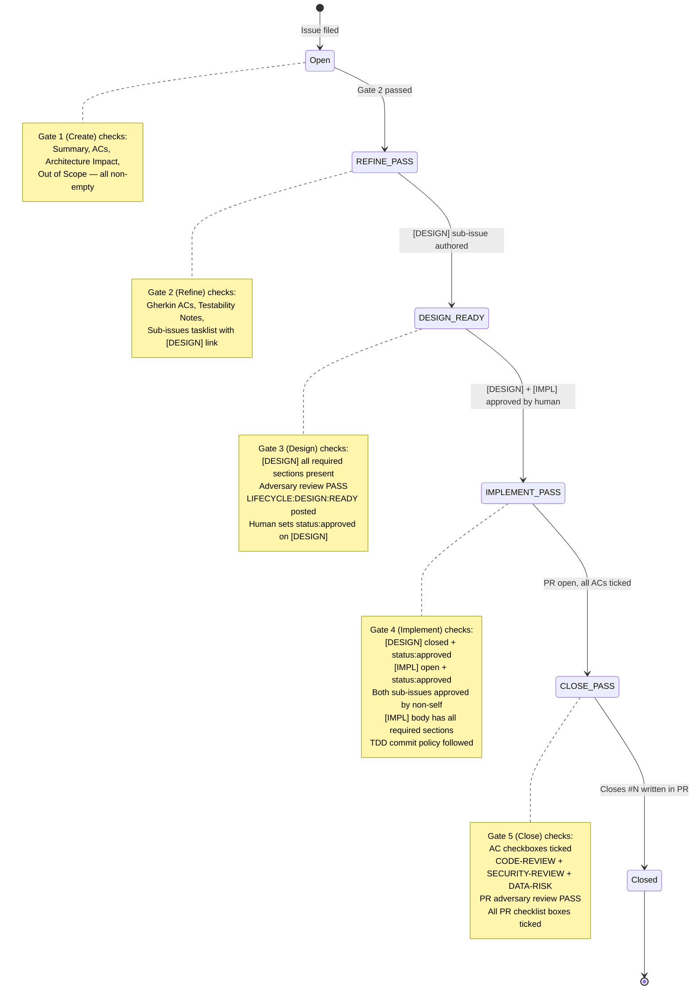

# Work Item Lifecycle Flow

Visual guide to the 4-gate Work Item (WI) lifecycle. All states and transitions match `GOV-PROT-003.wi-lifecycle-contract.md` exactly.

> **Source:** `GOV-PROT-003.wi-lifecycle-contract.md` (canonical)

## State Diagram



## Gate Summary Table

| Gate | Name | Trigger | Key Checks |
|------|------|---------|------------|
| 1 | Create | Issue filed | Summary, ACs, Architecture Impact, Out of Scope |
| 2 | Refine | Branch cut | Gherkin ACs, Testability Notes, [DESIGN] link in Sub-issues |
| 3 | Design | [DESIGN] sub-issue authored | All required sections, adversary PASS, LIFECYCLE:DESIGN:READY posted |
| 4 | Implement | [DESIGN]+[IMPL] approved | Non-self approval, [IMPL] sections, TDD cycles |
| 5 | Close | PR open, all ACs ticked | Reviews, adversary, PR checklist, ADR if needed |

## TDD Commit Convention

Each TDD cycle produces exactly two commits:

```
test(scope): WI-N.M — red: <description of failing test>
feat(scope): WI-N.M — green: <description of implementation>
```

Refactor commits are optional but follow:
```
refactor(scope): WI-N.M — blue: <description>
```

## Sub-issue Naming Convention

| Type | Title pattern | Example | State when gate passes |
|------|--------------|---------|------------------------|
| `[DESIGN]` | `[DESIGN] WI-N.M — <parent WI title>` | `[DESIGN] WI-42.1 — fix auth bug` | Closed + `status:approved` (set by human) |
| `[IMPL]` | `[IMPL] WI-N.M — <parent WI title>` | `[IMPL] WI-42.1 — fix auth bug` | Open + `status:approved` (set by human) |

> **Self-approval is forbidden.** The person who sets `status:approved` must differ from the current GitHub actor. In a solo studio, this creates a gate that requires a second human reviewer.
