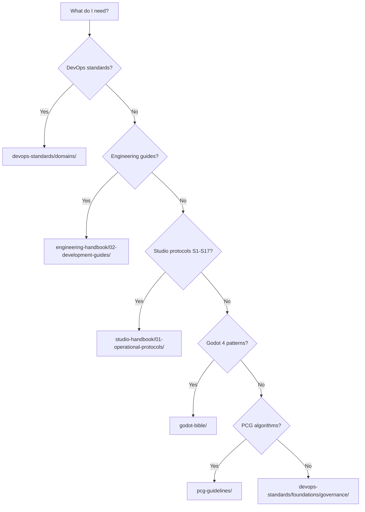

# reference-libraries/

Navigation index for the `reference-libraries/` folder. This folder is **FROZEN** — content is preserved as-is for reference. No restructuring or modification of existing files without a governance decision.

> **AI Agents:** For machine-readable protocols and rules, use [`agent-context/`](../agent-context/) instead. This folder is human-oriented reference material.

## Domain Map

| Folder | Purpose | Audience | Status |
|--------|---------|----------|--------|
| [`devops-standards/`](devops-standards/README.md) | CI/CD, IaC, security, tooling, and engineering standards | Human + Agent | Active |
| [`engineering-handbook/`](engineering-handbook/README.md) | Engineering philosophy, development guides, process playbooks | Human | Active |
| [`studio-handbook/`](studio-handbook/README.md) | Studio vision, operational protocols (S1–S17), organization | Human | Active |
| [`godot-bible/`](godot-bible/README.md) | Godot 4 patterns, architecture, TDD, anti-patterns (17 chapters) | Human | Active |
| [`pcg-guidelines/`](pcg-guidelines/README.md) | Procedural generation theory and implementation (11 chapters) | Human | Active |
| [`legal-references/`](legal-references/README.md) | Legal reference material | Human | Placeholder |

## Navigation by Question

## Frozen Content Policy

- Files in this folder are read-only references.
- The active, enforced versions of governance rules are in `config-engines/`.
- Machine-readable extracted protocols are in `agent-context/`.
- To update a reference document: open a GitHub Issue with the `governance` label.
