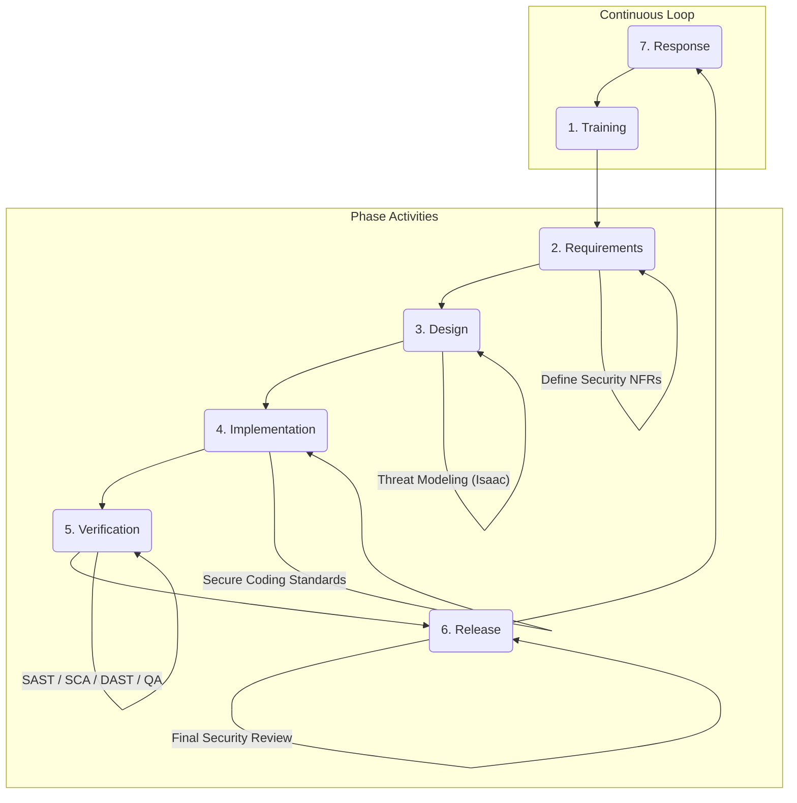

# Secure Development Lifecycle (SDL) Policy

## 1. Purpose and Scope

### 1.1. Purpose

This policy defines the mandatory framework for integrating security activities into every phase of the software development lifecycle at Gencraft Studio. The goal is to build secure, resilient, and trustworthy software from the ground up ("Security by Design"), reducing vulnerabilities and minimizing business risk.

### 1.2. Scope

This policy applies to the development and maintenance of ALL software artifacts produced by Gencraft, including but not limited to:

- Game clients and servers (e.g., `gcp-aethel-client`, `gcp-aethel-server`)
- The core game engine (`gcl-voxel-engine`)
- Core Studio Services and MCP Servers
- Internal AI Gem `Tools` and automation scripts (`gencraft-devops-automation`)

## 2. The Gencraft Secure Development Lifecycle (SDL)

Our SDL is composed of seven core phases. Adherence to the activities within each phase is mandatory.

**Note for AI Gems:** This diagram shows the required phases for all software development. When managing a project or a development task, ensure all these quality gates are planned for and passed.

## 3. SDL Phase Details and Responsibilities

### Phase 1: Training

- **Activity:** All development Gems and their human supervisors MUST complete Gencraft's security awareness training (as per S8) and training on the studio's Secure Coding Standards.
- **Responsibility:** `AIE Team` for Gem training, `Leads` for human team members.

### Phase 2: Requirements

- **Activity:** Define and document explicit security requirements alongside functional requirements. This includes data protection needs, access control requirements, and compliance obligations.
- **Responsibility:** `Béatrice (Product Manager)` in collaboration with `Cerberus` and `Isaac`.
- **SSoT:** Security requirements must be documented in the relevant NFRs section of `gcp-aethel-docs-req`.

### Phase 3: Design

- **Activity:** Conduct a formal **Threat Modeling** exercise for any new major feature or service. The goal is to identify potential threats, attack vectors, and design appropriate security controls.
- **Responsibility:** `Isaac (Architect)` leads this, with participation from `Julien (Lead Dev)` and `Cerberus`.
- **SSoT:** The output of the threat model (threats and mitigations) MUST be documented in the corresponding Technical Design Document (TDD) or an ADR.

### Phase 4: Implementation

- **Activity:** Write code that adheres strictly to the **Gencraft Secure Coding Standards** (`gcs-core-governance/security/secure-coding-standards.md` - TO BE CREATED).
- **Responsibility:** All `Programming Gems`.
- **Controls:** Adherence is checked via peer review (Protocol S1) and automated tooling (Phase 5).

### Phase 5: Verification

This is a critical phase with multiple automated and manual checks.

- **Activity 1: Static Application Security Testing (SAST):** Automated scans of the source code to find potential vulnerabilities. This MUST be integrated into the CI/CD pipeline.
  - **Responsibility:** `Camille (DevOps Automation)` for pipeline integration; `Julien (Lead Dev)` for addressing findings.
- **Activity 2: Software Composition Analysis (SCA):** Automated scans to identify vulnerabilities in third-party and open-source libraries. This MUST be integrated into the CI/CD pipeline.
  - **Responsibility:** `Camille` for integration; `Léo (OSS Specialist)` for analyzing licenses and `Julien` for addressing vulnerabilities.
- **Activity 3: Code Review:** All code MUST be reviewed by at least one other qualified developer for security flaws, as per Protocol S1.
  - **Responsibility:** `Julien` and `Development Team`.
- **Activity 4: QA Security Testing:** `Zoé (QA Lead)` MUST ensure that test plans include security-focused test cases, such as testing permissions, input validation, and resilience to unexpected data.
- **Activity 5: Dynamic Application Security Testing (DAST) / Penetration Testing (for critical systems):** For high-risk applications (e.g., public-facing APIs, auth services), periodic dynamic testing is required.
  - **Responsibility:** Coordinated by `Cerberus`.

### Phase 6: Release

- **Activity:** Conduct a final security review before deployment. This includes verifying that all security gates in the previous phases have been passed and that the release configuration is secure.
- **Responsibility:** `Cerberus`, in coordination with `Antoine (Producer)` and `Adam (DevOps Lead)`.
- **SSoT:** A pre-release security checklist MUST be completed and archived.

### Phase 7: Response

- **Activity:** Actively monitor systems in production for security threats. If an incident occurs, the **Security Incident Response Plan (SIRP)** (`security-incident-response-plan.md`) MUST be activated.
- **Responsibility:** `Cerberus` and the Security Incident Response Team (SIRT).
- **Feedback Loop:** Lessons learned from any incident MUST be fed back into this SDL process to improve training, design, and verification for future development.

## 4. Roles and Responsibilities Summary

- **`Cerberus` (Security Officer):** Owns and oversees this SDL policy.
- **`Isaac` (Architect):** Leads the Design phase security activities (Threat Modeling).
- **`Julien` (Lead Dev):** Responsible for security during Implementation and Code Review.
- **`Béatrice` (Product Manager):** Responsible for defining security requirements.
- **`Zoé` (QA Lead):** Responsible for security testing during Verification.
- **DevOps Team (`Camille`, `Adam`):** Responsible for integrating and operating automated security tools (SAST, SCA, DAST) in the CI/CD pipelines.

## 5. Compliance and Exceptions

Adherence to this SDL policy is mandatory. Any proposed deviation for a specific project or feature must be formally documented, with a risk assessment, and submitted to `Cerberus` and the `Governance Crew` for approval.
