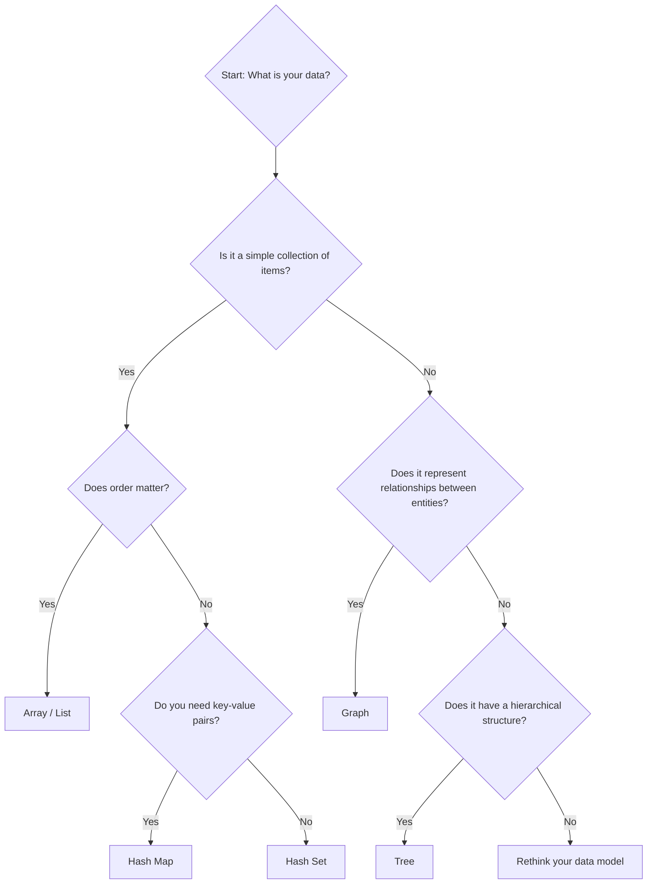

# The Practical Algorithm & Data Structure Guide

## 1. Objective

This guide provides a prescriptive framework for selecting the appropriate algorithms and data structures to solve common engineering problems. It is not an academic text but a practical "recipe book" intended to accelerate development and ensure performance by design.

Choosing the right data structure is a critical design decision. An incorrect choice can lead to significant performance issues that are difficult to refactor later. All developers MUST be able to justify their choices by referencing this guide.

## 2. The Problem-Solving Protocol

Before writing any complex data-handling or processing code, follow this mandatory analysis procedure:

1. **Identify Core Operations:** Clearly state the primary operations the code will perform. Examples: "find an item by its ID," "insert items in order," "traverse all connected nodes," "find the shortest path."
2. **Estimate Data Scale & Constraints:** What is the expected size of the dataset (e.g., 100 items, 10 million items)? What are the performance constraints (e.g., "response must be under 50ms")?
3. **Determine Required Complexity:** Based on the scale and constraints, determine the required Big O complexity for the core operations. A linear scan O(n) might be acceptable for 100 items, but it is unacceptable for 10 million.
4. **Consult the Recipe Book:** Use the catalog below to select the appropriate data structure and algorithm that matches the required operations and complexity.
5. **Justify Your Choice:** In your Pull Request or design document, explicitly state the data structure/algorithm chosen and why it is appropriate for the problem.

## 3. The Recipe Book: Problem -> Solution

### 3.1. Storing and Accessing Data

| **If your primary need is...** | **...then your default choice should be...** | **Complexity (Average)** | **Use When...** |
| :--- | :--- | :--- | :--- |
| Storing a collection of items to iterate over sequentially. | **Array / List** | Access: `O(1)`, Search: `O(n)` | The order matters and you need fast access by index. |
| Storing key-value pairs for fast lookup by key. | **Hash Map / Dictionary** | Insert/Search/Delete: `O(1)` | You need to quickly find an object by its unique identifier. |
| Storing a collection of unique items for fast membership checks. | **Hash Set** | Insert/Search/Delete: `O(1)` | You need to quickly check if an item exists in a collection. |
| Storing items in a "First-In, First-Out" (FIFO) order. | **Queue** | Enqueue/Dequeue: `O(1)` | You are processing tasks in the order they arrive (e.g., a job queue). |
| Storing items in a "Last-In, First-Out" (LIFO) order. | **Stack** | Push/Pop: `O(1)` | You are managing call stacks or implementing undo/redo functionality. |

### 3.2. Sorting and Ordered Data

| **If your primary need is...** | **...then your default choice should be...** | **Complexity** | **Use When...** |
| :--- | :--- | :--- | :--- |
| Sorting a general-purpose collection in memory. | **Quicksort / Introsort** (standard library sort) | `O(n log n)` | This is the default, most-used sorting algorithm. |
| Maintaining a dynamically sorted collection. | **Balanced Binary Search Tree** (e.g., Red-Black Tree) | Insert/Search/Delete: `O(log n)` | You need to frequently add, remove, and find items in a sorted set. |
| Finding the smallest or largest item in a collection quickly. | **Min/Max Heap** (Priority Queue) | Insert: `O(log n)`, Find-Min/Max: `O(1)` | You are scheduling tasks by priority or running simulations. |

### 3.3. Graph Problems

| **If your primary need is...** | **...then your default algorithm is...** | **Complexity** | **Use When...** |
| :--- | :--- | :--- | :--- |
| Finding the shortest path in an unweighted graph. | **Breadth-First Search (BFS)** | `O(V + E)` | Finding the minimum number of steps in a network (e.g., social network distance). |
| Finding the shortest path in a weighted graph (no negative weights). | **Dijkstra's Algorithm** | `O((V + E) log V)` | Finding the fastest route in a road network. |
| Traversing or searching all nodes in a graph. | **Depth-First Search (DFS) or BFS** | `O(V + E)` | Detecting cycles, finding connected components, solving mazes. |
| Finding a minimum cost spanning tree for a connected graph. | **Prim's or Kruskal's Algorithm** | `O(E log V)` | Connecting all nodes in a network with minimum total edge cost. |

-V = Number of Vertices, E = Number of Edges-

## 4. The Data Structure Decision Tree

## 5. Further Reading

This guide provides high-level recipes. For detailed implementations and deeper theoretical understanding, consult authoritative sources such as The Algorithm Design Manual by Steven S. Skien or Introduction to Algorithms by Cormen, Leiserson, Rivest, and Stein.

## 6. IA Instructions

This section is reserved for AI-specific instructions and context for processing or updating this document.
