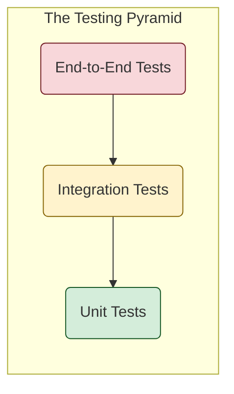
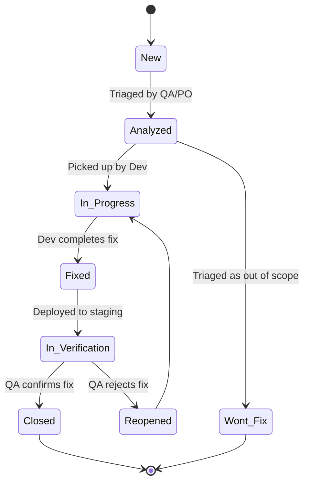

# The Quality Assurance (QA) Framework

## 1. Objective

This guide establishes the studio's official framework for Quality Assurance. Its purpose is to define a holistic quality strategy that goes beyond individual developer tests to ensure our products are robust, reliable, and meet the highest standards before they reach our users. This framework outlines our testing strategies, bug lifecycle, and triage protocols.

## 2. Our Testing Strategy: The Testing Pyramid

We do not treat all tests equally. Our strategy is based on the Testing Pyramid, which emphasizes having a large foundation of fast, isolated tests and fewer slow, integrated tests.

* **Unit Tests (Large Base):** These are the foundation. They test individual components in isolation. They are fast, reliable, and written by developers as part of the TDD cycle [cite: GCS-GUIDE-203].
* **Integration Tests (Smaller Middle):** These tests verify that different modules or services work together correctly. They are slower and more complex than unit tests.
* **End-to-End (E2E) Tests (Narrow Top):** These tests simulate a full user journey through the application. They are slow, brittle, and expensive to maintain. We use them sparingly to validate critical user flows only.

## 3. The Bug Lifecycle Protocol

Every bug or defect identified MUST follow this formal lifecycle in our issue tracking system (e.g., Jira).

* **New:** The initial state of a newly reported bug.
* **Analyzed:** The bug has been reproduced, documented, and triaged (see below).
* **In Progress:** A developer is actively working on a fix.
* **Fixed:** The developer has committed a fix.
* **In Verification:** The fix has been deployed to a testing environment and is ready for QA validation.
* **Closed:** The QA team has confirmed the fix resolves the issue.
* **Reopened:** The QA team has found that the fix is incomplete or has caused a regression.
* **Won't Fix:** After analysis, a decision has been made not to fix the bug (e.g., it's a feature, not a bug; it's too low priority).

## 4. The Bug Triage Protocol

Triage is the process of assessing and prioritizing new bugs. This is a collaborative effort.

1. **Reproduction:** The QA team's first responsibility is to reproduce the reported bug and gather all necessary information (steps, logs, screenshots).
2. **Severity Assignment (The "How Bad"):** The **QA Lead** is responsible for assigning a **Severity** level, which measures the technical impact of the bug on the system.
    * **S1 - Blocker:** Prevents core functionality; no workaround exists. Halts development/testing.
    * **S2 - Critical:** Crashes the system or causes data loss; a major feature is unusable.
    * **S3 - Major:** A major feature is significantly impaired, but a workaround exists.
    * **S4 - Minor:** A minor feature is impaired, or a cosmetic issue with significant user impact.
    * **S5 - Trivial:** A cosmetic issue with low user impact.
3. **Priority Assignment (The "How Soon"):** The **Product Owner** is responsible for assigning a **Priority** level, which measures the urgency of fixing the bug from a business perspective.
    * **P1 - Urgent:** Must be fixed in the current sprint or as a hotfix.
    * **P2 - High:** Must be fixed in the next sprint.
    * **P3 - Medium:** Should be fixed in a future release if time allows.
    * **P4 - Low:** Can be fixed opportunistically.

## 5. Non-Regression Testing Strategy

* **Automation is Key:** Our non-regression strategy relies on our automated test suites (Unit, Integration, and E2E).
* **Triggering:** The full non-regression suite MUST be executed automatically via our CI/CD pipeline [cite: GCS-GUIDE-202] before any deployment to the production environment.
* **Zero Tolerance:** A deployment to production is blocked if even a single non-regression test fails.
