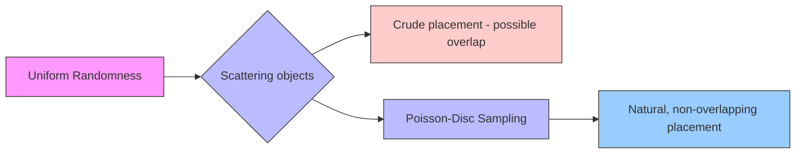
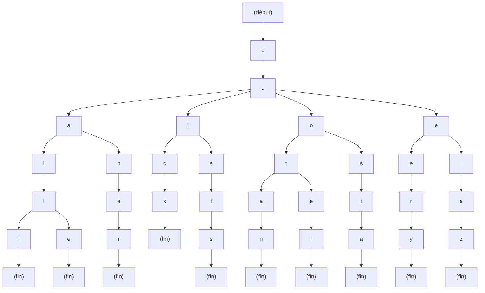

# Chapter 2: The Foundational Pillars

---

## 2.1. Randomness and Probabilistic Methods: From Chaos to Structure

* **2.1.1. Pseudo-Random Number Generators (PRNGs)**
    * **Definition:** Algorithms that produce deterministic sequences that appear random, controlled by a starting **seed**. This property is the cornerstone of procedural generation, as it guarantees content reproducibility. In essence, a PRNG is a mathematical recipe for generating a series of numbers. If you use the same recipe and the same starting ingredient (the seed), you'll always get the exact same sequence of numbers.
    * **Types of PRNGs:**

### LCG: The Oldest and Simplest PRNG

***

**Linear Congruential Generators (LCG)** are one of the most basic and oldest types of Pseudo-Random Number Generators (PRNGs). They're defined by a simple linear recurrence relation:

$X_{n+1} = (aX_n + c) \pmod m$

Where:
* $X_n$ is the sequence of pseudo-random numbers.
* $m$ is the **modulus** ($m > 0$). This defines the range of the output numbers, from 0 to $m-1$.
* $a$ is the **multiplier** ($0 \le a < m$).
* $c$ is the **increment** ($0 \le c < m$).
* $X_0$ is the **seed** ($0 \le X_0 < m$), the initial value that starts the sequence.

The quality of the LCG's output—its period and statistical randomness—depends heavily on the choice of these three parameters ($a$, $c$, and $m$). A poorly chosen set of parameters can lead to a very short sequence of numbers that repeats quickly, making the "randomness" very obvious.

### LCG Implementation Example

A classic set of parameters used in many older systems (like the `rand()` function in some C libraries) is:
* $a = 1103515245$
* $c = 12345$
* $m = 2^{31}$

Let's use a seed $X_0 = 1$ to demonstrate the first few numbers in the sequence:

1.  **First number ($X_1$):**
    $X_1 = (1103515245 \times 1 + 12345) \pmod {2^{31}}$
    $X_1 = 1103527590 \pmod {2147483648}$
    $X_1 = 1103527590$

2.  **Second number ($X_2$):**
    $X_2 = (1103515245 \times 1103527590 + 12345) \pmod {2^{31}}$
    $X_2 = (1217742054652230500 + 12345) \pmod {2147483648}$
    $X_2 = 1217742054664563845 \pmod {2147483648}$
    $X_2 = 1599814421$

...and so on.

As you can see, the process is straightforward and computationally inexpensive, which is why LCGs were so popular on early computers with limited processing power. However, modern applications generally avoid LCGs due to their statistical weaknesses, preferring more robust generators like the Mersenne Twister for high-quality procedural generation.

### Mersenne Twister: The Modern Workhorse

The **Mersenne Twister** is a sophisticated Pseudo-Random Number Generator (PRNG) that addresses many of the limitations of older methods like the LCG. Developed in 1997 by Makoto Matsumoto and Takuji Nishimura, it's widely regarded as a high-quality PRNG and is the default for many programming languages, including Python and MATLAB.

### Key Characteristics

Unlike the simple linear formula of an LCG, the Mersenne Twister operates on a large state, which is a sequence of integers. It's based on a mathematical concept called a **Twisted Generalized Feedback Shift Register**. The name comes from the fact that its period is a Mersenne prime number. The most common variant, MT19937, has an incredibly long period of $2^{19937} - 1$, which is a prime number with over 6,000 digits.

This immense period means the sequence of numbers won't repeat for an astronomical number of generations, making it virtually impossible to detect any patterns through statistical tests. It's also known for its excellent equidistribution, meaning numbers are generated evenly across its range.

### Mersenne Twister Implementation Example

The algorithm's internal workings are complex and involve bitwise operations and a large internal state (624 integers for MT19937). Here's a simplified, high-level overview of the process:

1.  **Initialization:** The generator's large internal state is seeded with a single integer. This sets the initial sequence of 624 numbers.
2.  **Number Generation:** To produce the next number in the sequence, the algorithm performs a series of bitwise operations (XOR, shifts) on its internal state. It "twists" the state to generate a new number and a new state.
3.  **Tempering:** The raw output from the "twisting" process undergoes a final set of bitwise operations called "tempering." This step improves the statistical properties of the output, ensuring better randomness.
4.  **Repeat:** The process repeats, generating a new number and updating the state with each call. The entire state is "rewound" or re-seeded only after the entire period of $2^{19937} - 1$ numbers has been generated.

Due to its complexity, the Mersenne Twister isn't typically implemented from scratch. Developers use optimized, pre-built libraries. The strength of the algorithm lies in its ability to produce high-quality, long-period randomness that is suitable for a vast range of applications, from scientific simulations to procedural generation in games.

#### Pre-Built Library References

Given the complexity of the Mersenne Twister, it's almost always preferable to use a pre-built, well-tested library. Here are some references for common programming languages:

* **C++:**
    * The **C++ Standard Library (`<random>`)** includes a high-quality implementation of the Mersenne Twister (`std::mt19937` and `std::mt19937_64`). This is the recommended choice for modern C++ projects as it's part of the standard.

* **Python:**
    * The **Python Standard Library (`random` module)** uses a Mersenne Twister as its core PRNG. You can simply use `random.seed(value)` to set the seed and `random.random()` to get a random number.

* **Java:**
    * The `java.util.Random` class in the Java Standard Library uses a different algorithm, but there are third-party libraries that provide a Mersenne Twister implementation, such as **Apache Commons Math** or **Jython**.

* **C#:**
    * The .NET Framework's `System.Random` also uses a different PRNG. A common third-party implementation for C# is available in the **Math.NET Numerics** library.

* **JavaScript:**
    * JavaScript's built-in `Math.random()` is not a Mersenne Twister and should not be used for high-quality PCG. A popular third-party library is **`mersenne-twister`** available on npm.


### Permuted Congruential Generator (PCG): The Modern Alternative

The **Permuted Congruential Generator (PCG)** is a family of modern Pseudo-Random Number Generators (PRNGs) that combines the simplicity and speed of LCGs with the high-quality statistical properties of more complex generators. The core idea is to use a simple, fast LCG for internal state progression and then apply a non-linear "permutation" function to the output bits. This makes the output extremely difficult to predict from the internal state, effectively hiding the simple LCG pattern.

### Key Characteristics

PCG's key advantages make it an attractive choice for many modern applications, particularly in procedural generation where speed and quality are both critical:

* **Excellent Statistical Quality:** PCG passes most stringent statistical tests for randomness, addressing the weaknesses of LCGs.
* **Small State:** Unlike the Mersenne Twister's large internal state of 624 integers, a PCG generator can have a very small state (e.g., one or two 64-bit integers), making it more memory-efficient and faster to initialize.
* **Hard to Predict:** The output permutation step makes it very difficult to reverse-engineer the internal state from the generated numbers. This is a significant improvement over LCGs, which are notoriously easy to predict.
* **High Performance:** Because the internal state update is a single, fast LCG step, and the permutation function is composed of efficient bitwise operations, PCG is exceptionally fast.

#### Implementation Example

The essence of a PCG implementation involves two main functions: a `seed` function to initialize the state and a `next` function to produce the next random number. The `next` function performs the core logic: it updates the internal state and then permutes the state's bits to produce the final output.

The following pseudo-code demonstrates a basic 32-bit PCG variant.

```python
  // Global state variables
  // The state should be a 64-bit unsigned integer for good quality.
  // It will be updated by a simple LCG.
  State = 0;
  // The stream defines a unique sequence.
  // Different streams for different generators prevent output correlation.
  Stream = 0;

  // Seeding function to initialize the generator
  function seed(initialState, initialStream) {
      State = 0;
      Stream = (initialStream << 1) | 1; // Stream must be odd
      next(); // Advance the state once to scramble the seed
      State += initialState;
      next(); // Advance again to further scramble
  }

  // Main function to generate the next 32-bit pseudo-random number
  function next() {
      // 1. Update the internal state using a simple LCG
      // This is the core LCG step. The constants are crucial.
      oldState = State;
      State = oldState * 6364136223846793005 + Stream;

      // 2. Permute the output bits for high-quality randomness
      // The permutation is a key step that scrambles the output.
      // This is the core of PCG, it hides the simple LCG pattern.
      xored = ((oldState >> 18) ^ oldState) >> 27; // xorshift high bits
      rotated = (oldState >> 59) // get rotation amount from high bits

      // The result is the xored value rotated by the rotated value
      output = (xored >> rotated) | (xored << ((-rotated) & 31));

      return output;
  }
```
#### Xorshift: Speed and Simplicity

The **Xorshift** family of Pseudo-Random Number Generators (PRNGs) is known for its extreme speed and computational simplicity. Developed by George Marsaglia, these generators rely on a sequence of bitwise XOR and shift operations on a single integer to produce a new pseudo-random number. Their core strength lies in leveraging the highly optimized bitwise instructions of modern CPUs, making them significantly faster than LCGs and even the Mersenne Twister in many cases.

### Key Characteristics

* **Exceptional Speed:** Xorshift algorithms perform a minimal number of operations per number generated, making them one of the fastest PRNG families available.
* **Small State:** A Xorshift generator typically uses a very small internal state, often just a single integer (32-bit or 64-bit). This makes it highly memory-efficient and easy to implement.
* **Simple Implementation:** The algorithm is straightforward and can be written in just a few lines of code, making it easy to integrate from scratch.
* **Statistical Trade-offs:** While incredibly fast, early Xorshift variants had known statistical weaknesses. More advanced versions, like those that incorporate an additional scrambling step (e.g., Xorshift* or Xorshift+), were developed to improve their statistical quality.

### Xorshift Implementation Example

The basic 32-bit Xorshift algorithm involves three bitwise operations in a sequence. The state is a single unsigned 32-bit integer.

```bash
// Global state variable, initialized with a non-zero seed
state = 123456789;

// Function to generate the next 32-bit pseudo-random number
function next() {
    // 1. Get the current state
    x = state;

    // 2. Perform a series of xorshift operations
    // These specific shift values are crucial for the algorithm's period.
    x = x ^ (x << 13);
    x = x ^ (x >> 17);
    x = x ^ (x << 5);

    // 3. Update the global state
    state = x;

    // 4. Return the new state as the random number
    return x;
}

// Function to seed the generator
function seed(new_seed) {
    if (new_seed == 0) {
        new_seed = 1; // The seed must be non-zero
    }
    state = new_seed;
}
```

The sequence of shifts (`<< 13`, `>> 17`, `<< 5`) is carefully chosen to ensure a long period and good statistical properties. The simplicity of this approach makes it an excellent choice for applications like particle systems or shaders, where thousands of random numbers might be needed in a very short amount of time.

#### The Importance of the Seed: The Deterministic Soul of Randomness

The **seed** is the critical initial value that makes procedural generation both unique and predictable. By serving as the starting point for a PRNG, it allows for the exact same sequence of "random" numbers to be generated every time. This deterministic behavior is not a limitation; it's a powerful and fundamental feature that provides several key advantages in the creation, management, and sharing of content.

* **Reproducibility:** A developer or user can save and share a single seed (e.g., a number or a simple phrase like "Galaxy_137") and be confident that anyone else using that seed with the same algorithm will generate an identical piece of content. This is essential for:
    * **Collaborative Work:** Multiple designers can work on the same procedurally generated level or asset by sharing a single seed, ensuring a consistent starting point for everyone.
    * **Multiplayer Experiences:** In online games like *Minecraft*, all players on a server use the same seed to generate the world. This guarantees that every player sees the exact same landscape, from mountain ranges to resource locations, creating a shared and consistent environment.
    * **Scientific and Research Applications:** Scientists can reproduce the results of their simulations by logging the seed, allowing for verification and peer review of their work.

* **Debugging and Bug Reporting:** One of the most significant challenges in procedural generation is debugging. A bug might only manifest in a specific, rare combination of generated elements. Without a seed, reproducing that exact scenario would be a near-impossible task. With a seed, the process is streamlined:
    * A user can report a bug along with the seed value.
    * The developer can then plug that seed into their system to instantly recreate the buggy environment, allowing them to isolate and fix the problem efficiently. This is the "deterministic debugger" for procedural content.

* **Content Persistence and Storage Efficiency:** Storing a massive, hand-crafted game world or a detailed 3D model can take up gigabytes of disk space. A procedurally generated world, however, can be fully described by its tiny seed value and the algorithm that generated it. When the user wants to return to that world, the algorithm regenerates it from the seed, which drastically reduces storage requirements.
    * **Example of Seed-Based Saving:** A game doesn't save the entire 100GB world map. Instead, it saves the seed "Wasteland_of_Titans_2077," along with a list of the player's modifications (e.g., "removed tree at position X,Y,Z"). The next time the game loads, it regenerates the world from the seed and then applies the list of saved changes.

* **Creative Control and Iteration:** A designer can explore a vast space of possibilities by simply changing the seed and other parameters. This allows for rapid iteration and discovery of new content.
    * **Seed Exploration:** An artist can write an algorithm to generate thousands of unique tree variations. By cycling through different seeds, they can quickly find a tree with the perfect shape or branch structure and save its seed for later use. This transforms the design process from one of direct creation to one of discovery and selection.

### Practical Seed Saving and Sharing

For a seed to be truly useful, it must be easily saved and shared. Here are some common methods:

* **Simple Integers:** The most basic approach. A game might display the seed as a number like `1234567890`. This is easy to copy and paste.
* **String Hashing:** A more user-friendly method is to allow users to input a memorable string (e.g., "The_Lost_Isle_of_Arches"). The program then uses a hashing function (like FNV-1a or MurmurHash) to convert this string into a numerical seed value. This makes seeds easy to remember and share, while still providing the deterministic output.
* **Hierarchical Seeds (Meta-Seeds):** For very large, multi-layered worlds, a single seed might not be enough. A "meta-seed" can be used to generate other, more specific seeds for different parts of the world. For example, a meta-seed `2589` could generate one seed for the "climate" layer (`31415`), another for the "geology" layer (`27182`), and a third for the "vegetation" layer (`16180`). This provides designers with a more granular level of control over the generation process.

In summary, the seed is far more than just a random number; it is the fundamental mechanism that allows creators to tame the chaos of randomness, making procedural generation a predictable, reproducible, and powerful tool for building dynamic and vast digital worlds.


### 2.1.2. Probability Distributions

In procedural generation, pure uniform randomness (where every outcome is equally likely) often fails to produce results that look natural or believable. Real-world phenomena rarely exhibit perfect uniformity; instead, they tend to follow predictable patterns, or distributions. **Probability distributions** are mathematical functions that describe the likelihood of different outcomes. By sampling from a specific distribution, a procedural system can imbue its output with a desired statistical bias, making the generated content feel more organic and coherent. For example, instead of scattering trees completely randomly, a distribution can be used to cluster them in a forest, or to ensure that the majority of trees are of an average height. This section explores several key probability distributions and their practical applications in procedural generation.

#### Visualizing Distributions

To understand the power of distributions, consider how they shape generated data. A simple graph of a distribution shows the probability of a given value occurring.


* **Uniform Distribution:** A flat line, where every value has the same probability. This is useful for simple random choices, like picking an enemy type from a list, but often results in sparse, unrealistic scattering when used for spatial generation.
* **Normal Distribution (Gaussian):** The classic "bell curve," where values are more likely to cluster around a central mean. This is perfect for simulating natural variance, such as the height of trees in a forest or the size of a rock. Most trees will be of an average height, with a few very tall and a few very short ones, which is a much more realistic outcome.
* **Poisson Distribution:** This distribution is characterized by its use for modeling discrete events occurring in a fixed interval of space or time. It is particularly valuable for distributing objects that are scattered randomly but are not clustered. Think of the locations of craters on a planetary surface or the placement of boulders in a field.
* **Pareto Distribution (Power Law):** A skewed distribution where a small number of events have a very high probability of occurring, while the vast majority have a low probability. In PCG, this is crucial for creating realistic city populations (a few large cities, many small towns) or resource distribution (a few very rich ore veins, many common ones). This approach avoids a bland, uniform distribution of elements and adds compelling realism.

By selecting and combining these distributions, a procedural artist moves beyond simple chance and begins to author the *statistical properties* of their virtual world, allowing for a deep and intuitive level of control over the "feel" and realism of the generated content.

##### Uniform Distribution: A Foundation of Equal Opportunity

In a **uniform distribution**, every possible value within a given range has an equal probability of being chosen. When visualized as a graph, it appears as a flat, horizontal line, as the probability density is constant across the entire interval. This type of distribution is the most basic form of randomness and is what most people instinctively think of as "random."

#### Applications in Procedural Generation

While its lack of bias can sometimes lead to unrealistic, non-organic results, uniform distribution is a fundamental tool for several key tasks in procedural generation:

* **Simple Random Placement:** It is used to scatter objects in a space when there is no need for clustering or density variations. For example, placing a fixed number of rocks on a flat field without any specific pattern.
* **Asset Selection:** When you have a pool of assets, such as different enemy types, building facades, or quest objectives, a uniform distribution can be used to select one of them with equal probability. This ensures that all options are represented equally over time.
* **Binary Decisions:** A uniform distribution between 0 and 1 is perfect for making simple "yes/no" or "true/false" decisions. For instance, determining whether a house should have a balcony (if a random number is > 0.5) or not.
* **Parameter Initialization:** It can be used to set an initial range of values for various parameters before other, more complex distributions or algorithms take over. For example, setting the initial size of an object to a random value between a minimum and a maximum.

#### LCG and Uniform Distribution

Most basic PRNGs, such as the Linear Congruential Generator (LCG), are designed to produce a sequence of numbers that approximates a uniform distribution over their output range. The raw integer output of an LCG can be easily mapped to a floating-point number between 0 and 1, which serves as the basis for generating values for other, more complex distributions.

**Example:**
To generate a uniform random integer between `min` and `max`, the following formula can be used:

`random_integer = (next_prng_value % (max - min + 1)) + min`

This straightforward approach demonstrates why uniform distribution is the entry point for understanding and implementing more nuanced probabilistic methods in PCG.

#### Normal (Gaussian) Distribution: The Bell Curve

The **Normal Distribution**, also known as the **Gaussian distribution**, is one of the most important probability distributions in statistics and procedural generation. It is characterized by its iconic **bell curve** shape, where values are more likely to cluster around a central mean, with the probability tapering off symmetrically as you move away from that mean. Many natural phenomena, from the height of people to the distribution of grades on a test, follow this pattern.

#### Key Characteristics

A normal distribution is defined by two parameters:

* $ \mu $ (mu): The **mean**, which represents the center of the distribution and the peak of the curve.
* $ \sigma $ (sigma): The **standard deviation**, which measures the spread or dispersion of the data. A smaller standard deviation results in a taller, narrower bell curve, indicating that the data points are tightly clustered around the mean. A larger standard deviation results in a flatter, wider curve, indicating a greater spread.

The formula for the probability density function (PDF) of a normal distribution is:

$f(x) = \frac{1}{\sigma\sqrt{2\pi}}e^{-\frac{1}{2}\left(\frac{x-\mu}{\sigma}\right)^2}$

However, in procedural generation, you typically don't need to implement this formula from scratch. Instead, you use a library function to sample from a normal distribution, providing the mean and standard deviation as parameters.

### Applications in Procedural Generation

The normal distribution is a powerful tool for adding **natural-looking variance** to generated content. It allows a designer to define a baseline for a parameter and then add realistic, randomized fluctuations. This approach prevents the "hand-crafted" look that often comes from using uniform distribution for everything.

* **Terrain Generation:** When creating mountains, a procedural system might use a normal distribution to vary their height. The **mean ($\mu$)** would represent the average mountain height for a specific biome, while the **standard deviation ($\sigma$)** would control how much taller or shorter a mountain could be from that average. This ensures that most mountains are of a similar size, with a realistic number of smaller foothills and a few towering peaks.

* **Asset Scaling and Placement:** For a forest of trees, you would not want every tree to be the exact same size. A normal distribution can be used to scale the trees, with the mean being the desired average size and the standard deviation controlling the range of sizes. This creates a more believable ecosystem with a mix of small, medium, and large trees. Similarly, it can be used to vary the density of objects, such as placing a cluster of smaller rocks around a larger central boulder.

* **Character Attributes:** In a role-playing game, character stats like strength, intelligence, or speed can be generated using a normal distribution. This ensures that most characters have "average" stats, with a few exceptionally strong or weak characters appearing at the tails of the bell curve. This distribution is also perfect for generating noise or imperfections, like minor flaws in a procedural object's texture.

* **Behavioral Modeling:** The normal distribution can be used to add believable randomness to AI behavior. For instance, the accuracy of an archer's shot could be a normal distribution centered on the target, with the standard deviation controlling their skill level. A highly skilled archer would have a small standard deviation, with shots landing very close to the target, while a less skilled archer would have a larger standard deviation, with shots scattering more widely.

---

### The Box-Muller Transform: Bridging Uniform to Normal

The **Box-Muller transform** is a classic and efficient algorithm used to generate pairs of independent, standard normally distributed (Gaussian) random numbers from a pair of independent uniform random numbers. This is a fundamental technique for any "from scratch" implementation of a normal distribution.

The standard normal distribution has a mean ($\mu$) of 0 and a standard deviation ($\sigma$) of 1. If you need a different mean or standard deviation, you can easily scale and shift the result.

#### The Algorithm

The transform takes two uniform random numbers, $u_1$ and $u_2$, sampled from the interval (0, 1]. It then calculates two independent standard normal random numbers, $z_1$ and $z_2$.

$z_1 = \sqrt{-2 \ln(u_1)} \cos(2\pi u_2)$

$z_2 = \sqrt{-2 \ln(u_1)} \sin(2\pi u_2)$

The algorithm is often implemented to generate one number and save the second for a later call, avoiding the need for two uniform numbers every time.

#### Pseudo-Code Implementation

Here is a pseudo-code implementation of the Box-Muller transform that generates two standard normal numbers at a time. The function `next_uniform_random()` represents your underlying uniform PRN.

```python
// Global state to store the second number for later use
var has_spare = false;
var spare_number = 0.0;

// Function to generate a number from a standard normal distribution (mu=0, sigma=1)
function next_standard_normal() {
if (has_spare) {
// If we have a spare, return it and reset the flag
has_spare = false;
return spare_number;
} else {
// Generate two uniform random numbers
var u1 = 0.0;
var u2 = 0.0;
do {
u1 = next_uniform_random();
} while (u1 <= 0.0); // Ensure u1 is greater than 0
u2 = next_uniform_random();

    // Apply the Box-Muller transform
    var magnitude = sqrt(-2.0 * log(u1));
    var z1 = magnitude * cos(2.0 * PI * u2);
    var z2 = magnitude * sin(2.0 * PI * u2);

    // Save the second number for the next call
    has_spare = true;
    spare_number = z2;

    return z1;
}
}

// Function to generate a number from a general normal distribution
// with a specified mean and standard deviation
function next_normal(mean, std_dev) {
// Generate a standard normal number and scale/shift it
return mean + std_dev * next_standard_normal();
}
```

This implementation allows you to generate high-quality normal random numbers using only a standard uniform PRNG, which is a common and efficient approach in procedural generation.

#### Poisson Distribution: Modeling Sparse Events

The **Poisson distribution** is a discrete probability distribution that models the number of events occurring within a fixed interval of time or space. The events are assumed to happen with a known average rate and independently of the time since the last event. Its primary application in procedural generation is to distribute a sparse set of objects in a non-uniform yet statistically consistent manner. Unlike a uniform distribution, which would scatter objects with equal density, the Poisson distribution allows for some areas to be empty while others contain a few objects, reflecting a more natural, clustered randomness.

The distribution is defined by a single parameter, $\lambda$ (lambda), which represents the average number of events in the given interval. The probability of observing exactly $k$ events is given by the formula:

$P(k; \lambda) = \frac{\lambda^k e^{-\lambda}}{k!}$

Here, $e$ is the base of the natural logarithm, and $k!$ is the factorial of $k$.

### Applications in Procedural Generation

***

The Poisson distribution is invaluable for distributing objects that are meant to be scattered randomly but not evenly.

* **Environmental Detail Placement:** This is a core use for the Poisson distribution. Instead of placing rocks, trees, or bushes in a perfectly even grid (which would look unnatural) or with a completely uniform scatter (which can look sparse), a Poisson distribution places them with a more organic feel. The parameter $\lambda$ controls the average density of these objects in a given area. For instance, a low $\lambda$ could be used for a barren wasteland, while a higher $\lambda$ would be used for a dense forest.

    * **Pseudo-Code Example for Placement:** To place objects on a 2D surface, you would divide the area into a grid of cells. For each cell, you would sample from a Poisson distribution to determine the number of objects to place within it.

    ```
    // Pseudocode for object placement in a grid
    function placeObjectsInGrid(grid_size, density_lambda) {
        for x from 0 to grid_size:
            for y from 0 to grid_size:
                // Determine how many objects to place in this cell
                num_objects = poisson_random(density_lambda);

                for i from 0 to num_objects:
                    // Place each object at a random position within the cell
                    random_x = uniform_random(x, x + 1);
                    random_y = uniform_random(y, y + 1);
                    createObject(random_x, random_y);
    }
    ```

* **Crater Generation:** On a planetary surface, craters aren't evenly spaced; their placement is a classic example of a Poisson process. The distribution can be used to model the number of craters of a certain size within a given area, simulating the effects of random impacts over time. A designer can use different $\lambda$ values for different geological eras, with older surfaces having a higher $\lambda$ (more craters) and newer surfaces having a lower $\lambda$.

* **Enemy Spawning:** In games, the number of enemies that appear in a specific zone or time frame can be modeled using a Poisson distribution. This creates a varied and unpredictable experience for the player, where sometimes a single enemy appears and other times a small group, with a known average encounter rate. This method is far more engaging than a predictable, static spawn count.

    * **Pseudo-Code Example for Enemy Spawning:** Here, $\lambda$ represents the average spawn rate over a time interval.

    ```
    // Pseudocode for enemy spawning over time
    function spawnEnemies(time_interval, spawn_rate_lambda) {
        // Calculate the number of enemies to spawn in this interval
        num_enemies_to_spawn = poisson_random(spawn_rate_lambda * time_interval);

        for i from 0 to num_enemies_to_spawn:
            spawnRandomEnemy();
    }
    ```

* **Galaxy Generation:** The distribution of stars and star clusters within a procedurally generated galaxy can be modeled with a Poisson distribution. This creates a realistic-looking night sky where stars are not placed at a constant density but appear to cluster naturally in some regions. A high-level algorithm might use a normal distribution to define the large spiral arms, and then use a Poisson distribution within those arms to place individual stars and systems.

* **Loot Drop Tables:** The Poisson distribution can be used to add a layer of unpredictability to loot drops. Instead of having a fixed number of items drop from a chest or a monster, you can model the number of drops using a Poisson distribution. For instance, a monster might have a $\lambda$ of 2, meaning on average it drops two items, but sometimes it may drop one, three, or even zero items, adding to the excitement for the player.

### Poisson-Disc Sampling

A closely related and highly important technique in procedural generation is **Poisson-disc sampling**. This method generates a set of points that are randomly distributed, but with the additional constraint that no two points are closer than a specified minimum distance. This is ideal for distributing objects that need to be distinct and not overlapping, such as trees or buildings. The resulting pattern is often referred to as "blue noise" because of its pleasing, non-uniform spectral characteristics.

This hybrid approach leverages the randomness of the Poisson model while adding a crucial spatial constraint, which is essential for creating believable and visually appealing procedural content.


This hybrid approach leverages the randomness of the Poisson model while adding a crucial spatial constraint, which is essential for creating believable and visually appealing procedural content.


### Exponential Distribution: Modeling Time Between Events

***

The **Exponential distribution** is a continuous probability distribution that describes the time between events in a Poisson process. It's defined by a single parameter, $\lambda$ (lambda), which is the average rate of events per unit of time. This makes it a powerful tool for modeling phenomena where events happen at a constant average rate, independently of past events.

The probability density function (PDF) is given by the formula:

$f(x; \lambda) = \lambda e^{-\lambda x}$ for $x \ge 0$

The cumulative distribution function (CDF), which gives the probability that an event will occur by a certain time $t$, is:

$F(t; \lambda) = 1 - e^{-\lambda t}$

### Applications in Procedural Generation

The exponential distribution is invaluable for modeling time-based events and creating a more dynamic, less predictable feel in simulations.

* **Enemy Spawning:** In games, you can use the exponential distribution to determine the time until the next enemy spawns. Instead of a new enemy appearing at fixed intervals, the time between spawns might vary, with the average rate remaining constant. This adds a layer of unpredictability that makes a game feel more alive and engaging.

    * **Pseudo-Code Example:**
        ```
        // Pseudocode for spawning events with an exponential distribution
        average_rate = 0.1; // 1 event every 10 seconds
        time_until_next_event = 0.0;

        function update(delta_time) {
            time_until_next_event -= delta_time;
            if (time_until_next_event <= 0.0) {
                spawnEvent();
                // Get a new time for the next event
                time_until_next_event = exponential_random(average_rate);
            }
        }
        ```

* **Lifespan of Procedural Objects:** When generating objects that have a lifespan, like meteors in a space simulation or leaves on a procedural tree, the exponential distribution can model how long they last. For a group of objects, a few might disappear quickly, while a small number of others might persist for a very long time, which is a common pattern in nature. This creates a sense of an aging, dynamic world.

* **Natural Disasters and Events:** In a procedural world simulation, the time between rare events like volcanic eruptions or meteor showers can be modeled with an exponential distribution. This ensures that these events are not on a fixed schedule but occur at an average rate over the course of the simulation. For example, a volcano might erupt at an average rate of once every 100 years, but the exact timing is randomized according to the distribution.

* **Procedural Music Generation:** The exponential distribution can be used to control the timing of musical events. It can model the length of silences between notes or the delay between chords, giving the generated music a more natural and less mechanical feel. A low $\lambda$ would lead to longer, more dramatic pauses, while a high $\lambda$ would result in a faster, more continuous flow of notes.

* **Traffic Simulation:** In a procedural city, the time between the arrival of new cars at a point can be modeled using an exponential distribution. This makes the traffic flow feel more organic and less like a predictable, robotic parade of vehicles. It's a key component in creating believable, dynamic urban environments.

* **Player Event Pacing:** In a game's narrative, the time between certain story beats or events can be procedurally determined. An exponential distribution can ensure that these events don't feel too regular or predictable, keeping the player engaged through an unpredictable but statistically consistent series of occurrences.

### The Memoryless Property

A key characteristic of the exponential distribution is its **memoryless property**. This means that the probability of an event happening in the future is completely independent of how much time has already passed. For example, if the average time between volcanic eruptions is 100 years, and one hasn't erupted for 500 years, the probability of it erupting in the next year remains the same as if the last eruption was just yesterday. This property is what makes it so suitable for modeling random, time-based events.

### Binomial Distribution: Modeling Discrete Outcomes

***

The **Binomial distribution** is a discrete probability distribution that models the number of "successes" in a fixed number of independent trials. It is defined by two parameters: $n$, the total number of trials, and $p$, the probability of success in each individual trial. This distribution is ideal for scenarios where there are only two possible outcomes for each trial, such as "success/failure," "yes/no," or "hit/miss."

The probability of observing exactly $k$ successes in $n$ trials is given by the formula:

$P(k; n, p) = \binom{n}{k} p^k (1-p)^{n-k}$

Where $\binom{n}{k}$ is the binomial coefficient, which represents the number of ways to choose $k$ successes from $n$ trials.

### Applications in Procedural Generation

The binomial distribution is a powerful tool for adding a layer of controlled randomness to discrete events with a fixed number of trials. It allows designers to define a known success rate and then model the likely number of successes in a series of events.

* **Loot Drop Generation:** In a game, if a player defeats a group of enemies, you can use the binomial distribution to determine how many rare items they get. The number of enemies is $n$, and the probability of a rare item dropping from a single enemy is $p$. This provides a more realistic and exciting loot experience than a simple uniform distribution, as it accounts for the probability of getting multiple rare drops at once.
* **Tile Placement in a Grid:** When generating a grid-based world, you can use the binomial distribution to model how many tiles of a certain type should appear in a given region. For example, in a forest biome, if a tile has a 75% chance of being a "tree tile" ($p=0.75$), you can use the distribution to determine how many of the 100 tiles in a specific chunk ($n=100$) will be trees. This provides a more organic feel than forcing a fixed number of trees per chunk.
* **Procedural Content Variation:** When creating a group of similar objects, such as houses in a village, you can use the binomial distribution to vary their features. For instance, if there's a 20% chance ($p=0.2$) that a house has a chimney, you can use the distribution to determine how many houses in a group of 10 ($n=10$) will have chimneys. This creates believable variety without making every house feel completely random.
* **AI Behavior Modeling:** The binomial distribution can be used to model the success rate of a group of AI units. For example, if a team of 5 archers ($n=5$) fires at a target with a 60% accuracy ($p=0.6$), the distribution can be used to determine the probability of 0, 1, 2, 3, 4, or 5 arrows hitting the target. This provides a statistically sound way to simulate group performance.

### Relationship with Other Distributions

The binomial distribution is closely related to several other key distributions. As the number of trials ($n$) gets very large and the probability of success ($p$) gets very small, the binomial distribution approximates the **Poisson distribution**. Conversely, for a large number of trials, it approximates the **Normal distribution**, a relationship that is fundamental to the Central Limit Theorem. Understanding these relationships is crucial for a procedural generator that needs to scale its logic from small-scale discrete events to large-scale continuous phenomena.

#### Pareto Distribution (Power Law): Modeling the '80/20 Rule'

The **Pareto distribution**, often referred to as the **power law**, is a skewed probability distribution that models phenomena where a small number of events or items account for a large proportion of the total. This is famously known as the **Pareto principle** or the **"80/20 rule,"** which states that roughly 80% of effects come from 20% of the causes. In procedural generation, this distribution is crucial for creating realistic content where elements are not evenly or normally distributed, but rather exhibit a distinct hierarchy of scale or importance.

The distribution is defined by two parameters:
* $\alpha$ (alpha): The **shape parameter** or **tail index**. This value determines the steepness of the curve. A smaller $\alpha$ results in a heavier tail, meaning there is a higher probability of very large values.
* $x_m$: The **scale parameter** or **minimum possible value**.

The probability density function (PDF) is given by the formula:

$f(x; \alpha, x_m) = \frac{\alpha x_m^\alpha}{x^{\alpha+1}}$ for $x \ge x_m$

### Applications in Procedural Generation

The Pareto distribution is a powerful tool for generating content that feels authentic and non-uniform by modeling statistical biases found in the real world.

* **City Generation and Urban Planning:** When generating a city, a power law distribution can model the population of different settlements. A small number of large cities will exist, with a great many small towns and villages. The `alpha` value can be tweaked to control this distribution, from a more even spread to a highly concentrated "megalopolis" and its surrounding small communities.

    * **Pseudo-Code for City Population:**
    ```
    // Pseudocode for generating city populations based on Pareto distribution
    function generateCityPopulations(num_cities, alpha, min_pop) {
        populations = [];
        for i from 0 to num_cities:
            // The Pareto random function returns a value >= min_pop
            pop = pareto_random(alpha, min_pop);
            populations.append(round(pop));
        return populations;
    }
    ```

* **Resource and Loot Distribution:** In a game world, resources like rare ore, magical artifacts, or valuable treasure are not found everywhere. Using a Pareto distribution, a designer can ensure that a small number of veins contain a vast amount of ore, while the majority of veins contain very little. This encourages exploration and adds value to rare finds.

* **Island and Continent Sizing:** On a planetary scale, the sizes of islands and continents can follow a power law. This results in a few massive continents and a huge number of tiny islands and archipelagos, which is a common geological pattern on Earth.

* **Ecosystem Hierarchies:** In a simulated ecosystem, the size or power of creatures can be modeled with a Pareto distribution. This results in a few apex predators and a large number of smaller, more common animals. It creates a believable food chain structure without manual balancing.

* **User Content and Engagement:** The Pareto principle is visible in user-generated content. A small number of popular videos or posts on a social media platform receive the majority of the attention. A procedural system for generating content based on user engagement could use a power law to simulate this, ensuring that only a few generated items are "featured" while many others are "background" content.

### Relationship to the Zipf Law

A special case of the Pareto distribution is the **Zipf law**, which describes the distribution of word frequencies in a language. It states that the frequency of any word is inversely proportional to its rank in the frequency table. For example, the most frequent word appears roughly twice as often as the second most frequent, and three times as often as the third most frequent. This can be used in procedural narrative generation to create text that has a believable, natural-sounding vocabulary, rather than a flat, uniform word usage.

### 2.1.3. Stochastic Processes: Beyond Pure Randomness

This section covers **stochastic processes**, which are mathematical models describing the evolution of systems that depend on random factors. In procedural generation, they are used to create organic structures and behaviors that are not purely random, but have a memory or a dependency on previous states.

#### 2.1.3.1. Random Walk: The Wandering Path

***

A **Random Walk** is a mathematical model of a path that consists of a succession of random steps on a mathematical space such as a grid or a graph. Unlike a deterministic path, where the next step is a fixed outcome, a random walk's next step is determined by a set of probabilities. The path itself has a "memory" of its location, as the next position is always relative to the current one, but its direction is random. This simple principle allows for the creation of incredibly organic, non-linear structures.

#### Theoretical Explanation

The concept of a random walk is a fundamental stochastic process. It can be formally defined as a sequence of random variables $S_n$ where each step, $X_{n+1}$, is a random variable and $S_{n+1} = S_n + X_{n+1}$. In a simple random walk on a 2D grid, the set of possible steps $X_{n+1}$ might be to move up, down, left, or right, each with an equal probability of 0.25. The path of the walk is the sequence of positions $S_0, S_1, S_2, ...$.

#### Pseudo-Code Implementation

A basic random walk implementation is straightforward and can be easily adapted to various dimensions and constraints. This pseudo-code demonstrates a 2D random walk on a grid.

```
// Global state variables
// The current position of the walker on a 2D grid
position_x = start_x;
position_y = start_y;

// Function to perform a single step of the random walk
function take_random_step() {
// Generate a random number to choose a direction
direction = next_uniform_random(0, 3); // 0: up, 1: down, 2: left, 3: right

if (direction == 0) { // Move up
    position_y = position_y + 1;
} else if (direction == 1) { // Move down
    position_y = position_y - 1;
} else if (direction == 2) { // Move left
    position_x = position_x - 1;
} else if (direction == 3) { // Move right
    position_x = position_x + 1;
}
}

// Function to perform a random walk for a given number of steps
function perform_random_walk(num_steps) {
for i from 0 to num_steps:
record_position(position_x, position_y);
take_random_step();
}
```
This basic algorithm can be extended by adding constraints, such as ensuring the walk stays within a boundary, or by introducing a bias, where one direction is more likely than others.

#### Detailed Applications

The random walk is an incredibly versatile tool in procedural generation, allowing for the creation of organic and believable structures in many different contexts.

* **Maze Generation:** The random walk is the basis of a simple and effective maze generation algorithm. By starting at a point and "walking" through a grid, carving out a path as it goes, a maze is formed. The walk continues until a certain number of cells have been visited, creating a winding and non-linear maze.
* **Cave Systems and Tunnels:** For creating realistic-looking cave systems, a random walk can be used to carve out a path through a solid block of voxels or a 3D grid. The walk's path would be a series of chambers and tunnels, and by varying the size of the "steps" or the walk's dimensions, complex cave networks can be created.
* **River and Path Generation:** A random walk, often with a downward bias, is a great way to generate the path of a river or a winding trail through a terrain. By adding a small gravitational bias to the steps, the walk will naturally trend downwards, following a plausible path for a river.
* **Music and Melodies:** The notes in a melody can be modeled as a random walk. By having the next note be a small step (up or down) from the current one, the generated melody will have a natural flow and not sound like a completely random sequence of notes.
* **Procedural Art:** The path of a random walk can be used directly as a visual element in generative art. The chaotic yet structured nature of the path can create compelling, abstract images and patterns.

#### Algorithmic Variants

The simple random walk can be modified in numerous ways to achieve different results, each with its own specific use case.

* **Self-Avoiding Walk:** A variant where the walk is forbidden from returning to a position it has already visited. This is excellent for creating paths that do not intersect, such as a single-path dungeon layout.
* **Random Walk with Bias:** The probability of taking a step in a certain direction is weighted. For instance, in a river generation algorithm, the probability of moving "downhill" is higher than moving "uphill."
* **Lévy Flight:** A random walk where the step length is not fixed but is drawn from a probability distribution. This is covered in more detail in the next section.
* **Random Walk on a Graph:** Instead of a regular grid, the walk occurs on a pre-defined graph, moving from node to node. This is useful for generating paths in pre-existing social networks, story graphs, or road networks.


### 2.1.3.2. Lévy Flight: The Long Jump

***

A **Lévy Flight** is a specialized type of random walk where the step lengths are drawn from a probability distribution with a "heavy tail." This means that while most steps are small, there is a higher probability of taking occasional, very long jumps. This behavior is a key characteristic that distinguishes it from a simple random walk, where all step lengths are more or less uniform. The resulting path is a series of short, local movements interspersed with abrupt, long-distance movements.

#### Theoretical Explanation

Formally, a Lévy flight is a random walk whose step lengths are drawn from a Lévy distribution. This distribution is characterized by its heavy tail, which means that the variance is often infinite. This property mathematically models a system that is prone to large, unpredictable leaps. The distribution is defined by a stability index $\alpha$, where $0 < \alpha \leq 2$. A simple random walk corresponds to $\alpha = 2$ (a normal distribution), while a smaller $\alpha$ results in a heavier tail and more frequent long jumps.

#### Pseudo-Code Implementation

The implementation of a Lévy flight involves two main random number draws per step: one for the direction (often from a uniform distribution) and one for the step length (from a Lévy distribution or a power-law distribution).

```
// Global state variables
// The current position of the walker on a 2D grid
position_x = start_x;
position_y = start_y;

// Function to generate a random step length from a power-law distribution
// This is a common approximation for a Lévy distribution
function get_levy_step_length(alpha, min_length) {
// Generate a uniform random number
u = next_uniform_random(0, 1);
// Apply the power-law formula to get a long-tailed distribution
length = min_length * pow(u, -1.0 / alpha);
return length;
}

// Function to perform a single step of the Lévy flight
function take_levy_step(alpha, min_length) {
// 1. Get the random step length
step_length = get_levy_step_length(alpha, min_length);

// 2. Get a random direction (e.g., in a full circle)
angle = next_uniform_random(0, 2 * PI);

// 3. Update position based on length and direction
position_x = position_x + step_length * cos(angle);
position_y = position_y + step_length * sin(angle);
}

// Function to perform a Lévy flight for a given number of steps
function perform_levy_flight(num_steps, alpha, min_length) {
for i from 0 to num_steps:
record_position(position_x, position_y);
take_levy_step(alpha, min_length);
}
```
#### Detailed Applications

Lévy flights are excellent for modeling phenomena where local, small-scale movements are punctuated by large, long-distance movements. This is a very common pattern in nature and can be used to add a sense of unpredictability and realism to procedural content.

* **Animal Foraging Patterns:** Many animal species, from albatrosses to spider monkeys, exhibit foraging patterns that follow a Lévy flight. A procedural system can use this to generate believable animal paths, with the animal searching a local area intensively before making a long jump to a new area.
* **Fractal Network Generation:** The path of a Lévy flight can be used to generate complex, fractal-like networks. These can be used to create everything from procedural blood vessels in a biological simulation to intricate cave systems with long, connecting tunnels.
* **Music Composition:** A Lévy flight can be used to determine the pitch of notes in a musical composition. Most notes would be close to the previous one, giving the melody a coherent feel, but occasional long jumps would add surprising and interesting leaps in pitch.
* **Simulating Information Spread:** The way information or memes spread through a social network can be modeled as a Lévy flight. Most information stays in a local cluster, but a few key individuals or events can cause it to "jump" across the network to a new, distant cluster.

#### Algorithmic Variants

Variations on the core Lévy flight algorithm can be used to fine-tune its behavior for specific applications.

* **Constrained Lévy Flight:** The walk is confined within a specific boundary, such as a map or a pre-defined region. If a step would take the walk out of bounds, it is either cancelled or reflected back into the space.
* **Lévy Flight with Bias:** Like a biased random walk, a Lévy flight can have a directional bias. For example, in a river generation algorithm, the long jumps could have a stronger downward bias to ensure the river eventually reaches a lower elevation, while still allowing for some unpredictable twists and turns.
* **Generalized Lévy Process:** This is a more complex mathematical model that allows for more flexible step length and direction distributions, enabling the simulation of a wider range of phenomena.


### 2.1.3.3. Markov Chains: The Predictable Past

A **Markov chain** is a stochastic model that describes a sequence of possible events where the probability of each event depends only on the state attained in the previous event. This is known as the **Markov property**, or "memorylessness," as the system has no memory of past states beyond the current one. This simple principle is incredibly powerful for modeling systems that exhibit predictable, local transitions, such as sequences of letters, words, or even a player's movement in a game.

#### Theoretical Explanation

A Markov chain is formally defined by a set of states and a **transition matrix** or **transition probabilities**. This matrix stores the probability of moving from one state to another. For a simple text generation task, the states might be individual letters. The transition matrix would then contain the probabilities of a specific letter following another.

For example, given the state "q," the probability of the next state being "u" is very high (close to 1). The probability of the next state being "z" would be 0.



#### Pseudo-Code Implementation for Name Generation

A common application of Markov chains in procedural generation is creating realistic-sounding names. The algorithm works by training a model on a large list of names to build a transition table.

```
// Global state: a 2D array or map storing transition probabilities
// transition_table[current_letter][next_letter] = probability

// Function to train the model on a list of names
function build_transition_table(names_list) {
// Initialize table with zeros
transition_table = new Map<char, Map<char, int>>();

for each name in names_list:
    // Add start and end tokens
    current_letter = START_TOKEN;
    for each next_letter in name:
        transition_table[current_letter][next_letter]++;
        current_letter = next_letter;
    transition_table[current_letter][END_TOKEN]++;
}

// Function to generate a new name from the trained model
function generate_name(max_length) {
name = "";
current_letter = START_TOKEN;

while (current_letter != END_TOKEN and length(name) < max_length):
    // Get the probabilities for the next letter based on the current one
    probabilities = transition_table[current_letter];
    // Randomly choose the next letter based on those probabilities
    next_letter = weighted_random_choice(probabilities);
    name = name + next_letter;
    current_letter = next_letter;

return name;
}
```
#### Other Applications of Markov Chains

Beyond text and name generation, Markov chains are a versatile tool for modeling a wide range of systems.

* **Game AI and Behavior:** A non-player character (NPC) can be modeled as a Markov chain. The states might be "patrolling," "attacking," or "fleeing." The transition probabilities would then determine how the NPC reacts to a player's actions, creating a predictable yet dynamic behavior.
* **Procedural Music Composition:** A composer can define a set of musical states (e.g., "C major chord," "A minor chord," "G major chord") and a transition matrix to determine the likelihood of moving from one chord to another. This generates a coherent melody that follows a specific harmonic structure.
* **Pathfinding and Navigation:** In a procedural dungeon, a Markov chain can be used to generate plausible paths between rooms. The states would be the rooms themselves, and the probabilities would depend on factors like distance or enemy density.

#### Alternatives to Markov Chains

While Markov chains are effective for many applications, they are not always the best choice. Here are some alternatives:

* **Grammar-Based Systems:** For generating structured content like buildings or complex sentences, **L-Systems** or **shape grammars** offer more explicit control. They follow a set of deterministic rules rather than probabilities, which can be better for generating content with a specific, rigid structure.
* **Neural Networks and Recurrent Neural Networks (RNNs):** For highly complex and nuanced tasks like generating human-like dialogue or writing a short story, neural networks can learn more intricate patterns and dependencies than a simple Markov chain. An RNN, in particular, has a form of "long-term memory" that allows it to consider the entire history of a sequence, not just the last state.
* **Stochastic Context-Free Grammars (SCFG):** This is a middle ground between Markov chains and formal grammars. It adds probabilities to the rules of a context-free grammar, allowing for the generation of more complex and varied structures than a simple Markov chain while still retaining some probabilistic control.


### 2.1.3.4. Grammar-Based Systems: The Language of Form

While many procedural systems rely on randomness, **Grammar-Based Systems** offer a powerful alternative where content is generated through a set of deterministic, formal rules. These systems are inspired by linguistic grammars, where a simple set of rules can generate an infinite variety of complex sentences. In procedural generation, these "sentences" are geometric forms, structures, or objects. The system starts with an initial axiom (a starting symbol or shape) and repeatedly applies **production rules** to expand and replace symbols until no more rules can be applied. This approach provides a high degree of explicit control over the final output, making it ideal for creating content with a defined, predictable structure and style.

#### The Foundational Principle

The core of a grammar-based system is its **rule set**. These rules operate on a set of symbols or shapes. A rule specifies a condition (what to look for) and an action (what to replace it with). This process can be visualized as a step-by-step transformation:
1.  **Axiom:** The starting point, a simple initial state (e.g., a single character 'F' or a basic geometric cube).
2.  **Production Rules:** A set of rules that define how the system can evolve. For example, a rule "F → F[+F]F[-F]F" means that every 'F' in the current string should be replaced with the new string "F[+F]F[-F]F".
3.  **Iteration:** The rules are applied repeatedly to the entire string or shape. The output of one iteration becomes the input for the next, leading to a rapid increase in complexity from a simple starting point.

This generative process is fundamentally different from a random walk or a noise function. Instead of producing an organic, unpredictable form, it produces a structure that is a direct, logical consequence of its rules.

#### Key Types of Grammars

* **L-Systems (Lindenmayer Systems):** The most famous grammar-based system, developed by biologist Aristid Lindenmayer in 1968 to model the growth of plant cells. L-Systems use a string of characters (the "axiom") and a set of production rules to generate new, longer strings. Each character in the string represents a command for a "turtle" to draw in a 2D or 3D space (e.g., 'F' means "move forward," '+' means "turn right," '[' and ']' control branching). This process naturally creates fractal, self-similar branching structures that are a perfect match for vegetation.

    * **Pseudo-Code for an L-System:**
    ```
    // L-System for a simple fractal tree
    axiom = "F";
    rules = { "F": "F[+F]F[-F]F" }; // F becomes F, with two branches
    iterations = 3;

    function generate_l_system(axiom, rules, iterations) {
        current_string = axiom;
        for i from 0 to iterations:
            next_string = "";
            for char in current_string:
                if char in rules:
                    next_string += rules[char];
                else:
                    next_string += char;
            current_string = next_string;
        return current_string;
    }
    ```
    This string is then interpreted by a drawing engine to create the final geometry.
* **Shape Grammars:** A more generalized system where the rules operate directly on geometric shapes rather than on strings of characters. A shape grammar consists of a set of rules that replace parts of a shape with new shapes. For example, a rule might state, "A rectangle of a certain size can be replaced by two smaller rectangles and a square." This is particularly effective for generating architectural content, where a simple house shape can be repeatedly subdivided and detailed into windows, doors, and other features, all while maintaining a consistent style. This method allows for the creation of unique, yet stylistically coherent, buildings.

#### Detailed Applications of Grammar-Based Systems

Grammar-based systems are excellent for generating content with a strong underlying structure and a sense of deliberate design.

* **Vegetation and Organic Forms:** L-Systems are the gold standard for procedurally generating realistic-looking trees, ferns, and other plants. By varying the rules and the parameters (like branch angles and growth rates), a designer can create a vast library of different species. The addition of **context-sensitive rules** allows the system to model environmental factors like phototropism (growing towards light) or resource competition, making the vegetation feel even more lifelike.
* **Architectural Generation:** Shape grammars are a powerful tool for generating buildings, cities, and interiors. By defining rules for how a floor plan is subdivided into rooms or how a facade is detailed with windows and doors, a designer can create an entire city with a consistent architectural style. The grammar can be designed to respond to high-level parameters, such as "density," "wealth," or "historical period," allowing for the creation of diverse and plausible urban landscapes from a single set of rules.
* **Fractal Art and Patterns:** Both L-Systems and shape grammars are ideal for creating mesmerizing fractal art. The self-similar nature of the rules ensures that the generated patterns have infinite detail, from the macroscopic level down to the smallest scale.  This is a powerful way to explore a new aesthetic space that is difficult to create manually.
* **Dungeon and Level Design:** A grammar can be used to generate dungeon layouts. A rule might state, "A large chamber can be replaced by two smaller chambers connected by a corridor." By repeatedly applying such rules, a complex, multi-room dungeon is created that still adheres to a designer's high-level constraints.

#### Advantages and Disadvantages

* **Advantages:** Grammar-based systems offer unparalleled **control** and **predictability**. The output is a direct result of the rules, so a designer knows exactly what they will get. They are also incredibly **compact**, as the entire description of a complex object can be stored in a few simple rules, drastically reducing file size.
* **Disadvantages:** The primary challenge is that they are **less suited for organic, non-structured content** like a natural landscape or a cloud. The deterministic nature can also make the output feel rigid or "too perfect" if the rules are not carefully designed. A common way to overcome this limitation is to introduce a probabilistic element into the rules (e.g., "replace 'F' with 'F[+F]' 80% of the time, and with 'F[-F]' 20% of the time"), or by combining them with other techniques (e.g., using noise to deform the final output of an L-System).


### 2.2. Generators and Filters: Crafting Textures and Images

This section explores the fundamental techniques used to create and modify visual content algorithmically. It is divided into two core categories: **generators** and **filters**. Generators are the engines of creation, producing new content from scratch based on mathematical functions or procedural rules. Filters, on the other hand, are the tools of refinement, taking existing images or data and modifying them to achieve a desired effect, such as adding blur, adjusting color, or detecting edges. Together, these two categories form the essential toolkit for a procedural artist, enabling the creation of everything from simple repeating patterns to complex, realistic textures and dynamic visual effects. We will examine each of these tools in detail, understanding how they are implemented and applied in various procedural contexts.

#### 2.2.1. Texture Generators

This section explores the fundamental methods for generating textures from scratch. Unlike filters, which modify existing images, generators create new visual data based on mathematical functions, algorithms, or a set of rules. This process is key to creating a vast, non-repeating library of textures with a minimal memory footprint. We'll examine various techniques, from simple procedural patterns to complex noise-based and simulation-driven systems, each providing unique advantages for different applications.

### Simple Monochrome Textures

***

Simple monochrome textures are the most fundamental form of procedural texture generation. They are created by generating a solid, single-color image, often with the color being a configurable parameter. While seemingly basic, these textures are the building blocks for more complex systems and are crucial for efficiency in a procedural pipeline. Their low computational and memory footprint makes them an indispensable starting point.

#### Key Characteristics
* **Monochromatic:** The entire texture consists of a single, uniform color. There is no variation in hue, saturation, or value across the image.
* **Parametric:** The color is defined by parameters, typically a single `Color` object or its components (e.g., RGB or hexadecimal values). This allows for easy and precise customization without the need for complex algorithms.
* **Highly Efficient:** Monochrome textures require minimal memory, as they can often be represented by a single color value and the texture's dimensions. In many systems, a monochrome texture can be dynamically created on the GPU with a single shader call, making it incredibly fast.
* **Ideal for Initialization:** Their uniform nature makes them perfect for initializing data structures. For instance, a solid black texture is often used to represent an empty heightmap or a zero-value density field before more complex noise is applied.

#### Applications in Procedural Generation
* **Foundational Layer:** A monochrome texture serves as the initial, clean slate in a multi-layered procedural texture stack. You might start with a solid grey base and then add layers of noise, fractals, or other patterns on top of it.
* **Masking and Blending:** They function as essential masks to control the blending of other textures or effects. For example, a solid white texture can be used to indicate that an entire area should be "unmasked" or fully affected by a filter, while a solid black one would hide an underlying texture entirely. Intermediate values (shades of grey) are then used to create partial blending effects.
* **Simple Materials and Properties:** In 3D graphics, a simple monochrome texture can be used to define a material's base color, roughness, metallic properties, or emission value. For instance, a solid red texture could define a material's diffuse color, while a solid white one could represent a fully metallic surface in the metallic-roughness workflow.
* **Debug Visualization:** Monochrome textures are often used for debugging procedural systems. A developer might temporarily replace a complex texture with a solid red or green color to visualize which parts of a generated object or terrain are being affected by a specific algorithm.

#### Pseudo-Code Implementation
The implementation is as simple as it gets. You just need to create a pixel grid and assign the same color to every pixel.
```
/**

@brief Generates a simple monochrome texture.

@param width The width of the texture in pixels.

@param height The height of the texture in pixels.

@param color The color to fill the texture with.

@return A 2D array representing the monochrome texture.
*/
function generateMonochromeTexture(width, height, color):
// Allocate a 2D array to hold the pixel data
texture = new Array[width][height];

// Iterate through every pixel and set its color
for x from 0 to width - 1:
for y from 0 to height - 1:
texture[x][y] = color;

return texture;
```
This simple function is the starting point for countless procedural systems, demonstrating that even the most basic techniques have a crucial role in the larger procedural pipeline. The efficiency and simplicity of monochrome textures make them a fundamental building block for more advanced generation methods.

#### Tiling-Based Textures
**Tiling-Based Textures** are generated by seamlessly arranging smaller images or patterns, known as tiles, to cover a larger surface. This method is highly effective for creating large-scale textures with a minimal memory footprint, as only a small set of unique tiles needs to be stored. The primary challenge in this approach is ensuring the tiles seamlessly connect at their edges to avoid visible seams and repetitive artifacts.

The core principle involves defining a set of rules for how tiles can be placed next to each other. These rules, often based on matching colors or features on the tile edges, ensure that the final composition appears as a single, coherent image. By using a small set of carefully designed tiles, a procedural system can generate a vast, non-repeating surface, making this an invaluable technique for creating procedural backgrounds, floors, or ground textures in games and visualizations. We'll explore various methods for creating these textures, from simple regular tilings to more complex, aperiodic systems.

### Regular Tilings

***

**Regular tilings**, also known as tessellations, are created by arranging identical copies of a single **regular polygon** to completely cover a flat surface without any gaps or overlaps. In Euclidean geometry, only three regular polygons can form a regular tiling: the **equilateral triangle**, the **square**, and the **regular hexagon**.

The condition for a regular tiling is that the interior angle of the regular polygon must be a divisor of 360 degrees.
* **Equilateral Triangle:** Interior angle of 60°. Six triangles can meet at a single vertex.
* **Square:** Interior angle of 90°. Four squares can meet at a single vertex.
* **Regular Hexagon:** Interior angle of 120°. Three hexagons can meet at a single vertex.


#### Applications for Texture Generation

Regular tilings are fundamental to procedural generation because they provide a simple, predictable grid-like structure for arranging and generating textures. They form the base on which more complex visual details are built.

* **Grid-Based Worlds and Maps:** The square tiling is the basis for most grid-based games (e.g., chess, Minecraft). It's an intuitive and simple system for managing space and positioning objects
* **Hex-Grid Maps** The hexagonal tiling is widely used in strategy games (e.g., Civilization series) and board games. Its key advantage is that all adjacent cells are equidistant from the center, which simplifies movement and distance calculations.
* **Foundational Patterns:** Regular tilings serve as a base layer for more complex textures. A procedural artist might start with a square tiling and then apply a random or noise-based offset to each tile to create a less rigid, more organic-looking pattern, such as a brick wall or a stone path. A procedural artist might start with a square tiling and then apply a random or noise-based offset to each tile to create a less rigid, more organic-looking pattern, such as a brick wall or a stone path.

#### Implementation

The implementation of a regular tiling is straightforward. You only need to define the geometry of a single tile and then use a simple looping algorithm to place it across a surface.

```
function drawRegularTiling(tile_type, size, width, height):
    // Calculate the dimensions of the tile based on its type and size
    tile_width = calculateWidth(tile_type, size);
    tile_height = calculateHeight(tile_type, size);

    // Loop through the canvas and draw the tile at each position
    for x from 0 to width step tile_width:
        for y from 0 to height step tile_height:
            drawTile(tile_type, x, y, size);
```
This simple method of repeating a single tile is an efficient way to cover a large surface. The challenge is in designing the tile itself so that its edges seamlessly connect, preventing any visible seams when it's placed next to an identical copy.

#### Ensuring Seamless Connections

The main challenge in using tilings for texture generation is ensuring the tiles seamlessly connect at their edges. For a single-tile texture to be tileable, the pixels on one edge must be identical to the pixels on the opposite edge.

For a square tile, this means:
* The pixels on the left edge must match the pixels on the right edge.
* The pixels on the top edge must match the pixels on the bottom edge.

This constraint is crucial for avoiding a visible "seam" when the texture is repeated.

There are two primary methods for ensuring this seamless connection:

1.  **Symmetry and Design:** The artist or algorithm can design the tile from the outset with these constraints in mind. For example, by painting a pattern on one edge and then copying it to the opposite edge, the tile is guaranteed to be seamless. This is often the simplest approach for hand-crafted procedural tiles.
2.  **Averaging and Blending:** A common algorithmic technique is to start with a non-seamless tile and then force its edges to match. This can be done by averaging the colors of opposing pixels at the seams or by generating a pattern that extends beyond the tile boundaries and then "wrapping" it around to create a seamless connection.

```
function makeTileSeamless(texture):
    width = texture.width
    height = texture.height

    // Ensure left and right edges match
    for y from 0 to height:
        texture[width - 1][y] = texture[0][y]

    // Ensure top and bottom edges match
    for x from 0 to width:
        texture[x][height - 1] = texture[x][0]

    return texture
```
While this pseudo-code is a simplified example, the principle of matching opposing edges is the foundation for creating tileable patterns. More sophisticated methods for seamless tiling exist, but they all build upon this core idea.

Some textures lend themselves particularly well to tiling, which is essential for creating large-scale procedural surfaces efficiently. Textures with non-directional or chaotic patterns are ideal because their inherent lack of structure makes it easy to hide the seams and repetition. This includes materials like:

Rock and stone: The natural, irregular surfaces of stone, such as cobblestones, marble, or slate, often lack a strong, repeating pattern, which helps them blend seamlessly when tiled.

Concrete and plaster: These materials have a subtle, often uniform texture.

Gravel and sand: The randomness of individual particles makes it easy to create a seamless tiling pattern.

Natural terrain: Grass, dirt, and even aerial views of forests or fields can be made tileable by focusing on variations in color and value rather than on specific, recognizable shapes.

On the other hand, textures with strong, repeating patterns or distinct features are much more difficult to tile effectively without it looking artificial. For example, a texture of a wooden plank with a clear grain or a brick wall with a very specific pattern would require meticulous work to create a seamless tile that doesn't show obvious repetition.

A seamless texture is one where the content on one side of the image perfectly matches the content on the opposite side. This is achieved through careful design or algorithmic blending. A good tiling texture has no visible seams and avoids noticeable repetition when tiled. This can be achieved using a variety of techniques, such as generating the texture with algorithms that inherently produce seamless patterns, like noise functions, or by using filters to modify a non-seamless texture to make it tileable.

This video provides some tips on how to hide texture repetition and create seamless textures in a game engine. [The Secret to Hide TEXTURE REPETITION in Unreal Engine 5](https://www.youtube.com/watch?v=zY8AtjM2Jxg&pp=0gcJCfwAo7VqN5tD).

### Semi-Regular Tilings

***

**Semi-regular tilings**, also known as Archimedean tilings, are a class of tessellations created by arranging two or more types of **regular polygons** to completely cover a plane. Unlike regular tilings, which use only one type of polygon, semi-regular tilings introduce complexity and visual variety by combining different shapes. The key constraint is that every vertex in the tiling must be identical, meaning the same polygons, in the same order, must meet at every intersection point. This consistency gives them a structured yet diverse appearance.

There are **eight distinct semi-regular tilings** in Euclidean geometry, each defined by the sequence of polygons that meet at a vertex. These are often represented by a numerical notation indicating the number of sides of the polygons in a clockwise or counter-clockwise order around a vertex. For example, the `3.3.3.4.4` tiling signifies a vertex where three triangles and two squares meet.


#### Applications in Procedural Generation

Semi-regular tilings provide a richer foundation for procedural content than their regular counterparts. Their varied shapes and inherent structure are ideal for generating more complex patterns.

* **Diverse Tile Sets:** They are perfect for generating floor patterns, mosaics, or stained-glass textures that don't look monotonous. A generator can be designed to place different textures within each type of polygon (e.g., a wood texture in the squares and a stone texture in the triangles), creating a visually engaging, coherent surface.
* **Structured Level Design:** In certain game genres, semi-regular tilings can be used as a blueprint for level design. A dungeon could be laid out using a `3.3.3.4.4` tiling, where the triangles represent small chambers and the squares represent larger rooms, all while ensuring a consistent connectivity pattern.
* **Artistic Patterns:** By applying filters, color gradients, or noise functions to a semi-regular tiling, a procedural artist can quickly create complex, abstract patterns for generative art. The underlying geometric structure ensures that the final image, no matter how chaotic the effects, maintains a sense of order.

#### Textures that Lend Themselves to Semi-Regular Tiling

Certain textures are particularly well-suited for semi-regular tiling, as they can be naturally divided into distinct geometric forms or are intended for complex ground patterns. The generated textures appear both structured and visually rich, avoiding the monotony of uniform patterns.

* **Mosaics and Paving:** This is the most direct application. Semi-regular tilings are perfect for generating complex mosaic patterns, decorative floor tiles, or street pavers. Each polygon can represent a different type of tile (e.g., square tiles for main slabs and triangular tiles for borders).
* **Ancient Ground Motifs:** Many historical ground motifs, such as those found in Roman temples or medieval palaces, used combinations of polygons. Procedural generation with semi-regular tilings can easily replicate these historical styles.
* **Game Level Structures:** Beyond visual textures, semi-regular tilings are used as templates for level design, particularly in strategy or puzzle games. Each polygon type can represent a different kind of room or gameplay area, ensuring consistent connectivity and structure.

#### Implementation

The implementation of a semi-regular tiling is more complex than a regular tiling. It requires a lookup table or a geometric algorithm to correctly place and orient multiple types of polygons while ensuring the vertex rule is followed.
```
/ Pseudocode for generating a semi-regular tiling
function drawSemiRegularTiling(tiling_type, size, width, height):
// Define the polygons for the tiling type (e.g., for 3.3.3.4.4, define triangle and square)
polygon_set = getPolygons(tiling_type);

// Initialize a grid to track vertex placement
vertex_grid = new Grid(width, height);

// Loop through the grid and place polygons
for each vertex in vertex_grid:
    if (vertex is not yet tiled):
        // Place the polygon set defined by the tiling type around the vertex
        placePolygonsAroundVertex(vertex, polygon_set, size);
```

While the core logic involves looping and placement, the real complexity lies in the `placePolygonsAroundVertex` function, which must handle the rotational symmetry and the precise geometric relationships between the different shapes. This is often done by pre-calculating the geometry of the tiles and their connections, which is a common practice in modern procedural systems.

#### Isometric Transformations

**Isometric transformations** are a class of geometric transformations that preserve the distances between points and the angles between lines. In simple terms, they are movements of a shape that don't change its size or form, only its position and orientation in space. The three fundamental isometric transformations are:

* **Translation:** A rigid movement of a shape from one point to another without any rotation or reflection.
* **Rotation:** A movement of a shape around a fixed point.
* **Reflection:** A movement of a shape that creates a mirror image across a line or plane.

#### Applications for Tiling and Texture Generation

Isometric transformations are a key tool for creating complex and non-repetitive textures from a small number of base tiles. By applying different combinations of these transformations to a single tile, a procedural system can generate a larger, visually interesting pattern that appears to be composed of many unique tiles, even though they all derive from the same source.

* **Reducing Repetition:** A major challenge with simple tilings is the visible repetition of the same pattern. By randomly rotating, reflecting, or translating each tile before placement, the eye is less likely to detect the underlying repeating pattern.
* **Creating Complex Mosaics:** A single-tile pattern can be designed with features that align with its rotated or reflected versions. By strategically placing these transformed tiles, a procedural artist can create complex, interlocking mosaics that would be difficult to design manually.
* **Escher-like Art:** The famous works of M.C. Escher, which feature interlocking shapes that seamlessly tile a plane, are a classic example of this principle. A procedural system can be designed to use isometric transformations to generate similar patterns from a base "motif" tile.

#### Materials that Lend Themselves to Isometric Transformations

Certain materials are particularly well-suited for textures generated with isometric transformations, as they have patterns that benefit from being rotated or reflected. These include materials that are man-made and feature a repeating, interlocking, or symmetric design.

* **Woven fabrics and chainmail:** The interlocking, repeating nature of these materials is a natural fit for isometric transformations. A single tile of a chainmail pattern can be rotated and reflected to create a convincing, large-scale surface without obvious seams.
* **Complex pavement and tiles:** Many intricate floor patterns, like mosaics, parquet floors, or decorative paving, are designed with rotational or reflective symmetry in mind. Using a base tile and applying these transformations can procedurally generate these patterns easily.
* **Engravings and decorative moldings:** For creating detailed engravings on a surface or decorative moldings on a building, a base motif can be designed and then placed with various transformations to create a rich, non-linear pattern that still feels cohesive.
* **Stone and brick walls:** While a simple brick wall might not benefit much from a reflection, a complex stone wall with interlocking pieces can be made more visually interesting by applying rotations and reflections to a base tile. This helps break up the repetition and adds to the illusion of a hand-placed structure.

#### Implementation

The implementation of isometric transformations is computationally efficient and can be done with simple matrix multiplication or by directly manipulating the coordinates of the tile's geometry or pixels.
```
function applyIsomtetricTransformation(tile, transform_type):
if (transform_type == "rotation_90"):
// Rotate the tile's pixel data by 90 degrees
return rotateMatrix90(tile);
else if (transform_type == "reflection_x"):
// Flip the tile's pixel data horizontally
return flipMatrixX(tile);
// ... other transformations
}

// Pseudocode for generating a pattern with transformed tiles
function generateTransformedTiling(base_tile, transformations, width, height):
tile_width = base_tile.width;
tile_height = base_tile.height;

for x from 0 to width step tile_width:
    for y from 0 to height step tile_height:
        // Randomly select and apply a transformation
        transform_to_apply = random_choice(transformations);
        transformed_tile = applyIsomtetricTransformation(base_tile, transform_to_apply);

        // Draw the transformed tile to the canvas
        drawTile(transformed_tile, x, y);
```
This simple approach demonstrates how combining a base tile with a set of isometric transformations can exponentially increase the visual variety of a tiled texture, making it a powerful tool for procedural content creation.

#### Non-Euclidean Space

***

**Non-Euclidean space** refers to a geometry where some of the axioms of Euclidean geometry—most notably the parallel postulate—do not hold. This results in spaces with intrinsic curvature, which can be either positive (like a sphere) or negative (like a hyperbolic surface). In procedural generation, working within these spaces allows for the creation of unique and visually striking patterns that are impossible to achieve in a standard flat, Cartesian plane. The most common examples explored are the **Poincaré disk model** and the **hyperbolic plane**, which are ideal for generating tilings and fractals.

#### Applications for Tiling and Texture Generation

Working with non-Euclidean spaces is a highly advanced technique, primarily used in generative art, visualizations, and for creating fantastical environments in games.

* **Fantastical Worlds and Visualizations:** Non-Euclidean spaces are perfect for generating otherworldly, mind-bending environments. A game could feature a level where a hyperbolic tiling of interlocking shapes creates a sense of impossible geometry, challenging a player's perception.
* **Complex Fractal Patterns:** The recursive nature of many non-Euclidean tilings makes them a natural fit for creating intricate, self-similar fractal patterns. The visual effect of these patterns, which appear to warp and compress towards the edges of the space, is mesmerizing and difficult to replicate with other methods.
* **Artistic Expression:** Artists and programmers can use non-Euclidean geometry as a medium for creative expression, generating complex and beautiful abstract art that explores the mathematical properties of these spaces.

#### Implementation

Implementing non-Euclidean tilings requires a deep understanding of the underlying geometry and a translation layer to render them on a 2D screen. The process involves:

1.  **Defining the Space:** Choose a model, such as the Poincaré disk, which represents a hyperbolic space within a Euclidean circle.
2.  **Tiling the Space:** Use algorithms to place shapes (e.g., triangles or hexagons) that conform to the rules of that non-Euclidean geometry. This involves complex calculations for angles and distances, as these are not standard.
3.  **Rendering:** Translate the non-Euclidean coordinates and shapes back to Euclidean coordinates for rendering on a screen. This is a non-linear transformation that causes shapes to appear distorted and compressed towards the edges of the viewing area.

```
// Pseudocode for rendering a hyperbolic tiling in the Poincaré disk model
function renderPoincareTiling(disk_radius, num_polygons_per_vertex):
// 1. Generate the initial polygon at the center of the disk
center_polygon = createHyperbolicPolygon(num_polygons_per_vertex);

// 2. Recursively tile the space
function tileRecursively(polygon, current_depth):
    if (current_depth > max_depth):
        return;

    drawPolygon(polygon);

    // 3. For each edge of the polygon, reflect it to generate a new polygon
    for each edge in polygon:
        // Calculate the hyperbolic reflection matrix for the edge
        reflection_matrix = getHyperbolicReflection(edge);

        // Apply the reflection to create the new polygon
        new_polygon = applyMatrix(polygon, reflection_matrix);

        tileRecursively(new_polygon, current_depth + 1);

// Start the recursive tiling from the center
tileRecursively(center_polygon, 0);
```
This recursive reflection process is a common way to generate these intricate, non-Euclidean patterns. The final result is a texture or a scene that visually conveys the sense of a curved, infinite space compressed into a finite, viewable area.


### Spatial Noise-Based Textures

This section delves into a fundamental and powerful class of texture generators that use **spatial noise functions**. Unlike tiling-based methods that repeat a pattern, noise functions create a continuous, non-repeating field of values that can be mapped to colors, heights, or other material properties. The key characteristic of noise is that it's a form of "structured randomness": while the exact value at any point is unpredictable, nearby points will have similar values, which is essential for creating organic, natural-looking textures such as clouds, marble, or terrains. We'll explore various types of noise, from the foundational Perlin noise to more modern variants like Simplex and Worley, and examine how they're combined to create rich, detailed procedural content.

### White Noise: The Sound of Randomness

***

**White noise** is the most basic form of spatial noise. Theoretically, it's a signal containing all frequencies with equal intensity, analogous to static on a television screen or the sound of a waterfall. In a digital context, a white noise texture is simply a grid where each pixel's value is chosen independently and uniformly at random from a specified range. It has no structure, correlation, or predictability between neighboring pixels.

#### Theoretical Explanation
White noise is defined by its lack of spatial correlation. The value of a pixel at coordinates $(x, y)$ is a random variable that is statistically independent of the value of any other pixel at $(x', y')$. This results in a texture that looks like pure, visual static.

#### Implementation and Pseudo-Code
The implementation of a white noise generator is straightforward, relying on an underlying pseudo-random number generator (PRNG) to set the value of each pixel.
```
function generateWhiteNoise(width, height, min_value, max_value, seed):
// Initialize the PRNG with a seed for reproducibility
prng = new PRNG(seed);

// Create an empty grid for the texture
texture = new Array[width][height];

for x from 0 to width - 1:
    for y from 0 to height - 1:
        // Get a random value for each pixel
        texture[x][y] = prng.uniform_random(min_value, max_value);

return texture;
```
This algorithm ensures that every pixel's value is a fresh, independent random number, resulting in a completely uncorrelated texture.

#### Limitations and Strengths
* **Strengths:** White noise's primary strength is its **computational simplicity** and **low memory footprint**. It's easy to generate and requires no complex interpolation or gradient calculations. It's also an excellent starting point for more complex algorithms.
* **Limitations:** Its primary limitation is its **lack of spatial coherence**. Textures generated with pure white noise look artificial and do not resemble any natural, organic patterns. They contain an immense amount of high-frequency detail, which can lead to visual "noise" and aliasing artifacts when rendered.

#### Use Cases for Texture Generation
While rarely used as a final texture on its own, white noise is a crucial component in more complex systems.
* **Seeding More Advanced Algorithms:** A white noise texture can serve as the input for a blur filter to create a simple, low-frequency cloud pattern. It can also be used as the initial state for cellular automata or reaction-diffusion simulations.
* **Masks and Dither Patterns:** White noise can be used as a mask to introduce randomness into a pattern. For example, a random dither pattern (a common form of white noise) can be used to simulate a larger color palette on a limited display.
* **Initial Conditions for Generative Systems:** The uncorrelated nature of white noise makes it an ideal way to initialize the state of a system, such as a field of particles or a cellular automata grid, ensuring that the final result is unpredictable and unique.

#### Algorithmic Variations
A common variation is **frequency-limited white noise**, where the high-frequency components are removed. This can be achieved by applying a **low-pass filter** (blur) to the white noise texture. This process transforms the sharp, uncorrelated static into a smooth, flowing pattern that is more suitable for creating organic textures like water or smoke. The degree of blurring controls the smoothness and scale of the resulting pattern.


### Perlin Noise and Variants: The Heart of Organic Generation

***

**Perlin Noise**, invented by Ken Perlin in 1983 for the movie *Tron*, is a foundational algorithm in procedural generation. It is a type of **gradient noise** that produces a continuous, coherent, and pseudo-random field of values. Unlike the static of white noise, Perlin noise has a flowing, organic quality that is perfect for simulating natural phenomena like clouds, fire, smoke, and, most famously, terrains. Its key strength is that it provides "structured randomness," where the values of nearby points are smoothly correlated.

#### Perlin Noise: Theoretical Explanation
The core of Perlin's algorithm lies in a clever combination of a grid of random gradients and interpolation. For any given point in space, the algorithm performs the following steps:
1.  **Grid Points:** The space is divided into a grid of integer coordinates (a lattice).
2.  **Random Gradients:** At each integer grid point, a pseudo-random, pre-calculated gradient vector is assigned. These vectors are short and point in various directions.
3.  **Distance and Dot Product:** For the point you want to sample, the algorithm calculates the distance vector from each of the surrounding grid points. It then computes the **dot product** of each distance vector with its corresponding gradient vector. The dot product's result is a value between -1 and 1. It is positive if the point is in the same direction as the gradient and negative if it's in the opposite direction.
4.  **Interpolation:** The four dot product values (in 2D) are then smoothly interpolated to produce a final, single noise value for the point. Perlin used a smooth cubic function to ensure the output is continuously differentiable, which means it has no sharp edges or discontinuities, resulting in a very smooth surface.

#### Perlin Noise: Implementation and Pseudo-Code
The implementation is computationally intensive but provides a smooth, natural output. A key element is the use of a permutation table, an array of 256 unique values that is shuffled once at the start to ensure the noise is pseudo-random and repeatable with a given seed.

```
function PerlinNoise(x, y, seed):
// 1. Initialize permutation table with seed
perm = initialize_permutation_table(seed);

// 2. Find grid coordinates and fractional components
x_int = floor(x);
y_int = floor(y);
x_frac = x - x_int;
y_frac = y - y_int;

// 3. Get the four surrounding grid points
// Modulo 256 is used for the permutation table
x0 = x_int & 255;
x1 = (x_int + 1) & 255;
y0 = y_int & 255;
y1 = (y_int + 1) & 255;

// 4. Get random gradient vectors from the permutation table
// The permutation table is used to get a unique hash for each corner
g00 = get_gradient_vector(perm[x0 + perm[y0]]);
g01 = get_gradient_vector(perm[x0 + perm[y1]]);
g10 = get_gradient_vector(perm[x1 + perm[y0]]);
g11 = get_gradient_vector(perm[x1 + perm[y1]]);

// 5. Calculate dot products
dot00 = dot_product(g00, (x_frac, y_frac));
dot01 = dot_product(g01, (x_frac, y_frac - 1));
dot10 = dot_product(g10, (x_frac - 1, y_frac));
dot11 = dot_product(g11, (x_frac - 1, y_frac - 1));

// 6. Interpolate the dot products using a smooth cubic function
u = smoothstep(x_frac);
v = smoothstep(y_frac);

return lerp(v, lerp(u, dot00, dot10), lerp(u, dot01, dot11));
```

The `lerp` function performs linear interpolation, and `smoothstep` is a cubic function that Perlin used to remove the jarring artifacts that would result from linear interpolation.

---

### Variants of Perlin Noise

#### Value Noise
* **Theory:** **Value noise** is a simpler form of coherent noise. Instead of using gradient vectors, it assigns a pseudo-random value to each grid point. The value at any point in the grid is then determined by interpolating between the four random values of the surrounding grid points. This is computationally faster than Perlin noise as it avoids the dot product calculation.
* **Strengths & Limitations:** Value noise is faster and easier to implement than Perlin noise. However, because it interpolates between values rather than gradients, its derivatives are not continuous, which can lead to a "blocky" or "grid-like" appearance and less smooth surfaces.
* **Applications:** Its speed makes it useful for low-detail background textures or as a quick base for a more detailed texture.

#### Simplex Noise
* **Theory:** **Simplex noise**, also invented by Ken Perlin, was designed to address the shortcomings of classic Perlin noise, namely its computational cost and directional artifacts. Simplex noise works by dividing the space into **simplices** (triangles in 2D, tetrahedra in 3D) rather than a square grid. This reduces the number of vertices to interpolate from (3 in 2D instead of 4).
* **Strengths & Limitations:** Simplex noise has several key advantages:
    * It is **faster** to compute, especially in higher dimensions (3D and up), where its computational complexity is much lower than Perlin's.
    * It has **no directional artifacts** (the "grid-like" patterns that can appear in Perlin noise).
    * It is visually "cleaner" and has a smoother, more natural aesthetic.
* **Applications:** Simplex noise is often considered the modern standard for coherent noise. It is widely used for procedural generation of terrains, cloud formations, and other natural-looking surfaces in games and real-time graphics where performance is critical.

##### Implementation
```
function SimplexNoise(x, y, seed):
    // 1. Skew the input coordinates to a simplicial grid
    var F2 = 0.5 * (SQRT3 - 1.0);
    var s = (x + y) * F2;
    var i = floor(x + s);
    var j = floor(y + s);

    // 2. Unskew the coordinates to get the local position within the simplex
    var G2 = (3.0 - SQRT3) / 6.0;
    var t = (i + j) * G2;
    var x0 = x - i + t;
    var y0 = y - j + t;

    // 3. Determine which simplex the point is in (lower or upper triangle)
    var i1, j1;
    if (x0 > y0) {
        i1 = 1.0;
        j1 = 0.0;
    } else {
        i1 = 0.0;
        j1 = 1.0;
    }

    // 4. Calculate the other two simplex vertices' coordinates
    var x1 = x0 - i1 + G2;
    var y1 = y0 - j1 + G2;
    var x2 = x0 - 1.0 + 2.0 * G2;
    var y2 = y0 - 1.0 + 2.0 * G2;

    // 5. Initialize the permutation table and gradients
    perm = initialize_permutation_table(seed);
    gradients = initialize_simplex_gradients(); // Predefined set of gradients

    // 6. Calculate the noise value contribution from each vertex
    var n0, n1, n2;
    var ii = i & 255;
    var jj = j & 255;

    // For vertex 0
    var hash0 = perm[ii + perm[jj]];
    var g0 = gradients[hash0 % 12]; // 12 standard gradients for 2D
    var t0 = 0.5 - x0 * x0 - y0 * y0;
    if (t0 < 0) n0 = 0.0;
    else n0 = t0 * t0 * dot(g0, (x0, y0));

    // For vertex 1
    var hash1 = perm[ii + i1 + perm[jj + j1]];
    var g1 = gradients[hash1 % 12];
    var t1 = 0.5 - x1 * x1 - y1 * y1;
    if (t1 < 0) n1 = 0.0;
    else n1 = t1 * t1 * dot(g1, (x1, y1));

    // For vertex 2
    var hash2 = perm[ii + 1 + perm[jj + 1]];
    var g2 = gradients[hash2 % 12];
    var t2 = 0.5 - x2 * x2 - y2 * y2;
    if (t2 < 0) n2 = 0.0;
    else n2 = t2 * t2 * dot(g2, (x2, y2));

    // 7. Sum the contributions and scale to the final value
    return 70.0 * (n0 + n1 + n2);
```


##### Perlin Noise and Variants: The Heart of Organic Generation

Noise functions are the go-to tool for generating a vast array of organic, natural-looking textures. Their ability to create "structured randomness" means that generated patterns have a fluid, coherent quality that is perfect for simulating the irregularities found in nature.

* **Perlin Noise:** This is the most famous type of gradient noise. It's used to generate textures that have a smooth, cloudy, or marbled appearance. Its primary applications include:
    * **Terrain heightmaps:** The flowing, rolling patterns of Perlin noise are ideal for creating believable mountains, valleys, and plateaus.
    * **Natural surfaces:** It can be used to generate textures for wood grain, fire, smoke, and clouds.
    * **Animated effects:** By sampling Perlin noise in 3D or 4D space (where the fourth dimension is time), you can create smoothly evolving animations like swirling smoke or flowing water.
* **Value Noise:** A simpler and faster alternative to Perlin noise. The textures it generates have a more "blocky" or "grid-like" look due to its reliance on interpolation between random values at fixed points. It's often used for:
    * **Low-detail textures:** Its speed makes it suitable for quick, low-resolution background textures where fine detail isn't required.
    * **As a base:** It can be used as a simple foundation for a more detailed texture, with other layers of noise or filters applied on top to smooth out the grid artifacts.
* **Simplex Noise:** This is an improved version of Perlin noise that solves its two main issues: computational cost and directional artifacts. The textures it produces are visually "cleaner" and smoother, with no noticeable grid patterns. It's widely used for:
    * **Real-time graphics:** Its efficiency makes it the preferred choice for games and other applications that require fast, on-the-fly texture generation.
    * **High-dimensional noise:** Simplex noise scales more efficiently to higher dimensions (3D, 4D, etc.), making it ideal for generating volumetric effects like fog, procedural fire, or clouds.
* **Fractal Noise (FBM):** While not a distinct type of noise, FBM is a powerful technique for combining multiple layers (or "octaves") of any base noise function (Perlin, Simplex, etc.). By adding together these layers, each with a different frequency and amplitude, you can create textures with incredible detail and a realistic, fractal-like complexity. This is the secret to generating textures that look like intricate mountains, detailed rock surfaces, or realistic planetary landscapes.

### Fractal Noise (FBM): The Layered Landscape

***

**Fractal Noise**, commonly known as **Fractal Brownian Motion (FBM)**, is a technique for generating rich, detailed, and realistic-looking noise by combining multiple layers of a base noise function. While not a distinct type of noise itself, FBM is a powerful method for creating a fractal-like appearance by adding together several "octaves" of a coherent noise function (such as Perlin or Simplex noise). Each octave is a copy of the base noise but at a higher **frequency** (more detailed) and lower **amplitude** (less intense), which simulates the self-similar patterns found in nature.

#### Theoretical Explanation
FBM is based on the mathematical concept of fractional Brownian motion. The process involves summing a series of scaled-and-shifted noise functions. The general formula for FBM at a point $p$ is:

$FBM(p) = \sum_{i=0}^{n-1} A_i \cdot \text{Noise}(p \cdot F_i)$

Where:
* $n$ is the number of **octaves** or layers.
* $A_i$ is the **amplitude** of the $i$-th octave.
* $F_i$ is the **frequency** of the $i$-th octave.
* The `Noise` function is the base coherent noise (e.g., Perlin, Simplex).

The relationship between the octaves is defined by two key parameters:
* **Lacunarity:** The rate at which the frequency increases. A common value is 2, meaning each octave is twice as detailed as the previous one.
* **Persistence (or Gain):** The rate at which the amplitude decreases. A value of 0.5 means each successive octave is half as strong as the one before it.

This layering creates a texture with detail at multiple scales, from large, low-frequency shapes (the first octave) to small, high-frequency "wiggles" (the last octave).

#### Implementation and Pseudo-Code
The algorithm for generating FBM is a simple loop that calls the base noise function multiple times, each with a different frequency and amplitude.

```
function FBM(x, y, octaves, persistence, lacunarity, base_noise_function, seed):
total_noise = 0.0;
amplitude = 1.0;
frequency = 1.0;

// Sum each octave of noise
for i from 0 to octaves - 1:
    // Sample the base noise function with the current frequency
    noise_value = base_noise_function(x * frequency, y * frequency, seed);

    // Add the scaled noise to the total
    total_noise += noise_value * amplitude;

    // Update the frequency and amplitude for the next octave
    frequency *= lacunarity;
    amplitude *= persistence;

return total_noise;
```

#### Limitations and Strengths
* **Strengths:** FBM's greatest strength is its ability to create highly **realistic and detailed textures** with a relatively simple algorithm. It is the go-to method for generating convincing natural landscapes. The parameters (octaves, persistence, lacunarity) offer a high degree of artistic control over the final look of the texture.
* **Limitations:** The main limitation is the **computational cost**, which scales linearly with the number of octaves. Generating a texture with many octaves can be slow, especially in real-time applications.

#### Use Cases for Texture Generation
FBM is an indispensable tool in the procedural artist's toolkit.
* **Terrain Generation:** FBM is the workhorse for creating heightmaps. The first few octaves create the large-scale mountains and plateaus, while later octaves add smaller, realistic details like hills and rocks.
* **Complex Material Surfaces:** It's used to generate detailed textures for rock, stone, and metal, where the layers of noise can represent cracks, imperfections, and surface roughness.
* **Volumetric Effects:** In 3D, FBM is used to create procedural clouds, fire, and fog. The layers of noise create a complex, evolving shape that is far more realistic than a simple, single-octave noise function.
* **Generative Art:** By mapping FBM values to color, artists can create complex and visually stunning abstract patterns with fractal characteristics.

#### Algorithmic Variations
Several variations of FBM exist to produce different visual effects:
* **Turbulence:** Instead of a direct sum, a `fabs()` (absolute value) function is applied to each octave, creating sharp, ridged, and turbulent-looking patterns, ideal for jagged mountains or cliffs.
* **Billow:** A variation where the noise is inverted and its absolute value is taken, resulting in a series of inverted peaks and valleys that look like rolling billows or clouds.
* **Domain Warping:** A highly advanced technique where the output of one FBM function is used to distort the input coordinates of another FBM function, creating complex, swirling, and distorted patterns that are extremely difficult to achieve with other methods.

### Colored Noise: Beyond Uniformity

***

**Colored noise**, also known as **spectral noise**, is a class of noise functions defined by its **power spectral density (PSD)**. Unlike white noise, which has a flat PSD (equal power at all frequencies), colored noise has a non-uniform PSD, meaning different frequencies are more or less dominant. This is analogous to how different colors of light are defined by their frequency spectrum. In procedural generation, colored noise is a powerful tool for creating textures that exhibit specific spatial correlations and scales, moving beyond the simple, unstructured chaos of white noise.

#### Theoretical Explanation
The color of noise is determined by how its power, or energy, is distributed across its frequency spectrum. The most common types of colored noise are defined by a power-law relationship, where the PSD is proportional to $1/f^\beta$. The exponent $\beta$ determines the noise's "color":
* $\beta=0$: **White noise** (flat spectrum).
* $\beta=1$: **Pink noise** ($1/f$ noise). Power decreases with frequency.
* $\beta=2$: **Brownian noise** or **red noise** ($1/f^2$ noise). Power decreases even more steeply with frequency.

**Blue noise** and **violet noise** are other types with a different characteristic: their power increases with frequency. Blue noise, in particular, is a class of noise where the low-frequency components are minimized, resulting in a more uniform, scattered distribution of points without any noticeable clustering.

#### Implementation and Pseudo-Code
Generating colored noise is more complex than generating white noise. A common method involves a **frequency-domain approach**, where you start with a white noise texture and then filter it by its frequency spectrum using a **Fourier transform**.

```
function generateColoredNoise(width, height, beta, seed):
// 1. Generate white noise in the spatial domain
white_noise_texture = generateWhiteNoise(width, height, seed);

// 2. Perform a Fast Fourier Transform (FFT) to move to the frequency domain
fft_spectrum = FFT(white_noise_texture);

// 3. Apply the frequency filter (the "color" of the noise)
// The filter's magnitude is proportional to 1/f^beta
for u from 0 to width/2:
    for v from 0 to height/2:
        frequency = sqrt(u^2 + v^2);
        if (frequency > 0):
            // Scale the magnitude of each frequency component
            filter_magnitude = pow(frequency, -beta/2.0);
            fft_spectrum[u][v] *= filter_magnitude;

// 4. Perform an Inverse FFT to return to the spatial domain
colored_noise_texture = IFFT(fft_spectrum);

// Normalize the result to a usable range
return normalize(colored_noise_texture);
```

This process effectively "tints" the noise by suppressing or enhancing certain frequency bands.

#### Limitations and Strengths
* **Strengths:** The main advantage of colored noise is the **high degree of control** over the spatial correlation and visual character of the output. It allows a designer to generate textures with specific, predictable patterns, from the long, flowing waves of Brownian noise to the evenly scattered points of blue noise.
* **Limitations:** The primary limitation is the **computational cost** of the FFT, which can be slow, especially for high-resolution textures. This often makes it unsuitable for real-time generation and more appropriate for pre-baked textures or assets.

#### Use Cases for Texture Generation
* **Terrain Erosion:** **Brownian noise** (red noise) is excellent for simulating the long-range, correlated patterns of geological erosion and wind patterns, where features are strongly influenced by their surroundings.
* **Object Placement (Blue Noise):** **Blue noise** is a perfect choice for **Poisson-disc sampling**, a technique for placing objects (e.g., rocks, trees) in a scattered but non-overlapping fashion. The resulting distribution looks very natural and is a major improvement over uniform random placement.
* **Natural Phenomena:** **Pink noise** and other colored noises can be used to generate textures for subtle, organic details like water ripple patterns or the subtle variations in a wooden surface.

#### Algorithmic Variations
A more computationally efficient variation of colored noise is to use a filter on the spatial domain directly, without resorting to the FFT. This can be achieved using a **sum of noise functions** (similar to FBM) but with carefully chosen parameters to approximate a desired power-law distribution. Another variation is to generate the noise directly in the frequency domain without a white noise seed, which can be faster but is less intuitive to control.

 ### Worley Noise (Cellular Noise): The Field of Cells

***

**Worley noise**, also known as **cellular noise** or **Voronoi noise**, is a noise function that generates patterns based on the distance to a set of randomly distributed points. Unlike Perlin noise, which is based on a gradient grid, Worley noise creates a field of values that is zero at the center of each "feature point" and increases as you move away from it. The resulting pattern consists of organic-looking, cell-like structures, making it ideal for simulating textures like stone, cracks, or animal skin.

#### Theoretical Explanation
The algorithm's core principle is to partition space into regions based on the nearest feature point. For any given point $p$ in space, Worley noise calculates the distance to the nearest feature point, $p_i$. The noise value is typically the minimum of these distances.

$W(p) = \min_{i} \|p - p_i\|$

More complex and visually interesting patterns can be created by using the distance to the second-nearest feature point, $F_2$, or by calculating a difference between distances, such as $F_2 - F_1$. This produces textures with sharp, defined edges, which is a key characteristic of Worley noise.

#### Implementation and Pseudo-Code
The implementation of Worley noise involves an underlying grid to efficiently locate nearby feature points, rather than checking every single point in the entire space.

```
function WorleyNoise(x, y, seed):
// 1. Initialize PRNG and hash function
prng = new PRNG(seed);

// 2. Find the integer grid cell that the point (x, y) is in
cell_x = floor(x);
cell_y = floor(y);

// 3. Initialize minimum distances
min_dist_1 = infinity;
min_dist_2 = infinity;

// 4. Check the current cell and its 8 neighbors for feature points
// This optimization prevents checking every point in the space
for i from -1 to 1:
    for j from -1 to 1:
        neighbor_x = cell_x + i;
        neighbor_y = cell_y + j;

        // Generate a random feature point within the neighbor cell
        prng.set_seed(hash(neighbor_x, neighbor_y));
        feature_point_x = neighbor_x + prng.uniform_random(0, 1);
        feature_point_y = neighbor_y + prng.uniform_random(0, 1);

        // Calculate the distance to the feature point
        dist = distance((x, y), (feature_point_x, feature_point_y));

        // 5. Update the two minimum distances
        if (dist < min_dist_1):
            min_dist_2 = min_dist_1;
            min_dist_1 = dist;
        else if (dist < min_dist_2):
            min_dist_2 = dist;

// The final noise value can be F1, F2, or F2-F1
return min_dist_1;
```

#### Limitations and Strengths
* **Strengths:** Worley noise's biggest strength is its ability to create **sharp, well-defined cellular patterns** that are difficult to achieve with other noise functions. It is computationally efficient and its parameters (using $F_1$, $F_2$, etc.) provide a high degree of control over the texture's final appearance.
* **Limitations:** A primary limitation is the **discrete, "cellular" nature** of the pattern. It's not well-suited for simulating smooth, flowing, or cloudy textures. The patterns can also appear to have a slight "grid-like" look if the underlying cell structure is too regular.

#### Use Cases for Texture Generation
Worley noise is a specialized but powerful tool for specific types of textures.
* **Rock and Stone:** The $F_1$ value creates textures of cracked mud or ancient stone, while the $F_2 - F_1$ difference can create textures that resemble porous rock or volcanic surfaces.
* **Animal Skins:** The cellular patterns are perfect for creating textures for reptile scales, dragon skin, or insect carapaces.
* **Generative Art:** It's often used to create abstract textures that resemble crystalline structures or organic-looking tessellations.
* **Water Ripples:** By animating the feature points, Worley noise can be used to simulate the patterns of water ripples or rain hitting a surface.

#### Algorithmic Variations
* **Voronoi Diagram:** The underlying principle of Worley noise is the **Voronoi diagram**, where each feature point defines a "cell." By using the distance to the cell's boundary, a different visual effect can be achieved.
* **Custom Distance Metrics:** Instead of using Euclidean distance, other metrics (like Manhattan distance) can be used to create different cell shapes.
* **Noise on Noise:** A common technique is to use another noise function, like Perlin or Simplex, to perturb the positions of the feature points before calculating the Worley noise. This breaks up the regular grid-like appearance of the cells and creates a more organic, varied pattern.

### Gabor Noise: The Directional Whisper

***

**Gabor noise** is a highly specialized form of procedural noise designed to generate patterns with distinct directional features. Unlike Perlin or Simplex noise, which are omni-directional and create flowing, isotropic patterns, Gabor noise is **anisotropic**. It uses **Gabor kernels**, which are wavelets that have a specific orientation, frequency, and phase. By scattering these kernels across a space and summing their influence, Gabor noise can generate patterns that resemble wood grain, woven fabric, or hair, which are difficult to achieve with other noise functions.

#### Theoretical Explanation
The core of Gabor noise is the **Gabor function**, a Gaussian function multiplied by a complex exponential function. This creates a localized, oriented signal. The final noise value at any point $p$ is the sum of contributions from a set of randomly distributed kernels, each defined by its own position, orientation, frequency, and phase.

$G(p) = \sum_{i} K(p, p_i, \theta_i, \omega_i, \phi_i)$

Where:
* $p_i$ is the position of the $i$-th kernel.
* $\theta_i$ is its orientation.
* $\omega_i$ is its frequency.
* $\phi_i$ is its phase.

This unique approach allows a designer to precisely control the scale and direction of the noise at a local level, a level of control not available with other noise types.

#### Implementation and Pseudo-Code
The implementation of Gabor noise is a hybrid process, combining elements of Worley noise's point-based approach with a more complex summation. The following pseudo-code outlines a common implementation where the Gabor kernels are scattered and their influence is summed.

```
function GaborNoise(x, y, seed, kernel_count, frequency, orientation_range):
// 1. Initialize PRNG with the seed
prng = new PRNG(seed);
noise_value = 0.0;

// 2. Loop through a set of randomly placed kernels
for i from 0 to kernel_count:
    // Generate a random position for the kernel
    kernel_x = prng.uniform_random(0, width);
    kernel_y = prng.uniform_random(0, height);

    // Generate a random orientation and phase for the kernel
    kernel_orientation = prng.uniform_random(0, 2 * PI);
    kernel_phase = prng.uniform_random(0, 2 * PI);

    // 3. Calculate the distance and angle to the kernel
    dist_x = x - kernel_x;
    dist_y = y - kernel_y;
    dist_sq = dist_x*dist_x + dist_y*dist_y;

    // 4. Calculate the Gabor kernel's influence
    // The exponential term is the Gaussian envelope
    // The cosine term is the oriented wave
    kernel_influence = exp(-dist_sq * PI * frequency) * cos(2 * PI * frequency * (dist_x*cos(kernel_orientation) + dist_y*sin(kernel_orientation)) + kernel_phase);

    // 5. Sum the influence of all kernels
    noise_value += kernel_influence;

return noise_value;
```

This is a simplified example; a more efficient implementation would use a grid-based approach to limit the number of kernels checked per pixel.

#### Limitations and Strengths
* **Strengths:** The main strength of Gabor noise is its **anisotropic nature**, allowing for the generation of complex, directional patterns that are difficult to create with other noise types. It offers fine-grained control over frequency, orientation, and phase, making it a powerful tool for procedural material design.
* **Limitations:** Gabor noise can be **computationally expensive** due to the need to sum the influence of multiple kernels per pixel. It also requires careful parameter tuning to avoid unnatural-looking artifacts. Its highly specialized nature means it is not a general-purpose noise function like Perlin or Simplex.

#### Use Cases for Texture Generation
Gabor noise is a premium tool for specific, high-quality textures.
* **Wood Grain:** By using kernels with a consistent orientation, Gabor noise can perfectly simulate the long, parallel grain patterns of wood. Variations in frequency can simulate different types of wood.
* **Woven Fabric and Textiles:** Gabor noise is excellent for generating textures for textiles, where the interwoven threads have a clear, directional pattern.
* **Hair, Fur, and Strands:** It can be used to simulate the appearance of hair or fur on a surface, with the orientation of the kernels defining the direction of the strands.
* **Scratches and Imperfections:** By using thin, elongated kernels, Gabor noise can generate a convincing pattern of scratches or tool marks on a metal or stone surface.

#### Algorithmic Variations
* **Kernel-Based Filtering:** The core Gabor kernels can be used as a filter on a white noise texture, which is often a faster way to achieve similar results.
* **Frequency and Orientation Fields:** Instead of having a single frequency and orientation for the entire texture, the parameters can be procedurally generated by another noise function. This creates a texture where the direction and scale of the grain changes smoothly, leading to even more realistic results.

### Distance-Based Textures
This section explores a powerful class of texture generators that rely on calculating the distance between a given point and a set of predefined features, such as points or lines. By mapping these distance values to color or other properties, these methods create textures with sharp, well-defined patterns that are difficult to achieve with smooth noise functions like Perlin. This approach is fundamental to generating textures for crystalline structures, cracks, or cellular patterns. We'll examine several key techniques, including the use of Euclidean distance, Voronoi diagrams, and the advanced concept of Signed Distance Functions (SDFs).

#### Euclidean or Manhattan Distance

***

Distance-based textures are created by calculating the distance from each pixel to a set of predefined geometric primitives, like points or lines. The simplest and most direct methods use **Euclidean** and **Manhattan** distance metrics. The resulting texture is a field where the value of each pixel is its calculated distance, which creates predictable and geometric patterns.

#### Theoretical Explanation

* **Euclidean Distance:** This is the most common distance metric, representing the shortest straight-line path between two points. In a 2D space between two points $(x_1, y_1)$ and $(x_2, y_2)$, the distance is calculated as:
    $d_e = \sqrt{(x_2-x_1)^2 + (y_2-y_1)^2}$
    Textures based on Euclidean distance from a central point create perfect circular or spherical gradients.
* **Manhattan Distance:** Also known as taxicab geometry, this metric calculates the distance by summing the absolute differences of their coordinates. It's called "Manhattan" distance because it's analogous to navigating a grid of city blocks. The formula is:
    $d_m = |x_2-x_1| + |y_2-y_1|$
    Textures based on Manhattan distance from a central point create diamond or square-shaped gradients.


#### Implementation and Pseudo-Code

The implementation involves iterating through each pixel in the texture and calculating its distance to the nearest feature (a point or a line).

```
function generateDistanceTexture(width, height, feature_list, metric):
texture = new Array[width][height];

for x from 0 to width - 1:
    for y from 0 to height - 1:
        min_dist = infinity;
        for feature in feature_list:
            if (metric == "euclidean"):
                dist = sqrt( (x-feature.x)^2 + (y-feature.y)^2 );
            else if (metric == "manhattan"):
                dist = abs(x-feature.x) + abs(y-feature.y);

            if (dist < min_dist):
                min_dist = dist;

        texture[x][y] = min_dist;

return texture;
```
#### Limitations and Strengths

* **Strengths:** Both metrics are computationally inexpensive and simple to implement. They provide a high degree of **predictability and geometric control**, which is useful for creating clean, non-organic patterns.
* **Limitations:** Their biggest weakness is their **lack of organic detail**. The patterns are highly geometric and can appear artificial. They do not naturally generate the flowing, complex patterns of noise functions.

#### Use Cases for Texture Generation

* **Tiling Gradients:** These metrics are excellent for creating simple, geometric gradients that can be tiled. For example, a square tile can be filled with a Manhattan distance gradient to create a diamond-shaped pattern that blends perfectly when tiled.
* **Geometric Mosaics:** Textures that resemble mosaics or simple tessellations can be created by calculating the distance to a grid of points and then using a threshold to define the boundaries of each cell.
* **Simple Effects:** They can be used to generate simple effects like ripples, force fields, or radial gradients in generative art.

#### Algorithmic Variations

* **Chebyshev Distance:** Another common metric, where distance is the maximum of the absolute differences of coordinates. This creates a square-shaped gradient.
* **Distance to Multiple Features:** Instead of just the nearest feature, the texture can be based on the distance to the second-nearest feature, or a combination of distances to create more complex patterns. For example, Worley noise is a sophisticated extension of this principle.

### Voronoi Diagrams

***

A **Voronoi diagram**, also known as a Voronoi tessellation or Dirichlet tessellation, is a partitioning of a plane into regions based on their distance to a set of seed points, or "sites." For each site, there is a corresponding region (or cell) consisting of all points closer to that site than to any other. The boundaries of the cells are equidistant from the nearest two or more sites. This creates a powerful, non-uniform grid-like structure that is a cornerstone of many procedural generation techniques.

#### Theoretical Explanation
Given a set of seed points $P = \{p_1, p_2, \ldots, p_n\}$ in a plane, the Voronoi region $R_i$ for a site $p_i$ is defined as:

$R_i = \{q \in \mathbb{R}^2 \mid \|q - p_i\| \le \|q - p_j\| \text{ for all } j \ne i\}$

The resulting diagram is a collection of convex polygons that completely tile the plane. The edges of the polygons are segments of the perpendicular bisectors of the lines connecting adjacent sites.

#### Implementation and Pseudo-Code
Generating a Voronoi diagram from scratch is a non-trivial computational geometry problem. A common approach for procedural generation is to use a raster-based method, which is well-suited for creating textures. This involves a nested loop over every pixel and finding the closest seed point.
```
function generateVoronoiTexture(width, height, seed_points):
texture = new Array[width][height];

for x from 0 to width - 1:
    for y from 0 to height - 1:
        min_dist = infinity;
        closest_seed_index = -1;

        // Find the closest seed point for the current pixel
        for i from 0 to length(seed_points) - 1:
            seed = seed_points[i];
            dist = distance_euclidean(x, y, seed.x, seed.y);

            if (dist < min_dist):
                min_dist = dist;
                closest_seed_index = i;

        // The texture value can be the distance, the seed index, or a color based on the seed
        texture[x][y] = color_from_seed(closest_seed_index); // or min_dist

return texture;
```
For large numbers of seed points, this naive approach is slow ($O(n \cdot m)$, where $n$ is the number of pixels and $m$ is the number of seeds). More efficient algorithms like Fortune's algorithm or sweep-line algorithms exist but are much more complex to implement. A common optimization for texture generation is to use a grid-based approach to limit the number of seed points checked per pixel.

#### Limitations and Strengths
* **Strengths:** The greatest strength of Voronoi diagrams is their ability to create **cellular, fractured, and organic-looking patterns** that are highly distinct from noise functions. They are ideal for simulating natural patterns that are formed by competing growth or forces.
* **Limitations:** The patterns generated are often too perfectly geometric if the seed points are not themselves randomized. The sharp, straight edges can also look artificial.

#### Use Cases for Texture Generation
* **Cracked Earth and Dried Mud:** By using the distance from the cell boundaries (which can be calculated from the Voronoi diagram) and applying a color gradient, you can create a convincing texture of cracked, dry earth.
* **Scales and Plating:** Voronoi patterns can be used to generate textures for animal scales (e.g., a lizard or a dragon) or the plating on a futuristic vehicle.
* **Porous Stone and Mineral Deposits:** The diagram can be used to define the boundaries of different mineral deposits or the porous structure of certain types of rock.
* **Generative Art and Mosaics:** Voronoi diagrams are a common tool in generative art for creating striking abstract patterns, tessellations, and mosaics.

#### Variations and Algorithmic Variants
* **Weighted Voronoi Diagrams:** Instead of using a simple Euclidean distance, each seed point can be given a weight, causing its region to expand or shrink accordingly. This allows for more control over the size and influence of each cell.
* **Higher-Order Voronoi Diagrams:** Instead of finding the single nearest seed point, you can find the two or three nearest ones. Calculating textures based on these multiple distances can create more complex, layered patterns.
* **Voronoi-based Noise (Worley Noise):** Worley noise is a direct application of the Voronoi principle, where the noise value is the distance to the nearest (or second-nearest) feature point. This is a highly efficient way to generate these cellular patterns in a noise-like format.
* **Voronoi in 3D:** The principle can be extended to 3D, where the regions are defined by polyhedra instead of polygons. This is useful for volumetric effects like generating procedural crystals or the internal structure of a space station.

### Signed Distance Functions (SDFs)

***

**Signed Distance Functions (SDFs)** are a powerful and modern approach in computer graphics and procedural generation. An SDF is a function that, for any given point in space, returns the **shortest distance** to the surface of a shape. The "signed" part means the distance is negative if the point is inside the shape and positive if it's outside. This property makes SDFs an extremely versatile tool, as they can represent complex 3D shapes with a single mathematical function rather than with explicit polygon meshes.

#### Theoretical Explanation
An SDF can be thought of as a continuous, infinite field that defines a shape's geometry. The surface of the shape is precisely where the function's value is zero. A value of -5 means the point is 5 units inside the object, while a value of +3 means it's 3 units outside. This representation is called **implicit geometry** because the shape's form is defined implicitly by an equation, not by a list of vertices.

One of the key advantages of SDFs is that simple mathematical operations can be used to perform complex boolean operations (union, intersection, subtraction) on shapes. For example, to find the union of two shapes with SDFs `d1` and `d2`, you simply take `min(d1, d2)`. To perform a subtraction, you use `max(-d1, d2)`. This makes them ideal for constructing complex forms from simple primitives.

#### Implementation and Pseudo-Code
The core of an SDF implementation is the function for a single shape. For a sphere, it's the distance from the center minus the radius. For a box, it's more complex. Combining them using boolean operations is then straightforward.

```
// SDF for a sphere
function sphere_SDF(p, center, radius):
return length(p - center) - radius;

// SDF for a box
function box_SDF(p, center, size):
// Simplified, but a full implementation is more complex
return max(abs(p.x - center.x), abs(p.y - center.y), abs(p.z - center.z)) - size.x;

// Function to combine two shapes using a boolean union
function union_SDF(d1, d2):
return min(d1, d2);

// Function to combine two shapes using a boolean subtraction
function subtraction_SDF(d1, d2):
return max(-d1, d2);
```
The final SDF for a complex shape is a tree of these functions. To generate a texture, you iterate through every pixel, which represents a point in 2D or 3D space, and evaluate the final SDF at that point.

#### Limitations and Strengths
* **Strengths:**
    * **Infinite Resolution:** Since the geometry is a mathematical function, SDFs are resolution-independent.
    * **Efficient Boolean Operations:** Complex shapes can be built quickly and easily with simple math.
    * **Easy Rendering:** The distance information can be used for rendering techniques like ray marching, which is very efficient.
* **Limitations:**
    * **Performance:** Evaluating a complex SDF for every pixel can be computationally intensive, especially for very detailed scenes.
    * **Complex Primitives:** Defining an SDF for an arbitrary, complex shape (like a character mesh) can be very difficult.

#### Use Cases for Texture Generation
* **Procedural Modeling:** SDFs are a core technology for procedural modeling, allowing for the generation of intricate 3D shapes.
* **Texture Generation:** The SDF value itself can be used to generate a texture. The distance to the surface can be mapped to a color gradient, creating a pattern that perfectly follows the shape of the object.
* **Volumetric Effects:** SDFs are ideal for rendering volumetric effects like fog or clouds.
* **Seamless Textures:** By combining SDFs, you can create seamless tiling patterns for complex 3D surfaces.

#### Variations and Algorithmic Variants
* **Smoothing Operations:** The standard `min()` and `max()` operations result in sharp, hard edges. A common variation is to use smooth minimum and maximum functions to create beveled or rounded edges between shapes, making the final output look more organic.
* **SDF-based Ray Marching:** This is a rendering technique where a ray is "marched" through a scene, using the SDF to take large steps at a time, making it very efficient for rendering complex SDFs.
* **SDF Voxelization:** An SDF can be converted into a voxel grid or a mesh for rendering on standard hardware, bridging the gap between implicit and explicit geometry.


### Simulation-Based Textures
This section explores a powerful class of texture generators that rely on simulating the evolution of a system over time. Unlike static noise functions or distance-based methods, these techniques generate patterns by modeling real-world processes, such as the spread of a fire, the growth of a bacterial colony, or the diffusion of chemicals. The resulting textures are dynamic, organic, and possess a unique, emergent complexity that is difficult to achieve with other methods. We will examine key techniques like cellular automata and reaction-diffusion systems, understanding how simple local rules can give rise to intricate global patterns.

#### Cellular Automata

***

**Cellular Automata (CA)** are a class of discrete, computational models that generate complex patterns and behaviors from a set of simple, local rules. A CA consists of a grid of "cells," each of which can be in one of a finite number of states. The state of each cell evolves in discrete time steps based on the states of its neighboring cells. The most fascinating aspect of CAs is their ability to exhibit **emergence**, where complex, global patterns arise from simple, local rules with no central control.

#### Theoretical Explanation
A cellular automaton is formally defined by:
1.  A grid or lattice of cells (e.g., a 2D grid, a line of cells).
2.  A finite number of states for each cell (e.g., "alive" or "dead," a color value).
3.  A neighborhood definition (e.g., a cell's immediate 8 neighbors).
4.  A set of transition rules that determine a cell's new state based on its current state and its neighbors' states. These rules are applied simultaneously to all cells in each time step.

The classic example is **Conway's Game of Life**, a 2D CA where each cell can be either "alive" or "dead." Its three simple rules, when applied iteratively, can generate an astonishing variety of complex, dynamic patterns, from stable, static forms to oscillating, repeating structures.

#### Implementation and Pseudo-Code
Implementing a CA involves setting up a grid and running a simulation loop. A crucial detail is using two grids: one for the current state and one for the next state, so that all cells are updated based on the state of the previous time step.

```
// Global state: two grids for current and next state
grid_current = new Array[width][height];
grid_next = new Array[width][height];
num_states = 2; // e.g., 0 for dead, 1 for alive

// Function to initialize the grid with a starting pattern
function initializeGrid(seed):
// Fill grid_current with a random or predefined pattern
// e.g., for Game of Life, fill with random alive/dead cells

// Main simulation loop
function simulate(num_steps):
for step from 0 to num_steps:
// Clear the next grid
grid_next.fill_with_zeros();

    for x from 0 to width - 1:
        for y from 0 to height - 1:
            // Apply the rules to each cell
            new_state = applyRules(grid_current, x, y);
            grid_next[x][y] = new_state;

    // Update the current grid with the new state
    grid_current = grid_next;
```
#### Example Rules to Apply
The rules are the heart of a CA's behavior. They are typically based on a simple count of the neighbors in a specific state.

* **Conway's Game of Life:**
    * **Rule 1 (Underpopulation):** Any live cell with fewer than two live neighbors dies.
    * **Rule 2 (Survival):** Any live cell with two or three live neighbors lives on to the next generation.
    * **Rule 3 (Overpopulation):** Any live cell with more than three live neighbors dies.
    * **Rule 4 (Reproduction):** Any dead cell with exactly three live neighbors becomes a live cell.

* **Rule 90 (1D CA):** This is a 1D CA where a cell's next state depends on itself and its two neighbors. The rule is based on a binary string `01011010` (90 in decimal), where each bit corresponds to a neighbor state configuration. It generates a perfect fractal pattern (Sierpinski triangle).

#### Limitations and Strengths
* **Strengths:** CAs are excellent for producing **emergent complexity** from simplicity. They are highly **scalable** and can run efficiently on parallel hardware like GPUs. Their rule-based nature gives a designer intuitive control over the system's global behavior by only tweaking local rules.
* **Limitations:** The final output can be **unpredictable** and difficult to control. Finding a rule set that produces a desired pattern can be a process of trial and error.

#### Use Cases for Texture Generation
* **Crack and Erosion Patterns:** CAs can model the spread of cracks on a surface or the erosion of a material by defining a "crack" or "erosion" state that propagates to its neighbors based on simple rules.
* **Fire and Smoke:** A CA can be used to simulate fire by defining a "burning" state that spreads to nearby cells with a certain probability, with other states modeling ash and smoke.
* **Biological Patterns:** The spots on an animal's skin or the patterns on a seashell can be simulated with CAs that model competing growth and inhibition.

#### Algorithmic Variations
* **Probabilistic CA:** The rules are not deterministic. Instead, a cell transitions to a new state with a certain probability, which can lead to more chaotic and organic-looking results.
* **Continuous CA:** The cell states are not discrete but continuous values (e.g., a floating-point number from 0 to 1). This is often used in fluid dynamics simulations.
* **Rule-Based Grids:** Instead of a uniform grid, the CA can be run on a graph or a non-Euclidean surface, leading to more complex spatial patterns.

#### Reaction-Diffusion

***

**Reaction-Diffusion** systems are a class of mathematical models that describe how two or more substances (or "chemicals") can interact and spread across a space, giving rise to intricate, organic, and self-organizing patterns. The system is governed by two simultaneous processes: **reaction**, where chemicals locally convert into one another, and **diffusion**, where they spread from areas of high concentration to areas of low concentration. This interplay between local interaction and global spread is what creates the emergent, non-uniform patterns seen in nature, such as animal spots, stripes, and the intricate structures of seashells.

#### Theoretical Explanation

The model, pioneered by Alan Turing in 1952, uses a set of partial differential equations to describe the change in concentration of two chemical agents, typically called "activator" and "inhibitor." The activator promotes the growth of a pattern, while the inhibitor suppresses it. For a common variant called the **Gray-Scott model**, the equations are:

$\frac{\partial u}{\partial t} = D_u \nabla^2 u - uv^2 + F(1-u)$

$\frac{\partial v}{\partial t} = D_v \nabla^2 v + uv^2 - (F+k)v$

Where:
* $u$ and $v$ are the concentrations of the two substances.
* $D_u$ and $D_v$ are the **diffusion rates** of $u$ and $v$.
* $F$ is the **feed rate** of substance $u$.
* $k$ is the **kill rate** of substance $v$.

By adjusting these parameters, a wide variety of patterns can be generated, from chaotic turbulence to stable, spot-like structures.

#### Implementation and Pseudo-Code

The most common way to implement a reaction-diffusion system for procedural textures is by discretizing the equations and running a simulation on a 2D grid. The algorithm simulates the changes in concentration over many small time steps.

```
// Global state: two grids for chemical concentrations (u and v)
grid_u = new Array[width][height];
grid_v = new Array[width][height];

// Function to initialize the grids
function initializeGrids(F, k, seed):
// Fill grid_u with a high uniform concentration (e.g., 1.0)
// Fill grid_v with a low concentration (e.g., 0.0)
// Introduce small random perturbations (white noise) to trigger pattern formation
// e.g., grid_v[x][y] = 0.0 + random_value * 0.1;

// Main simulation loop
function simulate(num_steps, Du, Dv, F, k):
for step from 0 to num_steps:
// Create new grids for the next state
next_grid_u = new Array[width][height];
next_grid_v = new Array[width][height];

    for x from 0 to width - 1:
        for y from 0 to height - 1:
            // Calculate the local reaction and diffusion
            laplacian_u = calculate_laplacian(grid_u, x, y);
            laplacian_v = calculate_laplacian(grid_v, x, y);

            reaction_rate = grid_u[x][y] * grid_v[x][y]^2;

            next_grid_u[x][y] = grid_u[x][y] + (Du * laplacian_u - reaction_rate + F * (1.0 - grid_u[x][y])) * delta_t;
            next_grid_v[x][y] = grid_v[x][y] + (Dv * laplacian_v + reaction_rate - (F + k) * grid_v[x][y]) * delta_t;

    // Update the main grids
    grid_u = next_grid_u;
    grid_v = next_grid_v;
```
The `calculate_laplacian` function approximates the diffusion term ($\nabla^2$) by summing the difference in concentration between a cell and its neighbors. The `delta_t` is a small time step to ensure simulation stability.

#### Example Rules and Parameter Sets
The patterns generated by reaction-diffusion are highly sensitive to the parameter values. Here are some common examples for the Gray-Scott model:
* **Spots:** A low $F$ and a high $k$ often result in the formation of isolated spots.
* **Stripes:** A high $F$ and a high $k$ can lead to the formation of flowing, striped patterns.
* **Chaotic Growth:** Specific combinations of $F$ and $k$ can produce a state of perpetual, chaotic growth and decay, leading to complex, dynamic textures.

#### Limitations and Strengths
* **Strengths:** The main advantage is its ability to produce textures with a high degree of **organic realism** and **emergent complexity**. The patterns feel natural because they are the result of a simulated physical process.
* **Limitations:** The computational cost can be very high, making it unsuitable for real-time generation of high-resolution textures. The output is also **unpredictable**; finding a parameter set that produces a specific, desired pattern can be a process of trial and error.

#### Use Cases for Texture Generation
* **Animal and Creature Textures:** Reaction-diffusion is a primary technique for generating realistic-looking patterns on animal skins, such as the spots of a leopard or the stripes of a zebra.
* **Biological and Cellular Patterns:** The model is perfect for simulating the growth of mold, bacterial colonies, or the intricate vein patterns of leaves.
* **Scifi and Fantasy Textures:** It's used to create strange, otherworldly patterns for alien planets, magical artifacts, or corrupted surfaces.
* **Corrosion and Decay:** Reaction-diffusion can model how rust spreads or how mold grows on a surface, creating realistic-looking decay.

#### Variations
* **Diffusion-Reaction on Meshes:** The simulation can be run directly on a 3D mesh rather than a 2D grid, allowing for the generation of patterns that wrap seamlessly around complex objects.
* **Continuous Models:** More advanced models use a continuous-time simulation to achieve higher precision.
* **GPGPU Implementation:** The highly parallel nature of the algorithm makes it a perfect candidate for implementation on a GPU (General-Purpose Graphics Processing Unit), where the computations for every cell can be run simultaneously, drastically speeding up the simulation.

### 2.2.2. Image Filters
This section explores image filters, a class of algorithms that transform an existing image to create a new one. Unlike generators, which create content from scratch, filters are tools of manipulation and refinement. They operate on a pixel-by-pixel basis, modifying an image's colors, values, or spatial properties. Image filters are essential in procedural pipelines for adding detail, correcting artifacts, or giving a texture a specific artistic style after it has been procedurally generated. We will examine various types of filters, from simple color adjustments to complex convolution-based and warping techniques.

### Composition Filters

***

**Composition filters** are a class of image filters that combine two or more source images into a single output image. They are based on simple mathematical operations applied on a pixel-by-pixel basis. These filters are fundamental to any procedural pipeline, as they allow for the seamless layering of textures, masks, and effects. The core principle is that the output color of a pixel is a function of the input colors from the corresponding pixels of the source images.

#### Theoretical Explanation

The most common composition filters are based on basic arithmetic operations. Given two images, `A` and `B`, the output image `C` is generated by applying a function `f` to the color values of each pixel. This can be expressed as:

$C(x, y) = f(A(x, y), B(x, y))$

Where `f` is an operation like addition, multiplication, or division, performed on the color channels (e.g., RGB). The simplicity of this model allows for highly efficient and parallelizable operations, making composition filters a staple in real-time graphics and shaders.

#### Implementation and Pseudo-Code

The implementation is straightforward, as it involves a simple nested loop over the pixel grid. The `compose` function takes two input images and an operation type and applies it to each pixel.

```
function composeImages(imageA, imageB, operation):
// Assume images have the same dimensions
width = imageA.width;
height = imageB.height;
output_image = new Array[width][height];

for x from 0 to width - 1:
    for y from 0 to height - 1:
        pixelA = imageA[x][y];
        pixelB = imageB[x][y];

        if (operation == "multiply"):
            output_image[x][y] = pixelA * pixelB; // Element-wise multiplication of color channels
        else if (operation == "add"):
            output_image[x][y] = pixelA + pixelB;
        // ... other operations

return output_image;
```

#### Limitations and Strengths

* **Strengths:**
    * **Exceptional Speed:** Composition filters are extremely fast because each pixel's calculation is independent of its neighbors, making them perfect for GPU-based parallel processing.
    * **Simplicity and Predictability:** The results of the filters are easy to understand and control, which is essential for a predictable procedural pipeline.
* **Limitations:**
    * **Lack of Spatial Awareness:** These filters have no concept of a pixel's neighbors. They cannot be used for tasks that require spatial context, such as blurring or edge detection.

#### Use Cases for Texture Generation

* **Layering and Blending:** Composition filters are the primary tool for blending different procedural layers. For example, a base layer of rock texture can be combined with a detail layer of cracks using a "multiply" filter to darken the cracks into the rock. A procedural artist might use an "add" or "screen" operation to combine a noise texture with a base color to create highlights.
* **Masking:** A monochrome mask texture can be used to control the influence of a layer. By multiplying a texture with a black-and-white mask, the white areas will be fully visible, and the black areas will be transparent, allowing for precise control over a texture's placement. This is crucial for painting procedural details onto a surface.
* **Color Correction and Enhancement:** An image can be "composed" with a solid color to adjust its brightness (using "add" or "screen") or tint (using "multiply" with a colored layer). A procedural texture might have its contrast adjusted by composing it with itself using a "soft light" or "overlay" blending mode.

#### Variations

* **Blending Modes:** In software like Photoshop, composition filters are known as **blending modes**. These include more complex operations like "overlay," "soft light," or "screen," which are variations of the core arithmetic operations.
* **Alpha Blending:** A common variation that uses the alpha channel (transparency) of a source image to control the blending. The formula is $C = A \cdot \alpha + B \cdot (1 - \alpha)$, where $\alpha$ is the alpha value. This is fundamental for layering images with transparency.
* **Composition Trees:** Complex textures are often built by chaining multiple composition filters together in a tree-like structure, where the output of one filter becomes the input for the next. This allows for the creation of intricate, multi-layered effects from simple components.

### Convolution-Based Filters

***

**Convolution-based filters** are a fundamental class of image processing algorithms that apply a mathematical operation called **convolution** to an image. In this process, each pixel's new value is calculated as a weighted average of its neighbors' values, with the weights defined by a small matrix called a **kernel** (or convolution matrix). This operation is used to achieve a wide range of effects, from blurring and sharpening to embossing and edge detection.

#### Theoretical Explanation

The convolution operation slides a small kernel over every pixel of a source image. At each pixel, the kernel's values are multiplied by the corresponding pixel values in the source image, and the results are summed to produce the new value for the center pixel of the kernel's region. This is a local operation, as the new value of a pixel depends entirely on its immediate neighborhood.

The formula for a 2D convolution is:
$G(i, j) = \sum_{u=-k}^{k} \sum_{v=-k}^{k} I(i-u, j-v) \cdot H(u, v)$

Where:
* $G$ is the output image.
* $I$ is the input image.
* $H$ is the kernel.
* $(i, j)$ are the coordinates of the pixel being processed.
* $k$ defines the size of the kernel (e.g., a $3 \times 3$ kernel has $k=1$).


#### Implementation and Pseudo-Code

The implementation of a convolution filter involves iterating through each pixel of the input image and applying the kernel to its neighborhood. A crucial detail is handling the boundaries of the image, where the kernel extends beyond the image's edges. This is typically done by padding the image with zeros or by clamping the pixel coordinates.

```
function applyConvolution(image, kernel):
width = image.width;
height = image.height;
kernel_size = kernel.size;
output_image = new Array[width][height];

// Calculate the half-size of the kernel
half_size = floor(kernel_size / 2);

for x from 0 to width - 1:
    for y from 0 to height - 1:
        // Initialize the new pixel value
        new_pixel_value = 0;

        // Iterate over the kernel's neighborhood
        for i from -half_size to half_size:
            for j from -half_size to half_size:
                // Get the corresponding pixel from the input image (with boundary handling)
                image_x = x + i;
                image_y = y + j;

                // Clamp coordinates to stay within image bounds
                if (image_x < 0) image_x = 0;
                if (image_x >= width) image_x = width - 1;
                if (image_y < 0) image_y = 0;
                if (image_y >= height) image_y = height - 1;

                // Apply the kernel weight and add to the sum
                kernel_value = kernel[i + half_size][j + half_size];
                new_pixel_value += image[image_x][image_y] * kernel_value;

        output_image[x][y] = new_pixel_value;

return output_image;
```

#### Limitations and Strengths

* **Strengths:**
    * **Versatility:** By simply changing the kernel, a single algorithm can perform a vast array of operations, from blurring and sharpening to edge detection.
    * **Parallelization:** Since the calculation for each pixel's new value is independent, convolution is highly parallelizable and can be efficiently run on GPUs.
* **Limitations:**
    * **Computational Cost:** The number of multiplications and additions scales with the size of the kernel and the image, which can be computationally expensive for large kernels.
    * **Loss of Information:** Filters like blurring cause a loss of high-frequency detail, which is an inherent trade-off.

#### Use Cases for Texture Generation

* **Blurring and Smoothing:** A blurring kernel (e.g., a simple average of all neighbors) can be used to smooth out high-frequency noise, creating a more organic, low-frequency texture. This is a common step after generating a sharp noise pattern to produce smoother hills and clouds.
* **Sharpening and Detail Enhancement:** A sharpening kernel (with a high value in the center and negative values for neighbors) can be used to accentuate the details and edges of a texture.
* **Edge Detection:** An edge-detection kernel (e.g., the Sobel or Laplacian operator) can be used to extract the outlines of shapes within a texture, which can then be used as a mask for another procedural layer.

#### Variations

* **Gaussian Blur:** A common and highly effective blurring filter that uses a Gaussian function to determine the weights in the kernel. This produces a very smooth, natural-looking blur.
* **Separable Filters:** For large kernels, a 2D convolution can be separated into two 1D convolutions (one horizontal and one vertical), which drastically reduces the computational cost. This is a key optimization for real-time applications.
* **Custom Kernels:** The power of convolution comes from the ability to define any custom kernel, allowing for the creation of unique, specialized effects that are not possible with other filtering methods.


### Color Transformations

***

**Color transformations** are image filters that modify the color values of an image without changing its spatial properties. They operate on a pixel-by-pixel basis, allowing for a wide range of aesthetic adjustments, from simple brightness and contrast tweaks to more complex color shifts and stylizations. These transformations are essential in a procedural pipeline for fine-tuning the look of a generated texture or for giving it a specific artistic mood.

#### Theoretical Explanation

A color transformation is a function that maps an input color to an output color. This function can be as simple as adding a constant value to each color channel or as complex as a matrix multiplication. The transformations are typically applied to the individual color channels of a pixel (e.g., Red, Green, Blue, Alpha). Given an input pixel $P_{in}$ with color $(R_{in}, G_{in}, B_{in})$, the output pixel $P_{out}$ is calculated as:

$P_{out} = f(P_{in})$

Where $f$ is a function that acts on the color channels. The most common color transformations can be broken down into three categories: **point transformations** (e.g., brightness, contrast), **channel mixers** (e.g., desaturation), and **color lookup tables (LUTs)**, which are a highly efficient way to apply complex transformations.

#### Implementation and Pseudo-Code

The implementation of most color transformations is a straightforward pixel-by-pixel loop. For a simple brightness adjustment, you would add a constant value to each color channel.

```
function adjustBrightness(image, brightness_value):
width = image.width;
height = image.height;
output_image = new Array[width][height];

for x from 0 to width - 1:
    for y from 0 to height - 1:
        pixel = image[x][y];

        // Adjust each color channel
        new_r = clamp(pixel.r + brightness_value, 0, 255);
        new_g = clamp(pixel.g + brightness_value, 0, 255);
        new_b = clamp(pixel.b + brightness_value, 0, 255);

        output_image[x][y] = (new_r, new_g, new_b);

return output_image;
```
The `clamp` function is essential to ensure that the color values remain within a valid range (e.g., 0-255 for 8-bit color).

#### Limitations and Strengths

* **Strengths:**
    * **Exceptional Speed:** Like composition filters, color transformations are highly parallelizable as each pixel's calculation is independent. This makes them extremely fast, even for high-resolution images.
    * **Intuitive Control:** Concepts like brightness, contrast, and saturation are easy for a designer to understand and manipulate, making color transformations a user-friendly tool in a procedural pipeline.
* **Limitations:**
    * **No Spatial Context:** Color transformations do not consider a pixel's neighborhood. They cannot be used for effects like blurring, sharpening, or edge detection, which require spatial information.

#### Use Cases for Texture Generation

* **Adjusting Procedural Output:** A noise function might generate a texture with a specific value range. Color transformations can be used to remap this range, increasing the contrast to make the texture more vivid or adjusting the brightness to make it darker.
* **Toning and Color Grading:** The final output of a complex procedural texture can be color-graded to match a specific artistic style. For example, a texture could be given a sepia tone to make it look old or a cool blue tint to make it look like it's from a futuristic world.
* **Creating Variations:** By applying different color transformations to a single base texture, a procedural system can quickly generate a vast library of variations. A single brick wall texture could be transformed into a red brick, a grey concrete, or a moss-covered stone wall by simply applying different color transformations.
* **Simulating Time of Day:** A procedural scene can use color transformations to simulate the time of day. A generated world could be given a warm, orange tint for sunset and a cool, blue tint for nighttime.

#### Variations

* **Gamma Correction:** A non-linear color transformation that adjusts the brightness of an image without affecting black and white values. It is essential for ensuring that images are rendered correctly on different displays.
* **Color Channels Manipulation:** More advanced transformations can manipulate individual color channels. For example, a filter could swap the red and blue channels of an image to create an otherworldly look.
* **Color Lookup Tables (LUTs):** A highly efficient way to apply complex, non-linear color transformations. A LUT is a pre-calculated table that maps an input color to an output color. By simply performing a lookup, a complex transformation can be applied to an entire image in a single pass.

### Spatial Deformations

***

**Spatial deformations** are image filters that modify the geometric layout of an image by moving its pixels to new locations. Unlike filters that operate on a pixel's color value, deformations operate on its coordinates. This allows for a wide range of effects, from simple stretching and shrinking to complex warping and swirling. These filters are essential in procedural generation for adding a sense of organic movement or physical distortion to a texture, breaking up rigid patterns, and creating unique, non-linear effects.

#### Theoretical Explanation

The core of a spatial deformation is a function that maps an input coordinate $(x_{in}, y_{in})$ to a new output coordinate $(x_{out}, y_{out})$. The color of the pixel at $(x_{out}, y_{out})$ is then sampled from the original image at the input coordinates $(x_{in}, y_{in})$. This can be a simple linear function (e.g., scaling) or a more complex, non-linear function (e.g., a swirl).

$P_{out}(x, y) = P_{in}(f_{x}(x, y), f_{y}(x, y))$

Where $P_{in}$ is the input image, $P_{out}$ is the output image, and $(f_{x}, f_{y})$ are the functions that define the deformation. A key challenge is that the mapping from output to input coordinates might not land on an integer pixel. Therefore, **bilinear or bicubic interpolation** is often used to get a smooth color value from the neighboring pixels of the input image.

#### Implementation and Pseudo-Code

The implementation involves iterating through every pixel of the output image and, for each pixel, calculating the corresponding coordinate in the input image and sampling its color.
```
function applySpatialDeformation(image, deformation_function):
width = image.width;
height = image.height;
output_image = new Array[width][height];

for x from 0 to width - 1:
    for y from 0 to height - 1:
        // Calculate the source coordinates in the input image
        source_x = deformation_function.fx(x, y);
        source_y = deformation_function.fy(x, y);

        // Get the pixel color from the input image using interpolation
        output_image[x][y] = interpolate_color(image, source_x, source_y);

return output_image;
```
#### Limitations and Strengths

* **Strengths:**
    * **Non-linear Control:** Deformations offer a high degree of **non-linear control** over the final texture, allowing a designer to create effects like swirls, twists, and distortions that are impossible with other filters.
    * **Creating Organic Patterns:** By warping a simple, regular pattern, deformations can introduce a sense of natural chaos and movement, making the output look more organic.
* **Limitations:**
    * **Computational Cost:** The interpolation step can be computationally expensive, making it slower than composition or color filters.
    * **Pixel Loss:** Complex deformations can cause some pixels to be stretched or compressed, leading to a loss of detail or aliasing artifacts.

#### Use Cases for Texture Generation

* **Water and Liquid Effects:** By applying a non-linear distortion field to a water texture, you can simulate the look of ripples and waves, adding a dynamic, flowing quality.
* **Corrupted or Distorted Surfaces:** A procedural texture for a sci-fi environment could be warped by a complex deformation field to simulate the effects of a digital virus or a gravitational anomaly.
* **Escher-like and Generative Art:** Deformations are a key component in generative art for creating warped patterns, spirals, and other mind-bending effects that challenge traditional geometry.
* **Terrains and World Generation:** The output of a noise function can be used as a distortion field to "warp" the input coordinates of another noise function. This technique, known as **domain warping**, is used to create incredibly detailed and realistic terrains with features like canyons and twisting rivers.

#### Algorithmic Variations

* **Warping:** A general term for deformations that use an external field (e.g., a noise texture) to distort the input coordinates.
* **Swirls and Twirls:** Specific deformations that use polar coordinates to create a swirling effect, where pixels are rotated around a central point.
* **Conformal Transformations:** A class of deformations that preserve angles, often used to create a "fish-eye" lens effect or other geometric distortions while maintaining local shapes.

### Seamless Textures

***

**Seamless textures** are images that have been designed or processed to tile perfectly without visible seams or repetition. When a seamless texture is placed next to itself, the edges blend together to create a continuous, larger surface. This is a critical technique in procedural generation, as it allows a small texture file to cover a vast area, from a dungeon floor to a planetary landscape, without the player noticing the repeating pattern.

#### Theoretical Explanation

A texture is seamless if the pixels along one of its edges are identical to the pixels along the opposite edge. For a square texture of size $N \times N$, this means that for all $y \in [0, N-1]$, `texture[0, y]` must equal `texture[N-1, y]`, and for all $x \in [0, N-1]$, `texture[x, 0]` must equal `texture[x, N-1]`. The primary challenge is not just to make the edges match, but to ensure that the pattern itself doesn't have a recognizable, repeating feature that gives away the illusion.


#### Implementation and Pseudo-Code

The goal of creating a seamless texture algorithmically is to take a source texture and modify its edges to match its opposing sides without introducing a noticeable seam. A common method is to use a **synthesis-based approach**, where the new texture is created by blending the source image with a shifted copy of itself.

```
function makeSeamless(source_image):
// Assume source_image is a square N x N texture
N = source_image.width;
output_image = new Array[N][N];

// Copy the original image
for x from 0 to N-1:
    for y from 0 to N-1:
        output_image[x][y] = source_image[x][y];

// Blend the top edge with the bottom edge
for x from 0 to N-1:
    for y from 0 to N-1:
        // Calculate a blend value that is 1.0 at the edge and 0.0 in the center
        blend_y = abs( (y / N) - 0.5) * 2.0;
        // The blend only happens at the top and bottom
        if (blend_y > 0.8):
            // Get the pixel from the opposite side
            opposite_y = (y + N/2) % N;
            // Linearly interpolate between the two pixels
            output_image[x][y] = lerp(output_image[x][y], source_image[x][opposite_y], (blend_y - 0.8)*5.0);

// Repeat the process for the left and right edges
return output_image;
```
This pseudo-code is a simplified example of a blending approach. More advanced techniques often use a **Fourier transform** to analyze and modify the frequency components that cause the seams, or a **graph cut algorithm** to find an optimal, non-linear seam.

#### Limitations and Strengths

* **Strengths:**
    * **Efficiency:** Seamless textures allow a small asset to cover a large area, drastically reducing memory usage.
    * **Versatility:** The technique can be applied to almost any type of texture, from noise-generated patterns to hand-crafted photos.
* **Limitations:**
    * **Perceptual Repetition:** Even a perfectly seamless texture can become visually repetitive if the pattern within the tile is too recognizable. A good seamless texture must also be **aperiodic**, meaning it doesn't have an obvious repeating pattern.
    * **Computational Cost:** The algorithms for generating truly seamless and aperiodic textures can be computationally expensive and time-consuming.

#### Use Cases for Texture Generation

* **Ground Textures:** The most common use for seamless textures is for ground surfaces like grass, dirt, sand, and stone. A small, high-quality seamless texture can be tiled over a massive procedural landscape.
* **Architectural Surfaces:** Textures for brick walls, wooden floors, or metal siding often need to be seamless to cover large architectural structures without visible breaks.
* **Environmental Details:** A seamless texture can be used for smaller details like a bark on a tree or a pattern on a creature's skin, which needs to tile across the surface of a complex 3D model.

#### Variations

* **Texture Synthesis:** A highly effective, modern approach that uses machine learning to create a new, larger texture from a small source image. Algorithms like **Image Quilting** or **Graph Cut Texture Synthesis** find the best way to assemble small patches of the source image to create a larger, seamless texture without obvious seams.
* **Perlin Noise and Fractals:** Noise-based generators are inherently seamless, as they are continuous functions. By generating a noise function and using a specific coordinate range, you can create a perfectly tileable texture that is also aperiodic, solving both problems at once.
* **Wang Tiles and Aperiodic Tilings:** A more advanced method that uses a set of specially designed tiles with matching edge colors. By placing these tiles according to a set of rules, a procedural system can generate a large-scale, aperiodic pattern that never repeats, solving the problem of visual repetition.

---

### 2.3. Fractals and Self-Similar Systems
This section explores **fractals**, a class of mathematical sets that exhibit **self-similarity**, meaning they appear the same at different levels of magnification. This property is a cornerstone of procedural generation, as it allows for the creation of intricate, detailed, and organic-looking forms from a simple, repeated process. Instead of defining a shape explicitly, fractal algorithms define a **generative rule** that, when applied iteratively, produces a structure with infinite complexity. This method is fundamental to simulating the branching patterns of trees, the ruggedness of a mountain range, or the delicate details of a snowflake. We will examine the theoretical foundations of fractals and explore key algorithms that leverage this principle for generating natural-looking content.

* **2.3.1. Mathematical Fractals**
  ### Mandelbrot and Julia Sets: The Seeds of Complexity

***

**Mandelbrot and Julia sets** are among the most famous and visually stunning fractals in mathematics. Discovered and popularized in the 20th century, these sets are generated by repeatedly iterating a simple complex number function. While they are not typically used to create textures for natural-looking objects like rocks or trees, their mesmerizing complexity makes them a cornerstone of **generative art** and an iconic example of how infinite detail can emerge from a single, elegant mathematical rule.

#### Theoretical Explanation

Both sets are based on the same simple iterative function for complex numbers:

$z_{n+1} = z_n^2 + c$

The key difference lies in how this formula is applied:

* **Mandelbrot Set:** The Mandelbrot set is the set of all complex numbers `c` for which the sequence $z_{n+1} = z_n^2 + c$ remains bounded when starting with $z_0 = 0$. In other words, if the sequence of $z_n$ values doesn't fly off to infinity, the value of `c` belongs to the set. The set itself is a single, continuous shape in the complex plane.
* **Julia Sets:** A Julia set is defined for a **fixed** value of `c`. The set consists of all possible starting values of $z_0$ for which the sequence $z_{n+1} = z_n^2 + c$ remains bounded. A different value of `c` produces a different Julia set, allowing for an infinite variety of shapes, from connected, intricate structures to scattered, dust-like patterns.


#### Implementation and Pseudo-Code

The most common way to visualize these sets is to create a texture by iterating the function for each pixel on the screen. The color of the pixel is then determined by how quickly the iteration diverges. If it remains bounded after a maximum number of iterations, the pixel is considered part of the set and is colored black. If it diverges, its color is based on the number of iterations it took to escape a certain radius (e.g., a circle with a radius of 2).
```
function generateMandelbrot(width, height, max_iterations):
texture = new Array[width][height];

// Map screen coordinates to the complex plane
for pixel_x from 0 to width - 1:
    for pixel_y from 0 to height - 1:
        // c_re and c_im are the real and imaginary parts of c
        c_re = map(pixel_x, 0, width, -2.5, 1.0);
        c_im = map(pixel_y, 0, height, -1.5, 1.5);

        z_re = 0.0;
        z_im = 0.0;
        iterations = 0;

        // Iterate the function
        while (z_re*z_re + z_im*z_im < 4.0 and iterations < max_iterations):
            temp_re = z_re*z_re - z_im*z_im + c_re;
            z_im = 2.0*z_re*z_im + c_im;
            z_re = temp_re;
            iterations++;

        // Color the pixel based on the number of iterations
        if (iterations == max_iterations):
            texture[pixel_x][pixel_y] = black;
        else:
            texture[pixel_x][pixel_y] = color_from_iterations(iterations);

return texture;
```
Generating a Julia set uses the same pseudo-code, but the values of `c_re` and `c_im` are fixed, and the starting values of `z_re` and `z_im` are mapped from the pixel coordinates.

#### Limitations and Strengths

* **Strengths:**
    * **Infinite Detail:** The fractal nature means you can zoom in on the borders of the sets forever, revealing new, intricate, and unique patterns.
    * **Compact Representation:** A single, simple formula and a few parameters can describe an infinitely complex object.
* **Limitations:**
    * **Computational Cost:** Generating these fractals, especially at high resolutions or with high zoom levels, is computationally intensive.
    * **Lack of Organic Realism:** The geometric and often abstract nature of the patterns makes them unsuitable for generating realistic natural textures like grass or wood.

#### Use Cases for Texture Generation

* **Generative Art:** The primary application is in generative art, where the fractals are used to create beautiful, abstract textures and visuals. The colors can be mapped to the iteration count, creating mesmerizing gradients and patterns.
* **Visualizations:** They are used in educational software and data visualizations to demonstrate the principles of chaos theory and complex dynamics.
* **Sci-fi and Fantasy:** The otherworldly and intricate patterns can be used to generate textures for alien surfaces, magical artifacts, or corrupted data streams in science fiction and fantasy games.

#### Algorithmic Variations

* **Coloring Algorithms:** The way a fractal is colored can have a dramatic effect on its final appearance. Techniques like smooth coloring, where the color is interpolated based on the iteration count, or using a palette cycling, can create a wide range of visual styles.
* **3D Fractals:** The concept can be extended to 3D space, leading to mesmerizing volumetric fractals like the Mandelbulb or Julia bulbs, which are rendered using techniques like ray marching.
* **Alternative Formulas:** The iterative formula can be changed to use different powers (e.g., $z_n^3 + c$) or other functions, leading to an infinite variety of new, undiscovered fractals.

### L-Systems (Lindenmayer Systems)

***

**L-Systems**, short for Lindenmayer Systems, are a formal grammar-based model developed by biologist Aristid Lindenmayer in 1968. They were originally created to model the growth of plant cells and the branching structures of trees. At their core, L-Systems use a set of simple, recursive rules to generate complex, self-similar patterns. The system operates on a string of characters, where each character represents a command for a "turtle" to draw in a 2D or 3D space. This process naturally creates fractal, branching structures that are a perfect match for vegetation.

#### Theoretical Explanation

An L-System is defined by three key components:
1.  **Alphabet (V):** A set of symbols that can be used in the system's strings.
2.  **Axiom (ω):** The initial string that the system starts with.
3.  **Production Rules (P):** A set of rules that define how symbols in the string are replaced. For example, a rule `F → F[+F]F[-F]F` means that every instance of 'F' in the string should be replaced with `F[+F]F[-F]F`.

The system works by repeatedly applying these production rules to the current string. The resulting string is then interpreted by a "turtle graphics" system, where characters like 'F' mean "move forward," '+' means "turn right," and '[' and ']' are used to push and pop the current state to create branching.

#### Implementation and Pseudo-Code

The implementation of an L-System generator is a two-step process:
1.  **String Generation:** A simple loop applies the production rules to the axiom a specified number of times.
2.  **Turtle Interpretation:** A second process interprets the final string to generate the geometry.

```
// Pseudocode for L-System string generation
function generateLSystemString(axiom, rules, iterations):
current_string = axiom;

for i from 0 to iterations - 1:
    next_string = "";
    for char in current_string:
        if char in rules:
            next_string += rules[char];
        else:
            next_string += char;
    current_string = next_string;

return current_string;
```

#### Limitations and Strengths

* **Strengths:**
    * **Biologically Plausible:** L-Systems are excellent for generating organic, plant-like structures that feel natural.
    * **Compactness:** A single, complex fractal can be described by a few lines of code and a short rule set, making it highly memory-efficient.
    * **Predictable Control:** The output is a direct result of the rules, so designers have precise control over the final structure.
* **Limitations:**
    * **No Global Context:** Classic L-Systems are context-free; a rule for a symbol is applied regardless of its surroundings. This makes it difficult to model a plant's growth in response to a global environment.
    * **Rigidity:** Without introducing randomness or external influences, the output can look too perfect or repetitive, which can be an artistic limitation.

#### Examples of Rules

1.  **Koch Curve (Axiom: F):** `F → F+F-F+F`. This rule generates a simple, geometric fractal line.
2.  **Sierpinski Triangle (Axiom: A):** `A → B-A-B`, `B → A+B+A`. This creates the classic triangular fractal pattern.
3.  **Simple Tree (Axiom: F):** `F → FF-[-F+F+F]+[+F-F-F]`. This rule generates a basic, bushy branching structure.
4.  **Dragon Curve (Axiom: FX):** `X → X+YF`, `Y → FX-Y`. This produces a complex, non-intersecting fractal.
5.  **Bushy Plant (Axiom: F):** `F → F[+F]F[-F]F`. This is a classic rule for a bushy, self-similar plant.

#### Use Cases for Texture Generation

While L-Systems are primarily used for generating 3D models, their output can be easily rendered into a 2D texture.
* **Vectorial Patterns:** The output string can be interpreted to draw a vector-based pattern for a texture, such as a repeating geometric pattern or a stylized, leafy border.
* **Procedural Maps:** The geometry of an L-System can be used to generate a procedural heightmap for a world, creating a branching river network or a series of fractal-like canyons.
* **Backgrounds:** A rendered L-System fractal can be used as a backdrop or a decorative texture in generative art.

#### Algorithmic Variations

* **Stochastic L-Systems:** Instead of a single rule, multiple rules with different probabilities can be assigned to a single symbol. For example, `F → F[+F]` (80% probability) and `F → F[-F]` (20% probability). This introduces a controlled amount of randomness and makes the output feel more organic and less rigid.
* **Context-Sensitive L-Systems:** The rule for a symbol can depend on its neighboring symbols in the string. This allows for a more complex and biologically accurate simulation of plant growth, where a branch's development might be influenced by a nearby, more dominant branch.
* **Open L-Systems:** These systems can interact with and respond to their external environment (e.g., a 3D model of a rock or a wall). This allows the L-System to simulate growth in response to light, obstacles, or other environmental factors, making the final geometry more realistic.


### * **2.3.2. Procedural Fractals for Generation**

This section explores a class of algorithms that directly apply fractal principles to generate large-scale, natural-looking geometric content. Unlike mathematical fractals, which are often abstract, these methods are specifically designed to create realistic, "physical" objects such as mountains, coastlines, and islands. These algorithms use a recursive or iterative process to add detail at multiple scales, from the broad strokes of a landscape to the fine details of its features. We'll examine key techniques, including the Diamond-Square and Fault Line algorithms, which are workhorses for creating convincing procedural worlds.


### Diamond-Square Algorithm

***

The **Diamond-Square algorithm** is a classic method for generating realistic, fractal-like terrain heightmaps. It is a recursive, top-down algorithm that starts with a simple grid and progressively adds detail at finer levels of resolution. Its key advantage is that it can create convincing mountain ranges, valleys, and plateaus with a relatively simple process. The name comes from the two core steps of the algorithm: the "diamond" step, and the "square" step.

#### Theoretical Explanation

The algorithm operates on a square grid whose dimensions are a power of two plus one (e.g., $9 \times 9$, $33 \times 33$, $129 \times 129$). The process begins by setting the height values of the four corner points of the grid. It then alternates between two steps until the entire grid is filled:

1.  **Diamond Step:** For each square in the grid, the algorithm calculates the height of the center point (forming a "diamond" shape with the four corners). The new height is the average of the four corner heights plus a random offset. The magnitude of this random offset decreases with each recursive step.
2.  **Square Step:** For each diamond formed in the previous step, the algorithm calculates the height of the four edge midpoints (forming a "square" shape). The new height is the average of the four surrounding diamond and corner heights plus a random offset. Again, the magnitude of the offset decreases with each step.

This iterative process of averaging and adding noise creates a fractal effect where large-scale features are defined early on, and finer details are added with each successive step.

#### Implementation and Pseudo-Code

The algorithm is best implemented as a recursive function. A key parameter is the `roughness` value, which controls how quickly the random offset decreases, thereby controlling the jaggedness of the final terrain.

```
function diamondSquare(grid, size, roughness, random_seed):
// Base case: if the size is 1, do nothing
if (size <= 1):
return;

// Diamond Step
for x from 0 to grid.width step size:
    for y from 0 to grid.height step size:
        // Find the center of the square
        cx = x + size/2;
        cy = y + size/2;

        // Average the four corners
        average = (grid[x][y] + grid[x+size][y] + grid[x][y+size] + grid[x+size][y+size]) / 4;

        // Add a random offset
        grid[cx][cy] = average + (random_value(random_seed) - 0.5) * roughness * size;

// Square Step
for x from 0 to grid.width step size/2:
    for y from 0 to grid.height step size/2:
        // Calculate the midpoint
        if (x+size/2) % size != 0 or (y+size/2) % size != 0: // Avoid already calculated points
            // Average the surrounding points and add a random offset
            average = (grid[x][y] + grid[x+size][y] + grid[x][y+size] + grid[x][y+size]) / 4; // This is a simplified average
            grid[x+size/2][y] = average + (random_value(random_seed) - 0.5) * roughness * size;
            // ... repeat for other midpoints

// Recursive call for the next level of detail
diamondSquare(grid, size/2, roughness, random_seed);
```

#### Limitations and Strengths

* **Strengths:**
    * **Simplicity:** The algorithm is easy to understand and implement.
    * **Fractal Realism:** It produces convincingly natural-looking, fractal terrain with mountains and valleys.
    * **Efficiency:** For a given grid size, the number of operations is low.
* **Limitations:**
    * **Grid Artifacts:** The algorithm can produce noticeable "grid-like" or "crease" artifacts, especially along the diagonals of the initial squares.
    * **Top-down Approach:** Because it starts from a coarse resolution, it's difficult to add specific, fine-grained details later in the process without disrupting the overall structure.

#### Use Cases for Texture Generation

* **Heightmaps for Terrain:** This is the primary use case for the Diamond-Square algorithm. It generates a grayscale heightmap that can be used to create a 3D terrain mesh.
* **Abstract Patterns:** By mapping the height values to colors, the algorithm can be used to generate beautiful, geometric fractal art.
* **Game Level Design:** In older games with limited processing power, Diamond-Square was a workhorse for generating large, varied game worlds from a minimal amount of data.

#### Algorithmic Variations

* **Perlin Noise Hybrid:** To mitigate the grid artifacts, a small amount of Perlin noise can be added to the random offset, which helps to smooth out the creases.
* **Fault-Line Algorithm:** This is a simpler, non-recursive algorithm that starts with a flat plane and repeatedly "cuts" it with a random line, elevating one side. This creates sharper, more jagged mountain ranges.
* **Midpoint Displacement:** A similar algorithm that uses only a single midpoint displacement step per recursion, avoiding the "diamond" step. While simpler, it is more prone to producing obvious grid artifacts.

### Fault Line Algorithm

***

The **Fault Line Algorithm** is a procedural method for generating terrains that is simpler and often faster than recursive algorithms like Diamond-Square. It creates a terrain by iteratively simulating geological fault lines. The process starts with a flat plane and, in each iteration, a random line is "cut" across the terrain. One side of this line is then raised, or the other side is lowered, creating a sharp discontinuity in the surface, a "fault." By performing this operation many times, the algorithm builds up a complex, jagged, and realistic-looking mountain range.

#### Theoretical Explanation

The algorithm is based on the idea that many geological features, such as mountains, are formed by the movement of tectonic plates along fault lines. The process is defined by a simple loop: for a given number of iterations, a random line is generated. The line divides the terrain grid into two halves. A random value is then added to every point on one side of the line, and the heights of the points on the other side are left unchanged or lowered. The amount of height change decreases with each iteration to ensure that large-scale features are created early, and finer details are added later.

#### Implementation and Pseudo-Code

The implementation is an iterative, not recursive, loop. A key part is the `raiseTerrain` function, which efficiently adds a value to all points on one side of a line.

```
function generateTerrainWithFaultLines(grid, num_iterations, height_factor, seed):
// Initialize the grid to a flat plane
grid.fill_with_zeros();

// Initialize the random number generator
prng = new PRNG(seed);

// Iterate to create the fault lines
for i from 0 to num_iterations - 1:
    // 1. Get a random fault line
    // A line is defined by two random points or a random point and a random angle
    p1 = (prng.random_x(), prng.random_y());
    p2 = (prng.random_x(), prng.random_y());

    // 2. Determine which side to raise (randomly)
    side_to_raise = prng.random_boolean();

    // 3. Raise or lower the terrain on one side of the line
    for x from 0 to grid.width - 1:
        for y from 0 to grid.height - 1:
            // Check if the point (x,y) is on the side to raise
            if (is_on_side(x, y, p1, p2) == side_to_raise):
                // Add a value to the height, which decreases with each iteration
                grid[x][y] += height_factor * (num_iterations - i);

return grid;
```
The `is_on_side` function can be a simple cross-product or a sign check to determine which side of the line a point lies on.

#### Limitations and Strengths

* **Strengths:**
    * **Simplicity and Speed:** The algorithm is very fast and easy to implement, as it avoids complex recursion or grid interpolation.
    * **Jagged and Dramatic:** It naturally produces sharp, jagged, and dramatic mountain ranges that are reminiscent of real-world geology.
* **Limitations:**
    * **Lack of Organic Realism:** The final output can look somewhat artificial, with sharp, unnatural-looking creases and angles. It does not produce the smooth, rolling hills and valleys that are characteristic of older, more eroded terrains.
    * **Visual Repetition:** The large, straight lines of the faults can become visually repetitive if the number of iterations is too low.

#### Use Cases for Texture Generation

* **Heightmaps for Mountainous Terrain:** This is the primary use case for the Fault Line algorithm. It's ideal for generating a heightmap for a world that is meant to look young, geologically active, or rugged.
* **Fractured and Cracked Surfaces:** By using the fault lines to define the boundaries of different colors or materials, you can create textures of cracked earth, shattered stone, or dry desert mud.
* **Generative Art:** The algorithm can be used to create abstract geometric patterns by mapping the fault lines to different colors or gradients.

---
### Algorithmic Variations

The simple Fault Line algorithm can be modified to produce a wide range of different terrains. Here are some key algorithmic variations:

* **Radial Faults:** This variation uses circular or elliptical fault lines instead of straight ones. This is particularly useful for generating **impact craters** or **volcanoes**, where the geological activity radiates outwards from a central point. The terrain is raised or lowered within a circular region, creating a distinctive central feature.
    ```
    function radialFault(grid, center_x, center_y, radius, height_factor):
        for x from 0 to grid.width - 1:
            for y from 0 to grid.height - 1:
                dist = distance_euclidean(x, y, center_x, center_y);
                if (dist < radius):
                    // Raise the terrain within the circle
                    grid[x][y] += height_factor;
    ```
---
* **Smooth Faults:** The default fault line algorithm creates sharp, unnatural-looking creases. To simulate erosion and create a smoother, more organic terrain, the height change can be a function of the distance from the fault line itself. A common approach is to use a **Gaussian falloff** or a **noise function** to "feather" the edges of the fault. The height change is greatest at the fault line and smoothly tapers off as the distance from the line increases.
    ```
    function smoothFault(grid, p1, p2, height_factor, falloff_radius):
        for x from 0 to grid.width - 1:
            for y from 0 to grid.height - 1:
                // Calculate the distance from the point to the line segment
                dist_to_line = distance_to_line(x, y, p1, p2);

                // Use a Gaussian falloff function to smooth the height change
                falloff = exp(-pow(dist_to_line, 2) / (2 * pow(falloff_radius, 2)));

                grid[x][y] += height_factor * falloff;
    ```
---
* **Non-Uniform Height Changes:** To prevent the fault from being a perfectly straight ridge, the height change can be randomized along the length of the fault line. This adds more detail and makes the resulting mountain range look more chaotic and realistic. This can be achieved by using a noise function to modulate the `height_factor` along the length of the fault line.
    ```
    function nonUniformFault(grid, p1, p2, height_factor, noise_function):
        // Calculate the direction and length of the line
        dir = normalize(p2 - p1);
        len = length(p2 - p1);

        for x from 0 to grid.width - 1:
            for y from 0 to grid.height - 1:
                // Get the position of the point along the line
                pos_on_line = dot_product((x, y) - p1, dir);

                // Use a noise function to modulate the height change along the line
                noise_value = noise_function(pos_on_line / len);

                // Add the height change, modulated by the noise
                if (is_on_side(x, y, p1, p2)):
                    grid[x][y] += height_factor * noise_value;
    ```
These variations demonstrate how the simple, core idea of a fault line can be extended to create a wide range of convincing and detailed geological features.
---

#### 2.4. Cellular Automata: Emergence from Local Rules

This section explores Cellular Automata (CA), a class of discrete computational models that generate complex patterns from a set of simple, local rules. A CA consists of a grid of cells, each of which can be in one of a finite number of states. The state of a cell evolves in discrete time steps based on the states of its neighboring cells. The most fascinating aspect of CAs is their ability to exhibit emergence, where complex, global patterns arise from simple, local rules with no central control. This makes them a powerful tool for simulating everything from biological growth to urban sprawl. We will examine the theoretical foundations of CAs and their application in generating dynamic and intricate textures.

### Cellular Automata

***

**Cellular Automata (CA)** are a class of discrete, computational models that generate complex patterns and behaviors from a set of simple, local rules. A CA consists of a grid of "cells," each of which can be in one of a finite number of states. The state of each cell evolves in discrete time steps based on the states of its neighboring cells. The most fascinating aspect of CAs is their ability to exhibit **emergence**, where complex, global patterns arise from simple, local rules with no central control.

#### Theoretical Explanation
A cellular automaton is formally defined by four key components:
1.  **A grid or lattice of cells:** This is the spatial domain of the system. It can be a simple 1D line of cells, a 2D grid, a 3D volumetric grid (like voxels), or even more complex geometries. The grid itself is the universe in which the automaton lives.
2.  **A finite number of states for each cell:** Each cell's state is a value from a predefined set. For the classic Game of Life, the states are simply "alive" or "dead." For a model of urban sprawl, the states might be "empty," "residential," or "commercial." This discrete nature is a defining feature of CAs.
3.  **A neighborhood definition:** This defines which cells are considered "neighbors" to a given cell. The two most common are the **Von Neumann neighborhood** (a cell and its four orthogonal neighbors) and the **Moore neighborhood** (a cell and its eight surrounding neighbors). The size and shape of the neighborhood are crucial, as they determine the scope of a cell's influence.
4.  **A set of transition rules:** These rules are the heart of the CA. They specify how a cell's state in the next time step is determined based on its current state and the states of its neighbors. Critically, these rules are applied uniformly and simultaneously to every cell in the grid.

The classic example is **Conway's Game of Life**, a 2D CA where each cell can be either "alive" or "dead." Its three simple rules, when applied iteratively, can generate an astonishing variety of complex, dynamic patterns, from stable, static forms to oscillating, repeating structures.  These rules are:
1.  **Underpopulation:** Any living cell with fewer than two living neighbors dies.
2.  **Survival:** Any living cell with two or three living neighbors survives.
3.  **Overpopulation:** Any living cell with more than three living neighbors dies.
4.  **Reproduction:** Any dead cell with exactly three living neighbors becomes a living cell.

These rules, starting from a simple initial configuration, can produce patterns that move, replicate, and interact in ways that are impossible to predict from the rules alone. This emergent behavior is what makes CAs so fascinating and powerful for procedural generation.

### Implementation and Pseudo-Code

The implementation of a **Cellular Automaton (CA)** involves setting up a grid and running a simulation loop. The most crucial detail is the use of **two grids**, often referred to as "double-buffering," to correctly handle the state transitions. One grid stores the **current state**, while the other is used to compute the **next state**. This prevents changes made to a cell in the current time step from influencing the calculation for a neighboring cell in the same time step, ensuring all cells evolve simultaneously based on the same snapshot of the system.

The simulation process is a straightforward, iterative loop. It begins with an initial configuration on the `grid_current`, which can be a random arrangement of cell states or a predefined pattern. The loop then runs for a specified number of time steps, with each step executing the core logic: for every cell in the grid, the `applyRules` function determines its next state, which is then written to the `grid_next`. Once all cells have been processed, the `grid_next` becomes the new `grid_current`, and the cycle repeats.

```
// Global state: two grids for current and next state
// These are the two buffers for the double-buffering technique
grid_current = new Array[width][height];
grid_next = new Array[width][height];

// The number of possible states for each cell
num_states = 2; // e.g., 0 for "dead," 1 for "alive"

// Function to initialize the grid with a starting pattern
function initializeGrid(seed):
// Use a PRNG initialized with the seed to ensure reproducibility
prng = new PRNG(seed);

// Fill the grid_current with a random or a predefined starting pattern.
// For Conway's Game of Life, this might be a random scatter of 'alive' cells.
for x from 0 to width - 1:
    for y from 0 to height - 1:
        grid_current[x][y] = prng.uniform_random(0, num_states - 1);
// Main simulation loop
function simulate(num_steps):
for step from 0 to num_steps:
// Clear the next grid to ensure it starts fresh for the new time step
grid_next.fill_with_zeros();

    for x from 0 to width - 1:
        for y from 0 to height - 1:
            // Get the new state of the cell based on the *current* grid
            new_state = applyRules(grid_current, x, y);
            // Write the new state to the *next* grid
            grid_next[x][y] = new_state;

    // After all cells have been updated, swap the grids for the next iteration
    grid_current = grid_next; // The next state becomes the current state
```
The `applyRules` function is where the specific logic of the cellular automaton resides. It takes the `grid_current` and a cell's coordinates as input, inspects the states of its neighbors, and returns the new state of that cell. This double-buffering approach is what gives cellular automata their elegance and ensures the integrity of the simulation.

### Limitations and Strengths

***

Cellular Automata (CAs) are a powerful tool in procedural generation, but their unique properties come with both significant advantages and distinct drawbacks. Understanding these is crucial for knowing when to apply a CA and when to choose an alternative method.

#### Strengths: The Power of Emergence

The primary appeal of CAs lies in their ability to produce **emergent complexity**. From a handful of simple, local rules, a CA can generate intricate, large-scale patterns that are impossible to predict by looking at the rules in isolation. This allows a designer to create content that feels genuinely organic and dynamic.

* **Scalability and Efficiency:** CAs are perfectly suited for parallel processing. The calculation for each cell's next state is independent of its non-neighboring cells. This means that a GPU can compute the entire grid's next state in a single pass, making CAs incredibly fast and **highly scalable** for large, high-resolution textures or simulations. This parallel nature is a significant advantage over other algorithms that require sequential processing.
* **Intuitive Control:** A designer can influence the global behavior of the system by only tweaking a few local parameters. For instance, adjusting a rule's threshold (e.g., changing the number of neighbors required for a cell to reproduce) can drastically alter the final output, shifting a pattern from stable spots to chaotic, turbulent growth. This gives a creator a high-level, intuitive form of control over the system's "DNA."
* **Versatility:** CAs are not limited to a single application. With the right rules and states, they can simulate a vast range of phenomena. They can model the spread of a fire, the growth of a bacterial colony, the corrosion of a metal surface, or even the flow of a fluid. This versatility makes them a Swiss Army knife for a procedural artist.

#### Limitations: The Challenge of Unpredictability

Despite their strengths, CAs have a major drawback: their output can be **unpredictable** and hard to control with precision. A small change to a single parameter can lead to a completely different result, a phenomenon known as "chaotic behavior."

* **Trial and Error:** Finding a specific rule set to generate a desired pattern is often a process of extensive trial and error. The relationship between the rules and the emergent pattern is not linear or intuitive. For a designer who needs to create a specific type of crack or a particular shape of coral, this can be a frustrating and time-consuming process. The vast number of possible rule sets makes an exhaustive search impractical.
* **Discrete and Blocky Appearance:** The grid-based nature of CAs can lead to a blocky, pixelated appearance in the final output. While this can be a desired aesthetic for certain styles (e.g., retro games), it's a significant limitation for generating smooth, organic, or high-fidelity textures. Post-processing with filters, such as blurring or smoothing, can mitigate this, but it adds an extra step to the pipeline.
* **Lack of Long-Term Memory:** Most CAs have the **Markov property**, meaning the state of a cell depends only on its immediate neighbors. This makes it difficult to model systems that have a long-term history or global context, such as a city's development over centuries or a plant's growth in response to a global climate. CAs are excellent for local, short-term simulations, but they struggle with complex, historical dependencies.

### Examples of Rules and Their Results

The power of Cellular Automata (CA) is best understood through specific examples of rule sets and the complex patterns they produce. These rules, though simple, give rise to a vast array of emergent behaviors, from stable life forms to chaotic, spreading phenomena.

* **Conway's Game of Life:**
    * **Rules:** A live cell survives with exactly 2 or 3 live neighbors. A dead cell becomes live with exactly 3 live neighbors. All other cells die or remain dead.
    * **Result:** This is arguably the most famous CA. Its simple rules lead to a Turing-complete system, meaning it can simulate any computer. The output is a mesmerizing world of self-organizing patterns, including **still lifes** (stable forms like blocks and beehives), **oscillators** (patterns that repeat in a cycle, like the blinker), and **spaceships** (patterns that move across the grid, like the glider). This demonstrates how complex, computation-like behavior can arise from minimal rules.
* **Forest Fire:**
    * **Rules:** A living tree cell becomes burning if one of its neighbors is burning. A burning cell becomes empty. An empty cell becomes a living tree with a small probability (representing new growth).
    * **Result:** This models the spread of a fire in a forest, creating a dynamic, spreading pattern that can be used for real-time visualization or procedural texture generation. The slow, probabilistic growth of new trees adds a naturalistic feel to the simulation.
* **Greenberg-Hastings:**
    * **Rules:** A cell can be in one of three states: resting, excited, or refractory. A resting cell becomes excited if a neighbor is in the excited state. An excited cell becomes refractory. A refractory cell becomes resting.
    * **Result:** This models an "excitable medium" (a system where a local stimulus can propagate globally), creating intricate, wave-like patterns that resemble nerve impulses, chemical reactions, or even patterns on the heart.
* **Rule 90 (1D CA):**
    * **Rule:** A cell's next state depends on its own state and its two neighbors, based on a specific binary rule set (90 in decimal).
    * **Result:** When run on a line of cells, this rule generates a perfect fractal pattern known as the **Sierpinski triangle**. This illustrates how CAs are capable of generating not just dynamic behavior, but also beautiful, static, and geometric fractals.
* **Corrosion or Rust:**
    * **Rules:** A metal cell in contact with a water cell has a chance of becoming a rust cell. A rust cell in contact with a metal cell will turn the metal cell into a rust cell.
    * **Result:** This models the spread of rust on a metal surface, creating realistic, organic-looking decay patterns that follow the lines of the initial water sources.
* **Urban Sprawl:**
    * **Rules:** Cells can be empty, road, residential, or commercial. A residential cell in contact with a road cell has a chance of becoming a commercial cell. A commercial cell in contact with three other commercial cells might become a city center. A new residential cell can appear next to a road with some probability.
    * **Result:** This can model the organic growth of a city, where different zones expand and change based on their proximity to other structures. It's a key technique for creating plausible, city-like patterns from a set of simple growth rules.
* **Fluid Simulation (Lattice Boltzmann):**
    * **Rules:** Each cell stores particle densities for a fluid, and the rules govern how these particles move and collide with their neighbors. The rules ensure that macroscopic properties like momentum and density are conserved.
    * **Result:** This can be used to simulate fluid dynamics, creating dynamic textures of swirling smoke, flowing water, or granular materials. It's a more physically-based approach than a simple noise function.
* **Crystal Growth:**
    * **Rules:** A cell on the edge of a crystal has a certain probability of becoming part of the crystal. This probability can depend on the number of crystal neighbors.
    * **Result:** This models the organic growth of crystals, creating intricate, geometric patterns that are perfect for mineral textures or fantastical ice formations.
* **Game Level Generation (Dungeon):**
    * **Rules:** A cell can be a wall, a corridor, or a room. A wall cell adjacent to two corridor cells might become a corridor. A corridor cell adjacent to a room cell might become a room.
    * **Result:** This allows for the generation of complex, interconnected dungeon layouts that feel organic and less structured than a hand-crafted map.
* **Crack Propagation:**
    * **Rules:** A cell can be either solid or cracked. A solid cell adjacent to a cracked cell has a small probability of cracking. The probability increases with the number of cracked neighbors.
    * **Result:** This models the spread of cracks on a surface, creating realistic, branching fracture patterns that follow the lines of stress in the material.
<br>
The vast number of possibilities for rule sets and initial states makes cellular automata a rich and inexhaustible source of procedural content.

### Use Cases for Texture Generation

Cellular Automata (CAs) are exceptionally versatile tools for creating textures that exhibit emergent, organic patterns. Their ability to model dynamic processes makes them ideal for a wide range of applications beyond simple visual design.

* **Crack and Erosion Patterns:** CAs can be used to simulate the natural wear and tear on a surface. By defining a state for "cracked" or "eroded," a simple set of rules can govern how these states propagate to neighboring cells. For example, a crack might have a higher probability of spreading to a neighbor with a low "stress" value, creating realistic, branching fracture patterns. This is a powerful method for generating textures for weathered stone, dried mud, or brittle ice.
* **Biological Patterns:** CAs are a perfect fit for simulating the growth and competition that lead to intricate biological patterns. The spots on a leopard, the stripes on a zebra, or the intricate markings on a seashell can be generated by CAs that model competing "activator" and "inhibitor" states. The rules of these systems, which dictate how the patterns grow and suppress each other, can be tuned to produce a vast array of life-like textures.
* **Fire, Smoke, and Fluid Effects:** A CA can be used to simulate the dynamic behavior of fluids and gasses. A "burning" state can spread to nearby cells with a certain probability, while other states model the spread of smoke and ash. This method is computationally lightweight and ideal for creating real-time, dynamic textures for special effects in games and simulations. A similar approach can be used to generate textures for swirling smoke or flowing water, where the cell states represent particle densities and the rules model their movement.
* **Sci-fi and Fantasy Textures:** CAs are a go-to tool for creating alien-looking or otherworldly textures. Their ability to generate complex, non-repeating patterns from simple rules makes them perfect for creating textures for futuristic panels, corrupted digital surfaces, or strange mineral deposits.
* **Architectural Decay:** The spread of moss, rust, or decay on a building's surface can be simulated with CAs. A "moss" state can have a higher probability of spreading to neighbors in shaded or damp areas, creating a realistic, context-sensitive pattern of decay.
* **Terrain Generation:** CAs can be used to refine or augment a heightmap generated by another method. For instance, a CA could be used to simulate a small, local flood, with "water" cells propagating to lower-lying neighbors, thereby creating a realistic-looking river delta or swamp.

### Algorithmic Variations

The basic, deterministic, and discrete CA model can be extended in several ways to achieve different visual effects and behaviors.

* **Probabilistic CA:** The rules are not deterministic. Instead, a cell transitions to a new state with a certain probability, which can lead to more chaotic and organic-looking results.
    * **Pseudo-Code:**
    ```
    function applyProbabilisticRules(grid_current, x, y, birth_prob):
        num_neighbors_alive = count_neighbors(grid_current, x, y);

        if (grid_current[x][y] == 0): // If cell is dead
            if (num_neighbors_alive == 3 and uniform_random() < birth_prob):
                return 1; // Birth with a certain probability
            else:
                return 0;
        else: // If cell is alive
            if (num_neighbors_alive < 2 or num_neighbors_alive > 3):
                return 0; // Death
            else:
                return 1;
    ```
    * **Application:** This variation is excellent for modeling non-uniform, organic growth where a simple rule is not enough. It can be used to simulate the random spread of fire or the probabilistic growth of a plant.
* **Continuous CA:** The cell states are not discrete but continuous values (e.g., a floating-point number from 0 to 1). The rules are often defined by a function that returns a new continuous value based on the average or sum of its neighbors.
    * **Pseudo-Code:**
    ```
    function applyContinuousRules(grid_current, x, y):
        sum_neighbors = sum_of_neighbors(grid_current, x, y);
        average = sum_neighbors / 8.0; // Assuming 8 neighbors

        // Example rule: the new state is an average of the current state and neighbors
        return (grid_current[x][y] + average) / 2.0;
    ```
    * **Application:** This is often used in fluid dynamics simulations, where the continuous values represent particle densities or pressures, creating smooth, flowing textures.
* **Rule-Based Grids:** Instead of a uniform grid, the CA can be run on a graph or a non-Euclidean surface, leading to more complex spatial patterns. The neighborhood definition would have to be adapted to the topology of the grid or graph.
    * **Pseudo-Code:**
    ```
    // Pseudocode for a CA on a graph
    function applyGraphRules(graph, node):
        num_neighbors_alive = count_neighbors(graph, node);

        // Apply rules based on the number of living neighbors in the graph
        // ...

        return new_state;
    ```
    * **Application:** This allows for the simulation of systems on non-linear surfaces, such as a texture that wraps around a 3D model, or a simulation of social network behavior on a graph of connections.
* **Multi-State CA:** The number of states is increased beyond a simple binary "on/off" to allow for more complex transitions. For instance, a cell might have 10 different color states, and the rules would dictate how it transitions between them based on its neighbors. This can be used to generate rich, multi-colored patterns that are more visually complex than a binary system.
*

### 2.4.2. Applications in PCG

Cellular Automata (CA) are exceptionally versatile for procedural content generation. The core principle of local rules producing global patterns makes them ideal for a range of applications, from creating natural-looking cave systems to intricate, non-repeating textures.

---

#### Cave Generation 🪨

One of the most popular uses of CA is for generating organic, interconnected cave systems. The process simulates geological formation and erosion. You start with a grid representing a solid block of stone, with each cell having a state of "wall" or "air." Initially, a random distribution of "air" cells is introduced. The CA then runs a set of simple "birth" and "death" rules over a few iterations. For example, a cell might become "air" if it has fewer than a certain number of "wall" neighbors, simulating a cave collapsing. Conversely, an isolated "air" cell surrounded by "walls" might revert to a "wall" state, simulating the cave filling in. After several iterations, the scattered "air" cells coalesce into large, natural-looking, and interconnected cave systems.

**Detailed Process:**
1.  **Initialization:** Create a grid (2D or 3D) and fill a certain percentage of cells (e.g., 40-50%) with the "air" state, while the rest are "wall."
2.  **Simulation Loop:** Run the CA for a small number of steps (e.g., 4-8 iterations).
3.  **Rule Application:** In each step, apply a rule like: "If a cell is a 'wall' and has fewer than 4 'wall' neighbors, it becomes 'air'." This rule erodes thin walls and creates larger, open spaces. Another rule might be: "If a cell is 'air' and has more than 5 'wall' neighbors, it becomes a 'wall'." This rule fills in small, isolated air pockets, preventing a "Swiss cheese" effect.
4.  **Finalization:** After the loop, the remaining "air" cells form the cave system. You can then run a flood-fill algorithm to remove any isolated, small caves that are not connected to the main system, ensuring the final output is a single, coherent network.

---

#### Texture Generation ✨

CA are excellent for creating intricate and non-repeating textures. The emergent patterns are perfect for simulating organic surfaces that would be tedious to create by hand.

* **Static Patterns:** Rules can be designed to stabilize after a certain number of iterations, leaving behind a static pattern. For example, rules for rust or moss can simulate how these materials spread across a surface, creating a texture that looks like natural decay. By running the CA for hundreds or thousands of steps, the system eventually settles into a stable, non-changing pattern.
* **Animated Patterns:** By continuously running the CA, you can generate dynamic, animated textures. Rules for fluid dynamics can produce swirling patterns for smoke or water, and fire rules can create a convincing real-time flame effect. The patterns evolve naturally from one state to the next, which is a significant advantage over pre-rendered animations.

**Detailed Process for Texture Generation:**
1.  **Grid Initialization:** A grid of pixels is initialized with random values or a specific seed pattern. For a rust texture, this might be a few "rust" cells on a "metal" grid.
2.  **Rule Design:** The rules are designed to model a specific process. For rust, a rule might state: "A 'metal' cell becomes 'rust' if it is adjacent to a 'rust' cell and has a low 'moisture' value." This models a natural spread of corrosion.
3.  **Simulation:** The CA is run for a number of iterations. The final state of the grid is then mapped to a color palette to create the final texture.

---

#### Maze Generation  labyrinth

CA can be used to generate intricate, non-linear mazes that feel more organic than those created with traditional algorithms like Prim's or Kruskal's. You start with a grid of all "walls," and a single cell is designated as a "path." The CA rules then govern how "path" cells spread into the "wall" cells. For example, a "wall" cell might become a "path" if it has exactly one "path" neighbor, but it remains a "wall" if it has two or more "path" neighbors. This simple rule prevents paths from creating loops and ensures the maze remains solvable. By running the simulation, a complex, labyrinthine structure emerges, which can be further refined with additional rules to create larger chambers or dead ends.

**Detailed Process for Maze Generation:**
1.  **Initialization:** Create a grid of all "walls" and place a single "path" cell somewhere in the middle.
2.  **Simulation Loop:** Run the CA, and in each step, apply the "maze" rules:
    * A "wall" cell becomes a "path" if it has exactly one "path" neighbor.
    * A "path" cell adjacent to a "wall" cell with two "path" neighbors remains a "path," while the neighboring "wall" turns into a "path." This is the core logic that prevents loops and ensures the maze has a single, connected path.
3.  **Finalization:** The simulation runs until all reachable cells are "paths." This process guarantees a single-path maze. Additional post-processing rules can then be applied to create loops or add larger "room" areas to the maze.

### Conclusion of Chapter 2

---

This chapter has provided a comprehensive overview of the foundational pillars of procedural generation, demonstrating how simple mathematical and algorithmic concepts serve as the building blocks for creating complex, organic, and vast digital worlds. We began with the core principles of **randomness**, from the deterministic nature of a seeded PRNG to the power of various probability distributions that give generated content a sense of natural bias.

We then delved into the world of **noise functions**, which are the workhorses of procedural generation. We saw how Perlin noise and its modern variants, like Simplex, create flowing, structured randomness, while Worley noise builds textures from a field of cellular patterns. The power of these functions is amplified by techniques like **Fractal Brownian Motion (FBM)**, which layers multiple octaves of noise to generate stunningly detailed and realistic terrains and surfaces.

We also explored the elegant world of **fractals** and **grammar-based systems**. From the abstract beauty of Mandelbrot sets to the biological plausibility of L-Systems, these methods showed how self-similar, recursive rules can generate an endless variety of intricate forms. Finally, we examined the dynamic and emergent nature of **cellular automata** and **reaction-diffusion systems**, where simple, local rules give rise to complex, global patterns, perfect for simulating natural processes like fire, decay, and animal markings.

By mastering these foundational pillars, a procedural artist gains the tools to move beyond simple, hand-crafted assets and to create entire universes with a small set of rules. These techniques are not just for generating content; they are for designing the very systems that allow content to create itself, paving the way for a new era of digital creativity and world-building.
