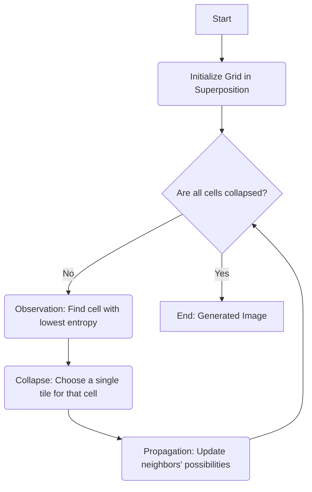

# Chapter 5: Advanced Algorithmic Approaches

This chapter explores a class of powerful procedural techniques that go beyond the foundational building blocks of noise, recursion, or simple agent-based models. While earlier chapters provided the "raw materials" for procedural content, this chapter focuses on algorithms that **assemble** those materials according to complex rules, constraints, and examples. These advanced approaches are often meta-algorithms, meaning they coordinate other, simpler techniques to solve a high-level problem.

The key theme of this chapter is the shift from direct generation to **constraint-based generation**. Instead of just defining *how* to build something (like an L-System), these methods define *what rules the final result must follow*. The goal is to generate content that is not just random, but **logically coherent** and **structurally sound**. This allows us to tackle complex problems like creating a solvable puzzle, a functional building interior, or a seamless texture that perfectly matches a specific art style.

We will delve into methods like **Wave Function Collapse (WFC)**, a remarkable algorithm that generates complex, large-scale patterns by learning local rules from a small example. We will also explore **Grammar-based Systems** in more depth, moving beyond simple L-Systems to see how formal grammars can construct complex architecture and data. We'll look at **Voxel Generation** as a method for creating truly 3D, volumetric worlds, and finally, we'll examine the core of **Constraint Satisfaction**, a problem-solving technique that can be used to generate any content that must adhere to a strict set of predefined conditions. These advanced approaches represent a significant step up in complexity, moving from generating simple *forms* to generating intelligent *systems* that self-organize and assemble content, allowing for the creation of intricate, logical, and highly detailed procedural worlds.

---

## 5.1. Wave Function Collapse (WFC)

---

### 5.1.1. Theoretical Explanation

**Wave Function Collapse (WFC)** is a powerful and relatively recent procedural generation algorithm that operates based on **local constraints**. It is fundamentally a **constraint-solving algorithm** that generates new, large-scale content by learning rules from a small input example. Unlike a top-down algorithm like BSP, WFC builds its content iteratively, starting from a state of pure uncertainty and reducing it to a single valid result.

The core principle is inspired by an analogy to quantum mechanics. The system begins in a state of **superposition**, where every cell in the output grid holds a list of *all possible tiles* it could be. The system is in a state of high entropy, or pure potential. The algorithm then enters a loop that "collapses" this superposition into a single, concrete state.

The WFC process is divided into two main phases: Initialization (Learning) and Synthesis (Collapse).

**1. Initialization (Learning Phase):**
Before generation can begin, the algorithm must first learn the rules from an example image or a predefined set of tiles. It analyzes the input and builds a "model" of adjacency constraints. For each tile type, it determines which other tiles are allowed to be its neighbors in all four directions (up, down, left, right). For example, it learns that a "grass" tile can be adjacent to a "sand" tile, but a "sand" tile can never be adjacent to a "deep water" tile.

**2. Synthesis (Collapse Phase):**
This is the main generation loop. It continuously iterates between two steps: Observation and Propagation.

Here is the high-level flow of the algorithm:


  * **Observation:** The algorithm finds the cell with the *lowest entropy*—the cell that has the fewest possible tiles remaining in its superposition. This is a heuristic that makes the process efficient; by collapsing the most constrained cell first, it avoids making choices that lead to unsolvable contradictions. If all cells have the same entropy, one is chosen at random.
  * **Collapse:** Once the cell is chosen, the algorithm "observes" it. It randomly picks *one* tile from that cell's list of possibilities (often weighted by the tile's frequency in the input example). This cell is now "collapsed" and has a single, defined state.
  * **Propagation:** This is the critical step. The newly collapsed cell now enforces its rules on its neighbors. It effectively sends a message to its northern neighbor: "I am a 'grass' tile. You must remove any tile from your list that is not allowed to be *south* of a 'grass' tile." This neighbor updates its list of possibilities. If this update *changes* its list, it in turn propagates new constraints to *its* neighbors. This chain reaction continues until the entire grid is stable and no more possibilities can be eliminated.

This "Observation-Propagation" loop repeats until every cell in the grid has collapsed into a single valid state. The final result is a complex, non-repeating pattern that perfectly adheres to the local rules learned from the input, creating a visually similar but entirely new piece of content.

---

### 5.1.2. Implementation and Pseudo-Code

---

Implementing Wave Function Collapse (WFC) involves two main phases: an initial **Learning Phase** (analyzing the input) and the **Synthesis Phase** (the main generation loop). The synthesis phase is where the core algorithm runs, iteratively collapsing the "wave function" of the grid.

#### Core Data Structures:

* **`Grid`:** A 2D or 3D array of `Cells`.
* **`Cell`:** An object that stores its current state. Instead of holding one tile, it holds a `boolean array` or `list` representing all *possible* tiles it could be. `Cell.Possibilities[TileID] = true`.
* **`AdjacencyRules`:** A lookup table (e.g., a 4D array or nested dictionary) built during the learning phase. It stores the constraints: `Rules[TileA][Direction][TileB] = true` if Tile B is allowed to be in that `Direction` relative to Tile A.

#### Pseudo-Code: The WFC Algorithm

This pseudo-code outlines the main synthesis (generation) loop.

```

// 1. INITIALIZATION
function initializeGrid(width, height, all\_tile\_types):
grid = new Array[width][height];
for x from 0 to width-1:
for y from 0 to height-1:
// Each cell starts in superposition, holding all possibilities
grid[x][y] = new Cell(all\_tile\_types);
return grid;

// 2. MAIN LOOP
function runWFC(grid, rules):
while (true):
// 3. OBSERVATION (Find Lowest Entropy)
// Find the cell with the fewest possibilities remaining (but more than 1)
cell\_to\_collapse = findLowestEntropyCell(grid);

    if cell_to_collapse == null:
        // All cells are collapsed. We are done!
        break; // Success

    // 4. COLLAPSE
    // Randomly choose one valid tile from the cell's list
    // (This can be weighted by the tile's frequency in the input)
    chosen_tile = cell_to_collapse.selectOneTile();
    cell_to_collapse.setPossibilities([chosen_tile]); // Collapse state

    // 5. PROPAGATION
    // Propagate the consequences of this choice to all neighbors
    propagateConstraints(cell_to_collapse, grid, rules);

    if hasContradiction(grid):
        // A cell has zero possibilities. Generation failed.
        return FAILURE;

return SUCCESS;
```

// 6. PROPAGATION (The Core Logic)
```
function propagateConstraints(initial\_cell, grid, rules):
// Use a stack or queue to manage cells that need to update their neighbors
stack = new Stack();
stack.push(initial\_cell);

while !stack.isEmpty():
    current_cell = stack.pop();

    // Look at all neighbors of the current cell
    for neighbor in getNeighbors(current_cell, grid):

        // What tiles are possible for this neighbor,
        // given the *current* state of `current_cell`?
        valid_neighbor_tiles = getValidTiles(current_cell, neighbor.direction, rules);

        // Check if the neighbor has any tiles that are *no longer valid*
        if neighbor.removeInvalidTiles(valid_neighbor_tiles):
            // If the neighbor's state changed (tiles were removed),
            // then *its* neighbors must also be re-checked.
            stack.push(neighbor);
```

// Helper function for propagation
```
function getValidTiles(cell, direction, rules):
// Start with an empty set of valid tiles
valid\_tiles = new Set();
// Check every tile that `cell` could possibly be
for tileA in cell.Possibilities:
// Get all tiles that are allowed to be in `direction` of tileA
allowed\_tiles = rules[tileA][direction];
valid\_tiles.add(allowed\_tiles);
return valid\_tiles;

```

---
### 5.1.3. Strengths and Limitations

***

Wave Function Collapse (WFC) is a remarkably powerful algorithm, but it is not a "magic bullet." Its strengths are profound, but they come with a distinct set of limitations that are crucial to understand.

#### Strengths

* **High-Quality Local Coherence:** WFC's primary strength is its ability to produce highly detailed, complex patterns that are *always* locally correct. Because it operates on a set of adjacency constraints learned from an example, it is impossible for it to produce an "invalid" arrangement, such as a road tile ending abruptly against a water tile (assuming the input example doesn't allow this). The result feels structured and logical at a granular level.
* **Art-Directable by Example:** The algorithm is "art-directable" in a unique way. The entire aesthetic of the output is controlled by the input example. If you provide an example of a simple, clean cartoon world, WFC will generate a large, new world with that same simple, clean cartoon style. If you feed it a dark, gritty, complex texture, it will generate a new texture with that same gritty feel. This gives artists a huge amount of control over the final look.
* **Generates Novelty from Familiarity:** WFC is not just a "copy-paste" algorithm. It generates new, large-scale structures that are not present in the small input example but are *composed* of the same local patterns. It can produce surprising and emergent global structures from a simple set of local rules, providing a powerful balance between familiarity and novelty.

#### Limitations

* **Computational Cost & Speed:** WFC can be computationally expensive. The propagation step, where constraints are updated across the grid, can be slow, especially for large grids or complex rule sets. The algorithm's performance scales non-linearly with the size of the output.
    * **Mitigation:** One common mitigation is to not generate the entire world at once. Instead, **generate in chunks** or on-demand. Another is to optimize the data structures used to store the "wave function" (e.g., using bitsets to store tile possibilities) to speed up the propagation step.

* **Generation Failure (Contradictions):** WFC is not guaranteed to succeed. It is possible for the algorithm to "paint itself into a corner," reaching a state where a cell has no valid tiles left in its superposition (its entropy is 0, but it has no valid state). This creates a contradiction, and the generation fails.
    * **Mitigation:** The most common solution is **backtracking**. When a contradiction is found, the algorithm "rewinds" its last few choices and tries a different random collapse. A simpler, more brute-force mitigation is to simply **restart the entire generation** with a different random seed, which will almost always produce a different (and hopefully valid) result.

* **Lack of Global Control:** WFC is brilliant at *local* coherence but has no concept of *global* structure. It is a pattern generator, not a level designer. It cannot be told to "place a boss room at the end of a long corridor" or "make sure the city has one large park in the center." It only knows that a "park" tile can be next to a "street" tile.
    * **Mitigation:** This is the most important limitation to overcome. The best mitigation is a **hybrid approach**. Use a different, top-down algorithm (like **Graph-based Generation** or **BSP**) to generate the high-level *global* structure (e.g., the main rooms of a dungeon). Then, run WFC *inside* those pre-defined areas to fill them with the low-level, *local* detail (e.g., WFC generates the "floor pattern" or "wall details" inside a BSP room). You can also **pre-collapse** certain cells to guide the generation (e.g., manually placing a "door" tile before running the algorithm).

* **Input-Dependent "Garbage In, Garbage Out":** The quality of the output is 100% dependent on the quality and clarity of the input example. If the input example is messy, contains contradictions, or is not representative of the desired style, the output will also be messy or will fail frequently.
    * **Mitigation:** This is more of a design-pipeline mitigation. The solution is to **invest time in creating a high-quality, clean, and representative input example**. The input image or tile set must be carefully curated to contain all the adjacency patterns you want (and none that you don't).


### 5.1.4. Use Cases for Generation
***
WFC's ability to enforce local consistency makes it incredibly versatile. It is primarily used in situations where a high degree of local, structural coherence is required, and where the "look and feel" can be defined by a small example.

* **Seamless Texture Generation** 🖼️
    * **Concept:** This is the most common use of WFC. The algorithm is given a small, representative texture as an input example. It learns the local patterns (e.g., which 3x3 pixel pattern is allowed) and then generates a new, much larger texture that perfectly adheres to those patterns.
    * **Result:** A large, non-repeating, and perfectly seamless texture that has the exact visual style and "feel" of the small input, but without the obvious repetition of simple tiling. This is ideal for materials like mossy bricks, complex fabrics, or alien ground textures.

* **Tilemap and World Map Generation** 🗺️
    * **Concept:** Instead of learning from pixels, WFC is given a set of explicit 2D tiles (e.g., "grass," "water," "sand," "forest") and their adjacency rules (e.g., "water can only be next to sand," "grass can be next to forest").
    * **Result:** The algorithm generates large, plausible 2D world maps. The local rules ensure that biomes blend naturally and that impossible transitions (like a forest tile next to an ocean tile) do not occur. This is used extensively in 2D simulation and strategy games.

* **Logical Building Interiors & Dungeons** 🏛️
    * **Concept:** WFC is given a set of 3D or 2D modules representing building components: "wall segment," "window," "doorway," "corner piece," "corridor," "stairwell." The adjacency rules define how these pieces must connect (e.g., a "doorway" must connect to a "floor" tile on both sides).
    * **Result:** WFC can generate the complete interior layout of a building or a complex dungeon that is *functional* and *logical*. All doors lead somewhere, corridors connect correctly, windows are only placed on exterior walls, and the entire structure is architecturally consistent with the input style.

* **3D Model Generation & Voxel Art** 🧊
    * **Concept:** This extends the 2D tilemap concept to three dimensions. The algorithm is given a set of 3D "voxel chunks" or mesh modules as its input tiles. The rules define which 3D chunk can be placed next to, on top of, or below another chunk.
    * **Result:** WFC can assemble these 3D chunks to create complex, large-scale 3D models that maintain a consistent visual style. This is used for generating procedural spaceships, intricate voxel castles, or complex, abstract 3D sculptures.

* **City Layout Generation** 🏙️
    * **Concept:** This is a more advanced version of the tilemap application. The input "tiles" are pre-defined city blocks (e.g., "dense residential," "commercial," "park," "T-junction road," "straight road"). The adjacency rules are more complex, defining a functional city logic (e.g., "a 'commercial' tile must be adjacent to a 'road'," "a 'residential' tile should *not* be adjacent to an 'industrial' tile").
    * **Result:** WFC generates large-scale, functional city maps that are not just random collections of buildings. The algorithm naturally creates districts, ensures all roads connect, and produces plausible urban layouts that adhere to a specific style (e.g., a medieval city with winding alleys vs. a modern city grid).

* **Puzzle Generation** 🧩
    * **Concept:** WFC's core strength as a constraint-solver is leveraged to create solvable puzzles. The tiles represent puzzle elements, such as "pipe segments" (straight, corner, T-junction), "laser emitters," "mirrors," or "circuit components." The rules define how these elements must connect (e.g., "a pipe's opening must connect to another pipe's opening").
    * **Result:** The algorithm can generate complex, solvable puzzles like pipe-laying games, electrical circuit puzzles, or Sokoban-style levels where the solvability is guaranteed by the local constraints. By pre-collapsing a "start" and "end" tile, the generator is forced to find a valid, connecting path between them.

* **Procedural Music & Sequences** 🎵
    * **Concept:** WFC can be applied to 1D data, such as music. The "tiles" are musical notes, chords, or short melodic phrases. The algorithm learns the adjacency rules from an input piece of music (e.g., "a G-major chord is often followed by a C-major chord").
    * **Result:** The algorithm generates new, coherent musical sequences that share the same harmonic structure and "feel" as the input, but are entirely novel. This can be used for creating endless, non-repeating background music for a game or for generating new creative ideas for a musician.


### 5.1.5. Algorithmic Variations

***

The core Wave Function Collapse algorithm is a flexible framework. Its behavior can be significantly altered based on how the "tiles" and "rules" are defined, and how the collapse process is handled.

#### Tiled Model vs. Overlapping Model

This is the most fundamental variation in WFC, defining how the rules are created.

* **Tiled Model:** In this model, the "tiles" are explicit, pre-defined units (like a set of 16x16 pixel sprites: 'grass', 'road_straight', 'road_corner'). The adjacency rules are also explicitly defined by the user (e.g., in an XML file: "'road_straight' can be to the 'left' of 'road_corner'"). This gives the artist direct control over the allowed connections.
    * **Use Cases:** Perfect for generating tile-based game levels, city layouts, or circuit diagrams where the constituent parts are known and distinct.
* **Overlapping Model:** This is the more "magical" variation. The algorithm is given a single example image as input. It "learns" the rules by sliding a small N*N window (e.g., 3x3 pixels) over the entire image. Each unique N*N pattern it finds becomes a "tile." The adjacency rules are automatically inferred by observing which patterns are adjacent to which other patterns in the input.
    * **Use Cases:** Ideal for seamless texture generation, generating biomimetic patterns (like spots or stripes), or creating content that *feels* like the input but is entirely new.

---

#### 3D Wave Function Collapse

* **Concept:** This extends the WFC algorithm from a 2D grid to a 3D voxel grid. The core logic remains the same, but the adjacency rules are expanded from 4 directions (North, South, East, West) to 6 directions (Up, Down, North, South, East, West).
* **Use Cases:** Generating complex, fully 3D structures like voxel-based buildings, intricate spaceships, 3D dungeon interiors, or complex geological formations. It can create logical 3D structures that are difficult to achieve with 3D noise functions alone.

---

#### Weighted & Probabilistic WFC

* **Concept:** This variation refines the "Collapse" step. In the base algorithm, when a cell is observed, it picks one of its remaining possibilities with a uniform random chance. In a weighted WFC, this choice is biased by the *frequency* of each tile in the original input example. Tiles that appeared more often in the input are more likely to be chosen during the collapse.
* **Use Cases:** This is essential for ensuring the *statistical texture* of the output matches the input. If the input example is 90% grass and 10% sand, a weighted WFC will produce a new map that is also approximately 90% grass, making the result feel much more authentic.

---

#### WFC with Backtracking

* **Concept:** The standard WFC algorithm is "greedy" and can fail by running into a contradiction (a cell where no tiles are possible). This variation turns WFC into a full constraint solver by adding backtracking. When a contradiction is reached, the algorithm "backtracks" by undoing its last N choices and trying a different random path.
* **Use Cases:** This is crucial for solving highly constrained problems where a valid solution *must* be found, such as generating solvable puzzles (like Sudoku or pipe-laying games) or ensuring a dungeon layout has a guaranteed path from start to finish.

---

## 5.2. Grammar-based Systems

---

While L-Systems (covered in Chapter 3) are a specific type of grammar for generating branching, string-based structures, this section explores the broader category of **Grammar-based Systems**. These are powerful procedural techniques that use a set of formal rules, or a "grammar," to generate complex, structured content. Much like a linguistic grammar defines the rules for constructing a valid sentence (e.g., `Sentence → Noun + Verb`), a procedural grammar defines the rules for constructing a valid *object* (e.g., `Building → Facade + Roof`). This approach is ideal for content that has a strong, hierarchical, and logical structure, such as architecture, language, or intricate 3D models.

### 5.2.1. Theoretical Explanation

**Grammar-based systems** are a powerful procedural technique that uses a set of formal rules, known as a **grammar**, to generate complex, structured content. This approach is directly analogous to linguistics, where a grammar defines the rules for constructing valid sentences from words and phrases. In procedural generation, instead of constructing sentences, we construct objects, buildings, or other complex data.

The core of any grammar-based system consists of three key components:

1.  **Alphabet (V):** This is the set of all possible symbols that the system understands. The alphabet is divided into two types:
    * **Terminals:** These are concrete, "final" symbols that represent an actual object or action (e.g., `draw_window`, `create_room`, `wall`). They cannot be replaced further.
    * **Non-Terminals:** These are abstract, high-level symbols that must be replaced by other symbols (e.g., `Building`, `Facade`, `Floorplan`). They act as placeholders for more complex structures.
2.  **Axiom (ω):** This is the starting symbol (or string of symbols) for the generation process. It is the initial, high-level description of the object to be generated (e.g., the axiom might simply be `Building`).
3.  **Production Rules (P):** This is the set of rules that defines how non-terminal symbols can be replaced. A rule takes the form `A → B`, meaning the symbol `A` can be replaced by the symbol or string of symbols `B`. For example, a rule might be `Facade → Window + Wall + Window`.

The generation process is a **recursive replacement** (or "derivation"). It starts with the axiom and repeatedly applies production rules, replacing non-terminal symbols with their definitions. This process continues until only terminal symbols remain. The final string of terminal symbols is then interpreted to construct the final object. This top-down, hierarchical approach is ideal for generating content that has a strong, logical, and often self-similar structure.


### 5.2.2. Implementation and Pseudo-Code

Implementing a grammar-based system involves translating the theoretical components (alphabet, axiom, rules) into concrete data structures and a processing loop. The core of the implementation is a **derivation engine** that iteratively applies the production rules. This engine's main task is to scan the current state (often a list of symbols) and find non-terminal symbols. When one is found, it consults the "rulebook" (the grammar) and replaces that symbol with its definition. This process repeats until no non-terminal symbols remain, resulting in a final list of terminal symbols that can be interpreted to create the final geometry or data.

#### Data Structures and Data Model

To build a robust grammar engine, three primary data structures are essential.

1.  **`Symbol`:** A representation of an element in our alphabet. Rather than a simple string, it's best implemented as a class or struct to hold metadata, especially for more advanced grammars.
    ```
    class Symbol:
        string name                 // e.g., "Facade", "Window", "draw_cube"
        bool is_terminal            // Is this a final symbol (true) or an abstract one (false)?
        // ... parameters for parametric grammars (e.g., width, height) could be added here
    ```

2.  **`Rule`:** A single production rule. It defines a non-terminal symbol as input and the sequence of symbols that will replace it.
    ```
    class Rule:
        Symbol non_terminal_input   // The symbol to be replaced (e.g., 'Facade')
        List<Symbol> replacement_sequence // The symbols that replace it (e.g., ['Window', 'Wall', 'Window'])
    ```

3.  **`Grammar`:** A container object that holds the complete set of rules, typically organized for fast lookups (like a dictionary or hash map), and the starting axiom.
    ```
    class Grammar:
        // A dictionary mapping a symbol's name to a list of possible rules.
        // Using a list allows for stochastic grammars (multiple rules for one symbol).
        Dictionary<string, List<Rule>> rules

        List<Symbol> axiom // The starting sequence (e.g., [new Symbol("Building", false)])
    ```

#### Pseudo-Code: The Derivation Engine

The generation process is a loop that repeatedly scans and replaces symbols until no non-terminals are left. This is a **breadth-first** implementation, which expands all symbols at a given generation step simultaneously.

```

function generate(grammar, max\_iterations):
// Start with the axiom
current\_symbols = grammar.axiom

iteration = 0
// We loop until we are done or hit the max iteration limit
while iteration < max_iterations:

    next_symbols = new List<Symbol>()
    all_terminals_found = true // Assume we are done until a non-terminal is found

    // 1. Scan the current list of symbols
    for symbol in current_symbols:

        if symbol.is_terminal:
            // Terminal symbols are final, just pass them to the next list
            next_symbols.add(symbol)
        else:
            // This is a non-terminal, so we are not done
            all_terminals_found = false

            // 2. Find the rule(s) for this symbol
            if grammar.rules.contains_key(symbol.name):
                // (For simplicity, we pick the first rule.
                // A stochastic grammar would randomly choose from the list.)
                rule_to_apply = grammar.rules[symbol.name].first()

                // 3. Replace the symbol with the rule's replacement sequence
                next_symbols.add_all(rule_to_apply.replacement_sequence)
            else:
                // Error: No rule found for this non-terminal
                // We can either stop or just pass the symbol through
                next_symbols.add(symbol)

    // Update the current list for the next iteration
    current_symbols = next_symbols

    // 4. Check for base case
    if all_terminals_found:
        break // Generation is complete

    iteration += 1

// The final list contains only terminal symbols, ready for interpretation
return current_symbols
```

### 5.2.3. Strengths and Limitations

Grammar-based systems are a powerful, high-level approach to procedural generation, but they come with a distinct set of trade-offs. Their strength lies in their ability to create highly structured, complex content, but this often comes at the cost of organic unpredictability.

#### Strengths

* **Structural Coherence & Hierarchy:** Grammars are the best tool for generating content that is inherently hierarchical. A building is naturally composed of floors, which are composed of rooms, which are composed of walls and furniture. A grammar can model this hierarchy perfectly, ensuring the final output is always structurally sound and logically organized.
* **High Degree of Control:** Because the system is defined by explicit rules (e.g., `Facade -> 3 * Window`), the designer has immense control over the final output. This makes it possible to enforce a specific, consistent **architectural style** or design language across all generated assets.
* **Data Compactness & Scalability:** An incredibly complex object, like a 100-story building, can be generated from a very small set of rules. The grammar itself is the asset; the final geometry is just the result of its execution. This allows for the generation of vast, complex structures with a minimal memory footprint.
* **Emergent Complexity from Simple Rules:** Like L-Systems and CAs, simple grammar rules can be applied recursively to generate objects of immense complexity that would be impossible to create by hand.

#### Limitations and Mitigations

* **Rigidity and "Boxy" Results:**
    * **Limitation:** Standard, deterministic grammars can produce results that feel sterile, repetitive, and overly geometric. If the rule is always `Facade -> 3 * Window`, every facade will look identical.
    * **Mitigation:** Introduce **Stochastic Grammars**. Instead of one rule, provide multiple probabilistic options: `Facade -> 3 * Window (40% chance)` OR `Facade -> 2 * Window + 1 * Door (60% chance)`. This introduces variation while maintaining the overall style. A second mitigation is to apply **post-processing filters** (like noise or spatial deformation) to the final geometry to break up straight lines and add organic imperfections.

* **Lack of Global Context & Environmental Awareness:**
    * **Limitation:** A simple grammar rule doesn't know *where* it is. It might try to place a `Window` on a wall that is facing another building or buried underground.
    * **Mitigation:** Use more advanced grammars. **Context-Sensitive Grammars** allow a rule to fire only if its neighbors match a certain pattern. Even better are **Parametric Grammars**, where symbols carry parameters (e.g., `Wall(length, height, orientation)`). The rules can then query these parameters or the environment, for example: `Wall(l, h, 'north') -> Window` (only place a window if the wall faces north).

* **Difficulty in Rule Design:**
    * **Limitation:** The quality of the output is entirely dependent on the quality of the grammar. Designing a good grammar that is robust, flexible, and produces aesthetically pleasing results is an extremely difficult and highly skilled creative task.
    * **Mitigation:** This is primarily a tooling and workflow problem. The best mitigation is to use **visual grammar editors** (like those found in software like Houdini or CityEngine) that allow designers to create and test rules graphically rather than by writing code. A more advanced, AI-driven mitigation is **Grammar Induction**, which attempts to *learn* a set of grammar rules by analyzing a set of existing, hand-made examples.

* **Poor at Non-Hierarchical or Organic Content:**
    * **Limitation:** Grammars are built for top-down, hierarchical structures. They are the wrong tool for generating "messy," bottom-up, organic patterns like a noise field, a cracked mud flat, or a fluid simulation.
    * **Mitigation:** Use a **hybrid approach**. Do not try to solve every problem with one algorithm. Use the grammar to generate the *skeleton* or *structure* (e.g., the building frame, the city layout) and then use other techniques (like noise generators, CAs, or WFC) to fill in the *details* (e.g., the wall textures, the furniture placement, the crowd simulation).

### 5.2.4. Use Cases for Generation
***
Grammar-based systems are exceptionally good at creating content that is **hierarchical**, **structured**, and **stylistically consistent**. The rules of the grammar act as a "blueprint" or "design language," ensuring that all generated content, from an entire city to a single word, feels like it belongs to the same set.

* **1. Architectural Facades** 🏛️
    * **Concept:** Use a **Shape Grammar** to recursively subdivide a building's rectangular facade into floors, windows, doors, and decorative elements.
    * **Pseudo-Code:**
        ```
        Axiom: Facade
        Rule 1: Facade -> split_vert(Floor, Floor, Roof)
        Rule 2: Floor  -> split_horiz(Wall_Section, Window, Wall_Section)
        Rule 3: Window -> Glass_Pane + Frame
        ```
    * **Result:** Generates complex, non-random building fronts that all share a consistent architectural style.

* **2. Building Floorplans** 🗺️
    * **Concept:** Recursively partition a 2D plot into functional spaces, defining rooms and their connections.
    * **Pseudo-Code:**
        ```
        Axiom: Plot
        Rule 1: Plot -> split_horiz(Living_Area, Utility_Area)
        Rule 2: Living_Area -> split_vert(Lounge, Dining_Room)
        Rule 3: Utility_Area -> split_horiz(Kitchen, Bathroom)
        ```
    * **Result:** A logically organized floor plan where spaces are defined by function and adjacency.

* **3. City Layouts (Hierarchical)** 🏙️
    * **Concept:** Generate a city's macro-structure from the top down, defining districts, blocks, and lots.
    * **Pseudo-Code:**
        ```
        Axiom: City
        Rule 1: City -> District_Commercial + District_Residential + Road_Network
        Rule 2: District_Residential -> Block + Block + Park
        Rule 3: Block -> 4 * Lot
        ```
    * **Result:** A city map with clear, zoned districts and a logical, hierarchical road network.

* **4. Vegetation (L-Systems)** 🌳
    * **Concept:** Use a string-rewriting grammar (L-System) to generate branching, self-similar plant structures.
    * **Pseudo-Code:**
        ```
        Axiom: F
        Rule 1: F -> F[+F]F[-F]F  // [=Push state, ]=Pop state, +=TurnLeft, -=TurnRight
        ```
    * **Result:** A classic fractal tree, which can be interpreted by a "turtle" graphics system to create a 2D or 3D plant model.

* **5. Narrative/Quest Generation** 📜
    * **Concept:** Generate a story structure by replacing high-level plot points with specific events, ensuring a logical narrative flow.
    * **Pseudo-Code:**
        ```
        Axiom: Quest
        Rule 1: Quest -> Intro_NPC + Objective + Reward
        Rule 2: Objective -> (GoTo_Dungeon | Defeat_Enemy | Fetch_Item) // Stochastic choice
        Rule 3: GoTo_Dungeon -> Find_Cave_Entrance + Clear_Cave_Interior
        ```
    * **Result:** A simple but complete quest chain that is guaranteed to be structurally valid.

* **6. Weapon/Item Assembly** ⚔️
    * **Concept:** Define a complex item as a hierarchy of its components, allowing for varied combinations.
    * **Pseudo-Code:**
        ```
        Axiom: Magic_Sword
        Rule 1: Magic_Sword -> Blade + Hilt + Pommel_Gem
        Rule 2: Blade -> (Short_Blade | Long_Blade)
        Rule 3: Pommel_Gem -> (Ruby_of_Fire | Sapphire_of_Ice)
        ```
    * **Result:** A data structure defining a unique, named weapon with a clear component list, perfect for crafting systems.

* **7. Musical Composition** 🎵
    * **Concept:** Generate a song structure by recursively replacing musical sections with specific chord progressions or note sequences.
    * **Pseudo-Code:**
        ```
        Axiom: Song
        Rule 1: Song -> Verse + Chorus + Verse + Chorus + Bridge + Chorus
        Rule 2: Verse -> Progression_Am_G_C
        Rule 3: Chorus -> Progression_C_G_F
        ```
    * **Result:** A complete, structured chord progression that forms a coherent piece of music.

* **8. UI Layout Generation** 🖥️
    * **Concept:** Define a UI screen as a hierarchy of containers and elements, ensuring a consistent layout.
    * **Pseudo-Code:**
        ```
        Axiom: Main_Menu
        Rule 1: Main_Menu -> Title_Header + Vertical_Box(Button_List) + Footer
        Rule 2: Button_List -> Button_Play + Button_Options + Button_Quit
        ```
    * **Result:** A structured UI definition that can be automatically rendered by a UI engine.

* **9. Fractal Art (Geometric)** 🎨
    * **Concept:** Use shape grammars to recursively replace geometric primitives, similar to L-Systems but with shapes.
    * **Pseudo-Code:**
        ```
        Axiom: Square
        Rule 1: Square -> 4 * Small_Square (at corners) + 1 * Circle (in middle)
        Rule 2: Circle -> 4 * Small_Circle (on axes)
        ```
    * **Result:** A complex, geometric fractal pattern, such as a Sierpinski carpet variant.

* **10. Procedural Text/Language** 🗣️
    * **Concept:** Generate new, plausible-sounding words or names based on a grammar of syllables.
    * **Pseudo-Code:**
        ```
        Axiom: Elf_Name
        Rule 1: Elf_Name -> (Prefix + Mid_Syllable + Suffix | Prefix + Suffix)
        Rule 2: Prefix -> ( "El" | "Ara" | "Gal" )
        Rule 3: Suffix -> ( "driel" | "las" | "mir" )
        ```
    * **Result:** New, stylistically consistent names like "Aradriel" or "Elas", perfect for fantasy world-building.

### 5.2.5. Algorithmic Variations

The power of grammar-based systems can be greatly enhanced by moving beyond simple, deterministic rules. These variations introduce randomness, context, and parameters, allowing for the generation of much more dynamic, varied, and responsive content.

#### Stochastic Grammars
* **Concept:** This is the most common variation. Instead of a single, deterministic rule for each non-terminal, a **stochastic grammar** (or probabilistic grammar) provides a *list* of possible replacement rules, each assigned a specific probability or weight. When the engine needs to replace a symbol, it randomly chooses one of the available rules based on these weights.
* **Pseudo-Code:**
    ```
    // Rules are now a list of possibilities, each with a weight
    Grammar.Rules = {
        "Facade": [
            { replacement: [Window, Wall, Window], weight: 0.6 }, // 60% chance
            { replacement: [Wall, Door, Wall], weight: 0.3 },    // 30% chance
            { replacement: [Wall, Wall, Wall], weight: 0.1 }     // 10% chance
        ]
    }

    function find_rule_for(symbol):
        rules_list = Grammar.Rules[symbol.name]
        // Select a rule from the list based on its weight
        chosen_rule = weighted_random_choice(rules_list)
        return chosen_rule
    ```
* **Use Case Example:** Generating a varied city skyline. A `Building` axiom can be replaced by `Tower (70%)` or `Block (30%)`, leading to a city that is not uniform but has a clear, dominant style. This is also heavily used in name generation (Section 5.2.4, Example 10) to create believable variations.

---
#### Context-Sensitive Grammars
* **Concept:** In a basic grammar, a rule `A -> B` is always applied to `A` regardless of its neighbors. A **context-sensitive grammar** allows a rule to fire only if the symbol is in a specific context (i.e., surrounded by other specific symbols). The rule format becomes `L < A > R -> B`, meaning "replace `A` with `B` *only if* it is preceded by `L` and followed by `R`."
* **Pseudo-Code:**
    ```
    // Rule: "Only place a door if it's on the ground floor next to a street"
    // (This is a simplified representation)

    // Check for context before applying a rule
    function find_rule_for(symbol, left_neighbor, right_neighbor):
        if symbol.name == "Wall_Segment" and left_neighbor.name == "Street":
            // Found a context-sensitive rule
            return { replacement: [Door] }
        else:
            // Default rule
            return { replacement: [Window] }
    ```
* **Use Case Example:** Creating a logical building facade. A context-sensitive rule can prevent a `Window` from being placed next to a `Door`, or ensure that a `Balcony` symbol is only placed if the symbol *below* it is a `Floor_Support`. This prevents nonsensical architectural combinations.

---
#### Parametric Grammars
* **Concept:** This variation adds parameters (or arguments) to the symbols, turning them into functions. Instead of a rule being `A -> B`, it becomes `A(x, y) -> B(x/2, y) + C(x/2, y)`. The rules can now modify and pass these parameters to their children.
* **Pseudo-Code:**
    ```
    // Axiom: Building(width=100, height=200)

    // Rule: "A building splits into a facade and a roof"
    // The facade gets 80% of the height, the roof gets 20%
    Rule: Building(w, h) -> Facade(w, h * 0.8) + Roof(w, h * 0.2)

    // Rule: "A facade splits into 3 windows, each taking 1/3 of the width"
    Rule: Facade(w, h) -> Window(w/3, h) + Window(w/3, h) + Window(w/3, h)
    ```
* **Use Case Example:** Generating a geometrically precise building. A top-level `Building` symbol can have parameters for `width` and `height`. The grammar rules then *calculate* the dimensions of all sub-components (floors, windows, doors) based on these initial parameters, ensuring the final geometry always fits together perfectly.

---
#### Graph Grammars
* **Concept:** This variation replaces the linear string or list of symbols with a **graph**. The rules no longer replace a single symbol, but rather find a specific *node* or *sub-graph* and replace it with a new, more complex *sub-graph*. This is essential for generating content that is non-linear, such as a branching dungeon or a road network.
* **Pseudo-Code:**
    ```
    // Axiom: A single graph node [Node("Entrance")]

    // Rule: "Replace a 'Room' node with a 'Room' connected to a 'Corridor' and another 'Room'"
    Rule: Node("Room") -> [Node("Room_A"), Node("Corridor"), Node("Room_B")]
                          with Edges: [("Room_A", "Corridor"), ("Corridor", "Room_B")]

    function applyGraphRule(graph, node, rule):
        if node.type == rule.input:
            // Create the new subgraph defined by the rule
            subgraph = rule.replacement_graph
            // Attach the subgraph's "entry/exit" points to the original node's neighbors
            graph.replace_node_with_subgraph(node, subgraph)
    ```
* **Use Case Example:** Generating complex, non-linear dungeon layouts where rooms (nodes) and corridors (edges) form intricate networks. This is far more flexible than a simple top-down BSP or recursive algorithm.

---
#### Grammar Induction (Inverse Procedural Modeling)
* **Concept:** This is the *reverse* of a standard grammar. Instead of the designer *writing* rules to generate content, the designer provides *examples* of finished, hand-made content. The algorithm then **infers** or **learns** a set of grammar rules that could have produced that content. This is a machine-learning approach to grammar generation.
* **Pseudo-Code:**
    ```
    // This is a high-level ML-style process, not a simple loop
    function induceGrammar(list_of_example_buildings):
        // 1. Analyze all buildings to find common patterns and sub-structures
        patterns = find_common_patterns(list_of_example_buildings)

        // 2. Cluster patterns to create non-terminal symbols
        // e.g., ["window_type_A", "window_type_B"] becomes NonTerminal("Window")
        clusters = create_symbol_clusters(patterns)

        // 3. Generate probabilistic rules based on observed adjacencies
        // e.g., "Window" is 70% of the time next to "Wall_Brick"
        grammar = new Grammar()
        for cluster in clusters:
            rule = generate_probabilistic_rule(cluster, patterns)
            grammar.add_rule(rule)

        return grammar
    ```
* **Use Case Example:** Analyzing a 3D model of a historic, hand-modeled building to generate a grammar that can then create *new*, different buildings in the *same architectural style*.

---
#### Constraint Grammars (Grammars with Backtracking)
* **Concept:** This variation combines a grammar system with a **Constraint Satisfaction** (CSP) solver. A grammar rule is only allowed to be applied *if* it does not violate a set of global or local constraints. If applying a rule leads to an invalid state (a contradiction), the system **backtracks** (reverts the change) and tries a different rule.
* **Pseudo-Code:**
    ```
    // This is a recursive backtracking function
    function generateWithConstraints(current_symbols, constraints):
        // Base Case: If all symbols are terminal, we are done
        if all_terminals(current_symbols):
            return current_symbols // Success

        symbol_to_replace = find_next_non_terminal(current_symbols)
        possible_rules = grammar.rules[symbol_to_replace.name]

        for rule in possible_rules:
            // 1. Apply the rule
            new_symbols = apply_rule(current_symbols, rule)

            // 2. Check constraints
            if satisfies_constraints(new_symbols, constraints):
                // 3. Recurse
                result = generateWithConstraints(new_symbols, constraints)
                if result != FAILED:
                    return result // Found a valid path

        // 4. Backtrack: All rules for this symbol failed the constraints
        return FAILED
    ```
* **Use Case Example:** Generating a solvable level. The grammar rules build the dungeon, but a global constraint `path_must_exist(start, exit)` is constantly checked. If a rule application blocks the only path, the system backtracks and tries a different rule, guaranteeing a solvable level.

---
### 5.3. Voxel Generation

This section explores **Voxel Generation**, a technique for creating and representing 3D worlds using **voxels**, or "volumetric pixels." A voxel is the 3D equivalent of a 2D pixel; it is a small, discrete cube that holds data, such as a material type ('rock', 'air', 'water'), a color, or a density value. Unlike traditional polygon-based modeling, which only defines the *surface* of an object—like a hollow cardboard box—voxel generation defines the entire 3D *volume* of a space. This approach is more akin to carving a statue from a solid block of marble.  Every single point in the 3D space has a defined state, making the world inherently "solid."

This "solid" nature is fundamental for creating fully **destructible and modifiable environments**, as famously seen in games like *Minecraft*. Because the world is made of discrete blocks, complex operations like digging a tunnel, building a castle, or simulating an explosion are reduced to a simple process: changing the state of individual voxels from 'rock' to 'air', or 'air' to 'wood'. This makes boolean operations (adding, subtracting, or intersecting matter) robust and easy to compute, which is a notoriously difficult problem for traditional surface-based polygon models.

However, this power comes at a significant computational cost. A voxel world is a massive 3D grid, and even a moderately sized $1024 \times 1024 \times 1024$ world contains over a billion data points. This section will therefore examine the two primary challenges of this approach: **generation** and **representation**. For generation, we will explore how algorithms like **3D noise functions** (e.g., 3D Perlin or Simplex noise) are sampled to create large-scale, coherent structures like continents, mountains, and cave systems. For representation, we will examine the core data structures used to manage this massive amount of data—from simple **dense 3D grids** (which are fast but memory-intensive) to efficient **sparse octrees** (which save memory by only storing data for non-empty space). Finally, we'll touch upon how these solid volumes are translated back into polygons for modern GPUs using **meshing algorithms** like **Marching Cubes**.

### 5.3.1. Theoretical Explanation

***

#### Voxel Definition
A **voxel**, a portmanteau of "volumetric pixel," is the fundamental building block of a 3D volumetric grid. Unlike a 2D pixel, which represents a value on a flat plane, a voxel represents a value in a three-dimensional space. It's a small, discrete cube of data. This data can be simple, like a material type (e.g., `1 = 'rock'`, `2 = 'air'`, `3 = 'water'`), or more complex, holding values for density, color, or other physical properties.

#### Volumetric vs. Surface Paradigm
Traditional 3D modeling almost exclusively uses a **surface paradigm**. Objects are defined by a "skin" of polygons (triangles) that form a hollow shell. This is efficient for rendering, but it's difficult to modify, as operations like carving a hole require complex, non-trivial polygon math.

**Voxel generation**, by contrast, uses a **volumetric paradigm**. The world is represented as a solid block of matter, much like a 3D photograph or a block of marble.  This approach makes certain operations incredibly simple and robust. For example, destroying terrain is as easy as changing a voxel's state from `'rock'` to `'air'`. This "solid" nature is what allows for the total environmental destructibility and player-driven construction seen in games like *Minecraft*.

#### Core Challenges
While powerful, this volumetric approach presents three distinct and significant technical challenges that must be solved in any practical voxel system:

1.  **Generation:** How is the data for billions of voxels *created*? A $1024^3$ world has over a billion voxels. This is typically solved by sampling a 3D **noise function** (like 3D Perlin or Simplex noise) at each (x, y, z) coordinate to determine the voxel's type.
2.  **Representation:** How is this massive dataset *stored* in memory? Storing a billion `int` values is unfeasible. This is solved using efficient **sparse data structures**, most notably **Octrees**, which only store data for areas that contain matter, ignoring vast empty spaces.
3.  **Meshing:** How is this solid block of data *rendered*? Modern GPUs are designed to draw polygons, not voxels. This is solved by a **meshing algorithm** (like **Marching Cubes**) that scans the voxel data and generates an optimized polygon mesh (a "skin") on the fly for the GPU to draw.

### 5.3.2. Implementation and Pseudo-Code

Implementing a complete voxel engine requires solving the three core challenges identified previously: **Generation**, **Representation**, and **Meshing**. This is not a single, monolithic algorithm, but rather a *pipeline* of three distinct systems that must work together seamlessly.

1.  **Generation:** We need an algorithm (like 3D Simplex Noise) to *create* the density data.
2.  **Representation:** We need an efficient data structure (like an Octree) to *store* this massive dataset.
3.  **Meshing:** We need a translation algorithm (like Marching Cubes) to *convert* this data into polygons that a GPU can render.

To build this pipeline, we must first define our core data models.

#### Core Data Models

1.  **`VoxelData` (Struct):** This is the smallest indivisible unit of data in our world. A simple struct is often sufficient, representing the "what" at a single point in space.
    ```
    struct VoxelData:
        int material_type  // e.g., 0=Air, 1=Rock, 2=Water
        float density        // A continuous value from -1.0 (empty) to 1.0 (solid).
                             // This is crucial for smooth meshing algorithms.
        // ... other data like color, health, metadata, etc. could be added here
    ```

2.  **`VoxelStorage` (e.g., Octree):** This is the data structure that holds the `VoxelData`. While a dense 3D array (`VoxelData[x][y][z]`) is the simplest, it is extremely memory-intensive. A **Sparse Octree** is the standard, high-performance solution, as it only allocates memory for regions that actually contain data (i.e., not empty air).
    ```
    class OctreeNode:
        Vector3 position     // The center of this node
        float size         // The physical size of this node (e.g., 64 units)
        OctreeNode children[8] // Pointers to the 8 child octants (null if this is a leaf)
        VoxelData data       // Holds the voxel data *if* this is a leaf node
    ```

3.  **`Mesh` (Struct):** This is the final output of the pipeline, ready to be sent to the GPU for rendering. It is a standard geometry data structure.
    ```
    struct Mesh:
        List<Vector3> vertices
        List<Vector3> normals
        List<int> triangles // Indices into the vertices list (e.g., [0, 1, 2, 0, 2, 3])
    ```

#### Part A: Data Representation (Storage)

This is the first and most critical implementation challenge in a voxel engine. The choice of data structure for storing the world's data dictates the engine's memory footprint and performance. A naive approach can easily consume all available system memory before a single voxel is rendered.

---

##### 1. Dense Grids

* **Concept:** The simplest and most straightforward method. A dense grid is a massive 3D array (e.g., `VoxelData[width][height][depth]`) where every single (x, y, z) coordinate in the world has a corresponding entry in memory.
* **Strengths:**
    * **O(1) Access Time:** Accessing or modifying any voxel is extremely fast, as you can find it directly via its array index (e.g., `data = grid[102][55][23]`).
    * **Simplicity:** Very easy to implement and debug.
* **Limitations:**
    * **Massive Memory Cost:** This is the primary drawback. A $1024 \times 1024 \times 1024$ world would require storing over *one billion* `VoxelData` objects. This is unfeasible for large worlds, especially since most of the world (e.g., empty sky, solid ground underground) is redundant data.
* **Data Model (Pseudo-Code):**
    ```
    // A 3D array where every single coordinate (x, y, z) maps to a data value.
    // Example for a small 256x256x256 chunk:
    VoxelData[256][256][256] dense_chunk_grid;

    // Access is O(1) - very fast:
    function getVoxel(x, y, z):
        return dense_chunk_grid[x][y][z];

    function setVoxel(x, y, z, data):
        dense_chunk_grid[x][y][z] = data;
    ```
* **Use Case:** Best suited for small, contained voxel spaces, such as a single procedural 3D model, a character, or a small special effect, where performance is far more important than memory.

---

##### 2. Sparse Octrees

* **Concept:** This is the standard, high-performance solution for storing large, sparse voxel worlds. An **Octree** (from *octo*, meaning eight) is a tree data structure where each node represents a cubic volume of space (a "bounding box").
* If the volume a node represents is **uniform** (i.e., all voxels inside it are identical, such as "all air" or "all stone"), that node becomes a **leaf node** and stores that single data value.
* If the volume is **non-uniform** (it contains a mix of materials), the node is subdivided into eight smaller cubes ("octants"), and each octant becomes a **child node**. This process repeats recursively until a base size (a single voxel) or a uniform region is reached.
* **Strengths:**
    * **Massive Memory Savings:** This is the key benefit. Vast, empty regions of space (like the sky) or huge, solid regions (like deep underground) are stored as a single node, consuming almost no memory compared to a dense grid.
* **Limitations:**
    * **O(log n) Access Time:** Accessing a single voxel is slower than a dense grid. You must traverse the tree from the root node down to the correct leaf, which takes $O(\log n)$ time.
    * **Implementation Complexity:** Octrees are significantly more complex to implement and debug than a simple 3D array.
* **Data Model (Pseudo-Code):**
    ```
    // A node in the tree.
    class OctreeNode:
        bool is_leaf = true     // Is this node a final data point (true) or a branch (false)?
        VoxelData data        // The data (e.g., 'air', 'rock'), only if is_leaf = true.
        OctreeNode children[8] // Pointers to the 8 child octants (null if is_leaf = true)

    // Main storage
    OctreeNode world_root_node;

    // Access is O(log n) - slower, but memory-efficient
    function getVoxel(node, position, depth):
        // 1. Base Case: We have reached a leaf node
        if node.is_leaf:
            return node.data // We found the data

        // 2. Recursive Step: Find the correct child octant to descend into
        octant_index = find_octant_for_position(position)

        if node.children[octant_index] == null:
            // Child doesn't exist, meaning this space is implicitly empty (or whatever the default is)
            return 'air'

        // 3. Recurse into the child
        return getVoxel(node.children[octant_index], position, depth + 1)
    ```
* **Use Case:** The industry standard for large-scale procedural voxel worlds (e.g., *Minecraft*-like games, *No Man's Sky*).

The following sections will provide pseudo-code for each of the three pipeline stages: **Generation** (creating the data), **Representation** (storing it, e.g., in an Octree), and **Meshing** (converting it to a `Mesh`).

#### Part B: Data Generation (Creation)

This is the core generative step where the `VoxelStorage` (e.g., a 3D grid or octree) is populated. The goal is to determine the material or density for every single (x, y, z) coordinate in the world. Since iterating by hand is impossible, this is almost always achieved by sampling **3D noise functions**.

---

##### 3D Noise Sampling

Unlike 2D noise which creates a heightmap (a "blanket" draped over a flat plane), **3D noise** (like 3D Perlin or Simplex noise) defines a value for *every point in 3D space*. This is what allows for the creation of true 3D structures like floating islands, overhangs, and complex, interconnected cave systems.

The algorithm iterates through each (x, y, z) coordinate of the world and samples a 3D noise function. This function returns a continuous value (e.g., -1.0 to 1.0), which is interpreted as the "density" of the world at that exact point.

##### Thresholding

This continuous "density" value must then be converted into a discrete material type. This is done through **thresholding**.

* **Simple Thresholding:** The simplest method. `if (density > 0) return 'stone' else return 'air'`. This single threshold value `0` defines the "surface" of the world.
* **Layered Thresholding:** A more advanced method uses multiple thresholds to create different layers of material.
* **Global Modifiers:** The density value is often modified by global rules. A very common modifier is to use the `y` (vertical) coordinate to create a planet surface. For example, `final_density = noise_value + (surface_height - y)`. This formula creates a solid planet below `surface_height` and uses the noise to carve out the mountains and valleys at the surface.

---

##### Generation Pseudo-Code

This pseudo-code demonstrates a robust generation function that combines 3D noise with a global height modifier and layered thresholding to create a simple, *Minecraft*-style world with air, water, grass, dirt, and stone.

```

function generateVoxelData(voxel\_storage, width, height, depth, seed):
// 1. Initialize the noise function with the world seed
noise\_function = new SimplexNoise(seed)

// 2. Define world parameters

sea_level = 32
terrain_scale = 0.01 // Controls the "zoom" level of the noise

// 3. Iterate through every single voxel coordinate
for x from 0 to width-1:
    for y from 0 to height-1:
        for z from 0 to depth-1:

            // 4. Sample 3D noise
            // We scale the coordinates to control the size of noise features
            nx = x * terrain_scale
            ny = y * terrain_scale
            nz = z * terrain_scale

            // This value is between -1.0 and 1.0
            density_noise = noise_function.get3D(nx, ny, nz)

            // 5. Apply Global Modifiers (e.g., create a ground plane)
            // This makes the world progressively more solid as we go down
            ground_level_density = (sea_level - y)

            // Combine the noise with the ground level
            final_density = density_noise + ground_level_density

            // 6. Apply Thresholds (Voxel Classification)
            material = 'air'
            if final_density > 8.0:
                material = 'stone'
            else if final_density > 1.0:
                material = 'dirt'
            else if final_density > 0.0:
                material = 'grass'
            else if y <= sea_level: // If we are below sea level and not solid
                material = 'water'

            // 7. Store the final voxel data
            voxel_storage.setVoxel(x, y, z, new VoxelData(material, final_density))
```


#### Part C: Meshing (Rendering)

This is the final, crucial stage in the voxel pipeline: translating the abstract, solid **voxel data** (stored in a dense grid or octree) into **polygons** (triangles) that a modern GPU can actually render. A GPU cannot draw "voxels"; it can only draw triangles. This translation process is called **meshing**.

---

##### 1. Greedy Meshing (Blocky or "Minecraft" Style)

* **Concept:** This algorithm is heavily optimized for worlds where many adjacent voxels share the *same material type*. Instead of creating two triangles for every single exposed face of a voxel, **Greedy Meshing** iterates through the voxels and merges adjacent, identical faces into large, single polygons (quads).
* **Process:** It sweeps through the grid (e.g., plane by plane) and, when it finds an exposed face, it tries to expand that face as far as possible in two dimensions (width and height) before it hits a different material. This "greedy" expansion results in a mesh with the absolute minimum number of polygons.
* **Result:** Produces a "blocky," cube-based aesthetic.
* **Strengths:** Extremely high performance and low polygon count. Ideal for stylized, grid-based worlds.
* **Limitations:** The result is inherently "blocky" and cannot represent smooth, organic surfaces.
* **Pseudo-Code:**
    ```
    function generateGreedyMesh(voxel_grid, chunk_size):
        mesh = new Mesh()
        // Sweep on all 3 axes (X, Y, Z)
        for direction in [X_AXIS, Y_AXIS, Z_AXIS]:
            for x, y, z in chunk:
                voxel_type = voxel_grid.getVoxel(x, y, z)
                neighbor_type = voxel_grid.getVoxelInDirection(x, y, z, direction)

                // 1. Find an exposed face (e.g., 'stone' next to 'air')
                if voxel_type != 'air' and neighbor_type == 'air' and not isFaceAlreadyMeshed(x, y, z, direction):

                    // 2. Start a "greedy" expansion to find the largest possible quad
                    width, height = findLargestQuad(voxel_grid, x, y, z, direction, voxel_type)

                    // 3. Add just one quad (2 triangles) to the mesh for this entire surface
                    mesh.addQuad(x, y, z, direction, width, height)

                    // 4. Mark all faces in that quad as "meshed"
                    markFacesAsMeshed(x, y, z, direction, width, height)

        return mesh
    ```

---

##### 2. Marching Cubes (Smooth or "Gooey" Style)

* **Concept:** **Marching Cubes** is a classic algorithm designed to create a smooth, organic, high-resolution polygon mesh directly from voxel density data. It does not care about individual voxel blocks; it only cares about the "surface" where the density value crosses a threshold (e.g., 0.0).
* **Process:** The algorithm "marches" through the grid, looking at a 2x2x2 "cube" of 8 voxel density values at a time. Based on which of these 8 corners are "inside" (solid) or "outside" (air) the surface, a unique 8-bit index (from 0 to 255) is created. This index is then used to look up the correct set of polygons from a **pre-computed lookup table** of 256 possible configurations.
* **Result:** Produces a smooth, "gooey," or organic-looking surface that represents the 3D contour of the noise.
* **Strengths:** Creates beautiful, smooth, natural-looking surfaces for terrain, caves, or characters.
* **Limitations:** The generated mesh can have a very high polygon count. The standard algorithm can also look *too* smooth and rounded, lacking sharp, crisp edges.
* **Pseudo-Code:**
    ```
    // A pre-computed table with 256 entries
    MARCHING_CUBES_LOOKUP_TABLE = [ ... polygon configurations ... ]

    function generateMarchingCubesMesh(voxel_grid, surface_threshold):
        mesh = new Mesh()
        for x, y, z in all grid cells:

            // 1. Get the density values of the 8 corners of this cell
            corners = voxel_grid.get_8_corners(x, y, z)

            // 2. Calculate the 8-bit index
            cube_index = 0
            if corners[0].density > surface_threshold: cube_index |= 1
            if corners[1].density > surface_threshold: cube_index |= 2
            if corners[2].density > surface_threshold: cube_index |= 4
            // ...
            if corners[7].density > surface_threshold: cube_index |= 128

            // 3. Get the polygon configuration from the table
            polygons = MARCHING_CUBES_LOOKUP_TABLE[cube_index]

            // 4. Calculate exact vertex positions (interpolate)
            interpolated_polygons = interpolate_vertices(polygons, corners)

            // 5. Add polygons to the final mesh
            mesh.addPolygons(interpolated_polygons)

        return mesh
    ```

---

##### Rendering Improvements (Variations)

The "blocky" and "gooey" results of these two algorithms represent two extremes. Advanced variations aim to find a middle ground.

* **Dual Contouring:** This is a more complex meshing algorithm that is excellent at preserving sharp features and "corners" that Marching Cubes smooths over. It analyzes the voxel data to find the best place to put a vertex *inside* a cell, rather than just on its edges. This results in a mesh that can have both smooth curves *and* sharp, geometric edges, making it ideal for generating structures that are part-natural and part man-made.
* **Surface Nets:** A simpler alternative to Dual Contouring that also generates a "dual" mesh (placing vertices inside cells) and is good at producing clean, manifold meshes from noisy or complex voxel data.


### 5.3.3. Strengths and Limitations

***

Voxel generation is a fundamentally different paradigm from traditional polygonal modeling, and it comes with a powerful but distinct set of trade-offs. Its strengths lie in its simulation of "solid matter," while its limitations are primarily related to performance and memory.

#### Strengths

* **True Volumetric Data (Destructibility):** The primary strength is that voxels represent a solid *volume*, not just a hollow *surface*. This makes boolean operations (adding, subtracting, or intersecting matter) trivial and robust. This is the core mechanic that enables **fully destructible environments**. It allows players to dig tunnels, build complex structures, or create realistic explosion craters simply by changing the state of voxDetails (e.g., from `'stone'` to `'air'`).
* **Complex Topological Freedom:** Voxel generation excels at creating complex, "impossible" geometry that traditional polygonal modeling struggles with. Generating intricate, multi-level **cave networks**, "swiss-cheese" interiors, **overhangs**, and **floating islands** is a natural and simple result of sampling 3D noise functions, rather than a complex manual modeling challenge.
* **Algorithmic Simplicity (for Generation):** The *generation* of the world data itself can be very simple. A complex, infinite, and varied world can be generated by a single algorithm: sampling a 3D noise function (like Simplex or Worley) and applying a threshold.

#### Limitations and Mitigations

* **Massive Memory Consumption:**
    * **Limitation:** This is the most significant drawback. A dense 3D grid (a simple 3D array) is unfeasible for large worlds. A $1024 \times 1024 \times 1024$ world would require storing over a *billion* `VoxelData` objects, consuming gigabytes of RAM.
    * **Mitigation:** This is primarily solved with **Sparse Data Structures**. The most common and effective solution is a **Sparse Voxel Octree (SVO)**, which recursively subdivides space and only stores data for regions that are *not* empty, allowing vast areas of "air" or "solid stone" to be represented by a single node. For grid-based worlds like *Minecraft*, this is solved by **Chunking** (breaking the world into 32x32x256 chunks) combined with internal compression like **Run-Length Encoding (RLE)** for vertical columns.

* **High Computational Cost (Generation & Meshing):**
    * **Limitation:** The engine must solve two expensive problems: (1) generating the noise data for billions of voxels and (2) converting that data into polygons (meshing) for the GPU. A single explosion that changes 1,000 voxels could force a slow re-meshing of an entire chunk, causing a frame rate drop.
    * **Mitigation:** This is solved with **parallelism**. **GPU Compute Shaders** are now commonly used to generate the 3D noise data in parallel, which is orders of magnitude faster than a CPU. For meshing, **Multi-threading** is essential. The meshing algorithm for each world chunk is run on a separate CPU core, preventing the main game thread from stuttering or freezing while new geometry is being calculated.

* **Aesthetic "Blocky" or "Gooey" Look:**
    * **Limitation:** Voxel generation often produces one of two undesirable visual styles. **Greedy Meshing** (used in *Minecraft*) results in an inherently "blocky" look. The alternative, **Marching Cubes**, often produces an overly smooth, "gooey," or "melted plastic" look that lacks any sharp, crisp edges.
    * **Mitigation:** The "blocky" look is often a desired aesthetic, but if not, it is mitigated by using a smooth meshing algorithm. The "gooey" look is mitigated by using more advanced meshing algorithms. **Dual Contouring** or **Surface Nets** are algorithms that are much better at detecting and preserving sharp edges and flat surfaces, resulting in a mesh that can have both smooth organic curves *and* crisp geometric features, appearing much closer to hand-modeled assets.


### 5.3.4. Use Cases for Generation
***
The power of voxel generation lies in its ability to represent "solid" 3D space, making it the tool of choice for a wide array of procedural tasks, from fully destructible worlds to scientific visualization.

* **1. Blocky Worlds (e.g., *Minecraft*)** 🧱
    * **Concept:** This is the most famous application. A 3D noise function is sampled, and its continuous value is sharply thresholded into discrete block types (air, water, grass, dirt, stone) based on height and density.
    * **High-Level Pseudo-Code:**
        ```
        function getBlockType(x, y, z, noise_func):
            density = noise_func.get3D(x, y, z)
            // Add a vertical gradient to create a solid planet
            vertical_gradient = (surface_height - y)
            final_density = density + vertical_gradient

            if final_density < 0 and y < sea_level: return "Water"
            if final_density < 0: return "Air"
            if final_density < 2: return "Grass"
            if final_density < 5: return "Dirt"
            return "Stone"
        ```

* **2. Smooth Organic Worlds (e.g., *No Man's Sky*)** ⛰️
    * **Concept:** Instead of thresholding into blocks, the continuous density value from the 3D noise function is used to generate a smooth polygon mesh via an algorithm like **Marching Cubes**.
    * **High-Level Pseudo-Code:**
        ```
        function getDensityField(x, y, z, noise_func):
            // A positive value is 'air', a negative value is 'solid'
            // The 0.0 value becomes the surface
            density = (y - surface_height) // Base planet
            density += noise_func.get3D(x, y, z) * 10.0 // Add mountains
            return density

        // This entire density field is then passed to a Marching Cubes mesher.
        ```

* **3. Dynamic Cave Systems** 🦇
    * **Concept:** 3D noise functions are perfect for carving out complex, multi-level cave systems that are impossible with 2D heightmaps. This is often done by subtracting a second noise field (e.g., 3D Worley noise) from the main terrain density.
    * **High-Level Pseudo-Code:**
        ```
        function getVoxelWithCaves(x, y, z):
            terrain_density = getDensityField(x, y, z)

            // Worley noise creates tunnel-like patterns
            // We make the caves less common as we go up
            cave_noise = 3D_WorleyNoise(x, y, z) * ( (surface_height - y) / surface_height )

            // If the terrain is solid BUT the cave noise is high, carve 'air'
            if terrain_density < 0.0 and cave_noise > 0.8:
                return "Air" // This is a cave

            return getMaterialFromDensity(terrain_density)
        ```

* **4. Floating Islands & Overhangs** ☁️
    * **Concept:** This is a key strength of 3D noise. By modulating the main terrain density with another, large-scale 3D noise function, you can create regions where the terrain only forms in specific vertical "bands," creating overhangs and floating islands.
    * **High-Level Pseudo-Code:**
        ```
        function getVoxelWithIslands(x, y, z):
            terrain_density = getDensityField(x, y, z)

            // A large-scale noise to create a vertical "mask"
            island_mask = 3D_Noise(x*0.1, y*0.5, z*0.1)

            if terrain_density < 0.0 and island_mask > 0.6:
                return "Rock" // Solid land

            return "Air" // Everywhere else
        ```

* **5. Volumetric Fluid Simulation** 💧
    * **Concept:** Voxels are a natural fit for grid-based fluid simulations. A 3D Cellular Automaton can be used to simulate the flow of water or lava, where a "water" voxel checks its neighbors and flows into adjacent "air" voxels, especially downwards.
    * **High-Level Pseudo-Code:**
        ```
        function simulateVoxelFluid(voxel_grid, x, y, z):
            if voxel_grid.getVoxel(x, y, z) != "Water":
                return

            // Rule 1: Flow down
            if voxel_grid.getVoxel(x, y-1, z) == "Air":
                setVoxel(x, y-1, z, "Water")
                setVoxel(x, y, z, "Air")
            // Rule 2: Spread sideways
            else if voxel_grid.getVoxel(x+1, y, z) == "Air":
                setVoxel(x+1, y, z, "Water")
        ```

* **6. Destructible Environments** 💥
    * **Concept:** This is a *use* of the voxel data. Because the world is "solid," destruction is as simple as changing the material type of voxels within a radius from 'solid' to 'air' and regenerating the mesh for that chunk.
    * **High-Level Pseudo-Code:**
        ```
        function createExplosion(center_pos, radius):
            // Find all voxels within the explosion radius
            for voxel_pos in voxels_within_radius(center_pos, radius):
                // Set the voxel to 'air'
                voxel_grid.setVoxel(voxel_pos, "Air")

            // Flag the affected chunks to be re-meshed
            affected_chunks = get_chunks_in_radius(center_pos, radius)
            for chunk in affected_chunks:
                chunk.needs_remesh = true
        ```

* **7. Procedural 3D Sculpting (Assets)** 🗿
    * **Concept:** Voxels can be used to generate *single* complex assets. By combining 3D noise with Signed Distance Functions (SDFs), one can "sculpt" complex shapes like statues, furniture, or weapons.
    * **High-Level Pseudo-Code:**
        ```
        function generateVoxelStatue(width, height, depth):
            statue_SDF = define_statue_shape_as_SDF()
            for x, y, z in all voxels:
                // Get the distance to the nearest surface of the statue shape
                dist = statue_SDF.getDistance(x, y, z)

                // Use 3D noise to add erosion/detail
                erosion_noise = 3D_Noise(x, y, z) * 0.1

                if (dist + erosion_noise) < 0:
                    setVoxel(x, y, z, "Marble")
                else:
                    setVoxel(x, y, z, "Air")
        ```

* **8. Medical & Scientific Visualization** 🔬
    * **Concept:** Voxels are the standard way to represent data from real-world 3D scanners like CT or MRI machines. The PCG system doesn't *create* this data, but it uses the same data structures (octrees, 3D grids) and meshing algorithms (Marching Cubes) to process and visualize it.
    * **High-Level Pseudo-Code:**
        ```
        function loadScanData(ct_scan_data_slices):
            voxel_grid = new VoxelGrid(w, h, num_slices)
            for z from 0 to num_slices:
                for x, y in ct_scan_data_slices[z]:
                    // Map the real-world density value
                    density = ct_scan_data_slices[z][x, y]
                    voxel_grid.setDensity(x, y, z, density)

            // Now the real-world data can be rendered with Marching Cubes
            return generateMarchingCubesMesh(voxel_grid)
        ```

* **9. Volumetric Effects (Clouds, Fog, Nebulae)** ☁️
    * **Concept:** Voxels don't have to be solid materials. They can store `density` values to represent "fuzzy" objects. A 3D noise function (like FBM) is sampled to create a "cloud" of density values, which is then rendered using a technique called raymarching.
    * **High-Level Pseudo-Code:**
        ```
        function getFogDensity(x, y, z, time):
            // Sample 4D noise (3D space + 1D time) for animated fog
            // Use low frequency for large, rolling shapes
            density = FBM_Noise(x * 0.05, y * 0.1, z * 0.05, time * 0.02)

            // Clamp the value to be between 0.0 (clear) and 1.0 (dense fog)
            return clamp(density, 0.0, 1.0)

        // This function is then called by a raymarching shader to render the fog.
        ```

* **10. 3D Pathfinding (AI Navigation)** 🤖
    * **Concept:** The discrete, grid-based nature of a voxel world makes it perfect for 3D pathfinding algorithms like A*. The voxel grid *is* the navigation mesh.
    * **High-Level Pseudo-Code:**
        ```
        function findPath_A_Star(start_pos, end_pos, voxel_grid):
            // ... (A* algorithm setup) ...

            function getValidNeighbors(pos):
                valid_neighbors = []
                for neighbor_pos in get_adjacent_voxels(pos):
                    // A* check: is the target cell 'air' (walkable)
                    // AND is the cell below it 'solid' (a floor)?
                    is_walkable = (voxel_grid.getVoxel(neighbor_pos) == "Air")
                    has_floor = (voxel_grid.getVoxel(neighbor_pos.down()) != "Air")

                    if is_walkable and has_floor:
                        valid_neighbors.add(neighbor_pos)

                return valid_neighbors

            // ... (run A* search using the getValidNeighbors function) ...
        ```

### 5.3.5. Algorithmic Variations
***
The core method of "sample 3D noise, then mesh it" can be varied significantly to achieve vastly different results in terms of both performance and final aesthetic. The main variations lie in *how* the data is generated (the source of the density) and *how* it is translated into a mesh.

#### 1. Signed Distance Functions (SDFs) for Generation
* **Concept:** This variation replaces the (often chaotic) 3D noise function with a mathematically "perfect" function. A Signed Distance Function (SDF) is a function that, for any point in 3D space, returns the shortest distance to a surface. The distance is negative if the point is *inside* the shape and positive if it's *outside*. The voxel data is then generated by sampling this function: if `SDF(x,y,z) < 0`, the voxel is solid. This is extremely powerful for building complex, hard-surface objects from simple primitives (spheres, boxes, etc.) using boolean operations.
* **Pseudo-Code:**
    ```
    // --- SDF Primitives ---
    function sdf_Sphere(p, center, radius):
        return length(p - center) - radius

    function sdf_Box(p, center, size):
        // ... (complex distance calculation) ...

    // --- Boolean Operations ---
    function sdf_Union(distA, distB):
        return min(distA, distB)

    function sdf_Subtraction(distA, distB):
        return max(distA, -distB)

    // --- Generation Function ---
    function generateVoxelData_SDF(voxel_grid):
        for x, y, z in all grid cells:
            // Define a complex shape by combining primitives
            shape1 = sdf_Sphere( (x,y,z), (10,10,10), 8 )
            shape2 = sdf_Box( (x,y,z), (10,12,10), 5 )

            // Carve the box from the sphere
            final_distance = sdf_Subtraction(shape1, shape2)

            if final_distance < 0:
                voxel_grid.setVoxel(x, y, z, 'solid')
            else:
                voxel_grid.setVoxel(x, y, z, 'air')
    ```
* **Use Cases:**
    * **Hard-Surface Modeling:** Generating complex, precise shapes for machinery, spaceships, or architecture.
    * **Generative Art:** Creating intricate 3D mathematical art and abstract sculptures.
    * **Smooth Organic Forms:** Modeling smooth, non-noisy organic shapes like bones or cells.

---
#### 2. Voxel Automata (3D Cellular Automata)
* **Concept:** This variation generates voxel data using a *simulation* rather than a static function. It applies the principles of Cellular Automata (from Chapter 2) to a 3D grid. Each voxel's state (e.g., 'air', 'rock') in the next time step is determined by a simple rule based on its neighbors' states. This is a "bottom-up" generative method.
* **Pseudo-Code:**
    ```
    function simulateVoxelAutomata(voxel_grid, iterations):
        for i from 0 to iterations:
            // Use a double buffer to avoid modifying data in-place
            next_grid = copy(voxel_grid)
            for x, y, z in all grid cells:
                // Rule: "A solid voxel 'erodes' if it has < 10 solid neighbors"
                // (Using a 3x3x3 = 26-neighbor Moore neighborhood)
                solid_neighbors = count_solid_neighbors(voxel_grid, x, y, z)

                if voxel_grid.getVoxel(x,y,z) == 'rock' and solid_neighbors < 10:
                    next_grid.setVoxel(x, y, z, 'air') // Erosion rule

                // Rule: "Air becomes 'crystal' if it has > 15 solid neighbors"
                if voxel_grid.getVoxel(x,y,z) == 'air' and solid_neighbors > 15:
                    next_grid.setVoxel(x, y, z, 'crystal') // Growth rule

            voxel_grid = next_grid // Swap buffers
        return voxel_grid
    ```
* **Use Cases:**
    * **Erosion/Cave Carving:** Simulating erosion to create complex cave systems that look more natural than noise-based ones.
    * **Crystal Growth:** Simulating crystal formation by "growing" new voxels from a seed point based on neighborhood rules.
    * **Procedural Destruction:** Simulating the collapse of a building or the spread of a fire through a 3D volume.

---
#### 3. Greedy Meshing (Blocky/Cubical Style)
* **Concept:** This is a *meshing variation*. It is an alternative to Marching Cubes, designed specifically for block-based worlds (like *Minecraft*) where adjacent voxels have the same material. It is extremely efficient because it merges all adjacent, identical voxel faces into large, single polygons (quads).
* **Pseudo-Code:**
    ```
    function generateGreedyMesh(voxel_grid, chunk_size):
        mesh = new Mesh()
        // Sweep on all 3 axes (X, Y, Z) and both directions (Positive, Negative)
        for axis in [X, Y, Z]:
            for dir in [Positive, Negative]:
                for x, y, z in chunk:
                    voxel_type = voxel_grid.getVoxel(x, y, z)
                    neighbor_type = voxel_grid.getVoxelInDirection(x, y, z, axis, dir)

                    // 1. Find an exposed face (e.g., 'stone' next to 'air')
                    if voxel_type != 'air' and neighbor_type == 'air' and not isFaceAlreadyMeshed(x, y, z, axis, dir):

                        // 2. Start a "greedy" expansion to find the largest possible quad
                        width, height = findLargestQuad(voxel_grid, x, y, z, axis, dir, voxel_type)

                        // 3. Add just one quad (2 triangles) to the mesh
                        mesh.addQuad(x, y, z, axis, dir, width, height)

                        // 4. Mark all faces in that quad as "meshed"
                        markFacesAsMeshed(x, y, z, axis, dir, width, height)

        return mesh
    ```
* **Use Cases:**
    * **Block-Based Games:** The definitive rendering technique for games like *Minecraft*, *VoxelQuest*, or *Teardown*.
    * **Stylized 3D Art:** Creating 3D "pixel art" (or "voxel art") aesthetics.
    * **High-Performance Worlds:** Creates meshes with far fewer polygons than Marching Cubes, enabling vast render distances.

---
#### 4. Dual Contouring (Sharp-Preserving Smooth Meshing)
* **Concept:** This is another advanced *meshing variation* that fixes the "gooey" or "melted" look of standard Marching Cubes. Instead of placing vertices *on* the edges of the voxel grid, Dual Contouring calculates a single optimal vertex *inside* each cell that has a surface passing through it. This allows it to generate flat surfaces and preserve sharp corners.
* **Pseudo-Code:**
    ```
    // This algorithm is highly complex; this is a conceptual overview.
    function generateDualContouringMesh(voxel_grid):
        mesh = new Mesh()

        // 1. Find all cells where the surface crosses (index != 0 and != 255)
        for x, y, z in all grid cells:
            if isCellOnSurface(voxel_grid, x, y, z):
                // 2. Calculate the optimal vertex position *inside* this cell
                // This uses the density values and gradients (hermite data)
                // and a math function (Quadratic Error Function - QEF) to find the
                // point that best represents the corner/surface.
                vertex = solveQEF(voxel_grid, x, y, z)
                mesh.addVertex(vertex)

        // 3. Connect the vertices
        // Iterate again and create quads by connecting the vertices
        // from adjacent, surface-crossing cells.
        for x, y, z in all grid cells:
            if isEdgeOnSurface(voxel_grid, x, y, z, X_AXIS):
                // Find the 4 vertices from the 4 cells around this edge
                v1 = getVertexForCell(x, y, z)
                v2 = getVertexForCell(x, y+1, z)
                v3 = getVertexForCell(x, y+1, z+1)
                v4 = getVertexForCell(x, y, z+1)
                mesh.addQuad(v1, v2, v3, v4)
            // ... repeat for Y and Z axes ...

        return mesh
    ```
* **Use Cases:**
    * **Hard-Surface Procedural Models:** Generating procedural buildings, machinery, or vehicles that have both curved and flat surfaces.
    * **Realistic Terrain:** Creating terrain with sharp cliffs, ridges, and flat plateaus, which Marching Cubes would incorrectly smooth over.
    * **High-Quality Voxel Art:** The preferred method for rendering high-fidelity voxel art that isn't meant to look "blocky."

---

### 5.4. Constraint Satisfaction

This section explores **Constraint Satisfaction Problems (CSPs)**, a powerful algorithmic approach from the field of artificial intelligence that is ideal for procedural generation tasks requiring a high degree of logical correctness. Unlike other methods that *generate* content from a set of rules (like grammars) or *simulate* a process (like CAs), constraint satisfaction is a problem-solving technique that *finds* a solution that adheres to a strict set of predefined rules.

The core of a CSP is defined by three components:
1.  **Variables:** A set of "slots" that need to be filled (e.g., the 81 squares on a Sudoku grid).
2.  **Domains:** A set of possible values for each variable (e.g., the numbers 1 through 9).
3.  **Constraints:** A set of rules that the final solution must obey (e.g., "no number can be repeated in the same row").

This approach is perfect for generating content that must be *solvable* or *functional*, such as puzzles, schedules, or logical level layouts, where a simple noise function or grammar would fail to produce a valid result. We will explore the common algorithms used to solve these problems, such as **backtracking search**.

### 5.4.1. Theoretical Explanation

***

**Constraint Satisfaction** is a problem-solving technique from the field of artificial intelligence that is ideal for procedural generation tasks requiring a high degree of logical correctness. Unlike generative methods (like grammars) that *build* content from a set of rules, or simulative methods (like CAs) that *evolve* a system, constraint satisfaction *finds* a solution that adheres to a strict set of predefined rules.

The core of a **Constraint Satisfaction Problem (CSP)** is defined by three key components:

1.  **Variables:** A set of "slots" or entities that need to be filled or assigned a value.
    * *Example: The 81 squares on a Sudoku grid.*
2.  **Domains:** For each variable, a set of all possible "values" that it can be assigned.
    * *Example: The set of numbers {1, 2, 3, 4, 5, 6, 7, 8, 9} for a Sudoku cell.*
3.  **Constraints:** A set of rules that the final solution must obey. These rules define the relationships *between* variables and restrict the values they can take.
    * *Example: The constraint "no number can be repeated in the same row, column, or 3x3 box."*

The **Goal** of a CSP algorithm is to find a complete and valid **assignment**—a state where every variable has been assigned a value from its domain, and *all* of the constraints are satisfied simultaneously. This makes it the perfect tool for generating content that must be provably *solvable* or *functional*, such as puzzles or logical level layouts.

### 5.4.2. Implementation and Pseudo-Code

The implementation of a Constraint Satisfaction Problem (CSP) solver is fundamentally different from a typical "generative" algorithm. Instead of building content from the bottom up, it is a **search algorithm** that seeks a valid solution within a predefined space of possibilities. The most common algorithm used to solve CSPs is **Backtracking Search**.

This algorithm works by performing a **depth-first search** through the set of possible assignments. It follows these steps:
1.  **Select:** Pick an unassigned variable.
2.  **Assign:** Try assigning a value from that variable's domain.
3.  **Check:** Check if this new assignment violates *any* of the constraints.
4.  **Recurse:**
    * If the assignment is **valid**, recursively call the function for the next unassigned variable.
    * If the assignment is **invalid**, or if a future recursive call fails (hits a dead end), **backtrack**: undo the assignment and try the next value in the domain.
5.  **End:** If all variables are assigned, a solution has been found. If all values for a variable have been tried and all have failed, backtrack to the previous variable.

---
#### Data Structures and Data Model

To implement a backtracking solver, we must first model the core components of the CSP: the variables, their domains, and the constraints.

1.  **`Variable`:** This can often be a simple identifier (string, int, or an object). It represents a "slot" to be filled.
    * *Example:* `GridCell[3, 4]`, `Main_Character_Weapon`, `Room_A_Color`.

2.  **`Assignment`:** This is the current state of the solution-in-progress. A **Dictionary (or Map)** is the perfect data structure, mapping a `Variable` to an assigned `Value`.
    ```
    // The solution being built
    Assignment = new Dictionary<Variable, Value>();
    // Example: { GridCell[0,0]: 5, GridCell[0,1]: 3 }
    ```

3.  **`Domains`:** This structure must map *each* variable to its *own* list of remaining possible values. A Dictionary mapping a `Variable` to a `List` is ideal.
    ```
    // The remaining possibilities for every unassigned variable
    Domains = new Dictionary<Variable, List<Value>>();
    // Example: { GridCell[0,2]: [1, 2, 4, 6, 7, 8, 9], ... }
    ```

4.  **`Constraint`:** This is the most complex component. A constraint is an object or function that knows (1) which variables it applies to (its **scope**) and (2) the logic to check if those variables are valid (its **rule**).
    ```
    class Constraint:
        // 1. The variables this constraint cares about
        List<Variable> scope

        // 2. The function that checks if the *current* assignment
        //    is valid *only* for the variables in its scope.
        function isSatisfied(Assignment current_assignment):
            // ... (e.g., check if all values for variables in `scope` are unique)
            // ... (returns true or false)
    ```

---
#### Backtracking Search Pseudo-Code

This pseudo-code combines these data structures into the backtracking algorithm.


function solveCSP(assignment, unassigned\_variables, domains, constraints):

```
// Base Case: If all variables are assigned, we found a solution
if unassigned_variables is empty:
    return assignment // Success

// 1. Select a variable
variable = unassigned_variables.pop()

// 2. Try each value in its current domain
for value in domains[variable]:

    // 3. Check constraints
    // Create a temporary assignment to check
    temp_assignment = assignment.copy()
    temp_assignment.set(variable, value)

    // Check *all* constraints to see if this new assignment is valid
    if isAssignmentValid(temp_assignment, constraints):

        // 4. Recurse
        result = solveCSP(temp_assignment, unassigned_variables, domains, constraints)

        // If the recursive call succeeded, pass the solution up
        if result != FAILED:
            return result // Success

    // 5. Backtrack: The assignment (value) failed.
    // We do nothing here, and the loop will try the next value.

// If all values for this variable failed, backtrack further up the call stack
unassigned_variables.add(variable) // Put the variable back
return FAILED
```

// Helper function to check all constraints
```
function isAssignmentValid(assignment, constraints):
for constraint in constraints:
// Check only if the constraint applies to the current assignment
if constraint.appliesTo(assignment):
if not constraint.isSatisfied(assignment):
return false // Violated a constraint
return true // All constraints are satisfied
```

### 5.4.3. Strengths and Limitations

Constraint Satisfaction is a powerful, high-level approach to generation, but it comes with a very specific and important set of trade-offs. It exchanges the "bottom-up" organic chaos of methods like CAs for a "top-down" logical guarantee.

#### Strengths

* **Guaranteed Validity & Solvability:** This is the primary strength of a CSP. The final output is not just a random configuration; it is *guaranteed* to be a valid solution that adheres to every single rule you define. This is non-negotiable for content like puzzles (a Sudoku puzzle *must* be solvable) or key-and-lock level design (the key *must* be placed in a location accessible before the locked door).
* **High-Level Declarative Control:** CSPs allow designers to think in a **declarative** way ("what I want") rather than an **imperative** way ("how to build it"). The designer only needs to define the high-level rules (e.g., "no two rooms can overlap," "this enemy must have a line of sight to the door"). The algorithm handles the complex, low-level task of *finding* a layout that satisfies all those rules.

#### Limitations and Mitigations

* **Limitation: High Computational Cost (NP-Hard)**
    * The search space for a CSP can be astronomically large. A simple $9 \times 9$ Sudoku has $9^{81}$ possible configurations. A brute-force backtracking search can be too slow for complex, real-time generation, as it may explore millions of invalid paths before finding one that works.
    * **Mitigation: Heuristics and Propagation:** This limitation is almost always addressed with optimizations.
        1.  **Constraint Propagation (e.g., Forward Checking):** This is the most important optimization. When you assign a value (e.g., `Grid[A1] = 5`), you don't wait for a failure. You *immediately* propagate that constraint, removing '5' from the domains of all other cells in that row, column, and box. If any cell's domain becomes empty as a result, you know this path is a dead end and you backtrack immediately, "pruning" billions of useless calculations from the search tree.
        2.  **Heuristics (e.g., MRV):** Instead of picking the *next* variable, you intelligently pick the **Minimum Remaining Values (MRV)** variable—the one with the *fewest* options left in its domain. This "fail-fast" strategy tackles the hardest part of the problem first and prunes the search tree even more effectively.

* **Limitation: "Brittle" Generation & Failure**
    * A CSP solver is "brittle," meaning it either finds a 100% perfect solution or it fails completely. If the constraints are too strict (e.g., "fit 10 large rooms in a 20x20 area"), the algorithm will simply run, fail, and return `null`. It has no concept of a "close" or "good enough" solution.
    * **Mitigation: Soft Constraints & Relaxation:** The best mitigation is to differentiate between **hard constraints** (which *must* be met, e.g., "no rooms overlap") and **soft constraints** (which are *preferred*, e.g., "the room *should* be 10x10"). The problem then becomes an optimization problem (like Simulated Annealing or Genetic Algorithms) where the goal is to find a solution that satisfies all hard constraints while *minimizing* the penalty from broken soft constraints.

* **LimTitation: Rigid & Uncreative Output**
    * A simple backtracking algorithm is deterministic. If it always picks the first variable and always tries the values in order (e.g., `[1, 2, 3...]`), it will find the *exact same* valid solution every single time. This is useless for procedural generation, which requires variety.
    * **Mitigation: Randomized Backtracking:** This is a simple and essential fix. Instead of picking the *first* unassigned variable, pick a **random unassigned variable**. Instead of trying the values in its domain in order, **shuffle the domain list** first (e.g., try `[7, 2, 5, 1, 9, ...]` instead of `[1, 2, 3, 4, 5, ...]`). This re-introduces randomness, ensuring the algorithm finds a *different* (but still 100% valid) solution with every run.

### 5.4.4. Use Cases for Generation
***
Constraint Satisfaction is used in any procedural generation task that requires a **logically valid** or **solvable** output. It is the perfect tool when the *rules* of the final content are more important than its *aesthetic*.

* **1. Puzzle Generation (Sudoku)** 🧩
    * **Concept:** This is the classic CSP. The variables are the 81 grid cells, the domain for each is the set of numbers {1-9}, and the constraints are the rules of Sudoku (no repeats in any row, column, or 3x3 box).
    * **High-Level Pseudo-Code:**
        ```
        Variables = GridCells[81]
        Domains = {1, 2, 3, 4, 5, 6, 7, 8, 9}
        Constraints = [RowConstraint, ColumnConstraint, BoxConstraint]

        // Generate a full, solved puzzle
        solved_grid = solveCSP(Variables, Domains, Constraints)
        // Then, remove some numbers to create the puzzle for the player
        puzzle_grid = removeNumbers(solved_grid, difficulty_level)
        ```

* **2. Solvable Level Design (Key & Lock)** 🔑
    * **Concept:** Ensures that a procedurally generated level is always solvable. The variables are the *locations* of key items and the *states* of locked doors. The constraints ensure a logical path exists.
    * **High-Level Pseudo-Code:**
        ```
        Variables = [Location_Key_A, Location_Player_Start, Location_Door_A]
        Domains = All_Reachable_Rooms
        Constraints = [
            PathExistsConstraint(Location_Player_Start, Location_Key_A),
            PathExistsConstraint(Location_Key_A, Location_Door_A)
        ]

        level_layout = solveCSP(...)
        ```

* **3. NPC Scheduling** 📅
    * **Concept:** Generates a believable daily schedule for an NPC that follows a set of logical rules (e.g., an NPC can't be at the market and their house at the same time).
    * **High-Level Pseudo-Code:**
        ```
        Variables = [Time_9AM, Time_10AM, Time_11AM, ...]
        Domains = {AtHome, AtMarket, AtTavern, Sleeping}
        Constraints = [
            Constraint(Time_9AM, "must_be", AtMarket),
            Constraint(Time_10AM, "must_not_be", Sleeping),
            Constraint(Time_11AM, "cannot_be", AtTavern AND AtMarket) // Mutually exclusive
        ]

        npc_schedule = solveCSP(...)
        ```

* **4. Balanced Item Stat Allocation** ⚔️
    * **Concept:** Generates a "magic item" (like a sword) where its stats are balanced according to a "power budget."
    * **High-Level Pseudo-Code:**
        ```
        Variables = [Stat_Strength, Stat_Agility, Stat_Magic]
        Domains = {1..20}
        Constraints = [
            BudgetConstraint("Stat_Strength + Stat_Agility + Stat_Magic <= 40"),
            ClassConstraint("if(Stat_Magic > 15) then Stat_Strength < 5") // e.g., for a "Mage Blade"
        ]

        item_stats = solveCSP(...)
        ```

* **5. Non-Overlapping Room Layout** 🏠
    * **Concept:** Places a set of predefined rooms (variables) into a level (domain) with the hard constraint that none of them can overlap.
    * **High-Level Pseudo-Code:**
        ```
        Variables = [Room_A, Room_B, Room_C]
        Domains = All_Possible_Coordinates // (e.g., [ (x,y) for x in 0..100, y in 0..100 ])
        Constraints = [
            NoOverlapConstraint(Room_A, Room_B),
            NoOverlapConstraint(Room_A, Room_C),
            NoOverlapConstraint(Room_B, Room_C)
        ]

        room_positions = solveCSP(...)
        ```

* **6. World Map Feature Placement** 🗺️
    * **Concept:** Places key locations on a world map according to a set of logical rules.
    * **High-Level Pseudo-Code:**
        ```
        Variables = [Town, Iron_Mine, Dragon_Lair, Starting_Point]
        Domains = All_Map_Coordinates
        Constraints = [
            ProximityConstraint(Town, Iron_Mine, "< 10 miles"),
            DistanceConstraint(Town, Dragon_Lair, "> 50 miles"),
            TerrainConstraint(Town, "must_be_on", Grassland),
            TerrainConstraint(Iron_Mine, "must_be_on", Mountains)
        ]

        feature_locations = solveCSP(...)
        ```

* **7. Narrative Logic & Plot Generation** 📖
    * **Concept:** Ensures a branching story is coherent. The variables are plot points, and the constraints are logical dependencies (e.g., you must *meet* a character before you can *betray* them).
    * **High-Level Pseudo-Code:**
        ```
        Variables = [PlotPoint_A, PlotPoint_B, PlotPoint_C]
        Domains = {1..10} // (Order in the story)
        Constraints = [
            PrecedenceConstraint(PlotPoint_A, PlotClick_B) // A must happen before B
        ]

        story_timeline = solveCSP(...)
        ```

* **8. Balanced Enemy Encounter** 👾
    * **Concept:** Generates a balanced party of enemies for the player to fight, based on a "difficulty budget" and encounter rules.
    * **High-Level Pseudo-Code:**
        ```
        Variables = [Slot_1, Slot_2, Slot_3, Slot_4] // (4 enemy slots)
        Domains = {Goblin, Orc, Troll, Empty}
        Constraints = [
            BudgetConstraint("TotalDifficulty(Slot_1, S2, S3, S4) <= 100"),
            RoleConstraint("Must_Have_At_Least_One", "Tank"), // e.g., Orc or Troll
            RoleConstraint("Must_Not_Have_More_Than", 2, "Troll")
        ]

        enemy_encounter = solveCSP(...)
        ```

* **9. Crossword Puzzle Generation** ✍️
    * **Concept:** Variables are the "word slots" (horizontal and vertical). The domain is a dictionary of valid words. The constraints are the intersections, where the letters must match.
    * **High-Level Pseudo-Code:**
        ```
        Variables = [Word_1_Across, Word_2_Down]
        Domains = Dictionary.words
        Constraints = [
            LengthConstraint(Word_1_Across, 5),
            LengthConstraint(Word_2_Down, 7),
            // The 3rd letter of 1-Across must equal the 2nd letter of 2-Down
            LetterMatchConstraint(Word_1_Across, 3, Word_2_Down, 2)
        ]

        puzzle_solution = solveCSP(...)
        ```

* **10. Procedural Tiling Puzzles (e.g., Pipe Game)** 🔧
    * **Concept:** Fills a grid with tiles (variables) from a set (domain) to create a continuous, valid path from a start point to an end point.
    * **High-Level Pseudo-Code:**
        ```
        Variables = GridCells[10][10]
        Domains = {Pipe_Straight, Pipe_Corner, Pipe_Cross, Pipe_Tee}
        Constraints = [
            // Example for Cell[1,1]:
            // "The 'North' opening of this tile must match the 'South' opening of Cell[1,0]"
            AdjacencyConstraint(Cell[1,1], "North", Cell[1,0], "South"),
            PathConstraint(Start_Cell, End_Cell) // (A global constraint)
        ]

        pipe_layout = solveCSP(...)
        ```

### 5.4.5. Algorithmic Variations
***
The standard backtracking algorithm is the simplest way to solve a CSP, but it is often too slow for practical use. Several variations and heuristics are used to dramatically improve performance by searching the solution space more intelligently.

#### 1. Constraint Propagation (e.g., Forward Checking)
* **Concept:** This is a crucial optimization. Instead of waiting for a recursive call to fail, **Constraint Propagation** *proactively* prunes the domains of *other* variables every time a new assignment is made. In **Forward Checking**, when you assign a value (e.g., `Grid[A1] = 5`), you immediately look at all constraints involving `Grid[A1]`. For each constrained variable (e.g., `Grid[A2]`, `Grid[B1]`), you remove '5' from their list of possible domains. If this propagation causes any variable's domain to become empty, you know the assignment was wrong and you backtrack *immediately*, saving an enormous amount of computation.
* **Pseudo-Code:**
    ```
    function solveCSP_ForwardChecking(assignment, unassigned_vars, domains, constraints):
        if unassigned_vars is empty:
            return assignment // Success

        variable = unassigned_vars.pop()

        for value in domains[variable]:
            // 1. Assign
            assignment.set(variable, value)

            // 2. Propagate
            // Create a *copy* of the domains to modify safely
            new_domains = domains.copy()

            // Prune the domains of neighbors based on the new assignment
            if propagateConstraints(new_domains, variable, value, constraints) == FAILED:
                // Propagation led to an empty domain (a contradiction)
                assignment.unset(variable) // Backtrack
                continue // Try the next value (this assignment was invalid)

            // 3. Recurse with the *new, pruned domains*
            result = solveCSP_ForwardChecking(assignment, unassigned_vars, new_domains, constraints)
            if result != FAILED:
                return result

            // 4. Backtrack (if recursion failed)
            assignment.unset(variable)

        unassigned_vars.add(variable)
        return FAILED
    ```
* **Use Cases:**
    * **Solvable Level Design:** When you place the 'Red Key' in 'Room 10', Forward Checking immediately removes all unreachable rooms from the 'Red Door's' list of possible locations. If this leaves the 'Red Door' with no valid locations, the algorithm backtracks instantly.
    * **Sudoku/Crossword Generation:** This is the *classic* use case. When you place a '5', Forward Checking immediately removes '5' from the domains of all other cells in that row, column, and box. This is massively faster than blind backtracking.
    * **NPC Scheduling:** When you assign 'Work (9-5)' to the Blacksmith, Forward Checking can immediately remove 'Visit Tavern' from their `Time_10AM` domain, pruning the search.

---
#### 2. Randomized Backtracking
* **Concept:** The standard backtracking algorithm is deterministic. If it always picks the first variable and always tries values 1-9 in order, it will find the *exact same* valid solution every single time. This is useless for procedural generation, which requires variety. **Randomized Backtracking** introduces randomness into the search process itself by shuffling the order in which variables are selected and the order in which values are tested.
* **Pseudo-Code:**
    ```
    function solveCSP_Randomized(assignment, unassigned_vars, domains, constraints):
        if unassigned_vars is empty:
            return assignment // Success

        // 1. Randomly select a variable
        variable = random_choice(unassigned_vars)
        unassigned_vars.remove(variable)

        // 2. Randomly shuffle the order of values to try
        shuffled_domain = shuffle(domains[variable])

        for value in shuffled_domain:
            if isAssignmentValid(assignment, variable, value, constraints):
                assignment.set(variable, value)
                result = solveCSP_Randomized(assignment, unassigned_vars, domains, constraints)
                if result != FAILED:
                    return result
                assignment.unset(variable) // Backtrack

        unassigned_vars.add(variable)
        return FAILED
    ```
* **Use Cases:**
    * **Puzzle Generation:** This is essential for generating a *new* Sudoku or crossword puzzle every time the user asks for one.
    * **NPC Scheduling:** Ensures that when the game starts, all the NPCs don't have the *exact same* schedule every time, even though all schedules are valid (e.g., the blacksmith doesn't *always* go to the tavern at 8 PM).
    * **Balanced Item Generation:** Creates a different, validly balanced weapon (e.g., `Str: 10, Agi: 20` one time, `Str: 15, Agi: 15` the next) each time a chest is opened, while still obeying the `Str + Agi <= 30` constraint.

---
#### 3. Heuristic-Driven Search (e.g., MRV)
* **Concept:** This is a performance optimization, often used *with* Constraint Propagation. Instead of picking a *random* variable, it intelligently picks the *hardest* variable first. The **Minimum Remaining Values (MRV)** heuristic says to always pick the variable with the *fewest* possible values left in its domain. This "fail-fast" strategy tackles the most constrained part of the problem first and prunes the search tree dramatically.
* **Pseudo-Code:**
    ```
    function solveCSP_Heuristic(assignment, unassigned_vars, domains, constraints):
        if unassigned_vars is empty:
            return assignment // Success

        // 1. Pick a variable using the MRV heuristic
        variable = find_variable_with_smallest_domain(unassigned_vars, domains)
        unassigned_vars.remove(variable)

        // (Often combined with LCV - Least Constraining Value heuristic for value ordering)
        for value in domains[variable]:
            if isAssignmentValid(assignment, variable, value, constraints):
                assignment.set(variable, value)
                // (Here you would also propagate constraints to update domains for the next MRV check)
                result = solveCSP_Heuristic(assignment, unassigned_vars, domains, constraints)
                if result != FAILED:
                    return result
                assignment.unset(variable) // Backtrack

        unassigned_vars.add(variable)
        return FAILED

    function find_variable_with_smallest_domain(vars, domains):
        return min(vars, key=lambda var: len(domains[var]))
    ```
* **Use Cases:**
    * **Real-time Constraint Solving:** This is used when generation *must* happen quickly (e.g., during a loading screen). Generating a complex, solvable level layout for a puzzle game *must* be fast. MRV significantly speeds up the search for a valid solution.
    * **Complex Scheduling:** Generating schedules for *many* (100+) NPCs simultaneously. A blind search would fail, but MRV (combined with propagation) can quickly find a valid, conflict-free schedule for the entire village.
    * **Highly Constrained Generation:** Generating content with *many* overlapping rules (e.g., placing a quest item in a room that must be reachable, must be 'level 5', and must *not* contain another specific item). MRV helps navigate these dense constraints efficiently.


### Conclusion of Chapter 5

This chapter has explored a suite of powerful, advanced algorithms that represent a paradigm shift in procedural generation. We have moved beyond the foundational techniques of noise, fractals, and simple agents into the realm of **constraint-based and structural generation**.

We examined **Wave Function Collapse (WFC)**, which demonstrated how complex, large-scale, and stylistically coherent content can emerge from a simple set of *local* adjacency rules learned from an example. We saw how **Grammar-based Systems**, like shape grammars, build upon the ideas of L-Systems to construct complex, hierarchical structures such as entire buildings with a defined architectural language.

We then delved into **Voxel Generation**, a technique that is not a single algorithm but a complete *pipeline* for creating truly 3D, volumetric worlds. We covered the three core challenges of this approach: the **generation** of 3D data (using noise and SDFs), the efficient **representation** of that data (using octrees), and the final **meshing** of that data into renderable polygons (using Marching Cubes and Greedy Meshing).

Finally, we explored **Constraint Satisfaction Problems (CSPs)** as a pure, logic-driven approach. By defining a set of variables, domains, and constraints, we can *solve* for a valid solution, guaranteeing that the generated content—be it a puzzle, a schedule, or a level layout—is 100% correct and solvable.

The unifying theme of this chapter is the move from generating *form* to generating *function*. These advanced algorithms (WFC, Grammars, CSPs) are the tools that allow a designer to enforce logic, coherence, and solvability, creating content that is not just random, but *intelligent*. With these techniques, we are now fully equipped to move from generating individual components to applying these principles across entire, large-scale domains.
