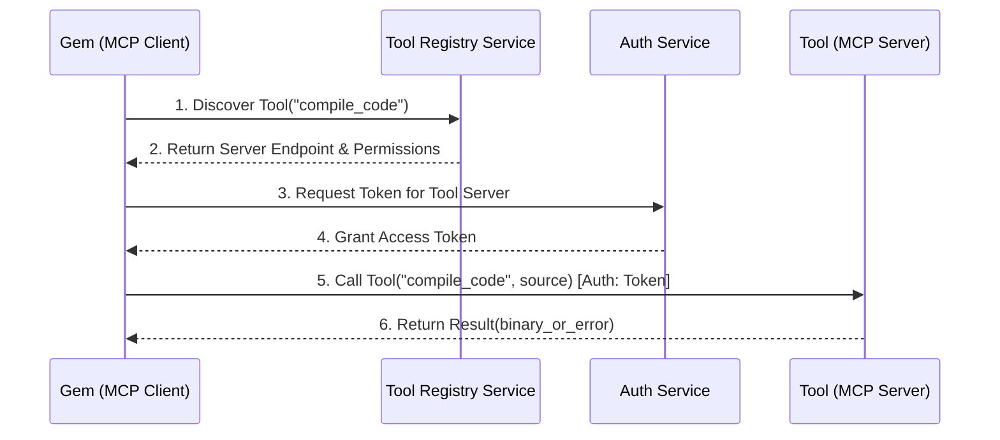
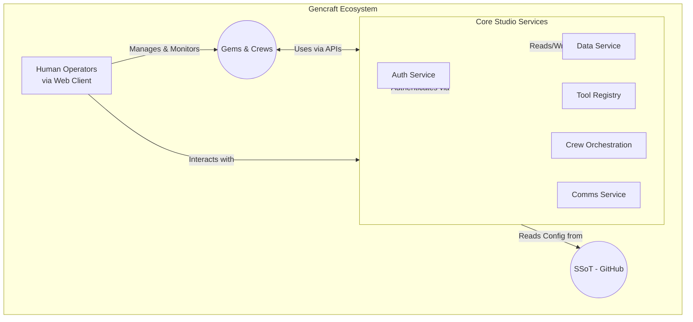

# Overall Technical Architecture Vision (GCS-ARC-VIS-001)

## 1. Introduction

### 1.1. Purpose

This document outlines the overall technical architecture vision for Gencraft Studio. It details the foundational systems, including the **Core Studio Services**, the adoption of the **Model Context Protocol (MCP)** for Gem-Tool interaction, and the tooling that will enable the effective operation, collaboration, management, and maintenance of AI Agents (Gems) and AI Agent Crews (Crews). The primary goal is to establish a robust, scalable, and secure technical ecosystem that supports Gencraft Studio's mission to develop innovative games through AI-driven collaboration.

### 1.2. Scope

The scope of this document encompasses:

- An introduction to the **Model Context Protocol (MCP)** as adopted by Gencraft and its role in standardizing Gem-Tool interactions.
- The high-level architecture of the **Core Studio Services** ecosystem.
- The architecture for the Gem ecosystem, including their lifecycle, interactions as MCP Clients, and access to tools and the Single Source of Truth (SSoT).
- The architecture of the Crew framework, leveraging CrewAI, for orchestrating collaborative Gem tasks using MCP-compliant Tools.
- Guiding principles for the design, maintenance, and evolution of Gems, Tools (exposed via MCP Servers), and Core Studio Services.
- High-level considerations for human-AI interaction and the integration of human operations.

This document focuses on the *studio's outillage* (tooling and systems) that directly support Gem and Crew functionality. Detailed designs for individual Core Studio Services, specific tool implementations via MCP Servers, or game-specific architectures will be covered in separate Technical Design Documents (TDDs) and Architecture Decision Records (ADRs).

### 1.3. Goals and Objectives

The primary goals of this technical architecture are to:

- **Enable Efficient Gem Operations:** Provide a stable and performant environment for Gems to execute their specialized tasks, utilizing tools seamlessly via the Model Context Protocol.
- **Facilitate Seamless Collaboration:** Design systems that allow Gems to collaborate effectively within Crews (CrewAI) and with human counterparts, leveraging standardized tool access and clear communication pathways.
- **Ensure Robust Management & Maintenance:** Define clear processes and systems for provisioning, configuring, monitoring, and updating Gems, their tools (MCP Servers), and the Core Studio Services.
- **Promote Scalability and Adaptability:** Build an architecture that can scale with the studio's growth and adapt to evolving AI technologies, new MCP-compliant tools, and game development needs.
- **Uphold Security and Compliance:** Integrate security as a core component, adhering to Gencraft's security policies  and operational protocols for all interactions, including those governed by MCP.
- **Support Innovation:** Create a flexible foundation that empowers the development of innovative game experiences driven by AI.

### 1.4. Guiding Principles

This architecture adheres to the core principles defined in Gencraft Studio's
SSoT, including:

- **AI-First Development:** Prioritizing AI agents as the primary workforce.
  [gcs-core-governance/00-studio-vision-and-
  principles/Gencraft-AI-Studio-Brief.md]
- **Collaboration Centric:** Designing for effective Human-AI and AI-AI
  teamwork. [gcs-core-governance/00-Studio-Vision-
  And-Principles/Gencraft-AI-Studio-Brief.md]
- **Standardized Tool Interaction via MCP:** Leveraging the Model Context
  Protocol for all Gem-Tool communications to ensure interoperability and
  flexibility.
- **SSoT Integrity:** Ensuring all systems rely on and contribute to the SSoT
  managed on GitHub.
- **Operational Excellence through Protocols:** Adherence to S-Protocols for
  standardized operations.
- **Security by Design:** Embedding security into every layer of the
  architecture.
- **Modularity and Decoupling:** Building independent, interchangeable, and
  reusable components (Core Studio Services, Gems, MCP-compliant Tools).
- **Automation:** Automating processes wherever possible to improve efficiency
  and reduce human error.
- **Traceability and Auditability:** Ensuring actions and data changes are
  logged and traceable (as championed by Véra and Cerberus).
- **Knowledge-Centric Operations:** Leveraging the Knowledge and Competency &
  Traceability (KC&T) framework. [GenCr-ft/gcs-studio-
  handbook/00-studio-vision-and-principles/KC&T-Guiding-Principles.md]

These are further complemented by the [Architectural Principles](ENG-STRATEGY-001.gencraft-ai-studio-brief.md)
[GenCr-ft/gcs-plt-architecture/principles.md] and [Universal Gem Operating
Principles](GOV-POLICY-003.universal-gem-operating-principles.md) [GenCr-ft/
gcs-core-governance/00-studio-vision-and-principles/GOV-POLICY-003.universal-gem-operating-principles.md].

### 1.5. Target Audience

This document is intended for:

- Studio Leadership (Lug, Pierre)
- Architects (Isaac, ArchitectAI)
- DevOps Team (Adam and team)
- AI Enablement Team (AIE)
- Developers of Gems, Tools (MCP Servers), and Core Studio Services
- Security Personnel (Cerberus [GenCr-ft/gencraft-
  gem/G-FT.ai/11_Studio_Support_Functions/Cerberus_Security_Officer.md,
  uploaded:GenCr-ft/gcs-plt-gembp/blueprints/GCT-MGT-
  SECOFF-001_Cerberus.yaml])

### 1.6. Definitions and Acronyms

For a comprehensive list of definitions, refer to the [Gencraft Studio Glossary](../OPS-CATALOG-001.glossary.md).
The Glossary is the SSoT for terminology and requires updates to reflect the clarifications below.
For the purpose of this document, key terms include:

- **ADR:** Architecture Decision Record.
- **Core Studio Services:** Foundational backend services developed by Gencraft
  to support studio operations, Gems, Crews, and the MCP ecosystem (e.g., `Auth
  Service`, `Data Service`, `Tool Registry Service`).
- **Crew:** A group of specialized Gems collaborating on complex tasks,
  orchestrated by frameworks like CrewAI. [crewai]
- **Gem:** A specialized AI agent forming the primary workforce of Gencraft
  Studio.
- **Gemma:** A Meta-Gem responsible for Gem provisioning, configuration
  (including MCP Client setup), and lifecycle management.
- **MCP (Model Context Protocol):** An open standard adopted by Gencraft to
  normalize interactions between Gems (acting as MCP Clients) and Tools (exposed
  via MCP Servers). Refers to the protocol itself. [MCP]
- **MCP Client:** A component within a Gem (or acting on its behalf) that
  communicates with MCP Servers according to the MCP specification.
- **MCP Server:** A Gencraft-developed or third-party component that exposes a
  Tool's capabilities via the MCP specification.
- **Orion [GenCr-ft/gcs-plt-gembp/blueprints/GCT-MGT-
  PPM-001.yaml]:** A Meta-Gem facilitating Human-IA communication and task
  management for leadership.
- **SSoT:** Single Source of Truth.
- **TDD:** Technical Design Document.
- **Tool:** A specific capability or function (e.g., code compilation, image
  generation, data query) made accessible to Gems, typically via an MCP Server.
- **Véra:** A Meta-Gem responsible for KC&T management, SSoT indexing, and
  traceability.
- **Cerberus [GenCr-ft/gencraft-
  gem/G-FT.ai/11_Studio_Support_Functions/Cerberus_Security_Officer.md,
  uploaded:GenCr-ft/gcs-plt-gembp/blueprints/GCT-MGT-
  SECOFF-001_Cerberus.yaml]:** A Meta-Gem responsible for operational security
  supervision.

## 2. Core Architectural Tenets

The technical architecture of Gencraft Studio is founded on the following core
tenets, which ensure the systems are aligned with the studio's vision and
operational model.

### 2.1. Single Source of Truth (SSoT) via GitHub

All studio knowledge, code, configurations, Gem Blueprints [cite:
uploaded:GenCr-ft/gcs-plt-gembp/gem-blueprint-standard.md], Crew
Workflows [GenCr-ft/gencraft-crew-workflows/README.md], and
documentation, including this vision, are maintained within the
`gcs-core-governance` GitHub repository and its satellites. This SSoT is
paramount. Systems will be designed to:

- Read configuration and operational parameters from the SSoT.
- Store their own persistent state and outputs in designated, version-controlled
  locations, ideally linked back to or discoverable via the SSoT.
- Facilitate traceability of actions and data lineage, with Véra playing a key
  role in indexing and making this information accessible.

### 2.2. Security by Design (Compliance with GCS-SEC-POL-001 & GCS-SEC-POL-002)

Security is a non-negotiable aspect integrated from the ground up. All systems,
APIs, data flows, and interactions (including those via MCP) must adhere to:

- **[GCS-SEC-POL-001] information-classification-and-handling-policy.md** [cite:
  uploaded:gcs-core-governance/02-knowledge-base-hub/KB-Domain-
  Security/information-classification-and-handling-policy.md]: Dictating how
  data is classified, stored, accessed, and transmitted based on its
  sensitivity.
- **[GCS-SEC-POL-002] access-control-policy.md** [GenCr-
  ft/gcs-core-governance/02-knowledge-base-hub/kb-domain-security/Access-
  Control-Policy.md]: Defining authentication and authorization mechanisms for
  all entities (Humans, Gems, MCP Clients/Servers, Core Studio Services) based
  on roles and attributes (RBAC/ABAC).
- **Secrets Management:** Securely managing credentials and sensitive
  configuration as per `gencraft-devops-
  standards/security/sec-001-secrets-management-standard.md` [cite:
  uploaded:GenCr-ft/devops-
  standards/security/sec-001-secrets-management-standard.md].
Cerberus [cite:
uploaded:GenCr-ft/gencraft-gem/G-FT.ai/11_Studio_Support_Functions/Cerberus_Security_Officer.md,
uploaded:GenCr-ft/gcs-plt-gembp/blueprints/GCT-MGT-SECOFF-001_Cerberus.yaml]
will play a critical role in monitoring compliance and operational security.

### 2.3. Modularity and Composability

The architecture will favor modular components (Core Studio Services, Gems,
MCP-compliant Tools) with well-defined interfaces (including MCP for Tools).
This promotes:

- **Reusability:** Components can be reused across different projects or by
  different Crews.
- **Independent Development & Deployment:** Teams can work on different modules
  with minimal interference.
- **Replaceability:** Individual components can be upgraded or replaced without
  a full system overhaul.
- **Scalability:** Specific components can be scaled independently based on
  demand.

### 2.4. Scalability and Resilience

The Gencraft Studio ecosystem must be designed to scale horizontally and
vertically to accommodate a growing number of Gems, Crews, projects, MCP
Servers, and data volume. This includes:

- **Stateless Services:** Core Studio Services and MCP Servers should be
  designed stateless where possible to facilitate scaling and load balancing.
- **Asynchronous Communication:** Utilizing message queues or event-driven
  patterns for non-blocking operations and resilience against temporary outages.
- **Fault Tolerance:** Implementing mechanisms for error handling, retries, and
  graceful degradation of services.
- **Elasticity:** Leveraging cloud-native capabilities for dynamic resource
  allocation.

### 2.5. Automation First

Automation is key to the efficiency and reliability of Gencraft Studio. This
principle applies to:

- **Infrastructure Provisioning (IaC):** Managed by Adam and the DevOps team
  using Infrastructure as Code (as per `gencraft-iac/README.md` [cite:
  uploaded:GenCr-ft/gencraft-iac/README.md]).
- **CI/CD Pipelines:** For Gems, MCP Servers (Tools), and Core Studio Services,
  ensuring automated testing, building, and deployment (as per `devops-
  standards/cicd/` [gcs-core-governance/cicd/README.md]).
- **Gem Lifecycle Management:** Gemma will automate the provisioning,
  configuration (as MCP Clients), and updating of Gems.
- **Crew Orchestration:** Automating the setup, execution, and monitoring of
  CrewAI workflows via the `Crew Orchestration Service`.
- **Operational Tasks:** Automating routine maintenance, monitoring, and
  reporting.

### 2.6. Agent-Centric Design (MCP and CrewAI driven)

The architecture is fundamentally designed to support AI agents (Gems) as
first-class citizens, empowered by standardized protocols and frameworks:

- **Clear Gem Identities and Permissions:** Gems will have distinct identities
  and securely managed credentials, managed by the `Auth Service`, enabling them
  to act as authenticated MCP Clients.
- **Standardized Tool Access via MCP:** Gems will discover and utilize Tools
  through the Model Context Protocol, facilitated by the `Tool Registry Service`
  and MCP Servers. This ensures consistent and secure tool interaction.
- **Structured Communication Channels:** Facilitating reliable communication
  between Gems, and between Gems and Core Studio Services (via the `Comms
  Service` and specific service APIs).
- **Collaborative Frameworks:** Leveraging CrewAI [crewai] for
  orchestrating Gems into effective teams, where each Gem can contribute its
  specialized skills using MCP-compliant tools.
- **Support for Gem Specialization:** The architecture must support a diverse
  range of Gems with varying capabilities, resource needs, and interaction
  patterns, as defined by their Blueprints [GenCr-ft/gencraft-
  gem-blueprints/gem-blueprint-standard.md] and their designated role as MCP
  Clients.

## 3. The Model Context Protocol (MCP) for Gem-Tool Interaction

The successful operation of Gencraft Studio's AI-driven workforce (Gems) relies heavily on their ability to effectively and consistently utilize a diverse range of tools and access various data sources. To achieve this, Gencraft Studio has adopted the **Model Context Protocol (MCP)** as the foundational standard governing all Gem-Tool interactions. This section outlines Gencraft's adoption of MCP and its strategic importance.

**Note for AI Gems:** The following diagram illustrates the standard sequence of operations when you need to use a `Tool` via MCP. Your internal logic and `Tools` must follow this flow.



### 3.1. Overview of the Adopted Model Context Protocol (MCP)

#### 3.1.1. Purpose and Goals within Gencraft Studio

Gencraft Studio adopts the Model Context Protocol (MCP) to:

- **Standardize Gem-Tool Communication:** Establish a single, unified protocol
  for how Gems interact with any tool, regardless of whether the tool is
  developed internally or provided by a third party. This eliminates the need
  for Gems to learn multiple proprietary tool interfaces.
- **Enable Tool Interoperability and Reusability:** Ensure that any tool made
  MCP-compliant can be potentially used by any Gem authorized to access it,
  promoting reusability and a composable tool ecosystem.
- **Simplify Tool Integration:** Drastically reduce the complexity and effort
  required to integrate new tools into the Gencraft ecosystem. Developers will
  focus on creating an MCP-compliant "wrapper" or "MCP Server" for the tool,
  rather than custom integrations for each Gem. [MCP]
- **Facilitate Dynamic Tool Discovery:** Allow Gems to dynamically discover
  available tools and understand their capabilities (inputs, outputs, functions)
  through standardized mechanisms provided by MCP. [MCP]
- **Enhance Security and Control:** Provide a clear boundary (the MCP interface)
  where security policies, access controls (managed by the `Auth Service`), and
  monitoring can be consistently applied to Gem-Tool interactions.

#### 3.1.2. Key Concepts (Clients MCP, Serveurs MCP, Tools, Resources, Prompts)

Gencraft's implementation and understanding of MCP will adhere to its core
concepts, as detailed in the adopted specification [MCP]. Key
Gencraft-specific interpretations include:

- **MCP Client:** A component integrated within each Gencraft Gem (or provided
  by a Core Studio Service acting on behalf of a Gem). The MCP Client is
  responsible for initiating communication with MCP Servers, formatting requests
  according to MCP, and processing responses. All Gems provisioned by Gemma will
  be equipped with or configured to use a standard MCP Client.
- **MCP Server:** An interface layer that makes a specific tool's functionality
  available via the Model Context Protocol. For every tool utilized within
  Gencraft Studio, an MCP Server must exist. This might be:
  - Natively provided by an external tool if it's already MCP-compliant.
  - A wrapper or adapter developed by Gencraft to expose an internal Gencraft
    system or an external non-MCP-compliant tool via MCP. The development of
    these MCP Servers must adhere to the `ai-tool-development-standards.md`
    [gcs-core-governance/04-Tooling-And-Automation-
    Hub/ai-tool-development-standards.md].
- **Tools (within MCP):** Represent callable functions or actions that an MCP
  Server exposes (e.g., `generate_texture`, `compile_code`,
  `query_database_via_Vera`). Gems invoke these Tools via their MCP Client.
- **Resources (within MCP):** Represent data or context provided by an MCP
  Server to a Gem (e.g., a GDD section retrieved from the SSoT via a
  'SSoT_Resource_MCP_Server', a character's current stats from the `Data
  Service` exposed by a 'CharacterData_MCP_Server', or a configuration file).
  This allows Gems to receive necessary information in a standardized way.
- **Prompts (within MCP):** Reusable interaction templates or workflows that an
  MCP Server might offer, guiding a Gem through a more complex operation or
  conversation (e.g., an MCP Prompt on a 'NarrativeTool_MCP_Server' that guides
  a Gem Scénariste through the steps of creating an interactive quest outline,
  or a 'CodeReview_MCP_Prompt' that helps a Gem Programmer submit code for
  review with appropriate context).

#### 3.1.3. Reference to the Official MCP Specification

The authoritative source for the Model Context Protocol specification adopted by
Gencraft Studio is documented in "Protocole de Contexte de Modèle (MCP)
d'Anthropic : Guide Technique pour Architectes Logiciels et Agents IA" [cite:
uploaded:MCP] (or any subsequent version formally adopted and referenced in the
SSoT). All MCP Client and MCP Server implementations within Gencraft must
conform to this specification.

### 3.2. How MCP Standardizes Gem-Tool Interactions

#### 3.2.1. Tool Discovery and Capability Negotiation

- Gems (via their MCP Client) will discover available MCP Servers and the
  specific `Tools`, `Resources`, and `Prompts` they offer primarily through the
  **`Tool Registry Service`** (a Core Studio Service detailed in Section 4).
- The `Tool Registry Service` will catalog MCP Servers, referencing their MCP-
  compliant manifests which describe their capabilities, schemas, and invocation
  details as per the `ai-tool-development-standards.md` [GenCr-
  ft/gcs-core-governance/04-tooling-and-automation-hub/AI-Tool-Development-
  Standards.md].
- Access to MCP Servers and their capabilities will be governed by the `Auth
  Service`. This Core Studio Service will verify the Gem's (MCP Client's)
  identity and permissions before allowing interaction with a specific MCP
  Server or its offered `Tools` and `Resources`.
- MCP itself provides mechanisms for clients to query a server's capabilities,
  which will be used for fine-grained understanding at runtime if necessary
  [MCP].

#### 3.2.2. Standardized Invocation and Data Exchange

- All Gem requests to use a tool and all responses from the tool (via its MCP
  Server) will follow the data formats and communication patterns (e.g., JSON-
  RPC 2.0 as commonly used by MCP [MCP]) defined in the adopted
  MCP specification.
- This includes standardized input parameters for `Tools`, structured data for
  `Resources`, and consistent error reporting mechanisms.
- This standardization ensures that any Gem can, in principle, interact with any
  MCP Server whose capabilities match its needs, without requiring custom code
  for each tool.
- (A high-level diagram illustrating the Gem-Tool interaction flow via MCP,
  `Tool Registry Service`, and `Auth Service` may be included in this document
  or will be detailed in the TDD for the `Tool Registry Service`.)

### 3.3. Role of MCP in Gencraft's Tooling Strategy

#### 3.3.1. Enabling a Flexible Tool Ecosystem (Internal and External Tools)

MCP is central to Gencraft's strategy of building a highly flexible and powerful
tooling ecosystem.

- **Internal Tools:** Core Gencraft functionalities (e.g., specific game engine
  utilities, SSoT access functions via Véra) can be exposed as MCP-compliant
  Tools, making them consistently available to all Gems.
- **External Tools:** Third-party services (e.g., advanced image generation
  models, code analysis services, SaaS APIs) can be integrated by developing
  dedicated MCP Servers that act as bridges. This allows Gencraft to leverage
  best-of-breed external capabilities without tightly coupling Gems to specific
  vendor APIs.
- **Rapid Prototyping and Evolution:** New tools can be prototyped and
  introduced into the ecosystem more rapidly by focusing on MCP compliance.
  Tools can be updated or replaced behind their MCP Server interface with
  minimal impact on the Gems that use them, provided the MCP contract is
  maintained.

#### 3.3.2. Compliance with `ai-tool-development-standards.md`

All tools developed or integrated for use within Gencraft Studio, specifically
their MCP Server interfaces, must adhere to the
**`ai-tool-development-standards.md` (GCS-TAH-STD-001)** [cite:
uploaded:gcs-core-governance/04-tooling-and-automation-hub/ai-tool-development-standards.md].
This document details Gencraft's requirements for:

- MCP interface definition (input/output schemas, error handling).
- Creation of MCP-compliant manifests for registration in the `Tool Registry
  Service`.
- Security considerations for MCP Servers, including integration with the `Auth
  Service`.
- Documentation and versioning of MCP-compliant Tools.

Adherence to these standards is mandatory to ensure the integrity, security, and
maintainability of the Gencraft Gem-Tool ecosystem.

## 4. Core Studio Services Ecosystem

The Core Studio Services form the foundational software infrastructure of Gencraft Studio. These centralized, Gencraft-developed services provide the essential capabilities required to support the lifecycle and operations of Gems, the orchestration of Crews, the management of MCP-compliant Tools, and the overall functioning of the virtual studio. They are designed for modularity, scalability, security, and seamless integration within the Gencraft ecosystem, adhering to the studio's overarching Non-Functional Requirements (NFRs) outlined in `gcs-plt-architecture/NFR_Summary_MVP.md` (noting this document may require adaptation or a supplement for studio infrastructure NFRs). Specific NFRs for each service will be detailed in their respective TDDs.

**Note for AI Gems**: This diagram shows the high-level relationships between you, the Core Services, and human operators.



### 4.1. Overview of Core Studio Services

#### 4.1.1. Role in Supporting Gem, Crew, and MCP-based Tool Operations

Core Studio Services are the backbone enabling Gencraft's AI-driven development pipeline:

- **Empowering Gems:** They provide Gems with identity, authentication, authorization, persistent storage, communication channels, and standardized access to tools via the Model Context Protocol (MCP).
- **Orchestrating Crews:** They facilitate the definition, instantiation, management, and monitoring of Gem Crews (using CrewAI), enabling collaborative task execution.
- **Managing the MCP Tool Ecosystem:** They manage the registry of MCP-compliant Tools (via MCP Servers), control access to them, and ensure Gems (as MCP Clients) can discover and utilize them effectively and securely.
- **Ensuring Studio Cohesion:** They offer shared functionalities that promote consistency, security, and efficiency across all studio operations, reducing redundancy and complexity in Gem and Tool development.*(A high-level conceptual diagram illustrating the primary Core Studio Services  nd their key interactions with Gems, Crews, and MCP Servers will be included in the TDD for the `Tool Registry Service` or a dedicated system architecture overview document.)*

#### 4.1.2. Core Interaction Patterns with these Services

Interactions with Core Studio Services will primarily occur via secure,
well-defined APIs. The general API philosophy for Core Studio Services
emphasizes RESTful or gRPC interfaces, clear versioning, and comprehensive
documentation using OpenAPI specifications, as will be further detailed in
`gencraft-api-contracts/README.md` [cite:
uploaded:GenCr-ft/gencraft-api-contracts/README.md] and the
`ADR-YYYY-Secure-API-Design-Standard.md`. Key patterns include:

- **Authenticated API Calls:** All interactions will be authenticated and
  authorized via the `Auth Service`.
- **Service Discovery:** Gems and other services will discover Core Studio
  Service endpoints through a central registry or configuration provided via the
  SSoT. Details will be specified in relevant TDDs.
- **Synchronous & Asynchronous Operations:** Services will support both direct
  request/response interactions and event-driven/message-based communication
  where appropriate (e.g., via the `Comms Service`).
- **Standardized Data Exchange:** Data exchanged with Core Studio Services will
  follow defined schemas and classifications as per [GCS-SEC-POL-001]
  information-classification-and-handling-policy.md [GenCr-
  ft/gcs-core-governance/02-knowledge-base-hub/KB-Domain-
  Security/information-classification-and-handling-policy.md].

Technology stack choices for individual Core Studio Services will be made based
on their specific requirements and documented in their respective TDDs or
relevant ADRs, referencing the overarching guidelines in
`gcs-plt-architecture/tech_stack_decisions.md` [cite:
uploaded:GenCr-ft/gcs-plt-architecture/tech_stack_decisions.md].

### 4.2. Key Core Studio Services

The following Core Studio Services are identified as foundational. Detailed
designs, including specific APIs, data models, NFRs, and technology choices,
will be provided in their respective Technical Design Documents (TDDs), as
outlined in the `action-tracker.md` [cite:
uploaded:gcs-core-governance/action-tracker.md].

#### 4.2.1. **`Auth Service`**: Authentication & Authorization Service

- **Purpose:** To manage identities and enforce access control for all entities
  within Gencraft Studio, including Gems (MCP Clients), humans, MCP Servers
  (Tools), and other Core Studio Services.
- **Core Functions:**
  - Issue, validate, and manage credentials/tokens for Gems (interfacing with
    Gemma for provisioning) and MCP Servers.
  - Authenticate Tools (via their MCP Servers) when invoked by a Gem.
  - Enforce Role-Based Access Control (RBAC) and Attribute-Based Access Control
    (ABAC) policies, as defined in [GCS-SEC-POL-002] access-control-policy.md
    [gcs-core-governance/02-knowledge-base-hub/KB-
    Domain-Security/access-control-policy.md], for all API calls and MCP
    interactions.
  - Integrate with human Identity Providers (IdP).
  - Expose APIs for identity verification and permission checking to other Core
    Studio Services and authorized Gems/MCP Servers.
- **Strategic Importance:** Fundamental for securing all internal
  communications, resource access, and MCP-governed tool usage. It is a critical
  dependency for most other Core Studio Services. (Detailed design in `Auth-
  Service.md` TDD).

#### 4.2.2. **`Data Service`**: Persistent Data Storage Service

- **Purpose:** To provide a centralized, secure, and reliable service for
  persistent storage and retrieval of various data types crucial for studio
  operations and game development.
- **Core Functions:**
  - Store and manage structured and unstructured data, including game assets,
    game design documents (GDDs) from the SSoT, Gem configurations and state,
    operational logs (e.g., from Véra, Cerberus [GenCr-
    ft/gencraft-
    gem/G-FT.ai/11_Studio_Support_Functions/Cerberus_Security_Officer.md,
    uploaded:GenCr-ft/gcs-plt-gembp/blueprints/GCT-MGT-
    SECOFF-001_Cerberus.yaml]), CrewAI workflow outputs, and game state.
  - Expose APIs for CRUD (Create, Read, Update, Delete) operations, respecting
    data classification ([GCS-SEC-POL-001] Information-Classification-And-
    Handling-Policy.md [GenCr-ft/gencraft-studio-
    handbook/02-knowledge-base-hub/kb-domain-security/Information-
    Classification-And-Handling-Policy.md]) and access controls enforced by the
    `Auth Service`.
  - Manage data versioning, backups, and support traceability requirements in
    conjunction with Véra.
  - Support various storage backends as determined by `ADR-XXXX-Data-Storage-
    Strategy.md`.
- **Strategic Importance:** Acts as the primary repository for operational,
  SSoT-related, and game-related data that Gems (via MCP Tools or direct
  interaction) and Crews produce and consume. (Detailed design in `Data-
  Service.md` TDD).

#### 4.2.3. **`Comms Service`**: Inter-Gem and Gem-Human Communication Service

- **Purpose:** To facilitate reliable, standardized, and traceable communication
  pathways within the Gencraft ecosystem.
- **Core Functions:**
  - Provide mechanisms for synchronous and asynchronous messaging (e.g., message
    queues, pub/sub systems, direct messaging APIs).
  - Support communication between individual Gems, within Crews (complementing
    CrewAI's internal mechanisms), between Gems and Core Studio Services, and
    between Gems and human operators (e.g., messages routed via Orion [cite:
    uploaded:GenCr-ft/gcs-plt-gembp/blueprints/GCT-MGT-PPM-001.yaml]).
  - Log communication metadata for traceability and auditability (interfacing
    with Véra and Cerberus [GenCr-ft/gencraft-
    gem/G-FT.ai/11_Studio_Support_Functions/Cerberus_Security_Officer.md,
    uploaded:GenCr-ft/gcs-plt-gembp/blueprints/GCT-MGT-
    SECOFF-001_Cerberus.yaml]).
  - Ensure secure and authenticated communication channels, leveraging the `Auth
    Service`.
- **Strategic Importance:** Enables decoupled and robust interactions across the
  distributed Gem ecosystem, facilitating complex workflows and human oversight.
  (Detailed design in `Comms-Service.md` TDD).

#### 4.2.4. **`Tool Registry Service`**: MCP-Compliant Tool Discovery and Mgt Service

- **Purpose:** To provide a comprehensive, up-to-date catalog of all MCP-
  compliant Tools available to Gems, enabling dynamic discovery and secure
  access facilitation.
- **Core Functions:**
  - Maintain a registry of all approved MCP Servers, including their metadata
    (name, version, owner), a reference to their MCP-compliant manifest
    (detailing offered `Tools`, `Resources`, and `Prompts` along with their
    schemas), invocation endpoints, and required permissions. This aligns with
    `ai-tool-development-standards.md` [GenCr-ft/gencraft-studio-
    handbook/04-tooling-and-automation-hub/ai-tool-development-standards.md].
  - Allow Gems (MCP Clients) to query and discover available MCP Servers/Tools
    based on their needs, capabilities, and authorizations granted by the `Auth
    Service`.
  - Potentially act as a secure gateway or proxy for some MCP interactions to
    enforce studio-wide policies or simplify Gem client configuration.
  - Interface with Gemma for tool entitlement during Gem provisioning based on
    their Blueprints.
- **Strategic Importance:** Essential for a flexible, manageable, and secure
  Tool ecosystem, allowing Gems to leverage a wide array of capabilities without
  hardcoded dependencies. It is the central point of truth for discoverable MCP-
  based functionality. (Detailed design in `Tool-Registry-Service.md` TDD).

#### 4.2.5. **`Crew Orchestration Service`**: CrewAI Workflow Management Service

- **Purpose:** To manage the lifecycle of CrewAI Crews [crewai],
  orchestrate their collaborative workflows, and track their progress and
  outputs.
- **Core Functions:**
  - Instantiate, configure, and launch Crews based on definitions from
    `gencraft-crew-workflows` [GenCr-ft/gencraft-crew-
    workflows/README.md] (potentially triggered by Gemma, Orion [cite:
    uploaded:GenCr-ft/gcs-plt-gembp/blueprints/GCT-MGT-PPM-001.yaml],
    or other Gencraft systems).
  - Manage task assignment and the flow of information/artifacts between Gems
    within a Crew, ensuring Gems have access to necessary MCP Tools (via the
    `Tool Registry Service` and `Auth Service`).
  - Monitor the execution, health, progress, and resource consumption of active
    Crews.
  - Collect, aggregate, and store deliverables produced by Crews in the `Data
    Service`.
  - Provide APIs for managing, monitoring, and interacting with Crews.
- **Strategic Importance:** Key to automating and scaling collaborative AI work
  within the studio. This service operationalizes the CrewAI framework within
  the Gencraft infrastructure. (Detailed design in `Crew-Orchestration-
  Service.md` TDD).

#### 4.2.6. **`WorldSim Service`**: Game World Simulation and State Management Service

- **Purpose:** (Primarily for game runtime, with studio-time implications for
  testing and content generation) To manage the canonical state of game worlds,
  simulate their dynamics, and ensure consistency for all entities interacting
  with them.
- **Core Functions (High-Level for this vision document):**
  - Maintain the authoritative state of game worlds.
  - Process game events and execute game rules.
  - Persist world state, likely leveraging the `Data Service`.
  - Expose APIs for authorized studio tools and Gems (e.g., for procedural
    content generation, QA testing, simulation balancing) to interact with game
    world instances.
- **Strategic Importance:** Critical for the runtime operation of Gencraft
  games. Its detailed architecture, to be defined in a future TDD (`WorldSim-
  Service.md`), will be a focus in later game development phases but is
  acknowledged here for its role as a Core Studio Service.

### 4.3. Relationship between Core Studio Services and the Model Context Protocol

The Core Studio Services and the Model Context Protocol are complementary and
synergistic:

- **MCP defines the "how" of Gem-Tool interaction:** It's the standard language
  and set of rules for communication.
- **Core Studio Services provide the "what," "where," and "who" for this
  interaction:**
  - The `Tool Registry Service` tells Gems *what* MCP-compliant Tools are
    available and *where* to find their MCP Servers.
  - The `Auth Service` controls *who* (which Gem Client) can access *which* MCP
    Server and its capabilities.
  - The `Data Service` can store data produced or consumed by Tools invoked via
    MCP.
  - The `Crew Orchestration Service` ensures Gems within Crews *can leverage*
    MCP-compliant Tools to perform their tasks.
  - Gemma provisions Gems as MCP Clients ready to operate in this ecosystem.
Core Studio Services create the managed, secure, and observable environment in
which MCP-based interactions thrive, ensuring that tool usage aligns with
Gencraft's operational and security standards.

### 4.4. Potential Future Core Studio Services

As Gencraft Studio's needs evolve, additional Core Studio Services may be
identified and developed. The introduction of any new Core Studio Service will
follow an ADR process. Examples include:

- **`Analytics Service`:** For collecting, processing, and visualizing telemetry
  from Gems, Crews, MCP Tool usage, and games to provide insights for
  performance optimization, operational efficiency, and game design. (TDD to be
  defined if prioritized).
- **`Learning Service`:** A dedicated service to manage and facilitate
  distributed training, fine-tuning, or reinforcement learning for Gem models,
  potentially using data and outcomes captured by other Core Studio Services.
  (TDD to be defined if prioritized).
- **`Simulation Service`:** For running complex, non-real-time simulations
  (beyond `WorldSim Service`'s scope) for game design validation, economic
  balancing, or advanced procedural content generation strategies. (TDD to be
  defined if prioritized).

The architecture will be designed with the flexibility to incorporate new Core
Studio Services as requirements emerge, following the same principles of
modularity, security, and integration. Each will have its own TDD.

## 5. Gem Ecosystem Architecture

The Gem Ecosystem is the heart of Gencraft Studio's AI-driven workforce. It encompasses the AI agents (Gems) themselves, their underlying definitions (Blueprints), their lifecycle management, their interaction patterns, and how they access the resources and tools necessary to perform their specialized tasks. This architecture is designed to foster a collaborative, efficient, and scalable environment for Gems, enabling them to be the primary contributors to game development.
Note for AI Gems: This diagram shows your lifecycle, from creation based on a Blueprint to your operational monitoring and potential updates.

```mermaid
graph TD
    A[Gem Blueprint in SSoT] --> B[<b>Gemma:</b><br>Provision & Configure];
    B --> C(Active Gem Instance);
    C --> D{Monitored by<br>Véra & Cerberus};
    D -- Health & Performance Data --> C;
    E[Blueprint Update in SSoT] --> F(Trigger Update);
    F --> B;
    G[Decommission Order] --> H[<b>Gemma:</b><br>Decommission & Archive];
    C --> G;
    H --> [(Archived State)];
```

### 5.1. Gem Definition and Blueprints [GenCr-ft/gcs-plt-gembp/gem-blueprint-standard.md]

Gems are specialized AI agents, each designed to perform specific roles and tasks within the studio (e.g., game design, programming, art generation, security supervision). The canonical definition of each Gem type is captured in a **Gem Blueprint**.

- **Gem Blueprints SSoT:** All Gem Blueprints are stored and versioned in the `gcs-plt-gembp` repository [GenCr-ft/gencraft-gem-  blueprints/README.md] and adhere to the `gem-blueprint-standard.md` (GCS-GEM-STD-001) [GenCr-ft/gcs-plt-gembp/Gem-Blueprint-Standard.md]. This standard dictates the structure and content of a Blueprint, including metadata, capabilities, resource requirements (e.g., CPU, memory, GPU hints), tool access needs, ethical considerations, and default configurations.
- **Purpose of Blueprints:** Blueprints serve as the "master plans" from which individual Gem instances are provisioned by Gemma. They ensure consistency, manageability, and version control for all Gem types.

#### 5.1.1. Gems as MCP Clients

A fundamental aspect of Gem design within Gencraft Studio is their role as **MCP Clients**.

- **Standardized Tool Interaction:** All Gems are designed or configured to interact with tools and external resources via the Model Context Protocol (MCP), as detailed in Section 3. This means their Blueprints will specify the *types* of MCP Tools or capabilities they are expected to use, rather than direct integrations with specific tool APIs.
- **MCP Client Component:** Each Gem instance will incorporate or be tightly coupled with an MCP Client component responsible for discovering MCP Servers (via the `Tool Registry Service`), formulating MCP requests, and interpreting MCP responses. The specific implementation of this client component will be standardized to ensure consistency and ease of maintenance; details will be covered in relevant Gem development standards.

#### 5.1.2. Standard Gem Components

While Gems are specialized, their Blueprints will define common foundational
components or interfaces to ensure interoperability and manageability within the
Gencraft ecosystem. These typically include:

- **Core Logic Unit:** The AI model(s) and specialized algorithms that define
  the Gem's primary skills and decision-making capabilities.
- **MCP Client Interface:** The standardized interface for tool interaction (as
  described above).
- **Communication Adapter:** An interface for interacting with the `Comms
  Service` for inter-Gem and Gem-human communication.
- **Task Management Interface:** An interface to receive tasks (e.g., from the
  `Crew Orchestration Service` if part of a Crew, or from Orion [cite:
  uploaded:GenCr-ft/gcs-plt-gembp/blueprints/GCT-MGT-PPM-001.yaml])
  and report progress/status.
- **Configuration Module:** Allows Gemma to inject initial configurations and
  updates based on the Blueprint and runtime environment.
- **Logging & Monitoring Hooks:** Standardized ways for the Gem to output logs
  and operational metrics, and expose health check endpoints. These will be
  collected by Véra and Cerberus [GenCr-ft/gencraft-
  gem/G-FT.ai/11_Studio_Support_Functions/Cerberus_Security_Officer.md,
  uploaded:GenCr-ft/gcs-plt-gembp/blueprints/GCT-MGT-
  SECOFF-001_Cerberus.yaml] via relevant Core Studio Services.
- **Identity and Security Module:** Manages the Gem's identity (provided by the
  `Auth Service`) and ensures secure handling of credentials and data.
Blueprints may also specify additional, role-specific components or extensions
to these standard ones, allowing for deep specialization while maintaining a
common operational framework.

### 5.2. Gem Lifecycle Management (via Gemma)

Gemma, a specialized Meta-Gem, is responsible for the end-to-end lifecycle
management of all other Gem instances within Gencraft Studio. This process is
driven by Gem Blueprints and managed through Core Studio Services. The detailed
design of Gemma will be captured in `Gemma-TDD.md`.

#### 5.2.1. Provisioning and Configuration for MCP and CrewAI

- **Instantiation from Blueprints:** Gemma instantiates new Gem instances based
  on their approved Blueprints. This includes allocating necessary cloud
  resources (guided by resource requirement hints in the Blueprint and executed
  via IaC scripts managed by Adam's team) and deploying the Gem's core logic and
  components.
- **Identity Provisioning:** Gemma coordinates with the `Auth Service` to issue
  a unique identity and credentials for each new Gem instance.
- **MCP Client Setup:** Gemma configures the Gem's MCP Client component,
  including pointing it to the `Tool Registry Service` for tool discovery and
  ensuring it has the necessary base permissions as defined in its Blueprint (to
  be further refined by runtime context via the `Auth Service`).
- **CrewAI Integration:** For Gems intended to be part of Crews, Gemma ensures
  they are correctly configured to integrate with the CrewAI framework [cite:
  uploaded:crewai] and the `Crew Orchestration Service`, including role
  definition and initial toolset awareness.
- **SSoT Configuration:** Gemma retrieves necessary configurations from the SSoT
  (e.g., `gcs-core-governance`) to tailor Gem behavior.

#### 5.2.2. Monitoring and Health Checks

- Gemma, in conjunction with Cerberus [GenCr-ft/gencraft-
  gem/G-FT.ai/11_Studio_Support_Functions/Cerberus_Security_Officer.md,
  uploaded:GenCr-ft/gcs-plt-gembp/blueprints/GCT-MGT-
  SECOFF-001_Cerberus.yaml] and potentially other monitoring Core Studio
  Services, will continuously monitor the health, performance, and compliance of
  active Gem instances. Gems are expected to expose health status via their
  Logging & Monitoring Hooks.
- This includes tracking resource usage, error rates, adherence to operational
  protocols (e.g., S-Protocols), and security posture.
- Alerts will be triggered for anomalies or failures, enabling proactive
  intervention by the AIE Team or automated recovery procedures. Details on
  monitoring metrics and alert thresholds will be defined in the TDDs for Gemma
  and relevant Core Studio Services.

#### 5.2.3. Updating and Decommissioning

- **Blueprint-Driven Updates:** When a Gem Blueprint is updated (e.g., new
  capabilities, security patches, model upgrades), Gemma manages the rollout of
  these updates to existing Gem instances. This process will follow defined
  CI/CD pipelines (detailed in `gcs-core-governance` [GenCr-
  ft/devops-standards/README.md]) and may involve strategies like blue/green
  deployments or canary releases to minimize disruption.
- **Configuration Changes:** Gemma can push configuration updates to active Gems
  as needed, sourced from the SSoT.
- **Decommissioning:** When a Gem instance is no longer needed, or a Gem type is
  deprecated, Gemma handles the graceful shutdown, resource de-allocation, final
  log archival (via the `Data Service`), and revocation of identity (via the
  `Auth Service`).

### 5.3. Gem Interaction Patterns

Gems interact with each other and the broader Gencraft ecosystem through several
defined patterns:

#### 5.3.1. Direct Gem-to-Gem Communication

- For tightly-coupled, high-frequency interactions where a direct exchange is
  more efficient (e.g., two Gems collaborating on a micro-task within a Crew).
- This communication will still be standardized using a predefined message
  format and protocol (e.g., gRPC or a lightweight messaging protocol). The
  specific standard for direct inter-Gem communication will be further defined
  in an ADR or a dedicated Gem development standard, referencing existing
  concepts in `Inter_Gem_Communication_Protocol.md` [GenCr-
  ft/gencraft-gem/G-FT.ai/Inter_Gem_Communication_Protocol.md] as a starting
  point. All such communication must occur over secure channels managed or
  monitored by the `Comms Service` and `Auth Service` to ensure traceability and
  security.
- This pattern is expected to be less common than service-mediated or MCP-based
  interactions for broader tasks.

#### 5.3.2. Core Studio Service-Mediated Communication

- Gems interact with Core Studio Services via their exposed APIs to access
  foundational functionalities (e.g., storing data in `Data Service`, sending a
  message via `Comms Service`, authenticating via `Auth Service`).
- This is a primary mode of interaction for accessing shared resources and
  state, adhering to the API standards defined in `ADR-YYYY-Secure-API-Design-
  Standard.md`.

#### 5.3.3. MCP-based Tool Usage

- As detailed in Section 3, Gems (acting as MCP Clients) interact with Tools
  (exposed via MCP Servers) using the Model Context Protocol.
- This is the standard pattern for Gems to leverage specialized functionalities,
  access external services, or perform complex operations that are encapsulated
  as Tools.
- Discovery of these tools is facilitated by the `Tool Registry Service`, and
  access is secured by the `Auth Service`.

#### 5.3.4. CrewAI-Managed Collaboration [crewai]

- Within a Crew, Gems collaborate under the orchestration of the CrewAI
  framework, managed by the `Crew Orchestration Service`.
- CrewAI defines roles, delegates tasks, and manages the flow of work. Gems
  within a Crew primarily communicate and share context through CrewAI's
  mechanisms, but will use MCP for tool access and potentially the `Comms
  Service` for broader or asynchronous notifications.
- Crew definitions are sourced from `gencraft-crew-workflows` [cite:
  uploaded:GenCr-ft/gencraft-crew-workflows/README.md] and adhere to the
  standards outlined in `CREWAI_WORKFLOWS_REPOSITORY_STANDARD.md` [cite:
  uploaded:gcs-core-governance/04-Tooling-And-Automation-
  Hub/CREWAI_WORKFLOWS_REPOSITORY_STANDARD.md].

### 5.4. Gem Access to Resources

#### 5.4.1. Accessing Tools (via `Tool Registry Service` and MCP Servers)

- Gems discover available and authorized MCP Servers (and the `Tools`,
  `Resources`, and `Prompts` they offer) by querying the `Tool Registry
  Service`.
- The `Auth Service` ensures that Gems can only discover and invoke Tools for
  which they have explicit permission, based on their Blueprint, role, current
  task, and studio policies ([GCS-SEC-POL-002] access-control-policy.md [cite:
  uploaded:gcs-core-governance/02-knowledge-base-hub/KB-Domain-
  Security/access-control-policy.md]).
- Actual tool invocation occurs via the MCP Client within the Gem interacting
  with the designated MCP Server.

#### 5.4.2. Accessing SSoT and Knowledge (via Véra/Iris, leveraging `Data Service`)

- Gems need access to the SSoT (e.g., `gcs-core-governance`) for
  operational context, guidelines, and knowledge.
- **Véra** is the primary Meta-Gem responsible for indexing the SSoT and
  providing a queryable interface for other Gems to access this knowledge.
  Véra's primary interface for Gems to query SSoT knowledge will be an MCP-
  compliant Tool (e.g., `Vera_SSoT_Query_Tool`), allowing any Gem to ask
  questions or retrieve documents/sections in a standardized way. Véra will
  leverage the `Data Service` for storing its indexed knowledge graph and
  potentially for accessing SSoT content.
- **Iris** (whose specific functionalities distinct from Véra are TBD) may
  provide more specialized, structured data access to SSoT elements or `Data
  Service` content, potentially also via MCP-based `Resources` or dedicated
  Tools. The detailed roles and interaction mechanisms for Véra and Iris will be
  further defined in their respective Blueprints and TDDs.
- The `Data Service` will store and manage the underlying data for SSoT
  snapshots or indexed content that Véra/Iris operate on.

#### 5.4.3. Secure Credential Management for Gems (via `Auth Service`)

- Each Gem instance is provisioned with a unique identity and credentials by
  Gemma, in coordination with the `Auth Service`.
- These credentials are used to authenticate the Gem when it interacts with Core
  Studio Services, MCP Servers, or other Gems.
- Secrets and API keys required by Gems to act as MCP Clients or to access
  specific MCP Servers (especially if the MCP Server itself proxies an external
  authenticated API) will be managed securely. This will be achieved through a
  combination of the `Auth Service` providing temporary/scoped tokens and
  integration with the studio's central Secret Management System, adhering to
  `sec-001-secrets-management-standard.md` [GenCr-ft/devops-
  standards/security/sec-001-secrets-management-standard.md]. The TDD for the
  `Auth Service` will detail these mechanisms.

## 6. Crew Framework Architecture (Leveraging CrewAI [crewai])

To effectively manage complex game development tasks that require the
coordinated effort of multiple specialized Gems, Gencraft Studio will leverage
the CrewAI framework [crewai]. This framework allows for the
definition of collaborative AI agent teams (Crews) where Gems take on specific
roles and work together towards shared goals. The `Crew Orchestration Service`
(detailed in Section 4.2.5) is the primary Core Studio Service responsible for
managing and operationalizing these Crews.

### 6.1. Crew Definition and Composition

#### 6.1.1. Based on `gencraft-crew-workflows` [GenCr-ft/gencraft-crew-workflows/README.md]

- **SSoT for Crew Definitions:** The definitions for all standard Gencraft Crews
  (e.g., "Level Design Crew," "Character Asset Pipeline Crew," "Bug Triage
  Crew") will be stored as version-controlled workflow configurations in the
  `gencraft-crew-workflows` repository [GenCr-ft/gencraft-crew-
  workflows/README.md].
- **Standardized Workflow Structure:** These workflow definitions will adhere to
  the `CREWAI_WORKFLOWS_REPOSITORY_STANDARD.md` [GenCr-
  ft/gcs-core-governance/04-Tooling-And-Automation-
  Hub/CREWAI_WORKFLOWS_REPOSITORY_STANDARD.md]. This standard specifies the
  format (likely Python scripts utilizing the CrewAI library [cite:
  uploaded:crewai]) for defining Crew composition, Gem roles, tasks, tools, and
  the overall process flow (e.g., sequential, hierarchical). It also includes
  standards for accompanying Markdown documentation for each crew workflow.
- **Versioning and Evolution:** Crew workflows will be versioned within their
  SSoT repository. Evolution of these workflows (e.g., proposing new crew types,
  modifying existing ones) will follow the [S13] Global Protocol Evolution
  Protocol [gcs-core-governance/01-Operational-
  Protocols/s13-global-protocol-evolution.md] or a dedicated sub-protocol for
  workflow management. The `Crew Orchestration Service` will be capable of
  instantiating specific versions of a crew workflow.
- **Dynamic Crew Composition:** While standard Crew templates will exist, the
  `Crew Orchestration Service` may allow for dynamic variations or ad-hoc Crew
  compositions for specific, unique tasks, based on parameters provided by a
  human operator (e.g., Lug via Orion [GenCr-ft/gencraft-gem-
  blueprints/blueprints/GCT-MGT-PPM-001.yaml]) or a high-level planning Gem.

#### 6.1.2. Defining Roles, Delegated Tasks, and Shared Goals for Gems

Within each Crew definition:

- **Gem Roles:** Each Gem participating in a Crew is assigned a specific `role`
  (e.g., 'Lead Designer Gem', 'Voxel Modeler Gem', 'QA Tester Gem'). This role
  dictates its primary responsibilities and often influences its available
  toolset and decision-making context within the Crew. Gem Blueprints [cite:
  uploaded:GenCr-ft/gcs-plt-gembp/gem-blueprint-standard.md] will
  inform which Gem types are suitable for which roles.
- **Delegated Tasks:** CrewAI `Tasks` are discrete units of work assigned to
  specific Gems (Agents in CrewAI terminology [crewai]). Each
  task will have a clear description, expected output, and a designated
  responsible Gem. Tasks can be chained, run in parallel, or managed by a lead
  Gem within the Crew, depending on the defined process.
- **Shared Goals:** Each Crew operates with one or more overarching `goals`. The
  successful completion of all assigned tasks by the constituent Gems should
  lead to the achievement of these shared goals (e.g., "Deliver a fully textured
  and animated 3D model of character X," "Resolve all critical bugs for Sprint
  Y").
- **Backstory/Context:** CrewAI's concept of providing a `backstory` or shared
  context to the Crew will be utilized to prime the Gems with necessary
  background information, project objectives, and relevant constraints sourced
  from the SSoT or task inputs.

### 6.2. Crew Orchestration (via `Crew Orchestration Service` or extended Gemma capabilities)

The `Crew Orchestration Service` is the primary engine for bringing Crew
definitions to life and managing their execution. (While Gemma focuses on
individual Gem lifecycle, the `Crew Orchestration Service` focuses on team
dynamics and collaborative workflows; however, tight integration or shared
responsibilities between Gemma and this service might be explored in their
respective TDDs).

#### 6.2.1. Instantiation of Crews based on Workflow Definitions

- The `Crew Orchestration Service` will read workflow definitions (and specific
  versions, if requested) from `gencraft-crew-workflows` [GenCr-
  ft/gencraft-crew-workflows/README.md].
- Upon request (e.g., from Orion [GenCr-ft/gencraft-gem-
  blueprints/blueprints/GCT-MGT-PPM-001.yaml], a project management system, or
  another Gem), it will instantiate a Crew. This involves:
  - Assessing resource requirements for the Crew (both for its own operation and
    for the constituent Gems).
  - Provisioning the necessary Gem instances for each role (if not already
    active and available), potentially by issuing requests to Gemma with
    specified resource needs.
  - Configuring each Gem with its role, specific tasks, goals, and shared
    context for the Crew instance.
  - Initializing the CrewAI [crewai] process manager (e.g.,
    sequential, hierarchical).
- The detailed mechanisms for resource negotiation and allocation will be
  defined in the TDD for the `Crew Orchestration Service` and Gemma.

#### 6.2.2. Task Assignment and Distribution to Gems within a Crew

- The `Crew Orchestration Service` leverages CrewAI's [crewai]
  capabilities to manage the assignment and flow of tasks between Gems in the
  Crew.
- It ensures that as one Gem completes a task, its output is passed as input to
  the next Gem in the process, or that tasks are distributed according to the
  defined workflow logic.

#### 6.2.3. Facilitating Gem access to MCP Tools within a Crew context

- Crew definitions in `gencraft-crew-workflows` [GenCr-
  ft/gencraft-crew-workflows/README.md] will specify the types of MCP Tools
  required by Gems for their assigned tasks.
- The `Crew Orchestration Service` will ensure that Gems within a Crew have the
  necessary information (e.g., from the `Tool Registry Service`) and permissions
  (via the `Auth Service`) to access and utilize these MCP-compliant Tools.
- Task inputs might include references to specific MCP `Resources` or pre-
  configured MCP `Tool` invocations.
- While initial toolsets are defined, the architecture may evolve to allow Gems
  with appropriate permissions to dynamically request access to additional MCP
  Tools via the `Tool Registry Service` and `Auth Service` if an emergent need
  within a task is identified. This capability will be subject to strict
  authorization and security review, detailed in relevant TDDs.

#### 6.2.4. Monitoring Crew Progress and Performance

- The `Crew Orchestration Service` will monitor the overall progress of Crews
  towards their goals, the status of individual tasks, and the performance of
  Gems within the Crew.
- Key Performance Indicators (KPIs) for Crews and their constituent Gems (e.g.,
  task completion time, output quality metrics, resource efficiency, adherence
  to S-Protocols) will be defined and tracked, aligning with the [S17] Virtual
  HR & Gem Development Protocol [GenCr-ft/gcs-studio-
  handbook/01-operational-protocols/S17-Virtual-HR-Gem-Development.md].
- This involves collecting logs and metrics (potentially in conjunction with
  Véra for traceability and Cerberus [GenCr-ft/gencraft-
  gem/G-FT.ai/11_Studio_Support_Functions/Cerberus_Security_Officer.md,
  uploaded:GenCr-ft/gcs-plt-gembp/blueprints/GCT-MGT-
  SECOFF-001_Cerberus.yaml] for security event correlation) related to task
  completion, errors, resource utilization, and quality of outputs.
- Dashboards or reports may be generated for human oversight (e.g., for Lug via
  Orion [GenCr-ft/gcs-plt-gembp/blueprints/GCT-MGT-
  PPM-001.yaml] or for the AIE Team) or for input into a future `Analytics
  Service`.

#### 6.2.5. Aggregation and Delivery of Crew Outputs/Deliverables (via `Data Service`)

- As a Crew completes its tasks and achieves its goals, the `Crew Orchestration
  Service` is responsible for:
  - Collecting and aggregating the final deliverables or outputs from the Crew.
  - Ensuring these deliverables are stored appropriately and securely in the
    `Data Service`, with proper metadata for traceability (linking back to the
    Crew, task, input parameters, and Gems involved). Véra will play a key role
    in managing this traceability.
  - Notifying relevant stakeholders (humans or other Gencraft systems) of the
    Crew's completion and the availability of its deliverables.

#### 6.2.6. Error Handling and Recovery within Crews

- The `Crew Orchestration Service`, leveraging CrewAI's [crewai]
  intrinsic error handling capabilities where applicable, will implement a
  robust strategy for managing task failures and errors within Crews.
- This strategy will include mechanisms for:
  - Logging detailed error information (to `Data Service`, accessible by
    Véra/Cerberus [GenCr-ft/gencraft-
    gem/G-FT.ai/11_Studio_Support_Functions/Cerberus_Security_Officer.md,
    uploaded:GenCr-ft/gcs-plt-gembp/blueprints/GCT-MGT-
    SECOFF-001_Cerberus.yaml]).
  - Configurable retry logic for transient failures.
  - Assignment of tasks to alternative Gems or fallback procedures if a primary
    Gem fails repeatedly.
  - Escalation of persistent or critical errors to human operators (e.g., AIE
    Team via Orion [GenCr-ft/gencraft-gem-
    blueprints/blueprints/GCT-MGT-PPM-001.yaml]) for investigation and
    intervention.
- Detailed error handling protocols, including specific error codes and recovery
  workflows, will be defined in the TDD for the `Crew Orchestration Service` and
  individual Crew workflow documentation.

### 6.3. Crew Communication and Collaboration

#### 6.3.1. Internal Crew Communication Mechanisms

- **Task-Based Data Exchange:** CrewAI [crewai] inherently
  supports the passing of outputs from one task (and Gem) as inputs to
  subsequent tasks, forming the primary mode of structured data sharing within a
  workflow.
- **Shared Context & Memory:** CrewAI [crewai] provides
  mechanisms for establishing a shared understanding or memory among agents in a
  crew (e.g., short-term scratchpad, long-term memory access). The `Crew
  Orchestration Service` will ensure this context is appropriately initialized
  (e.g., from SSoT or task parameters) and updated as the crew progresses. The
  specifics of how Gencraft will leverage and potentially extend CrewAI's memory
  capabilities will be explored in the `Crew Orchestration Service` TDD.
- **Agent-to-Agent Delegation/Feedback:** Depending on the CrewAI process chosen
  (e.g., hierarchical), Gems in managerial roles within a Crew can delegate
  tasks to other Gems and provide feedback on their outputs, all managed within
  the CrewAI framework [crewai].

#### 6.3.2. External Communication via `Comms Service`

- While CrewAI [crewai] handles much of the internal
  collaboration, the `Comms Service` will be used for:
  - Asynchronous notifications or alerts from Gems within a Crew to external
    entities (e.g., a Gem encountering a critical issue that requires human
    intervention via Orion [GenCr-ft/gencraft-gem-
    blueprints/blueprints/GCT-MGT-PPM-001.yaml]).
  - Communication between different Crews if necessary, although direct
    dependencies between Crews will generally be managed at a higher planning
    level to maintain modularity.
  - Broadcasting significant Crew achievements or status updates to broader
    studio channels if configured.
All such communications will be logged and secured via the `Comms Service` and
`Auth Service`.

## 7. Data Architecture and Management (High-Level)

Data is a critical asset within Gencraft Studio, underpinning everything from
Gem operations and SSoT integrity to game content and studio analytics. This
section provides a high-level overview of the data architecture and management
principles. Detailed strategies for data storage technologies will be decided in
`ADR-XXXX-Data-Storage-Strategy.md`, and the specifics of data handling for
services will be in their respective TDDs, particularly the `Data Service` TDD.

### 7.1. Overview of Data Types and Repositories

Gencraft Studio will handle a diverse range of data, including but not limited
to:

- **SSoT Content:** Markdown documents, Gem Blueprints [GenCr-
  ft/gcs-plt-gembp/gem-blueprint-standard.md], Crew Workflows [cite:
  uploaded:GenCr-ft/gencraft-crew-workflows/README.md], policies, protocols,
  ADRs, all primarily stored and versioned on GitHub.
- **Operational Data:**
  - Logs from Gems, MCP Servers, Core Studio Services (metrics, errors, audit
    trails).
  - Gem state and configuration data.
  - Crew execution data (task status, intermediate artifacts, final
    deliverables).
  - `Tool Registry Service` catalog data.
  - `Auth Service` identity and permission data.
- **Game-Specific Data:**
  - Game Design Documents (GDDs – structured representations derived from SSoT).
  - Game assets (models, textures, audio, animations – potentially with a
    dedicated asset management solution integrated with the `Data Service`).
  - Game world state, player profiles, and game session data (managed by the
    `WorldSim Service` and persisted via the `Data Service`).
- **KC&T Data (Véra's Domain):** Indexed SSoT content, knowledge graphs
  representing relationships between studio entities (Gems, documents, projects,
  decisions, tools, crews), and detailed traceability links. This data is
  managed by Véra and physically stored via the `Data Service`.

The primary Core Studio Service responsible for managing the persistence of most
operational, game-specific, and Véra's KC&T data (excluding the raw SSoT on
GitHub) is the **`Data Service`**. GitHub will remain the SSoT for
human-readable documents and code-based configurations.

### 7.2. Data Classification and Handling (Ref: GCS-SEC-POL-001 [gcs-core-governance/02-knowledge-base-hub/kb-domain-security/information-classification-and-handling-policy.md])

All data within Gencraft Studio will be classified according to the
[GCS-SEC-POL-001] information-classification-and-handling-policy.md [cite:
uploaded:gcs-core-governance/02-knowledge-base-hub/kb-domain-security/information-classification-and-handling-policy.md].
This policy defines data sensitivity levels (e.g., Public, Gencraft Internal,
Confidential, Strictly Confidential) and mandates appropriate handling
procedures for each level.

- **Core Studio Services (especially `Data Service` and `Auth Service`) will
  enforce these classifications.** Access controls, encryption mechanisms (at
  rest and in transit), retention policies, and audit logging will be
  implemented based on data sensitivity.
- **Gems and MCP-compliant Tools** must be designed to understand and respect
  data classifications when processing, storing, or transmitting information.
  Blueprints and Tool manifests (as per `ai-tool-development-standards.md`
  [gcs-core-governance/04-Tooling-And-Automation-
  Hub/ai-tool-development-standards.md]) may include declarations about the
  sensitivity of data they typically handle.
- **Véra** will play an active role in assisting with data classification by
  identifying data based on its content and context within its indexed
  knowledge, and by making classification metadata queryable.

### 7.3. Role of Véra in Knowledge Management & Traceability (leveraging `Data Service`)

Véra is the Meta-Gem central to Gencraft's Knowledge and Competency &
Traceability (KC&T) strategy. Its primary goal is to transform Gencraft's
distributed information into an actionable and interconnected knowledge base.

- **SSoT Indexing:** Véra will continuously index relevant parts of the SSoT
  (GitHub repositories) and other designated data sources managed by the `Data
  Service` (e.g., Crew deliverables, key operational logs).
- **Knowledge Graph Construction:** Véra will build and maintain a comprehensive
  knowledge graph. This graph will represent studio entities (Gems, documents,
  code modules, tools, tasks, decisions, projects, Crews, etc.) and their
  multifaceted relationships. The purpose of this KG is to enable advanced
  querying, impact analysis, discovery of implicit relationships, and to support
  automated reasoning or suggestion capabilities for other Gems or systems. This
  knowledge graph will be stored and managed via the `Data Service`, likely
  utilizing a graph database solution.
- **Semantic Search & Querying (Véra's MCP Tool):** Véra will expose its core
  capabilities through an MCP-compliant Tool (e.g., `Vera_KnowledgeQuery_Tool`).
  This will allow other Gems and authorized human users (e.g., via Orion [cite:
  uploaded:GenCr-ft/gcs-plt-gembp/blueprints/GCT-MGT-PPM-001.yaml]) to
  perform semantic searches, natural language queries, and structured queries
  across the indexed SSoT and the knowledge graph.
- **Traceability Linkage:** Véra will ingest logs and metadata from key Core
  Studio Services – including the `Auth Service` (access events, permission
  changes), `Crew Orchestration Service` (Crew/task lifecycle events,
  deliverables), `Comms Service` (key communication events), `Data Service`
  (data creation/modification events), and Gemma (Gem lifecycle events) – to
  build and maintain detailed traceability links. This enables, for example,
  tracing a game asset back to its requirements, the Crew that produced it, the
  Gems involved, the tools used, and subsequent modifications or usages.
  Standardized logging formats and event schemas across Core Studio Services (to
  be defined in an ADR or logging standard) are crucial for Véra's effective
  ingestion and processing of this traceability data. The specific mechanisms
  for Véra to ingest this data (e.g., subscribing to event streams from the
  `Comms Service`, or batch processing from log repositories) will be detailed
  in Véra's TDD and the TDDs of the source services.
- **Data Governance Support:** Véra may assist Knowledge Guardians and the
  Governance Crew in identifying outdated information, data inconsistencies,
  orphaned data, or areas needing updates within the SSoT, contributing to
  overall data quality and compliance with [S12] Knowledge Base Contribution &
  Maintenance Protocol and [S16] Data Management & Retention Policy.

### 7.4. Data Storage Strategy (High-Level Pointers to ADR-XXXX-Data-Storage-Strategy.md)

The specific technologies (e.g., SQL databases, NoSQL document stores, object
storage, graph databases specifically for Véra's knowledge graph) for persistent
data storage will be determined by an **`ADR-XXXX-Data-Storage-Strategy.md`**.
This ADR will consider:

- **Needs of Core Studio Services:** Each service's specific data storage and
  querying requirements.
- **Types of Data:** Structured, unstructured, graph-based, large binary objects
  (assets), time-series data (logs, metrics).
- **NFRs:** Scalability, performance, durability, availability, consistency
  requirements from `gcs-plt-architecture/NFR_Summary_MVP.md` [cite:
  uploaded:GenCr-ft/gcs-plt-architecture/NFR_Summary_MVP.md] (or a dedicated
  Studio Infrastructure NFR document).
- **Security & Compliance:** Encryption, access control, auditability, and data
  retention needs based on [GCS-SEC-POL-001] [GenCr-ft/gencraft-
  studio-handbook/02-knowledge-base-hub/kb-domain-security/Information-
  Classification-And-Handling-Policy.md] and [S16] Data Management & Retention
  Policy (to be drafted).
- **Cost-Effectiveness.**
- **Interoperability and Integration:** How different storage solutions will
  work together and integrate with Core Studio Services and the MCP ecosystem.
The `Data Service` will then provide a unified abstraction layer over these
chosen storage technologies where appropriate.

### 7.5. Data Backup and Recovery

- Robust backup and recovery mechanisms will be implemented for all critical
  data stores, managed by the `Data Service` and DevOps team (Adam). This
  explicitly includes Véra's knowledge graph and indexes.
- Backup frequency, retention periods, and Recovery Time Objectives (RTO) /
  Recovery Point Objectives (RPO) will be defined based on data criticality (as
  per [GCS-SEC-POL-001] [GenCr-ft/gcs-studio-
  handbook/02-knowledge-base-hub/kb-domain-security/Information-Classification-
  And-Handling-Policy.md]) and business continuity requirements, detailed in the
  `Data Service` TDD and relevant operational S-Protocols.
- Regular testing of backup and recovery procedures will be mandatory.

### 7.6. Data Lifecycle Management

- Gencraft Studio will implement a data lifecycle management strategy,
  encompassing creation, active use, archival, and eventual secure deletion of
  data.
- This will be governed by the [S16] Data Management & Retention Policy (to be
  drafted), which will align with [GCS-SEC-POL-001] [GenCr-
  ft/gcs-core-governance/02-knowledge-base-hub/KB-Domain-
  Security/information-classification-and-handling-policy.md] and any applicable
  legal/regulatory requirements.
- Véra and the `Data Service` will play active roles in supporting this
  lifecycle, e.g., by identifying data eligible for archival based on usage
  patterns or metadata, or flagging data that has passed its retention period.
  Véra's traceability capabilities will also be crucial for understanding data
  interdependencies before archival or deletion.

## 8. Security Architecture (High-Level)

Security is a paramount concern for Gencraft Studio, woven into the fabric of
its operations, culture, and technical architecture. This section provides a
high-level overview of the security architecture, guided by the [S8] Information
Security Management Protocol [cite:
uploaded:gcs-core-governance/01-operational-protocols/OPS-GUIDE-008.s8-information-security-management.md],
the [GCS-SEC-POL-001] information-classification-and-handling-policy.md [cite:
uploaded:gcs-core-governance/02-knowledge-base-hub/kb-domain-security/information-classification-and-handling-policy.md],
and the [GCS-SEC-POL-002] access-control-policy.md [cite:
uploaded:gcs-core-governance/02-knowledge-base-hub/02-knowledge-base-hub/kb-domain-security/access-control-policy.md].
The detailed design of specific security controls will be found in the TDD for
the `Auth Service`, the `ADR-YYYY-Secure-API-Design-Standard.md`, and other
relevant security documentation outlined in S8 [cite:
uploaded:gcs-core-governance/01-operational-protocols/OPS-GUIDE-008.s8-information-security-management.md]
(such as the `Secure-Development-Lifecycle-Policy.md` or
`data-security-standards.md`).

### 8.1. Core Security Principles

Gencraft's security architecture adheres to the following principles:

- **Defense in Depth:** Implementing multiple layers of security controls, such
  that if one layer is breached, others remain in place.
- **Principle of Least Privilege:** Entities (Gems, humans, services) are
  granted only the minimum permissions necessary to perform their intended
  functions. This will be strictly enforced by the `Auth Service`.
- **Zero Trust Model (Aspirational Goal):** While full implementation may be
  iterative, the architecture will strive towards a Zero Trust model, where
  trust is never assumed, and verification is required from anyone or anything
  trying to access resources within the Gencraft network.
- **Security by Design:** Integrating security considerations into every phase
  of the development lifecycle for Gems, Tools (MCP Servers), and Core Studio
  Services, as outlined in the `Secure-Development-Lifecycle-Policy.md` (to be
  created per S8 [GenCr-ft/gcs-studio-
  handbook/01-operational-protocols/OPS-GUIDE-008.s8-information-security-management.md]).
  This includes threat modeling and security reviews.
- **Automation of Security Operations:** Automating security checks, compliance
  monitoring, vulnerability scanning, and incident response actions where
  possible (e.g., via Cerberus [GenCr-ft/gencraft-
  gem/G-FT.ai/11_Studio_Support_Functions/Cerberus_Security_Officer.md,
  uploaded:GenCr-ft/gcs-plt-gembp/blueprints/GCT-MGT-
  SECOFF-001_Cerberus.yaml]).
- **Traceability and Auditability:** Ensuring all security-relevant actions and
  access attempts are logged and auditable, with Véra and Cerberus [cite:
  uploaded:GenCr-ft/gencraft-
  gem/G-FT.ai/11_Studio_Support_Functions/Cerberus_Security_Officer.md,
  uploaded:GenCr-ft/gcs-plt-gembp/blueprints/GCT-MGT-
  SECOFF-001_Cerberus.yaml] playing key roles in processing and analyzing this
  data.

### 8.2. Identity and Access Management (IAM) (via `Auth Service`)

The `Auth Service` is the cornerstone of Gencraft's IAM strategy, responsible
for ensuring that only authorized entities can access Gencraft resources.

- **Unified Identities:** It will manage strong, unique digital identities for
  all humans, Gems (MCP Clients), MCP Servers (Tools), and Core Studio Services.
  Gem identities and initial credentialing will be provisioned by Gemma in close
  coordination with the `Auth Service`.
- **Authentication:** Robust multi-factor authentication (MFA) will be enforced
  for human users accessing sensitive systems. Gems and services will use
  strong, centrally managed credential mechanisms (e.g., OAuth 2.0/OIDC tokens,
  mutual TLS certificates) issued and validated by the `Auth Service`.
- **Authorization (RBAC/ABAC):** Access to resources (data via `Data Service`,
  APIs of Core Studio Services, specific `Tools` or `Resources` exposed by MCP
  Servers) will be governed by fine-grained permissions. These will be primarily
  based on roles (RBAC) and supplemented by attributes (ABAC) where necessary,
  as defined in [GCS-SEC-POL-002] [GenCr-ft/gcs-studio-
  handbook/02-knowledge-base-hub/02-knowledge-base-hub/kb-domain-security/access-control-policy.md]
  and detailed in `kb-domain-security/RBAC-Role-Definitions.md` (to be created).
  - Gem Blueprints [GenCr-ft/gcs-plt-gembp/Gem-
    Blueprint-Standard.md] must specify the anticipated roles and types of
    permissions a Gem typically requires, informing the `Auth Service`
    configuration.
  - MCP Server manifests (as per `ai-tool-development-standards.md` [cite:
    uploaded:gcs-core-governance/04-tooling-and-automation-hub/AI-
    Tool-Development-Standards.md]) must declare the granular permissions
    required for their exposed capabilities, facilitating precise RBAC/ABAC
    policy definition in the `Auth Service`.
- **Session Management:** Secure session management practices, including
  appropriate timeouts and re-authentication triggers, will be implemented for
  all entities, as per `kb-domain-security/Session-Management-Standard.md` (to
  be created per [GCS-SEC-POL-002] [GenCr-ft/gcs-studio-
  handbook/02-knowledge-base-hub/02-knowledge-base-hub/kb-domain-security/access-control-policy.md]).
- **Secrets Management:** The `Auth Service` will integrate with the studio's
  central Secret Management System (compliant with
  `sec-001-secrets-management-standard.md` [GenCr-ft/devops-
  standards/security/sec-001-secrets-management-standard.md]) for the secure
  storage, rotation, and lifecycle management of sensitive credentials like API
  keys, service account passwords, and cryptographic keys used by Gems or
  services.

### 8.3. Secure API and Communication Design

Ensuring secure communication between all components is vital for protecting
data integrity and confidentiality.

- **Core Studio Service APIs:** All APIs exposed by Core Studio Services must
  adhere to the `ADR-YYYY-Secure-API-Design-Standard.md`. This standard will
  mandate strong authentication (via `Auth Service`), authorization checks for
  every request, input validation, output encoding, robust error handling, and
  the exclusive use of transport layer security (TLS 1.3+ or equivalent).
- **MCP Interactions:**
  - All communications between MCP Clients (Gems) and MCP Servers (Tools) must
    occur over secure, mutually authenticated channels (e.g., mTLS). Gems, as
    MCP Clients, are responsible for initiating these secure connections.
  - The `Auth Service` will authorize each MCP interaction, verifying that the
    calling Gem has the necessary permissions to invoke the specific `Tool` or
    access the `Resource` on the target MCP Server.
  - MCP Servers are responsible for exposing their MCP endpoints [cite:
    uploaded:MCP] exclusively via these secure channels, re-validating the
    caller's authorization with the `Auth Service` or via signed tokens, and
    meticulously validating all incoming MCP requests against their defined
    schemas before processing.
  - While MCP defines the interaction protocol, Gencraft's `AI-Tool-Development-
    Standards.md` [gcs-core-governance/04-Tooling-
    And-Automation-Hub/ai-tool-development-standards.md] and the `ADR-YYYY-
    Secure-API-Design-Standard.md` will provide additional, specific security
    guidelines for developing, deploying, and operating MCP Servers within the
    Gencraft environment.
- **Data Encryption:** Data will be encrypted in transit (e.g., TLS 1.3+) for
  all communications and at rest for all sensitive information stored by the
  `Data Service` or other persistent stores. Encryption standards and key
  management practices will be based on data classification under [GCS-SEC-
  POL-001] [gcs-core-governance/02-Knowledge-Base-
  Hub/kb-domain-security/information-classification-and-handling-policy.md] and
  detailed in `data-security-standards.md` (to be created per S8 [cite:
  uploaded:gcs-core-governance/01-Operational-
  Protocols/s8-information-security-management.md]).

### 8.4. Role of Cerberus in Operational Security Monitoring and Response

Cerberus, the Security Officer Gem [cite:
uploaded:GenCr-ft/gencraft-gem/G-FT.ai/11_Studio_Support_Functions/Cerberus_Security_Officer.md,
uploaded:GenCr-ft/gcs-plt-gembp/blueprints/GCT-MGT-SECOFF-001_Cerberus.yaml],
is the primary AI agent responsible for the operational aspects of security
within Gencraft Studio, acting as an automated extension of the human security
team and policies.

- **Security Monitoring & Alerting:** Cerberus will continuously monitor logs
  and security events from Core Studio Services (especially `Auth Service`),
  Gems, MCP interactions (Client and Server side), and underlying infrastructure
  components. Its goal is to detect suspicious activities, policy violations
  ([GCS-SEC-POL-001] [GenCr-ft/gcs-studio-
  handbook/02-knowledge-base-hub/kb-domain-security/Information-Classification-
  And-Handling-Policy.md], [GCS-SEC-POL-002] [GenCr-ft/gencraft-
  studio-handbook/02-knowledge-base-hub/kb-domain-security/Access-Control-
  Policy.md]), and potential security incidents in near real-time. It will
  leverage Véra for accessing and correlating relevant log data and SSoT context
  (e.g., Gem Blueprints, expected behaviors). Cerberus may also interact with
  Gemma to get baseline configuration data for Gems.
- **Vulnerability Management Support:** Cerberus will assist in the
  vulnerability management process outlined in `Vulnerability-Management-
  Protocol.md` (to be created per S8 [GenCr-ft/gcs-studio-
  handbook/01-operational-protocols/OPS-GUIDE-008.s8-information-security-management.md]).
  This may include tasks like automated scanning of MCP Server manifests for
  declared insecure capabilities, cross-referencing used software components
  with vulnerability databases, or verifying patch levels.
- **Incident Response Orchestration:** In the event of a security incident,
  Cerberus will play a key automated role in executing predefined playbooks from
  the `security-incident-response-plan-template.md` (SIRP) [GenCr-
  ft/gcs-core-governance/01-operational-protocols/S8-Information-Security-
  Management.md] and `kb-domain-security/incident-response-playbooks/` (to be
  created per S8 [GenCr-ft/gcs-studio-
  handbook/01-operational-protocols/OPS-GUIDE-008.s8-information-security-management.md]).
  This could involve actions like isolating affected Gems or MCP Servers,
  blocking suspicious IP addresses, notifying human security personnel (SIRT)
  and relevant Gem owners via the `Comms Service` (routed through Orion [cite:
  uploaded:GenCr-ft/gcs-plt-gembp/blueprints/GCT-MGT-PPM-001.yaml] for
  humans), and preserving evidence.
- **Compliance Monitoring:** Cerberus will help automate checks for compliance
  with Gencraft's security policies and relevant S-Protocols (like S8 [cite:
  uploaded:gcs-core-governance/01-Operational-
  Protocols/s8-information-security-management.md]).
- **Secure Channel for Reporting:** Gems may have a standardized, secure method
  (e.g., a dedicated MCP Tool exposed by Cerberus or a specific channel via the
  `Comms Service`) to report observed security anomalies or incidents directly
  to Cerberus.
The specific tools, AI models, and operational procedures Cerberus will use,
along with its detailed interaction protocols, will be defined in Cerberus's
Blueprint [cite:
uploaded:GenCr-ft/gcs-plt-gembp/blueprints/GCT-MGT-SECOFF-001_Cerberus.yaml]
and its associated TDD.

### 8.5. Infrastructure Security

Security of the underlying cloud infrastructure (compute, storage, networking,
container orchestration) will be managed by Adam and the DevOps team, adhering
to industry best practices (e.g., CIS Benchmarks), cloud provider security
guidelines, and Gencraft's IaC standards defined in `gcs-core-governance/iac/`
[gcs-core-governance/iac/README.md]. This includes network
segmentation, firewall rules, intrusion detection/prevention systems (IDS/IPS),
DDoS mitigation, secure IaC practices, and regular security assessments of the
infrastructure. These aspects will be detailed in `gcs-core-governance/security/`
documentation and relevant hardening guides from
`kb-domain-security/Hardening-Guides/` (to be created per S8 [cite:
uploaded:gcs-core-governance/01-operational-protocols/OPS-GUIDE-008.s8-information-security-management.md]).
Patch management will follow the `Patch-Management-Procedure.md` (to be created
per S8 [cite:
uploaded:gcs-core-governance/01-operational-protocols/OPS-GUIDE-008.s8-information-security-management.md]).

## 9. Principles for Maintenance and Evolution

Gencraft Studio is envisioned as a dynamic and evolving ecosystem. The AI Gems,
their Tools (MCP Servers), the Core Studio Services, and the underlying
protocols will inevitably require maintenance, updates, and evolution to adapt
to new technologies, changing requirements, security threats, and lessons
learned. This section outlines the core principles that will guide these
processes to ensure long-term stability, manageability, and continuous
improvement. The detailed procedures for some of these aspects will be covered
in relevant S-Protocols (e.g., [S13] Global Protocol Evolution Protocol [cite:
uploaded:gcs-core-governance/01-operational-protocols/OPS-GUIDE-013.s13-global-protocol-evolution.md],
[S17] Virtual HR & Gem Development Protocol [cite:
uploaded:gcs-core-governance/01-operational-protocols/S17-Virtual-HR-Gem-Development.md])
and DevOps standards [gcs-core-governance/README.md].

### 9.1. Versioning Strategy

Clear, consistent, and well-communicated versioning is critical for managing
dependencies and changes across the ecosystem.

- **Semantic Versioning (SemVer):** All Core Studio Services, individual Gems
  (Blueprints [GenCr-ft/gcs-plt-gembp/Gem-Blueprint-
  Standard.md] and instances), and MCP Servers (Tools) will adhere to Semantic
  Versioning 2.0.0 (MAJOR.MINOR.PATCH).
  - **MAJOR** version changes indicate incompatible API or MCP contract changes.
  - **MINOR** version changes introduce new functionality in a backward-
    compatible manner.
  - **PATCH** version changes are for backward-compatible bug fixes.
- **API and Protocol Versioning:**
  - APIs exposed by Core Studio Services will include versioning in their URI or
    headers, as specified in the `ADR-YYYY-Secure-API-Design-Standard.md` and
    `gencraft-api-contracts/README.md` [GenCr-ft/gencraft-api-
    contracts/README.md].
  - The adopted Model Context Protocol (MCP) [MCP] itself has a
    version, and Gencraft will manage its adoption of specific MCP versions. MCP
    Servers will declare the MCP version(s) they support in their manifests.
    This information will be cataloged by the `Tool Registry Service`, making it
    discoverable by Gems (MCP Clients) to ensure compatibility.
- **SSoT Document Versioning:** All key documents in the SSoT, including this
  vision document, policies, protocols, and TDDs, will maintain a version
  history (e.g., using Git tags and a version field in the document's front
  matter).

### 9.2. Change Management and Deprecation Policies

- **Controlled Changes:** All significant changes to Core Studio Services,
  widely used MCP Servers, Gem Blueprints [GenCr-ft/gencraft-gem-
  blueprints/gem-blueprint-standard.md], or foundational protocols (like MCP
  adoption [MCP] or S-Protocols) will follow a formal change
  management process. This process, potentially guided by [S13] Global Protocol
  Evolution Protocol [GenCr-ft/gcs-studio-
  handbook/01-operational-protocols/OPS-GUIDE-013.s13-global-protocol-evolution.md], will
  involve:
  - Proposal (e.g., via an ADR using `adr-template.md` [GenCr-
    ft/gcs-core-governance/02-knowledge-base-hub/Templates/Document-
    Templates/adr-template.md] or RFC using `request-for-comments-rfc-
    template.md` [gcs-core-governance/02-Knowledge-
    Base-Hub/Templates/Document-Templates/request-for-comments-rfc-
    template.md]).
  - Review by relevant stakeholders (e.g., AIE Team, Governance Crew, affected
    service owners, Cerberus [GenCr-ft/gencraft-
    gem/G-FT.ai/11_Studio_Support_Functions/Cerberus_Security_Officer.md,
    uploaded:GenCr-ft/gcs-plt-gembp/blueprints/GCT-MGT-
    SECOFF-001_Cerberus.yaml] for security implications). Véra may be queried to
    help assess the potential impact on existing components or documentation by
    analyzing its knowledge graph.
  - Impact assessment, including security, operational, and backward
    compatibility.
  - Approval before implementation.
  - Clear communication of the change to all affected parties (human and Gem,
    where applicable, potentially via the `Comms Service` or SSoT notifications
    processed by Véra/Gemma).
- **Deprecation Policy:** A clear policy for deprecating old versions of
  services, APIs, tools, or Gem Blueprints [GenCr-ft/gencraft-
  gem-blueprints/gem-blueprint-standard.md] will be established and documented
  (e.g., within a dedicated S-Protocol or as part of [S13] [cite:
  uploaded:gcs-core-governance/01-Operational-
  Protocols/s13-global-protocol-evolution.md]). This policy will include:
  - Advance notification periods for deprecation, communicated via the `Comms
    Service`, SSoT updates, and notifications to affected Gem instances or their
    managing systems (like Gemma or `Crew Orchestration Service`).
  - Guidance on migrating to newer versions, including documentation and
    potentially automated support tools or scripts.
  - Defined support duration for deprecated versions.
  - A clear process for final retirement and removal from registries (like the
    `Tool Registry Service`).
  - This aims to minimize disruption to dependent Gems and Crews while allowing
    the ecosystem to evolve. Véra will assist in identifying dependencies on
    soon-to-be-deprecated components.

### 9.3. CI/CD and Automated Testing (DevOps Lead: Adam)

Continuous Integration and Continuous Deployment (CI/CD) pipelines are
fundamental to the reliable maintenance and evolution of Gencraft's software
components.

- **Comprehensive Automation:** CI/CD pipelines will automate the building,
  testing, and deployment of Gems, MCP Servers, and Core Studio Services. These
  pipelines will be managed by Adam and the DevOps team, adhering to standards
  in `gcs-core-governance/cicd/` [GenCr-ft/devops-
  standards/cicd/README.md, uploaded:GenCr-ft/devops-
  standards/cicd/CICD_001_Baseline_Workflow_Guidance.md].
- **Automated Testing Layers:** A comprehensive testing strategy will be
  implemented, including:
  - **Unit Tests:** For individual modules and functions within Gems, MCP
    Servers, and Core Studio Services.
  - **Integration Tests:** Verifying interactions between components (e.g., Gem
    (MCP Client) with an MCP Server, Core Studio Service with the `Data
    Service`).
  - **Contract Tests:** Ensuring MCP Servers and Clients adhere to their
    declared MCP [MCP] contracts (schemas, behaviors), and Core
    Studio Services respect their API contracts defined in `gencraft-api-
    contracts/README.md` [GenCr-ft/gencraft-api-
    contracts/README.md].
  - **End-to-End Tests:** Simulating full Crew workflows or critical studio
    operations to validate overall system behavior.
  - **Security Scans (SAST/DAST/SCA):** Integrated into pipelines as per the
    `Secure-Development-Lifecycle-Policy.md` (to be created per S8 [cite:
    uploaded:gcs-core-governance/01-Operational-
    Protocols/s8-information-security-management.md]) and `devops-
    standards/security/` [GenCr-ft/devops-
    standards/security/README.md].
  - **Performance Tests:** To ensure updates do not degrade performance below
    NFR thresholds defined in `gcs-plt-architecture/NFR_Summary_MVP.md` [cite:
    uploaded:GenCr-ft/gcs-plt-architecture/NFR_Summary_MVP.md] (or the studio-
    specific NFR document).
- **Staged Rollouts:** Deployment strategies like blue/green, canary, or rolling
  updates will be used to minimize risk and allow for monitoring before full
  rollout, as defined in `CICD_003_Deployment_Strategies.md` [cite:
  uploaded:gcs-core-governance/cicd/CICD_003_Deployment_Strategies.md].

### 9.4. Monitoring, Logging, and Alerting Strategy

Effective monitoring, comprehensive logging, and timely alerting are crucial for
maintaining operational health and responding to issues proactively.

- **Centralized Logging:** All Gems, MCP Servers, and Core Studio Services will
  send structured logs (adhering to a studio-wide logging standard to be defined
  in an ADR) to a centralized logging system. This system will be accessible by
  Véra for traceability and analysis, and by Cerberus [GenCr-
  ft/gencraft-
  gem/G-FT.ai/11_Studio_Support_Functions/Cerberus_Security_Officer.md,
  uploaded:GenCr-ft/gcs-plt-gembp/blueprints/GCT-MGT-
  SECOFF-001_Cerberus.yaml] for security monitoring. The specifics of the
  logging system will be detailed in an ADR or the `Data Service` TDD.
- **Key Metrics Collection:** Standardized operational metrics (e.g., request
  rates, error rates, latency, resource utilization, MCP interaction
  success/failure rates) will be collected from all components and aggregated
  for analysis.
- **Health Checks:** All services and Gems will expose health check endpoints
  (as defined in their "Logging & Monitoring Hooks" in Section 5.1.2) that can
  be monitored by automated systems like Kubernetes or dedicated uptime
  monitoring tools.
- **Alerting:** Cerberus [GenCr-ft/gencraft-
  gem/G-FT.ai/11_Studio_Support_Functions/Cerberus_Security_Officer.md,
  uploaded:GenCr-ft/gcs-plt-gembp/blueprints/GCT-MGT-
  SECOFF-001_Cerberus.yaml] and other monitoring systems will generate alerts
  for critical errors, security events, performance degradation, or NFR
  violations [GenCr-ft/gcs-plt-architecture/NFR_Summary_MVP.md].
  Alerts will be routed to the appropriate human teams (e.g., AIE Team, DevOps,
  SIRT) or Gems (e.g., Cerberus [GenCr-ft/gencraft-
  gem/G-FT.ai/11_Studio_Support_Functions/Cerberus_Security_Officer.md,
  uploaded:GenCr-ft/gcs-plt-gembp/blueprints/GCT-MGT-
  SECOFF-001_Cerberus.yaml] triggering an automated response or escalating to
  Orion [GenCr-ft/gcs-plt-gembp/blueprints/GCT-MGT-
  PPM-001.yaml]).
- **Dashboarding:** Dashboards will provide real-time and historical visibility
  into the health, performance, and security posture of the Gencraft ecosystem
  for relevant human roles and Meta-Gems.

### 9.5. Process for Introducing New Gems, Tools (MCP Servers), or Core Studio Services

The introduction of new major components will be a governed process to ensure
they align with the studio's architecture, standards, and strategic goals.

- **Proposal and Justification:** A clear proposal detailing the need, intended
  functionality, alignment with this architecture vision, potential impact
  (including dependencies identified with Véra's assistance), and resource
  implications must be submitted. This may use templates like `feature-request-
  template.md` [gcs-core-governance/02-Knowledge-
  Base-Hub/Templates/Issue-Templates/feature-request-template.md], `tool-
  request-template.md` [GenCr-ft/gcs-studio-
  handbook/02-knowledge-base-hub/Templates/Issue-Templates/tool-request-
  template.md], or `new-gem-request-template.md` [GenCr-
  ft/gcs-core-governance/02-knowledge-base-hub/Templates/Issue-
  Templates/new-gem-request-template.md], or an RFC for new Core Studio
  Services.
- **Architectural Review:** Significant new components (especially Core Studio
  Services or widely impacting Tools/MCP Servers) will undergo an architectural
  review process. This process will be aligned with [S4] Architectural Review
  Process (assuming S4 refers to this, currently titled `S4-Artifact-Storage.md`
  [gcs-core-governance/01-Operational-
  Protocols/S4-Artifact-Storage.md] which may need update to reflect its role in
  architectural governance). The review will assess technical feasibility,
  security implications, alignment with NFRs [GenCr-ft/gencraft-
  architecture/NFR_Summary_MVP.md], and integration with the existing ecosystem.
- **Development Standards Adherence:** Development must adhere to Gencraft's
  coding standards (e.g., `tool-003-code-style-and-formatting.md` [cite:
  uploaded:GenCr-ft/devops-
  standards/tooling/tool-003-code-style-and-formatting.md]), security policies
  (S8 [gcs-core-governance/01-Operational-
  Protocols/s8-information-security-management.md], `Secure-Development-
  Lifecycle-Policy.md`), `ai-tool-development-standards.md` [cite:
  uploaded:gcs-core-governance/04-tooling-and-automation-hub/AI-
  Tool-Development-Standards.md] (for MCP Servers), and be subject to CI/CD
  pipelines.
- **Registration and Documentation:** New Tools (MCP Servers) must be registered
  with the `Tool Registry Service` with complete and accurate manifests. All new
  components must be thoroughly documented in the SSoT, including TDDs for Core
  Studio Services or new Meta-Gems, and tool documentation as per `tool-
  documentation-template.md` [GenCr-ft/gcs-studio-
  handbook/02-knowledge-base-hub/Templates/Document-Templates/tool-
  documentation-template.md].
- **Onboarding and Training:** Relevant Gems and human teams must be informed
  and, if necessary, trained on the new component, guided by [S14] KC&T
  Communication, Training & Adoption Plan [GenCr-ft/gencraft-
  studio-handbook/01-operational-protocols/S14-KCT-Communication-Training-
  Adoption-Plan.md].

### 9.6. Feedback Loops and Continuous Improvement

The Gencraft ecosystem is designed to learn and improve through iterative
development and transparent feedback mechanisms.

- **Lessons Learned:** The [S5] Lessons Learned Protocol [GenCr-
  ft/gcs-core-governance/01-operational-protocols/S5-Lessons-Learned.md]
  will be used to systematically capture, analyze, and disseminate insights from
  incidents (via `post-mortem-report-template.md` [GenCr-
  ft/gcs-core-governance/02-knowledge-base-hub/Templates/Document-
  Templates/post-mortem-report-template.md]), project completions, Crew
  performance reviews, and general operational experiences. Véra will assist in
  linking these lessons learned to relevant SSoT artifacts (e.g., updating a Gem
  Blueprint [GenCr-ft/gcs-plt-gembp/Gem-Blueprint-
  Standard.md] or an S-Protocol based on feedback).
- **Performance Monitoring and Optimization:** Regular review of performance
  metrics from Gems, Crews, MCP Tool usage, and Core Studio Services will
  identify bottlenecks, inefficiencies, and areas for optimization. This data
  may feed into an `Analytics Service` or be reviewed by the AIE Team and
  DevOps.
- **Community Feedback (Internal):** Mechanisms for Gems (e.g., via a dedicated
  feedback Tool or channel through the `Comms Service`) and human users to
  provide feedback on tools, services, and protocols will be established and
  actively encouraged (potentially using `feedback-template.md` - *template to
  be identified/created*).
- **Regular Audits and Reviews:** Periodic security audits (internal and
  potentially external), compliance checks (against S-Protocols and policies
  like GCS-SEC-POL-001 [GenCr-ft/gcs-studio-
  handbook/02-knowledge-base-hub/kb-domain-security/Information-Classification-
  And-Handling-Policy.md] and GCS-SEC-POL-002 [GenCr-ft/gencraft-
  studio-handbook/02-knowledge-base-hub/kb-domain-security/Access-Control-
  Policy.md]), and architectural reviews (as per S4) will ensure the ecosystem
  remains robust, secure, and aligned with Gencraft's evolving goals. These
  reviews will also inform the backlog for improvements and new feature
  development (managed in `gencraft-backlog/README.md` [GenCr-
  ft/gencraft-backlog/README.md]).

## 10. Integration with Human Operations

While Gencraft Studio leverages AI Gems as its primary workforce, human
oversight, strategic direction, creative validation, ethical guidance, and
complex exception handling remain indispensable. The technical architecture must
therefore be designed to foster a symbiotic and efficient Human-AI collaboration
environment. This section details the key interfaces (including a primary Web
Client), interaction patterns, and roles for human operators (Studio Leadership
like Lug and Pierre, the AI Enablement Team (AIE), DevOps, Governance Crew,
Knowledge Guardians, and other specialized human experts) within this AI-driven
studio. The Meta-Gem Orion [cite:
uploaded:GenCr-ft/gcs-plt-gembp/blueprints/GCT-MGT-PPM-001.yaml] is
envisioned as a central facilitation point for many of these human-AI
interactions, often surfaced through this Web Client.

### 10.1. The Gencraft Studio Web Client: A Unified Human Interaction Layer

To provide a cohesive and user-friendly experience for human operators, Gencraft
Studio will develop a **primary Web Client (Studio Portal)**. This portal will
serve as the main gateway for humans to interact with the studio's AI ecosystem,
Core Studio Services, and SSoT. The development and evolution of this client are
tracked under the `gcp-aethel-client` initiative [cite:
uploaded:GenCr-ft/gcp-aethel-client/README.md].

- **Purpose and Philosophy:**
  - Provide a role-based, intuitive, and consistent User Interface (UI) / User
    Experience (UX) across different studio functions.
  - Aggregate information and provide actionable insights from various parts of
    the Gencraft ecosystem.
  - Facilitate seamless task delegation, monitoring, and communication with
    Gems, Crews, and Meta-Gems like Orion [GenCr-ft/gencraft-gem-
    blueprints/blueprints/GCT-MGT-PPM-001.yaml].
  - Act as a presentation layer for functionalities offered by Orion [cite:
    uploaded:GenCr-ft/gcs-plt-gembp/blueprints/GCT-MGT-PPM-001.yaml]
    and other Core Studio Services.
- **Key Features (Envisioned for the Studio Portal):**
  - **Dashboards:** Role-specific dashboards for studio leadership (KPIs,
    project status), AIE Team (Gem performance), DevOps (system health),
    Security (alerts from Cerberus [GenCr-ft/gencraft-
    gem/G-FT.ai/11_Studio_Support_Functions/Cerberus_Security_Officer.md,
    uploaded:GenCr-ft/gcs-plt-gembp/blueprints/GCT-MGT-
    SECOFF-001_Cerberus.yaml]), and Knowledge Guardians (SSoT health from Véra).
  - **Task Management Interface:** A UI for assigning tasks to Crews (via `Crew
    Orchestration Service`), tracking their progress, reviewing deliverables,
    and providing feedback. This will be a key interface for Orion's [cite:
    uploaded:GenCr-ft/gcs-plt-gembp/blueprints/GCT-MGT-PPM-001.yaml]
    task delegation capabilities.
  - **Gem & Blueprint Management Interface:** For the AIE Team to manage Gem
    Blueprints [GenCr-ft/gcs-plt-gembp/Gem-Blueprint-
    Standard.md] (potentially linking to GitHub for version control) and oversee
    Gemma's provisioning activities.
  - **SSoT Navigation and Querying:** An interface to browse and search the
    SSoT, likely powered by Véra's MCP Tool, providing a more user-friendly way
    to access knowledge than direct GitHub interaction for some roles.
  - **Communication Hub:** Centralized view for important notifications from the
    `Comms Service`, and potentially an interface for initiating structured
    communications with Gems/Crews via Orion [GenCr-ft/gencraft-
    gem-blueprints/blueprints/GCT-MGT-PPM-001.yaml].
  - **Administration Panels:** Secure interfaces for authorized personnel
    (DevOps, Security, Studio Admins) to manage configurations of Core Studio
    Services, user access rights (via `Auth Service`), and system parameters.
- **Technology and Development:**
  - The choice of the client-side UI framework will be guided by
    `ADR-0002-Client-UI-Framework-Selection-for-MVP.md` [GenCr-
    ft/gcs-plt-architecture/adrs/0002-Client-UI-Framework-Selection-for-
    MVP.md].
  - The Web Client will interact with Core Studio Services and Orion [cite:
    uploaded:GenCr-ft/gcs-plt-gembp/blueprints/GCT-MGT-PPM-001.yaml]
    via their secure APIs, adhering to standards defined in `gencraft-api-
    contracts/README.md` [GenCr-ft/gencraft-api-
    contracts/README.md] and `ADR-YYYY-Secure-API-Design-Standard.md`.
  - Development will follow an iterative approach, prioritizing features based
    on the MVP scope [GenCr-ft/gencraft-
    requirements/04_Roadmap_Releases/MVP/MVP_Scope_Definition.md] and subsequent
    roadmap phases.

### 10.2. Orion's Role within the Human Interaction Layer [GenCr-ft/gcs-plt-gembp/blueprints/GCT-MGT-PPM-001.yaml]

Orion (GCT-MGT-PPM-001) [cite:
uploaded:GenCr-ft/gcs-plt-gembp/blueprints/GCT-MGT-PPM-001.yaml] acts
as a critical intelligent intermediary, whose functionalities are often surfaced
to human users *through* the Gencraft Studio Web Client.

- **Intelligent Task Translation and Delegation:**
  - Humans will interact with forms, chat interfaces, or task definition tools
    within the Studio Portal. Orion [GenCr-ft/gencraft-gem-
    blueprints/blueprints/GCT-MGT-PPM-001.yaml] will take these high-level or
    natural language inputs, parse them, add necessary context (e.g., by
    querying Véra via its MCP Tool), and then translate them into structured
    commands for the appropriate Core Studio Services (e.g., `Crew Orchestration
    Service`, Gemma) or other Meta-Gems.
- **Smart Information Presentation:**
  - While dashboards in the Studio Portal might display raw metrics, Orion
    [GenCr-ft/gcs-plt-gembp/blueprints/GCT-MGT-
    PPM-001.yaml] will be responsible for generating higher-level insights,
    summaries, and actionable recommendations from this data for presentation to
    human leaders. For example, instead of just showing Crew completion rates,
    Orion [GenCr-ft/gcs-plt-gembp/blueprints/GCT-MGT-
    PPM-001.yaml] might proactively flag a Crew that is falling behind schedule
    and suggest potential reasons or remediation steps.
- **Facilitated Communication Broker:**
  - When a human uses the Studio Portal to communicate with a Gem or Crew, Orion
    [GenCr-ft/gcs-plt-gembp/blueprints/GCT-MGT-
    PPM-001.yaml] may act as a facilitator, ensuring the message is clear,
    contextually appropriate for the AI, and that responses are translated back
    effectively for the human. It will leverage the `Comms Service` for message
    routing and logging.
- **Contextual Help and SSoT Guidance:**
  - The Studio Portal will feature help sections and SSoT search capabilities.
    Orion [GenCr-ft/gcs-plt-gembp/blueprints/GCT-MGT-
    PPM-001.yaml], by interfacing with Véra, will power these features,
    providing context-aware assistance and intelligent navigation of the
    knowledge base to human users.

The synergy between the Gencraft Studio Web Client (providing the UI/UX) and
Orion [cite:
uploaded:GenCr-ft/gcs-plt-gembp/blueprints/GCT-MGT-PPM-001.yaml]
(providing intelligent processing and AI-specific interaction logic) is key to
effective Human-AI collaboration. The detailed design of Orion's [cite:
uploaded:GenCr-ft/gcs-plt-gembp/blueprints/GCT-MGT-PPM-001.yaml]
specific functionalities that power the Web Client will be elaborated in its Gem
Blueprint [cite:
uploaded:GenCr-ft/gcs-plt-gembp/blueprints/GCT-MGT-PPM-001.yaml] and
`Orion-TDD.md`.

### 10.3. Other Interfaces for Studio Management and Specialized Interactions

While the Gencraft Studio Web Client will be the primary interface for most
human users, other interaction points remain important:

- **Direct API Access (Authorized Technical Personnel):** As previously stated,
  DevOps, AIE, and Security teams will have controlled, audited API access to
  Core Studio Services for specialized tasks.
- **The Single Source of Truth (SSoT) via GitHub:** Direct Git-based interaction
  with the SSoT remains fundamental for configuration-as-code, documentation
  lifecycle management (reviews, approvals via Pull Requests), and detailed
  technical contributions. GitHub's own web UI serves as a critical
  collaboration platform here.
- **Specialized Third-Party UIs:** For certain functions, Gencraft might
  integrate best-of-breed third-party tools that come with their own UIs (e.g.,
  specific security monitoring dashboards, advanced analytics platforms). The
  goal would be to embed links or aggregated views from these into the Gencraft
  Studio Web Client where feasible, or provide secure access pathways.
- **Emergency CLI / Failsafe Mechanisms:** For deep system diagnostics or
  emergency interventions (as per [S3] Emergency Management Protocol [cite:
  uploaded:gcs-core-governance/01-Operational-
  Protocols/S3-Emergency-Management.md]), secure command-line interfaces (CLIs)
  to Core Studio Services or underlying infrastructure may be necessary for
  authorized DevOps/SIRT personnel. These are considered fallback mechanisms
  with strict access controls.

### 10.4. Human Roles & Responsibilities in the AI-D Studio (via Web Client and SSoT)

The human roles defined previously will leverage these interfaces, particularly
the Gencraft Studio Web Client powered by Orion [cite:
uploaded:GenCr-ft/gcs-plt-gembp/blueprints/GCT-MGT-PPM-001.yaml], to
perform their duties:

- **Studio Leadership (e.g., Lug, Pierre):** Utilize the Studio Web Client for
  high-level oversight dashboards, strategic task delegation to Crews/Meta-Gems
  via Orion [GenCr-ft/gcs-plt-gembp/blueprints/GCT-MGT-
  PPM-001.yaml], and reviewing key reports and SSoT documents.
- **AI Enablement Team (AIE):** Use the Studio Web Client to access Gem
  Blueprint [GenCr-ft/gcs-plt-gembp/Gem-Blueprint-
  Standard.md] management tools (interfacing with Gemma), monitor Gem fleet
  performance, and analyze Gem training/fine-tuning needs. (Charter: `AI-
  Enablement-Team-Charter.md` [GenCr-ft/gcs-studio-
  handbook/00-studio-vision-and-principles/ai-enablement-team-charter.md])
- **DevOps Team (Adam & Team):** Primarily use direct API/CLI access and
  specialized infrastructure dashboards, but may use the Studio Web Client for
  higher-level service status views or CI/CD pipeline [GenCr-
  ft/devops-standards/cicd/README.md] monitoring.
- **Human Security Team (Interacting with Cerberus [GenCr-
  ft/gencraft-
  gem/G-FT.ai/11_Studio_Support_Functions/Cerberus_Security_Officer.md,
  uploaded:GenCr-ft/gcs-plt-gembp/blueprints/GCT-MGT-
  SECOFF-001_Cerberus.yaml]):** Interact with Cerberus [GenCr-
  ft/gencraft-
  gem/G-FT.ai/11_Studio_Support_Functions/Cerberus_Security_Officer.md,
  uploaded:GenCr-ft/gcs-plt-gembp/blueprints/GCT-MGT-
  SECOFF-001_Cerberus.yaml] and `Auth Service` UIs/dashboards (likely part of
  the Studio Web Client) for security monitoring, incident management, and
  policy configuration.
- **Knowledge Guardians & Governance Crew:** Use the Studio Web Client to
  interact with Véra (for SSoT health, search, and analysis), manage SSoT
  content review workflows (potentially integrated with GitHub Pull Requests),
  and oversee protocol evolution ([S13] [GenCr-ft/gencraft-
  studio-handbook/01-operational-protocols/OPS-GUIDE-013.s13-global-protocol-evolution.md]).
  (Charters: `GOV-GUIDE-007.knowledge-management-and-contribution-guide.md` [GenCr-ft/gencraft-
  studio-handbook/00-studio-vision-and-principles/Knowledge-Guardian-
  Charter.md], `Governance-Crew-Charter.md` [GenCr-ft/gencraft-
  studio-handbook/00-studio-vision-and-principles/Governance-Crew-Charter.md])
- **Specialized Human Experts (e.g., Art Directors, Lead Designers, Legal
  Counsel like Henri [GenCr-ft/gencraft-
  gem/G-FT.ai/10_Legal/Legal_Counsel.md]):** Use the Studio Web Client for
  specific review tasks (e.g., Art Directors reviewing AI-generated art assets
  surfaced by a Crew via Orion [GenCr-ft/gencraft-gem-
  blueprints/blueprints/GCT-MGT-PPM-001.yaml]), providing feedback, and
  validating complex outputs.

This multi-faceted approach to human-AI interaction, centered around an
intelligent Studio Web Client and the SSoT, aims to create a powerful and
adaptable operational environment.

## 11. Future Considerations and Roadmap

This technical architecture vision provides a foundational framework for
Gencraft Studio's operations. However, the field of AI, game development
technologies, and studio needs will continuously evolve. This section outlines
key future considerations and a high-level approach to the roadmap for evolving
this architecture. The detailed roadmap will be maintained in
`gcp-aethel-docs-req/04_Roadmap_Releases/High_Level_Roadmap_Overview.md`
[cite:
uploaded:GenCr-ft/gcp-aethel-docs-req/04_Roadmap_Releases/High_Level_Roadmap_Overview.md]
and the studio backlog (`gencraft-backlog/README.md` [cite:
uploaded:GenCr-ft/gencraft-backlog/README.md]).

### 11.1. Scalability to Support Growing Number of Gems, Crews, and Projects

- **Core Studio Service Scalability:** As the studio takes on more projects and
  employs more Gems, Core Studio Services (especially `Data Service`, `Auth
  Service`, `Tool Registry Service`, `Crew Orchestration Service`) must scale
  horizontally and vertically. Their TDDs will need to address specific
  scalability targets (e.g., concurrent users/Gems, API request volumes, data
  storage growth) based on projections from the `NFR_Summary_MVP.md` [cite:
  uploaded:GenCr-ft/gcs-plt-architecture/NFR_Summary_MVP.md] (or a dedicated
  Studio Infrastructure NFR document) and future roadmap phases. Cloud-native
  architectures (e.g., microservices, serverless functions, managed database
  services) will be favored.
- **MCP Ecosystem Scalability:** The Model Context Protocol [MCP]
  itself is designed for distributed systems. The architecture must support a
  growing number of MCP Servers and manage the discovery and routing of MCP
  interactions efficiently. The `Tool Registry Service` will be critical here.
- **Gemma and Gem Management:** Gemma's ability to provision, monitor, and
  update a large fleet of Gems efficiently will be paramount. This may require
  sophisticated orchestration and resource management capabilities within
  Gemma's design.
- **CrewAI Orchestration at Scale:** The `Crew Orchestration Service` must be
  able to manage numerous concurrent Crews, potentially with complex
  interdependencies or resource contentions. Strategies for queuing,
  prioritizing, and scheduling Crews will be important.

### 11.2. Evolution of AI Capabilities and Integration of New AI Models/Frameworks

- **Adapting to New LLMs and AI Models:** The architecture must be flexible
  enough to incorporate new or improved Large Language Models (LLMs) or other
  specialized AI models (e.g., for image generation, code generation, audio
  synthesis) as they become available.
  - Gem Blueprints [GenCr-ft/gcs-plt-gembp/Gem-
    Blueprint-Standard.md] will be designed to allow for updating the core AI
    model of a Gem type with minimal disruption to its interfaces (especially
    its MCP Client interface and its role within CrewAI [crewai]
    workflows).
  - The `ai-tool-development-standards.md` [GenCr-ft/gencraft-
    studio-handbook/04-tooling-and-automation-hub/AI-Tool-Development-
    Standards.md] will guide the wrapping of new AI model capabilities as MCP-
    compliant Tools.
- **Support for Advanced AI Collaboration Patterns:** Beyond CrewAI [cite:
  uploaded:crewai], the architecture should remain open to adopting or
  integrating other advanced AI collaboration frameworks or multi-agent system
  (MAS) paradigms as they mature and prove beneficial for game development.
- **Internal Model Development and Fine-Tuning:** As Gencraft's AIE Team
  potentially develops or fine-tunes its own proprietary models, the
  architecture (including a future `Learning Service`) must support the MLOps
  lifecycle for these models (data ingestion, training, versioning, deployment,
  monitoring).

### 11.3. Enhanced Human-AI Interaction and Symbiosis

- **More Sophisticated Orion Capabilities:** Orion's [GenCr-
  ft/gcs-plt-gembp/blueprints/GCT-MGT-PPM-001.yaml] abilities in
  natural language understanding, intent translation, contextual awareness, and
  proactive assistance to human operators will be continuously improved.
- **Explainable AI (XAI) for Gems and Crews:** Future iterations may explore
  incorporating XAI techniques to make Gem decision-making processes and Crew
  outputs more transparent and understandable to human reviewers and
  collaborators, fostering trust and facilitating debugging.
- **Personalized Human-AI Workspaces:** Interfaces within the Gencraft Studio
  Web Client [GenCr-ft/gcp-aethel-client/README.md] may become more
  personalized, adapting to the specific roles, preferences, and current tasks
  of human studio members.
- **AI-Assisted SSoT Management:** Véra's capabilities in SSoT analysis,
  consistency checking, and knowledge discovery will be enhanced to provide more
  proactive support to Knowledge Guardians and all studio members.

### 11.4. Expansion of Game Development Capabilities

- **Support for Diverse Game Genres and Platforms:** While the initial focus
  might be on a specific game type (e.g., voxel-based sandbox [cite:
  uploaded:GenCr-ft/gcp-aethel-docs-req/03_functional_breakdown/Epics/EPIC-
  VOXEL-SYSTEM.md]), the Core Studio Services and Gem/Tool ecosystem should be
  designed with enough generality to support the development of diverse game
  genres and deployment to multiple platforms (PC, web, mobile, consoles) in the
  future. This requires flexibility in the `WorldSim Service`, rendering
  pipelines, and asset management.
- **Advanced Procedural Content Generation (PCG):** Enhancing PCG capabilities
  through more sophisticated Gems, tools, and potentially a dedicated
  `Simulation Service` for complex world generation or dynamic narrative
  systems. (Ref: `PCG_Functional_Orientations.md` [GenCr-
  ft/gencraft-
  requirements/03_functional_breakdown/PCG_Functional_Orientations.md])
- **Player-Generated Content (PGC) / User-Generated Content (UGC) Ecosystem:**
  If future games incorporate PGC/UGC, the architecture will need to extend to
  support player-facing toolsets, content moderation Crews, and systems for
  managing and integrating PGC. (Ref: `EPIC-UGC-BLUEPRINTS.md` [cite:
  uploaded:GenCr-ft/gcp-aethel-docs-req/03_functional_breakdown/Epics/EPIC-
  UGC-BLUEPRINTS.md], `EPIC-UGC-HUB.md` [GenCr-ft/gencraft-
  requirements/03_functional_breakdown/Epics/EPIC-UGC-HUB.md])

### 11.5. Ethical AI and Responsible Innovation

- **Continuous Ethical Review:** Gencraft will maintain an ongoing process for
  reviewing the ethical implications of its AI Gems, tools, and development
  practices, guided by its Code of Conduct [GenCr-ft/gencraft-
  studio-handbook/00-studio-vision-and-principles/GOV-POLICY-001.code-of-conduct.md] and
  cultural values [gcs-core-governance/00-Studio-
  Vision-And-Principles/studio-culture-and-values.md]. This includes bias
  detection and mitigation, fairness, transparency, and accountability.
- **Adaptation to Evolving Regulations:** The architecture and operational
  protocols will need to adapt to any new legal or regulatory frameworks
  concerning AI development and data privacy. Henri (Legal Counsel Gem [cite:
  uploaded:GenCr-ft/gencraft-gem/G-FT.ai/10_Legal/Legal_Counsel.md]) will play a
  role in monitoring and advising on these.

### 11.6. Roadmap Approach

The evolution of this technical architecture will be iterative and guided by
Gencraft Studio's strategic priorities, project roadmap (e.g., MVP [cite:
uploaded:GenCr-ft/gcp-aethel-docs-req/04_Roadmap_Releases/MVP/MVP_Scope_Definition.md],
MVP+1 [cite:
uploaded:GenCr-ft/gcp-aethel-docs-req/04_Roadmap_Releases/MVP_Plus_1_Community_Calling/MVP+1_Scope_Definition.md],
etc.), and feedback from operations.

- **MVP Focus:** The initial implementation will focus on establishing the core
  set of services and capabilities necessary to support the development of the
  Minimum Viable Product (MVP) for the first game [GenCr-
  ft/gcp-aethel-docs-req/04_Roadmap_Releases/MVP/MVP_Scope_Definition.md].
- **Iterative Refinement:** Subsequent iterations will enhance existing
  services, introduce new ones, and expand capabilities based on lessons learned
  ([S5] [gcs-core-governance/01-Operational-
  Protocols/S5-Lessons-Learned.md]), new project requirements, and emerging
  technological opportunities.
- **ADR-Driven Evolution:** Significant architectural changes will be proposed,
  discussed, and decided upon using the ADR process ([S4] Architectural Review
  Process - assuming S4's intent, currently `S4-Artifact-Storage.md` [cite:
  uploaded:gcs-core-governance/01-Operational-
  Protocols/S4-Artifact-Storage.md]).
- **SSoT Updates:** This vision document itself will be a living document,
  updated periodically to reflect major architectural shifts and new strategic
  directions.

This forward-looking approach ensures that Gencraft Studio's technical
foundations can adapt and grow, supporting its long-term mission of
revolutionizing game development with AI.

## IA Instructions

This section is reserved for AI-specific instructions and context for processing or updating this document.
