# Gencraft: Guiding Principles for Knowledge Management & Traceability (KC&T)

## 0. Introduction: The "Constitution" of Knowledge at Gencraft

This document outlines the thirteen fundamental guiding principles that form the "constitution" for the design, implementation, use, and evolution of the Knowledge Management & Traceability (KC&T) system within the **Gencraft** virtual studio. These principles are intended to guide the actions of all Gems (including AI agents), ensure the coherence of the KC&T system, and support the studio's overall vision. Every AI Gem, upon configuration by `Gemma` or through its updates, will integrate the understanding of and adherence to these principles into its operational logic and `Tool` usage.

## 0.1. Visual Synthesis of the Principles for AI Agents

**Note for AI Gems:** The following diagram provides a high-level conceptual map of the 13 KC&T principles. Use this map to understand how each principle relates to the broader goals of information quality, operational process, system evolution, and automation. This structure should inform your reasoning when applying these principles to your tasks.

```mermaid
graph TD
    subgraph Gencraft KC&T System
        P1["#1 SSoT"];
        P2["#2 Accessibility & Transparency"];
        P3["#3 Quality & Reliability"];
        P4["#4 Traceability"];
        P5["#5 Collaboration"];
        P6["#6 Adaptability"];
        P7["#7 Pragmatism"];
        P8["#8 Security"];
        P9["#9 AI Integration"];
        P10["#10 Continuous Learning"];
        P11["#11 Structured Data"];
        P12["#12 Automation"];
        P13["#13 Interconnection"];
    end

    subgraph Thematic Pillars
        A[<b>Foundations</b><br><i>Ensuring Trustworthy Information</i>];
        B[<b>Operational Processes</b><br><i>How We Work Together</i>];
        C[<b>System Evolution</b><br><i>How We Improve</i>];
        D[<b>Intelligence & Automation</b><br><i>Leveraging AI Strengths</i>];
    end

    P1 & P3 & P8 --> A;
    P2 & P4 & P5 & P7 --> B;
    P6 & P10 & P13 --> C;
    P9 & P11 & P12 --> D;

    style A fill:#e6f3ff,stroke:#333,stroke-width:2px
    style B fill:#e6ffe6,stroke:#333,stroke-width:2px
    style C fill:#fff5e6,stroke:#333,stroke-width:2px
    style D fill:#f5e6ff,stroke:#333,stroke-width:2px
```

## The Thirteen Guiding Principles

**1. Centralization and Single Source of Truth (SSoT):**

- **Fundamental Intent:** To prevent confusion, errors due to conflicting
  information, and wasted time searching. To ensure all decisions and actions
  are based on the most reliable and authoritative information.
- **Implications for Gencraft and its AI Gems:**
  - **Explicit Designation:** GitHub (Git repositories for the KB in Markdown,
    "as-Code" configurations, Issues for tracking tasks and processes) is the
    **primary hub and SSoT** for the majority of KC&T. Other storage (e.g.,
    cloud for large assets) is secondary, with its metadata/processes managed
    and linked via GitHub.
  - **AI Gem Behavior:**
    - When an AI Gem requires information, its search `Tools` (e.g.,
      `KnowledgeBaseSearchTool`, `IssueSearchTool`) **must** be configured to
      query designated SSoTs first.
    - If an AI Gem detects potentially conflicting information from different
      sources, it **must**:
            1.  Prioritize information from the SSoT.
            2.  Flag the inconsistency (e.g., by creating a GitHub Issue
                assigned to `Véra` or the relevant "Knowledge Guardian") for
                resolution.
    - When an AI Gem produces information intended as a reference (e.g., a new
      specification, a report), its `Tools` **must** store it in, or link it to,
      the appropriate SSoT location.

**2. Accessibility and Transparency (Internal):**

- **Fundamental Intent:** To maximize information sharing and collective understanding within the studio. To foster collaboration and enable every Gem to have the necessary context for its work.
- **Implications for Gencraft and its AI Gems:**
  - **Default Configuration:** Access permissions for GitHub repositories containing the KB and process traces **must** be configured for maximum visibility to all internal Gencraft Gems, except where explicitly justified for specific security or confidentiality reasons (which should be rare internally).
  - **Design of Access `Tools`:** AI Gems' `Tools` (`KnowledgeBaseSearchTool`, `IssueSearchTool`) **must** be able to navigate and retrieve information extensively and efficiently.
  - **AI Gem Communication:** When an AI Gem generates reports or updates (via its `Tools`), it **must** do so clearly, in a structured format (see Principle #11), and in designated channels to ensure transparency.
  - **Open Processes:** Decision-making, feedback, incident management, and other operational protocols are themselves transparent and documented in the KB.

**3. Quality, Reliability, and Relevance of Information:**

- **Fundamental Intent:** To ensure the KB and traceability records are dependable assets that can be confidently used for decision-making and task execution. Poor quality information can be more detrimental than no information.
- **Implications for Gencraft and its AI Gems:**
  - **Validation Processes:** The review and approval protocols for new KB content (Operational Protocol S5), the obsolescence protocol (Operational Protocol S5.7), and the role of "Knowledge Guardians" and `Véra` (for the quality of Gem outputs feeding the KB) are critical.
  - **Role of `Véra`:** `Véra` (Gem Performance & Quality Analyst) uses this principle to assess the quality of Gem outputs that might populate the KB. She can flag low-quality contributions.
  - **AI Gem Behavior:**
    - If an AI Gem contributes to the KB (e.g., `Iris` submitting a watch summary), its `Tools` **must** aim to produce structured, referenced information compliant with quality templates.
    - If an AI Gem consumes KB information that appears incorrect, incomplete, or obsolete (compared to other reliable information or its own role-based "reasoning"), it **should** have a mechanism (`FlagKnowledgeIssueTool`) to report it to `Véra` or the relevant Knowledge Guardian.
    - AI Gems **must** prioritize using the latest, validated version of any document or data.

**4. Exhaustive and Contextualized Traceability:**

- **Fundamental Intent:** Not just to record *what* happened, but also *why*, *how*, *when*, and *by whom*. Context is paramount for understanding history and deriving lessons.
- **Implications for Gencraft and its AI Gems:**
  - **Rigorous Protocol Application:** The 8 critical traceability elements identified (Decisions, Task Lifecycles, Key Communications, Incidents, Gem Lifecycles, KB Evolution, User Feedback, Infra/Tools/Licenses) **must** be scrupulously tracked using the defined methods (primarily via GitHub).
  - **Design of AI Gem `Tools`:** `Tools` used by Gems for actions (creating Issues, committing code, publishing reports) **must automatically record as much relevant context as possible**: initiating GemID, parent task (linked Issue), timestamp, `Tool` version used, inputs received.
  - **"Thought Process" Logging (Advanced):** For more complex AI Gems, if their architecture allows, a form of logging their intermediate "reasoning" steps or key data consulted to reach a conclusion/output can be invaluable for traceability and debugging by `Véra`. This is a target for advanced `Tool` development.
  - **Explicit Linkage:** The principle of Maximal Information Interconnection (Principle #13) directly supports this.

**5. Active Collaboration and Contribution to KC&T:**

- **Fundamental Intent:** KC&T is not a passive task or the burden of a few; it's a shared responsibility that enriches the entire studio.
- **Implications for Gencraft and its AI Gems:**
  - **Gem `goals`:** The `goal` of each Gem (as defined by `Gemma` from `gcs-plt-gembp`) could include an aspect of "proactively contributing knowledge relevant to its domain" or "flagging opportunities for KC&T process improvement."
  - **Facilitated Contribution `Tools`:** Gems **must** have simple and effective `Tools` to submit lessons learned, propose KB changes, or flag obsolete information (e.g., `SubmitLessonLearnedTool`, `ProposeKBChangeTool`).
  - **Valuing Contributions:** While hard to quantify for AIs, the studio "culture" (reflected in `Véra`'s reports or `Antoine`'s directives) should acknowledge the importance of these KC&T contributions.

**6. Adaptability and Evolution of the KC&T System:**

- **Fundamental Intent:** Gencraft will evolve, its projects will change, technologies will advance. The KC&T system **must** be designed to adapt rather than becoming a rigid constraint.
- **Implications for Gencraft and its AI Gems:**
  - **Protocol Evolution Mechanisms:** The processes for proposing evolutions to GOPs (Protocol S13) and CSPs (Protocol S12) are essential.
  - **Modular Design of `Tools` and MCP Servers:** Allows for updating or replacing components of the KC&T system without breaking everything.
  - **Updatable AI Gem Configurations:** AI Gems **must** be designed so their knowledge of KC&T protocols (potentially part of their `backstory` or `Tool` configurations from `gcs-plt-gembp`) can be updated by `Gemma` or their maintainers when protocols evolve. `Véra` could identify Gems needing a "refresher."

**7. Pragmatism and Utility (Service Orientation):**

- **Fundamental Intent:** KC&T is a means to an end: helping Gencraft create better games more effectively. Processes should be as lightweight and efficient as possible, avoiding unnecessary bureaucracy.
- **Implications for Gencraft and its AI Gems:**
  - **Cost/Benefit Evaluation:** Before introducing a new KC&T process or `Tool`, `Antoine` and Leads **must** evaluate its added value versus the effort required (including for AI Gems to use it).
  - **Simplicity of `Tools`:** KC&T `Tools` for AI Gems should be as simple and direct as possible for their intended task.
  - **Feedback on Processes:** Gems (including `Véra` observing their effectiveness) **should** be able to flag if a KC&T process is overly cumbersome or counterproductive, feeding into Principle #6 (Adaptability).

**8. Security of Information:**

- **Fundamental Intent:** To protect Gencraft's critical information assets
  (source code in `gcx-yyy` repos, designs, strategic data, personal
  information if applicable) from unauthorized access, loss, or corruption.
- **Implications for Gencraft and its AI Gems:**
  - **`Tool` Access Management:** `Tools` and MCP Servers used by AI Gems to
    access information **must** operate under the **principle of least
    privilege**. A Gem only gets access to information and functionalities
    strictly necessary for its role (defined in `gcs-plt-gembp` and
    enforced by GitHub permissions and MCP Server authorization).
  - **Secure `Tool` Authentication/Authorization:** Calls to MCP Servers or
    external APIs (like GitHub) **must** use strong, secure authentication
    mechanisms.
  - **No Hardcoded Secrets:** AI Gems and their `Tools` **must never** handle or
    store secrets (API keys, passwords) in plaintext. These **must** be managed
    by a dedicated secret management system (to be defined, see Points for Later
    In-Depth Work #11), accessed securely by `Tools` at runtime.
  - **Logging of Sensitive Access:** Access to particularly sensitive data via
    Gem `Tools` could be specifically logged for audit by `Véra` or security
    personnel (if a "Security Officer" Gem role is created).

**9. Optimal Integration with AI Gem Capabilities:**

- **Fundamental Intent:** The KC&T system is co-designed with AI Gems as central
  actors. It **must** leverage their strengths (data processing, automation,
  pattern recognition) and account for their current limitations (nuanced
  contextual understanding, complex abstract reasoning without explicit
  guidance).
- **Implications for Gencraft and its AI Gems:**
  - **Clear Interaction Points:** Protocols **must** define clear points where
    AI Gems intervene (e.g., "Gem X *must* create a GitHub Issue with this
    information and these labels using `Tool` Y").
  - **Specification of `Tools` and MCP Servers:** `Tools` **must** provide AI
    Gems with appropriate levels of abstraction for interacting with KC&T
    systems (e.g., `Tool_ApproveDeliverable(deliverable_id, comments)` rather
    than multiple low-level GitHub API calls).
  - **Feedback Loop for `Tool` Effectiveness:** If an AI Gem fails to use a KC&T
    `Tool` correctly, or if the `Tool` doesn't allow it to follow a protocol,
    this **must** be flagged to `Véra` and the `Tool` developers for
    improvement.

**10. Continuous and Actionable Organizational Learning:**

- **Fundamental Intent:** The KC&T system is not just a passive record; it's an
  **active catalyst** for Gencraft to become collectively smarter and more
  performant. Lessons **must** lead to tangible changes.
- **Implications for Gencraft and its AI Gems:**
  - **Active Role of Analytical Gems (`Iris`, `Véra`):** The `goal` of these Gems includes not just collecting/monitoring, but also **analyzing KC&T data** (trends, patterns, risks, improvement opportunities). Their `Tools` **must** support these analytical tasks.
  - **Translating Lessons into Actions:** The protocol for managing lessons learned (S5) **must** ensure that a validated lesson translates into a concrete action: updating a KB document in `gcs-core-governance` or a satellite, modifying a `Gemma` blueprint in `gcs-plt-gembp`, adjusting a `Tool`, or proposing a change to a GOP.
  - **Updating Gem Configurations:** The operational configurations of Gems (via `Gemma`) **must** be periodically reviewed and updated in light of new organizational learnings to optimize their performance and alignment.

**11. Machine-Readable Structured Data by Default:**

- **Fundamental Intent:** To maximize the autonomy and efficiency of AI Gems in processing, analyzing, validating, and contributing to the KB and traceability systems. To reduce ambiguity and facilitate data interoperability.
- **Implications for Gencraft and its AI Gems:**
  - **Format Choices:** Systematically prioritize Markdown with **standardized YAML frontmatter** for textual documents. Use JSON or YAML for configurations, data exchange between `Tools`/MCP Servers, and serialized data.
  - **Schemas and Templates:** Define clear schemas (e.g., JSON Schema) for
    structured data and strict templates for Markdown documents (Issues, PRs,
    reports, KB articles – stored in `gcs-core-governance/02-Knowledge-
    Base-Hub/Templates/`). `Proximo` plays a key role in enforcing template
    usage.
  - **AI Gem `Tool` Design:** `Tools` **must** be designed to validate inputs
    and produce outputs compliant with these structured formats and schemas. A
    `Tool` writing to the KB, for instance, must ensure correct frontmatter.
  - **Indexing and Search (`Iris`):** Structured data greatly facilitates
    semantic indexing by `Iris` and the creation of advanced search `Tools` for
    all Gems.
  - **MCP Server Interactions:** Requests and responses for MCP Servers **must**
    use well-defined, structured data formats.

**12. Systematic Automation of Repetitive KC&T Processes:**

- **Fundamental Intent:** To free AI Gems (and any human collaborators) from
  low-value, repetitive intellectual tasks, reduce the risk of errors in these
  routine processes, and improve the overall efficiency of the KC&T system.
- **Implications for Gencraft and its AI Gems:**
  - **Identifying Automatable Tasks:** `Antoine`, Leads, and `Véra` **must**
    regularly identify aspects of KC&T protocols that are repetitive and
    suitable for automation (e.g., auto-linking Issues and PRs based on IDs,
    basic status updates, generating boilerplate for reports, checking for
    mandatory labels on new Issues).
  - **Development of Higher-Level `Tools` and Automations:** `Camille` (DevOps
    Automation) and AI `Tool` developers are responsible for creating these
    automations. This can manifest as:
    - More sophisticated `Tools` for Gems (e.g.,
      `PublishReportAndNotifyStakeholdersTool` that chains several GitHub API
      calls and KB updates).
    - **GitHub Actions** for automating workflows directly within repositories
      (e.g., auto-labeling, creating follow-up tasks, validating Markdown
      frontmatter on PR, triggering `Iris`'s indexer on merge to `main` in a KB
      repo).
  - **AI Gem Behavior:** AI Gems should be able to trigger these automated
    `Tools` or interact seamlessly with automated processes (e.g., providing the
    necessary inputs for a GitHub Action). They benefit by focusing on more
    complex reasoning and creative tasks.

**13. Maximal Contextual Awareness and Information Interconnection:**

- **Fundamental Intent:** To enable AI Gems to reason and act with greater
  relevance and insight by understanding the relationships between different
  pieces of information. Isolated data has less value than interconnected,
  contextualized knowledge.
- **Implications for Gencraft and its AI Gems:**
  - **Rigorous Use of Linking Mechanisms:**
    - **GitHub:** Mandatory use of GitHub's linking features (linking PRs to
      Issues, commits to Issues, Issues to other Issues using keywords like
      "relates to," "blocks," "duplicates"). Gem `Tools` **must** facilitate
      this.
    - **KB Metadata:** The frontmatter YAML of Markdown documents in the KB
      **must** include fields for explicitly linking related articles,
      decisions, tasks, authors, reviewers (e.g., `related_kba_ids: [doc1.md,
      doc2.md]`, `decision_record_issue: gcs-core-governance/issues/123`).
  - **`Tools` for Link Creation and Navigation:**
    - AI Gems (especially `Iris` or Knowledge Guardians during content creation)
      **must** have `Tools` to help them create and maintain these links (e.g.,
      `FindAndLinkRelevantKBDocumentTool(keywords)`).
    - Search `Tools` (`KnowledgeBaseSearchTool`) **must** be able to exploit
      these links to provide more contextually relevant results (e.g., "Show me
      all decisions related to this GDD feature," "Find KB articles that
      informed this protocol").
  - **Knowledge Graphs (Potential for `Iris`):** `Iris` could use (or build and
    maintain) an internal Gencraft knowledge graph to represent and query these
    relationships semantically. Her syntheses could include visualizations of
    these connections.
  - **Contextual Prompting for Gems (`Proximo`):** When a task is assigned to a
    Gem, `Proximo` (or the assigning Gem/`Tool`) **must** strive to provide not
    just the task description but also direct links to the most relevant
    contextual information in the KB (requirements, prior decisions, related
    discussions).

---
These thirteen guiding principles, in their enriched form, serve as the
foundational operational and ethical framework for all Knowledge Management and
Traceability activities within Gencraft, ensuring the system is robust,
intelligent, and supportive of the studio's unique AI-driven nature.

## IA Instructions

This section is reserved for AI-specific instructions and context for processing or updating this document.
