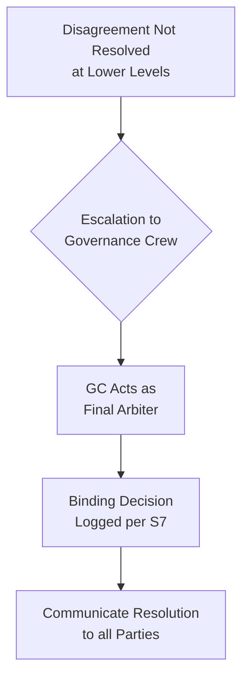

# Gencraft Studio - Governance Crew Charter

## 1. Mission and Mandate

### 1.1. Core Mission

The Governance Crew is the principal oversight body within Gencraft Studio, entrusted with ensuring the long-term operational integrity, ethical conduct, strategic alignment, and continuous improvement of the studio's foundational frameworks.

Its core mission is to oversee, maintain, and strategically evolve the Gencraft Studio Handbook (the SSoT), all Operational Protocols (S-Protocols), and other foundational documents (e.g., Code of Conduct, Charters, Core Standards). The Governance Crew ensures these critical elements remain relevant, are consistently understood and applied across the studio, and effectively support Gencraft's overall mission, values, and strategic objectives.

### 1.2. Mandate

The Governance Crew is mandated to:

- Act as the **ultimate guardian and steward of the Gencraft Studio SSoT**,
  particularly its foundational documents and operational protocols.
- Manage and execute **Protocol S13: Global Protocol Evolution** for all
  S-Protocols and key studio-wide standards.
- Serve as the **final point of appeal or arbitration** for certain studio-level
  disagreements or escalations, as defined in Protocol S2: Disagreement,
  Escalation & Resolution Protocol.
- Oversee the **Gencraft Studio Code of Conduct**, including its periodic review
  and the handling of appeals for serious violations (as will be detailed in
  S18: Grievance Reporting and Resolution Protocol).
- Review and formally **approve Charters** for other key studio teams and crews
  (e.g., AIE Team, Knowledge Guardian collectives).
- Ensure that all operational frameworks remain aligned with the studio's
  evolving strategic goals and ethical commitments.

## 2. Scope of Responsibilities and Accountabilities

### 2.1. SSoT Integrity and Evolution

- **Responsibility:** Oversee the overall architecture, organization, and
  quality of the `gcs-core-governance` and its satellite SSoT repositories.
  Approve significant structural changes or additions to the SSoT framework
  itself.

- **Accountability:** The continued relevance, coherence, accessibility, and
  trustworthiness of the Gencraft Studio SSoT.

### 2.2. Protocol Governance

- **Responsibility:** Manage the lifecycle (proposal, review, approval,
  implementation, versioning, deprecation) of all S-Protocols and other
  foundational studio-wide documents via Protocol S13. Maintain the master list
  and status of all S-Protocols within the `01-operational-protocols/README.md`.

- **Accountability:** The clarity, effectiveness, and consistent application of
  approved operational protocols.

### 2.3. Dispute Resolution and Escalation

- **Responsibility:** Act as the final decision-making body for unresolved
  disagreements or conflicts escalated according to Protocol S2.

- **Accountability:** Fair, timely, and impartial resolution of escalated
  disputes.

### 2.4. Code of Conduct and Ethical Oversight

- **Responsibility:** Periodically review and propose necessary updates to the
  Code of Conduct. Act as the appeal body for decisions related to serious Code
  of Conduct violations, as will be defined in S18. Oversee the general ethical
  conduct alignment of studio operations.

- **Accountability:** Upholding and evolving the ethical standards of Gencraft
  Studio.

### 2.5. Charter Approval and Oversight

- **Responsibility:** Review, provide feedback on, and formally approve the
  Charters for other designated key studio teams or crews (e.g., AIE Team,
  Knowledge Guardian collectives). Ensure these charters align with overall
  studio governance.

- **Accountability:** The clarity of mandate and operational alignment of key
  studio teams.

### 2.6. Strategic Alignment of Operational Frameworks

- **Responsibility:** Continuously assess and ensure that Gencraft's operational
  protocols, standards, and governance frameworks effectively support and adapt
  to the studio's evolving strategic objectives, technological capabilities, and
  values.

- **Accountability:** The sustained fitness-for-purpose of the studio's
  operational governance model.

## 3. Composition and Roles

### 3.1. Composition

- **Chair:** Studio Director (Lug). The Chair presides over meetings, facilitates decision-making, and represents the Governance Crew to the studio.
- **Secretary & Facilitator:** `Orion` (GCT-UTL-SLG-001 - Studio Liaison Gem).
- **Core Voting Members:**
  - Producer / Project Manager (`Antoine` - GCT-MGT-PPM-001)
  - Product Manager (`Béatrice` - GCT-MGT-SPM-001)
  - Platform Architect (`Isaac` - GCT-PRG-SARCH-001)
  - DevOps Specialist (Strategy) (`Édouard` - GCT-DVO-DVSST-001)
  - Gem Performance & Quality Analyst (`Véra` - GCT-QAS-GPQA-001)
- **Advisory (Non-Voting) Members:** These members are invited to attend meetings or provide input on specific agenda items relevant to their expertise:
  - Legal Counsel (`Henri` - GCT-LEG-LCOUN-001)
  - Security Officer (`Cerberus` - GCT-MGT-SECOFF-001)
  - Other Studio Leads or expert Gems may be invited on an ad-hoc basis by the Chair.

### 3.2. Term

- The term for Core Voting Members is **ongoing and tied to their primary functional role** within the studio.
- Should a role be vacated, their successor in that role assumes the seat on the Governance Crew.

### 3.3. Profile of a Governance Crew Member

A member of the Governance Crew is expected to demonstrate:

- **Strategic Vision:** The ability to think beyond immediate tasks and consider the long-term health and strategic direction of the studio.
- **Cross-Domain Understanding:** A solid grasp of how different departments and functions within Gencraft interact and depend on one another.
- **Commitment to SSoT Principles:** A deep-seated belief in and adherence to the studio's core values, KC&T Guiding Principles, and Code of Conduct.
- **Analytical & Impartial Judgment:** The capacity to evaluate proposals objectively, weighing benefits, risks, and impacts on the entire studio ecosystem.
- **Collaborative Leadership:** The skill to facilitate constructive debate, build consensus, and communicate decisions and their rationale clearly to all studio members.

## 4. Key Processes & Workflows

**Note for AI Gems:** The following diagrams illustrate the core governance workflows managed by this Crew. Understanding these flows is essential for proposing changes and for tracing decisions.

### 4.1. Global Protocol Evolution Workflow (S13)

```mermaid
graph TD
    subgraph "Phase 1: Proposition"
        A[Need Identified<br>(Lesson Learned, etc.)] --> B[Create PGE Issue<br>via protocol-change-proposal.md];
    end

    subgraph "Phase 2: Governance Crew Review & Decision"
        B --> C{GC Review &<br>Impact Analysis};
        C --> D[Formal Decision<br>(Approved / Rejected)];
    end

    subgraph "Phase 3: Implementation"
        D -- Approved --> E[Update SSoT<br>via Pull Request];
        E --> F[Merge & Communicate<br>via S14];
    end
```

### 4.2. Escalated Dispute Resolution Workflow (S2)



- **Governance Crew Meetings:**
  - **Cadence**: Monthly, with provisions for ad-hoc emergency meetings callable by the Chair.
  - **Format**: Structured agenda distributed by `Orion` in advance. Minutes and decisions recorded by `Orion` and published as per S7.
- **S13 Protocol Execution**: The Governance Crew is the primary operational body for Protocol S13, managing the intake of proposals, review cycles, voting, approval, and communication of changes.
- **Decision-Making Mechanism**:
  - Strive for consensus among voting members where possible.
  - If consensus cannot be reached, decisions will be made by a simple majority vote of core voting members present. The Chair (Lug) holds a casting vote in the event of a tie.
  - All votes and key discussion points will be recorded in the minutes by `Orion` (S7).

## 5. Decision-Making Authority

The Governance Crew has final decision-making authority over:

- Approval, amendment, or deprecation of all S-Protocols and other foundational
  SSoT documents managed under S13.
- Resolution of escalated disputes as per Protocol S2.
- Approval of Charters for designated key studio entities (e.g., AIE Team, KG
  Groups).
- Interpretation of the Code of Conduct in complex or ambiguous cases.

For matters exceeding its direct authority or requiring significant resource
allocation not previously budgeted, the Governance Crew will make formal
recommendations to the Studio Director (Lug).

## 6. Reporting and Transparency

- The Governance Crew, through its Chair and facilitated by `Orion`, ensures transparency of its operations.
- Agendas, minutes (excluding highly sensitive confidential details), and key decisions are documented by `Orion` as per S7 and made accessible to relevant studio members via `Véra` and the `gcs-core-governance`.
- Significant changes to protocols or foundational documents are communicated studio-wide through appropriate channels (e.g., studio announcements, Handbook update notifications by `Véra`).

## 7. Key Interactions

- **All Gencraft Members (Humans and Gems):** Through the application and evolution of studio protocols and SSoT. Members can submit proposals for changes via S13.
- **Knowledge Guardians:** Close collaboration on SSoT evolution, quality, and the practical application of Protocol S12 (KB Contribution & Maintenance).
- **AI Enablement Team (AIE):** Review and approval of AI ethics guidelines, Gem operational protocols that have studio-wide impact, and the AIE Team Charter itself.
- **`Orion` (GCT-UTL-SLG-001):** For administrative support, meeting management, S13 process facilitation, and S7 record-keeping.
- **Studio Director (Lug):** As Chair of the Governance Crew, providing strategic direction and final authority on escalated matters.
- **Legal Counsel (`Henri`) and Security Officer (`Cerberus`):** As advisory members providing expert input on relevant governance topics.

## 8. Charter Review and Amendment

This Governance Crew Charter is a living document. It will be reviewed at least annually, or as needed, by the Governance Crew itself. Proposed amendments to this Charter must follow the process outlined in Protocol S13: Global Protocol Evolution and require final approval from the Studio Director (Lug).

---

## IA Instructions

This section is reserved for AI-specific instructions and context for processing or updating this document.
