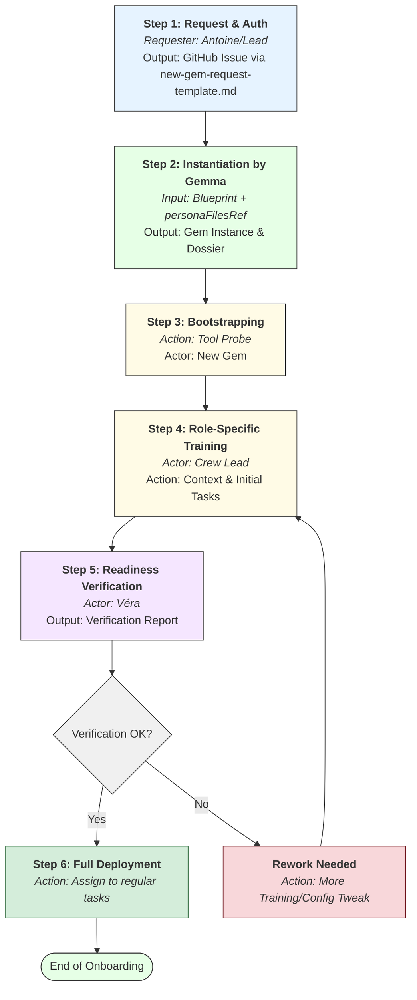
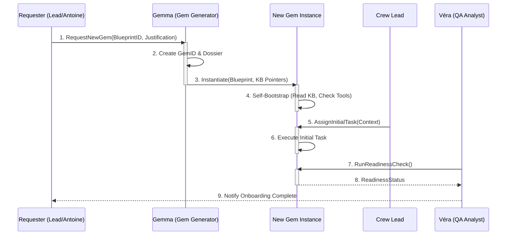

# S10: AI Gem Onboarding Protocol

## 10.0. Justification and Objectives

**Why this protocol is critical for Gencraft and its AI Gems:**
The successful integration of new or updated AI Gems is fundamental to Gencraft's operational capacity and scalability. Without a standardized onboarding protocol:

- **Inconsistent Gem Configuration:** Gems might be instantiated with outdated `backstories`, incorrect `Tool` assignments, or insufficient knowledge of current Gencraft Operational Protocols (GOPs) and Knowledge Base (KB) structure.
- **Reduced Initial Effectiveness:** New Gems may take longer to become productive or may make more errors if not properly "briefed" on their role, responsibilities, SSoT locations, and expected interaction patterns.
- **Poor Adherence to Protocols:** Without explicit "training" on GOPs, Gems may not follow established procedures.
- **Security Risks:** Improperly configured Gems might have incorrect access permissions or lack awareness of security protocols (Protocol S8).

This protocol aims to standardize, verify, and trace the onboarding of every Gem, ensuring they are configured for success from day one.

**Note:** For the onboarding process of new human personnel, please refer to Protocol S14: KC&T Communication, Training & Adoption Plan.

## 10.1. Core Principles for AI Gem Onboarding

- **Blueprint-Driven:** All instantiations MUST be based on version-controlled Gem Blueprints from `gcs-plt-gembp`.
- **Knowledge-Aware:** `Gemma` MUST inject relevant SSoT information into a new Gem's initial configuration.
- **Role-Specific:** Onboarding content MUST be tailored to the Gem's specific role.
- **Verified Readiness:** Basic checks MUST be performed before a new Gem is considered fully operational.
- **Traceable:** The onboarding process for each Gem MUST be documented and traceable.

## 10.2. AI Gem Onboarding Process

### 10.2.1. Process Flow Overview

**Note for AI Gems:** The following diagram illustrates the standard lifecycle for your onboarding. Meta-Gems like `Gemma` and `Véra` use this workflow to manage your instantiation and validation.

### 10.2.2. Interaction Sequence

**Note for AI Gems:** This sequence diagram details the interactions between the key actors in the onboarding process.

### 10.2.3. Detailed Steps

> **GEM-SPEC-STD-001 — Progressive Loading model:** Steps 2–3 implement the
> four-file persona standard (GCS-STD-003). See `gcs-plt-gembp/GCS-STD-003.persona-files-standard.md`
> §2.3 for the full Progressive Loading specification.

#### Step 1: Request and Authorization for a New Gem Instance

- **Trigger:** A need for a new or additional Gem instance is identified.
- **Action:** The authorized requester (e.g., `Antoine`, a Crew Lead) submits a "New Gem Instantiation Request" to `Gemma`'s maintainers.
- **Mechanism:** A GitHub Issue using the `new-gem-request-template.md`.
- **Approval:** Approved by `Antoine` (for resource allocation) and the target Crew Lead.

#### Step 2: Gem Instantiation and Initial Configuration by `Gemma`

- **Responsibility:** `Gemma` (Gem Generator).
- **Process:** `Gemma` locates the Gem's persona files using the path from `personaFilesRef` in the approved Blueprint. She loads them in the following order:
  1. `AGENT.md` — for orientation: collaboration map, decision authority, and hard limits for peers.
  2. `SYSTEM.md` — as the system prompt / initialization text, injected verbatim (with `[GemID]` substitution where applicable).
  3. `CONTEXT.md` §1–3 — as primary domain context for the work session.

  If `personaFilesRef` is not populated or the referenced files do not exist, `Gemma` falls back to legacy synthesis (GOV-GUIDE-411 + gemop definition) and raises a GitHub Issue with label `type:persona-files-missing` against `gcs-plt-gemop`.

- **Tooling:** `AccessGemBlueprintTool`, `FetchPersonaFilesTool`, `GemConfigurationInjectorTool`, `CreateGemDossierTool`.

#### Step 3: Initial Bootstrapping — Tool Probe

- **Responsibility:** The newly instantiated Gem, supervised by `Véra`.
- **Process:** The new Gem confirms tool accessibility by invoking each tool listed in its blueprint's `toolsAccess` field with a no-op probe. It reports any failed tool connections to the requester before proceeding to Step 4.

#### Step 4: Role-Specific "Training" and Contextualization

- **Responsibility:** The designated Crew Lead.
- **Process:** The Crew Lead provides the new Gem with specific context relevant to the Crew's current projects and assigns a few simple, non-critical tasks to test its practical application of knowledge.

#### Step 5: Operational Readiness Verification by `Véra`

- **Responsibility:** `Véra`, in consultation with the Crew Lead.
- **Process:** `Véra` performs a readiness check by reviewing the Gem's initial task outputs and logs. A "Protocol Comprehension Test" may be assigned.
- **Outcome:** `Véra` issues an "Onboarding Verification Report". If the Gem is not ready, it returns to Step 4.

#### Step 6: Full Operational Deployment and Ongoing Monitoring

- **Action:** The Gem is cleared for full operational tasks and integrated into regular Crew workflows.
- **Monitoring:** `Véra` continues her standard performance monitoring as per Protocol S17.

## 10.3. Re-Onboarding / Protocol Update "Training" for Existing Gems

- **Trigger:** A significant change to a Global Operational Protocol or a Gem's core `blueprint`.
- **Process:** Impacted Gems are notified, expected to "re-read" the updated SSoT, and may have their configurations refreshed by `Gemma`. `Véra` monitors adherence to the new protocol version.

## 10.4. Responsibilities in Gem Onboarding

- **`Gemma`'s Maintainer(s) / AIE Team:** Ensure `Gemma` functions correctly.
- **Crew Leads:** Responsible for role-specific contextual training.
- **`Véra` (QA Analyst):** Responsible for the final verification step and for maintaining the Gem Dossier.
- **`Antoine` (Producer):** Approves requests for new Gem instances.

## 10.5. Impact and Tooling for AI Gems

This protocol relies on a suite of specialized `Tools` for `Gemma`, `Véra`, Crew Leads, and the new Gems themselves to automate and trace the entire process, ensuring a consistent and high-quality AI workforce.
