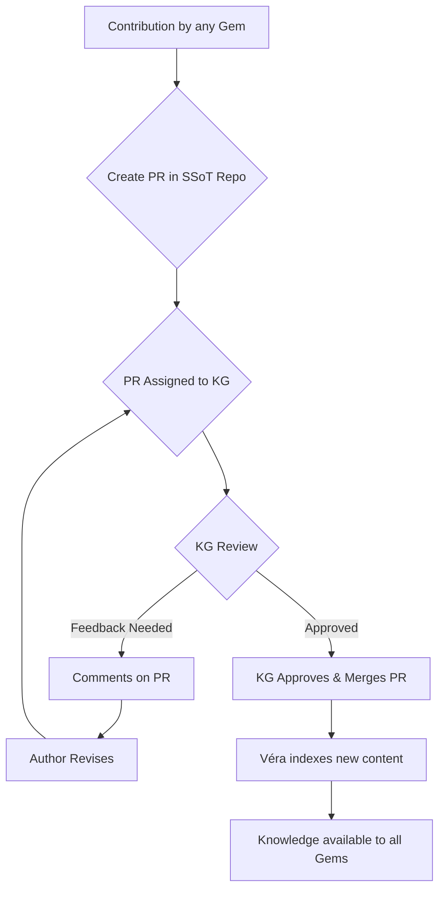
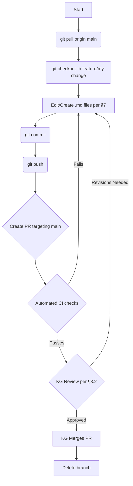
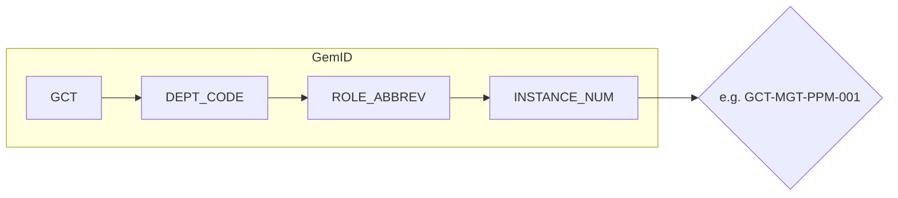

# Knowledge Management and Contribution Guide

> **Supersedes:** GOV-GUIDE-007 v1.0 *(Knowledge Guardian Charter)* and GOV-GUIDE-011 v1.0 *(KB Contribution and Style Guide)*. Both predecessor documents have been deleted. This single document is the authoritative reference for all Knowledge Base governance, Knowledge Guardian responsibilities, and contribution standards.

---

## 1. Purpose and Scope

This guide defines the complete rules for managing and contributing to the GenCr@ft Studio Knowledge Base (KB) and its Single Source of Truth (SSoT). It answers three questions:

- **Who** owns knowledge domains and is accountable for their quality — the Knowledge Guardian role.
- **How** any contributor proposes, creates, or revises KB content — the contribution workflow.
- **What** standards every document must meet — frontmatter, structure, linking, and code conventions.

All studio members — human contributors and AI Gems — are bound by this guide when creating or modifying any document in `gcs-core-governance` or a satellite SSoT repository.

---

## 2. Knowledge Guardians

### 2.1. Mission

A **Knowledge Guardian (KG)** is a designated studio member (human or specialized AI Gem) who serves as the primary custodian of a specific knowledge domain within the SSoT. Their mission is to ensure their domain is **accurate, current, well-structured, and discoverable** by both humans and AI agents.

KGs act as:
- **Subject Matter Experts** for their domain.
- **Primary quality validators and approvers** of all contributions to their domain (via the PR review process).
- **Champions** who encourage active use and continuous improvement of their domain.
- **Liaisons** with `Véra` (GCT-QAS-GPQA-001, KC&T System Gem) for metadata optimization and health monitoring.

### 2.2. Designation and Term

Knowledge domains are aligned with major operational areas, technical disciplines, or SSoT sections.

**Designation process:**
1. The Governance Crew identifies the need for a KG for a new or unassigned domain.
2. Candidates are identified by Leads, the Governance Crew, or self-nomination.
3. Nominees are reviewed against the KG profile (§2.3).
4. Formal appointment is made by the Governance Crew and recorded in `GOV-GUIDE-411` (Organization and Roles) and the master KG list maintained by `Orion` (GCT-UTL-SLG-001).

**Terms:**
- **AI Gem KGs:** Ongoing; tied to their functional role definition.
- **Human KGs:** Initial term of **12 months**, renewable after a brief performance review. Minimum one month's notice required to step down, to allow successor appointment.

### 2.3. KG Profile

A Knowledge Guardian must demonstrate:
- **Deep subject matter expertise** in their designated domain.
- **Commitment to SSoT principles** — accuracy, shared knowledge, reliability.
- **Communication and collaboration skills** — clear feedback, constructive review, effective cross-team liaison.
- **Attention to detail** — meticulousness in reviewing content and structuring information.
- **Proficiency with SSoT tools** — Git/GitHub PR workflow, Markdown, frontmatter standards.
- **Capacity** — ability to dedicate the necessary time to fulfill KG responsibilities.

---

## 3. KG Responsibilities

### 3.1. Content Curation and Accuracy

KGs regularly audit their domain for accuracy, relevance, completeness, and clarity. They proactively identify and address (or escalate) outdated, incorrect, or missing information. The KG is the accountable party for the overall quality of their domain.

### 3.2. Contribution Validation (PR Review)

KGs act as the **primary, authoritative reviewer** for all PRs affecting their domain. This means:
- Monitoring PRs targeting their domain's files in SSoT repositories.
- Reviewing for accuracy, clarity, completeness, formatting, and standard adherence.
- Providing constructive PR comments and requesting revisions when needed.
- Approving and merging valid contributions, or rejecting those that do not meet standards.
- Ensuring timeliness — reviews should not block contributors unreasonably.



### 3.3. Domain Structure and Navigation

KGs ensure their domain is logically structured, well-organized, and easy to navigate. This includes:
- Maintaining `README.md` files for domain sections (per §7.2).
- Managing a coherent sub-folder structure.
- Ensuring effective cross-linking between related documents.

### 3.4. Identifying and Filling Knowledge Gaps

KGs proactively identify areas where knowledge is missing, underdeveloped, or outdated. They initiate or solicit contributions to fill gaps and keep the domain aligned with current studio operations.

### 3.5. Collaboration with `Véra` (KC&T System Gem)

KGs work with `Véra` (GCT-QAS-GPQA-001) to:
- Optimize indexing, metadata, and discoverability of their domain.
- Define domain-specific metadata standards.
- Monitor health metrics, usage analytics, and user feedback reports.

### 3.6. Adherence to Global SSoT Standards

KGs enforce this guide (`GOV-GUIDE-007`) and the SSoT Documentation Principles (`GOV-PRIN-001`) within their domain, ensuring consistent formatting, linking, and frontmatter across all documents.

---

## 4. KG Processes

### 4.1. Proactive Content Auditing

KGs conduct periodic health checks (at minimum quarterly) of their domain:
- Identify content for update, archiving, or deletion based on relevance, accuracy, and `Véra` usage analytics.
- Fix broken links, outdated information, and formatting inconsistencies.
- Ensure all documents carry compliant SSoT frontmatter.

### 4.2. User Feedback Management

KGs manage feedback channels for their domain (e.g., GitHub Issue labels, discussion threads). They acknowledge feedback promptly and act on valid improvement requests within a reasonable timeframe.

### 4.3. Reporting to the Governance Crew

KGs provide bi-annual (or on-request) summary reports to the Governance Crew covering:
- Domain status, health, and key updates.
- Outstanding content gaps or quality issues.
- Systemic SSoT tooling or process concerns that require Governance Crew attention.

---

## 5. KG Decision-Making Authority

Knowledge Guardians have delegated authority to:
- **Approve or reject** PRs to their assigned domain based on quality, accuracy, relevance, and standard adherence.
- **Directly edit and maintain** content in their domain — all changes must still go via PRs for traceability.
- **Define the sub-structure** and navigation elements within their domain, in alignment with the global SSoT architecture.
- **Recommend** to the Governance Crew: significant structural cross-domain changes, amendments to this guide, or new tooling needs.

---

## 6. Contributing to the Knowledge Base

This section applies to **all contributors** — not just KGs. Every PR proposing new or modified KB content must follow this process.

### 6.1. Preparing Your Contribution (Local Workflow)

1. **Pull the latest changes** from the integration branch before starting:
   ```bash
   git pull origin main
   ```
2. **Create a feature branch** following the naming convention from `gcs-core-governance`:
   - `feature/docId-short-description`
   - `fix/issue-id-brief-summary`
   - `chore/task-description`
   - Never commit directly to `main`.
3. **Make your changes** applying all standards in §7.
4. **Commit in logical atomic units** with conventional commit messages (`feat:`, `fix:`, `docs:`, `chore:`).

### 6.2. Submitting a Pull Request



**PR requirements:**
- **Title:** Clear, conventional — e.g., `docs(GOV-GUIDE-NNN): Add section on X`.
- **Reviewers:** Must include the `knowledgeGuardian(s)` of every document affected.
- **Automated checks:** All mandatory CI checks (linting, frontmatter validation, link checking) must pass before requesting human review.

### 6.3. Review Cycle

- Read all reviewer feedback carefully. Ask for clarification if a comment is unclear.
- Address agreed changes on your feature branch and push updates.
- Notify reviewers when revisions are complete (`@reviewer, addressed in [commit hash]`).
- Do not self-merge unless you are the KG of the affected domain and have explicit maintainer rights.

### 6.4. Approval and Merge

- A PR is ready to merge once it has the approval of the domain KG and any required additional reviewers per OPS-GUIDE-021 (S1: Feedback & Approval).
- Post-merge: delete the feature branch.

### 6.5. Reporting Issues

If you find outdated content, broken links, or inconsistencies without a PR ready, open a GitHub Issue in the relevant repository with the appropriate issue template. Tag the domain KG.

---

## 7. Documentation Standards

### 7.1. YAML Frontmatter

Every Markdown document in the SSoT **must** begin with a compliant YAML frontmatter block. Frontmatter is the foundation for automated linting, AI discoverability, and governance tracking.

**Mandatory top-level fields:**

| Field | Description |
|-------|-------------|
| `docId` | Unique identifier in `DOMAIN-TYPE-NNN` format (e.g., `GOV-GUIDE-007`) |
| `title` | Human-readable document title |
| `version` | Semantic version (`MAJOR.MINOR.PATCH`) |
| `authors` | YAML block list of authors (GemIDs or names) |
| `creation_date` | ISO date string (`'YYYY-MM-DD'`) |
| `last_updated_date` | ISO date string; update on every significant revision |
| `language` | `en` (English only) |
| `knowledgeGuardian` | YAML block list — one or more KG names/GemIDs |
| `ssot_path` | Relative path from workspace root: `gcs-core-governance/path/to/file.md` |
| `metadata` | Block containing the sub-fields below |

**Mandatory `metadata` sub-fields:**

| Sub-field | Allowed values |
|-----------|---------------|
| `lifecycle-stage` | `draft` \| `review` \| `approved` \| `deprecated` \| `archived` |
| `scope` | `studio` \| `project-aethel` \| etc. |
| `domain` | `governance` \| `engineering` \| `production-management` \| etc. |
| `doc-type` | `guide` \| `policy` \| `protocol` \| `standard` \| `charter` \| `report` \| `readme` \| `catalog` \| etc. |
| `security-classification` | `l0_public` \| `l1_internal` \| `l2_confidential` \| `l3_secret` |
| `intended-audience` | YAML list — e.g., `contributors`, `ai-agents`, `governance-team` |
| `keywords` | YAML list of lowercase terms |

**Prohibited fields** (non-standard — will fail linting):
`date:`, `reviewers:`, `approvers:`, `summary:`, `status:`, `artifact-class:`, `classification:`, `provenance:`, `lifecycle-phase:`, `knowledgeGuardian(s):`

**Minimal compliant example:**
```yaml
---
docId: GOV-GUIDE-NNN
title: My Document Title
version: 1.0.0
authors:
- Your Name (GCT-DEPT-ROLE-001)
creation_date: '2026-01-01'
last_updated_date: '2026-05-20'
language: en
knowledgeGuardian:
- Guardian Name (GCT-DEPT-ROLE-001)
ssot_path: gcs-core-governance/path/to/GOV-GUIDE-NNN.my-document-title.md
metadata:
  lifecycle-stage: draft
  scope: studio
  domain: governance
  doc-type: guide
  security-classification: l2_confidential
  intended-audience:
  - contributors
  keywords:
  - my-topic
---
```

### 7.2. README.md Files

Every directory in the SSoT must have a `README.md` file. READMEs serve as the entry point for humans navigating the directory and as semantic anchors for AI agents building knowledge graphs.

**Required structure (in order):**

1. **YAML frontmatter** — as per §7.1, with `doc-type: readme`.
2. **H1 title** — mirroring the frontmatter `title`.
3. **Brief introduction** (1–3 sentences) — the directory's purpose.
4. **Overview of key contents** — list or table of subdirectories and key files with descriptions.
5. **`## AI Instructions`** (mandatory for repo roots and first/second-level directories) — see below.
6. **Contact/Knowledge Guardians** — who to reach for questions.

**`## AI Instructions` section** must include:

- **`### Core Objective`** — 1–2 sentences on what an AI should primarily understand from this directory.
- **`### Key Documents`** — bulleted list of key documents with `docId` and AI-relevant description.
- **`### Key Concepts`** *(recommended)* — types of artifacts or entities managed here.
- **`### Relationships to other SSoT Areas`** *(recommended)* — `docId` pointers to related directories/documents.

### 7.3. Semantic Structure

**Headings:**
- Use `#` through `######` sequentially — never skip levels (e.g., do not jump from `##` to `####`).
- The first heading in the body is always `# H1`, matching the frontmatter `title`.

**Lists:**
- Unordered (`-`) for items with no sequence; ordered (`1.`) for steps.
- Consistent indentation for nesting.

**Tables:**
- GFM table syntax; clear column headers.

**Line length:**
- Prose: no fixed limit — modern editors and viewers wrap naturally.
- Tables and code blocks: break lines manually for readability.

**Language:** English only. No French or other languages in any deliverable.

**Terminology:** Use official terms from the GenCr@ft Studio Glossary (`OPS-CATALOG-001`). Link or inline-explain terms on first use if context might be ambiguous.

### 7.4. Links and Cross-References

**Internal links** (within the same SSoT repository):
- **Must** use relative paths: `../01-operational-protocols/OPS-GUIDE-002.s2-disagreement-escalation.md`.
- Never use absolute file system paths or GitHub URLs for same-repo links.
- Filenames must include their `docId` prefix (e.g., `GOV-GUIDE-007.knowledge-management-and-contribution-guide.md`).

**Cross-repository links:**
- Use the full GitHub HTTPS URL pointing to the specific file on `main`.
- In prose, reference by `docId` for clarity alongside the URL.

**Anchor links:**
- `[Link text](#section-heading-as-anchor)` — lowercase, spaces → hyphens.
- Verify anchors against your Markdown renderer; update all anchors when a heading changes.

**External links:**
- Full valid HTTPS URLs.
- Add a parenthetical note if the resource requires login or may become stale.

**Link text:**
- Must be descriptive — never "click here," "link," or a bare URL.
- Good: `See the [Feedback and Approval Protocol](../01-operational-protocols/OPS-GUIDE-021.s1-feedback-approval.md)`.
- Bad: `More info [here]`.

**Link maintenance:**
- When renaming, moving, or deleting a document, all incoming links in other files **must** be updated or removed.
- KGs are responsible for link integrity within their domain. Broken links discovered by any contributor should be reported to the relevant KG via a GitHub Issue.

### 7.5. GemID Convention

The GemID uniquely identifies each AI Gem. The format is strict:

```
GCT-[DEPT_CODE]-[ROLE_ABBREV]-[INSTANCE_NUM]
```



**Components:**
- `GCT` — fixed prefix for GenCr-ft.
- `DEPT_CODE` — 3-letter uppercase code for the Gem's primary department.
- `ROLE_ABBREV` — 2–5 letter uppercase role abbreviation.
- `INSTANCE_NUM` — 3-digit sequential number (`001`, `002`, …).

**Department codes:**

| Dept ID | Department Name | `DEPT_CODE` |
|---------|----------------|-------------|
| D01 | Management & Production | `MGT` |
| D02 | Marketing, Sales & Business Development | `MKT` |
| D03 | Design | `DES` |
| D04 | Programming | `PRG` |
| D05 | Art | `ART` |
| D06 | Audio | `AUD` |
| D07 | Quality Assurance | `QAS` |
| D08 | DevOps | `DVO` |
| D09 | Community & Support | `CSM` |
| D10 | Legal | `LEG` |
| D11 | Utilities (Meta-Gems & Studio Support) | `UTL` |

The authoritative GemID list and all role assignments are maintained in `GOV-GUIDE-411` (Organization and Roles). New role abbreviations are defined when a new Gem role is created in that document.

### 7.6. Code Comments and Script Headers

**Comment philosophy:** Explain the *why*, not the *what*. Self-documenting code handles the what; comments handle hidden constraints, non-obvious design choices, and workarounds.

**Script file headers** (mandatory for all `.sh`, `.py`, `.ps1` scripts):
```bash
# Purpose:      Brief description of what the script does and why.
# Author(s):    GemID or name(s)
# Created:      YYYY-MM-DD
# Last Modified: YYYY-MM-DD
# Version:      1.0.0
# Usage:        ./my_script.sh --input <file> [--verbose]
# Dependencies: list of required tools/env vars
```

**Inline comments:**
- Concise and directly relevant to the code they annotate.
- Placed above the block they explain, or at end-of-line for single-line annotations.
- Use standard tags: `TODO:`, `FIXME:`, `NOTE:`, `XXX:` — with context and date where helpful.
- Update comments whenever the code they describe changes. An outdated comment is worse than no comment.

---

## 8. Contributor Checklist

Use this checklist before submitting any SSoT contribution via PR.

**General:**
- [ ] Content written entirely in English.
- [ ] Complies with SSoT Documentation Principles (`GOV-PRIN-001`).

**YAML Frontmatter (§7.1):**
- [ ] All mandatory top-level fields present and correctly populated.
- [ ] `knowledgeGuardian:` is a YAML block list (not an inline string).
- [ ] `lifecycle-stage` uses a valid enum value.
- [ ] `security-classification` uses underscore format (e.g., `l2_confidential`).
- [ ] No prohibited fields (`reviewers`, `approvers`, `summary`, `date`, `status`, etc.).
- [ ] `ssot_path` is a relative path with the correct `docId` filename prefix.

**README.md (if applicable, §7.2):**
- [ ] Includes mandatory `## AI Instructions` section for root and first/second-level directories.
- [ ] `### Core Objective` and `### Key Documents` subsections present.

**Structure and Content (§7.3):**
- [ ] No skipped heading levels.
- [ ] No French or non-English text.
- [ ] Official glossary terms used consistently.

**Links (§7.4):**
- [ ] Internal links use relative paths with `docId` prefixes.
- [ ] No bare URL link text — all link text is descriptive.
- [ ] Links tested for correctness.

**Process (§6):**
- [ ] Changes on a feature branch (not directly on `main`).
- [ ] PR targeting `main` with conventional commit message.
- [ ] KG of every affected document assigned as reviewer.
- [ ] All mandatory CI checks pass.

---

## 9. Charter Review

This document is reviewed at least annually by the Governance Crew. Proposed amendments must follow OPS-GUIDE-013 (S13: Global Protocol Evolution) and require Governance Crew approval. All changes are logged in `governance/AMENDMENT-LOG.md`.

---

## 10. Document Lifecycle Transitions

Every SSoT document moves through a defined sequence of `lifecycle-stage` values (set in frontmatter §7.1). This section specifies the transition criteria and required actions at each step.

### 10.1. Stage Definitions

| Stage | Meaning |
|-------|---------|
| `draft` | Document is being authored; not ready for review or citation. |
| `review` | Document is feature-complete and under KG/peer review via open PR. |
| `approved` | Formally approved; the active authoritative reference. Contributions must comply with it. |
| `deprecated` | Superseded or no longer valid; still accessible but must not be cited for new work. |
| `archived` | Permanently retired; file moved to `governance/archive/`. Accessible for audit only. |

### 10.2. Transition Rules

| Transition | Trigger | Required action |
|------------|---------|-----------------|
| `draft` → `review` | Author judges the document feature-complete | Open PR against `main`; update `lifecycle-stage` to `review`; assign all listed `knowledgeGuardian`(s) as PR reviewers |
| `review` → `approved` | All KGs approve the PR and all CI checks pass | Merge PR; update `lifecycle-stage` to `approved` and `last_updated_date` in frontmatter |
| `review` → `draft` | KG returns the document for major rework | Close PR without merging; update `lifecycle-stage` back to `draft`; address feedback before re-opening |
| `approved` → `deprecated` | A superseding document is merged, or the content is no longer valid | Update `lifecycle-stage` to `deprecated`; add a deprecation banner at the top of the document (see §10.3); log the change in `governance/AMENDMENT-LOG.md` |
| `deprecated` → `archived` | 90-day grace period has elapsed **or** the KG confirms no active citations remain | Follow the Archive Procedure (§11) |

### 10.3. Deprecation Banner

When marking a document `deprecated`, add the following block immediately after the H1 title, before the first section:

```markdown
> [!WARNING]
> **Deprecated.** This document is no longer actively maintained.
> It has been superseded by [`<successor-docId>`]#.
> Do not cite this document for new work.
```

Replace `<successor-docId>` and `<relative-path-to-successor.md>` with the actual values. If no direct successor exists, omit the second sentence and state the reason briefly (e.g., "The subject matter has been consolidated into the studio glossary.").

---

## 11. Archive Procedure

Archiving permanently removes a document from its active path. Documents are **never deleted** — they are moved to `governance/archive/` so they remain accessible for audit and historical reference.

### 11.1. When to Archive

Archive a document when **all** of the following are true:

1. `lifecycle-stage` is `deprecated`.
2. At least 90 days have passed since the deprecation PR was merged, **or** the responsible KG has explicitly approved early archival.
3. All known cross-references within the repository have been updated to point to the successor document or have been removed.

### 11.2. Archive Steps

1. **Add deprecation banner** (if not already present) — §10.3.
2. **Move the file** to `governance/archive/<original-relative-path>`, preserving the full `docId`-prefixed filename and the original subdirectory structure so that provenance remains clear.
   - Example: `02-knowledge-base-hub/GOV-GUIDE-NNN.my-guide.md` → `governance/archive/02-knowledge-base-hub/GOV-GUIDE-NNN.my-guide.md`
3. **Update the document's frontmatter**: set `lifecycle-stage: archived` and update `ssot_path` to reflect the new path (e.g., `gcs-core-governance/governance/archive/02-knowledge-base-hub/GOV-GUIDE-NNN.my-guide.md`).
4. **Update all cross-references** within the repo: replace relative links pointing to the old path with a link to the successor document (or remove the link if there is no successor).
5. **Run the pre-commit suite** to verify no broken links remain:
   ```bash
   pre-commit run --all-files
   ```
6. **Log the archival** in `governance/AMENDMENT-LOG.md`, matching the existing column format:
   | Date | Document | DocId | Version | Change Summary | Ratified By | PR |
   |------|----------|-------|---------|---------------|-------------|-----|
   | `YYYY-MM-DD` | `My Guide` | `GOV-GUIDE-NNN` | `x.y.z` | Archived — superseded by `<successor-docId>` | `KG Name` | `#NNN` |
7. **Commit** using the conventional message format:
   ```
   docs(archive): retire GOV-GUIDE-NNN — superseded by <successor-docId>
   ```
8. **Open a PR** targeting `main`; assign the KG as reviewer. The PR description must include a link to the original deprecation PR.

### 11.3. Cross-Repository References

If the archived document is cited from other repos, open a separate issue in each affected repo to track the reference update. Do not block the archive PR on cross-repo updates — those are tracked separately.

---

## AI Instructions

### Core Objective
This document defines all rules for Knowledge Base governance and contribution in GenCr@ft Studio. AI agents must apply the standards in §7 to every document they create or modify, and must respect the KG review authority defined in §3.2 before treating any SSoT change as complete.

### Key Documents
- `GOV-PRIN-001` (`02-knowledge-base-hub/GOV-PRIN-001.ssot-documentation-principles.md`) — overarching SSoT principles ("why").
- `GOV-GUIDE-411` (`00-studio-vision-and-principles/GOV-GUIDE-411.organization-and-roles.md`) — authoritative KG assignments and GemID registry.
- `OPS-GUIDE-021` (`01-operational-protocols/OPS-GUIDE-021.s1-feedback-approval.md`) — PR approval and review thresholds.
- `OPS-GUIDE-013` (`01-operational-protocols/OPS-GUIDE-013.s13-global-protocol-evolution.md`) — amendment process for this guide.
- `OPS-CATALOG-001` (`OPS-CATALOG-001.glossary.md`) — official terminology definitions.

### Key Concepts
- Knowledge Guardians (KG)
- SSoT frontmatter schema
- PR contribution workflow
- GemID convention
- Document lifecycle stages and transition rules (§10)
- Archive procedure and deprecation banner (§11)
