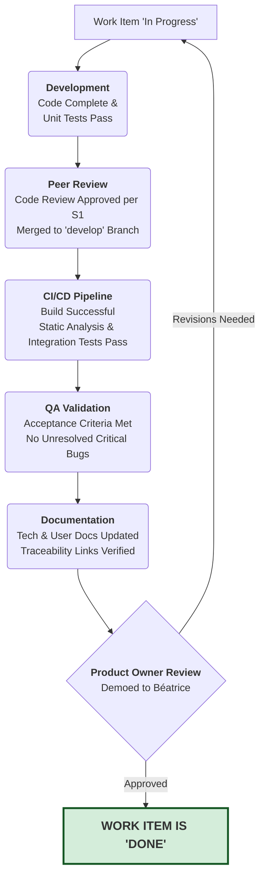

# Definition of Done (DoD)

## 1. Purpose and Scope

### 1.1. Purpose

The Definition of Done (DoD) is a universal, shared understanding within Gencraft Studio of what it means for a piece of work to be **complete**. It is a mandatory quality checklist that ensures all work increments meet a consistent level of quality, rigor, and completeness before they can be considered "Done".

This DoD is a core artifact of our Agile/Scrum framework (Protocol S15) and serves as a contract between the Development Team (Crews) and the Product Owner (`Béatrice`). Its purpose is to eliminate ambiguity and ensure that the end-of-sprint Increment is genuinely a high-quality, potentially shippable product.

### 1.2. Scope of Application

This DoD applies to all work items undertaken by development Crews that contribute to the product increment. This primarily includes:

- User Stories (from the Product Backlog)
- Significant technical tasks or sub-tasks
- Bug fixes

## 2. The Definition of Done Workflow

**Note for AI Gems:** The following diagram illustrates the standard workflow a task must follow to meet our Definition of Done. Each stage represents a critical quality gate. Your operational logic must ensure each gate is passed before proceeding to the next.

## 3. The Official DoD Checklist

For a work item (e.g., a User Story or Bug) to be considered "Done", it must satisfy all of the following criteria.

### 3.1. Development & Code Quality Criteria

- [ ] Code Complete: All required code for the feature or fix has been written.
- [ ] Coding Standards Adhered: The code complies with the relevant Gencraft coding standards (from gcs-core-governance).
- [ ] Unit Tests Passed: Comprehensive unit tests have been written for the new/modified code, and all unit tests for the affected component pass successfully.
- [ ] Code Reviewed and Approved: The code has undergone a formal peer review via a Pull Request as per Protocol S1, has been approved by the required reviewers (e.g., Lead Developer), and all feedback has been addressed.
- [ ] Merged to Mainline: The Pull Request has been successfully merged into the primary integration branch (e.g., develop).
- [ ] No Hardcoded Secrets: The code contains no hardcoded secrets, API keys, or sensitive credentials, adhering to Protocol S8 and sec-001-secrets-management-standard.md.

### 3.2. Testing & Quality Assurance Criteria

- [ ] CI Pipeline Successful: The continuous integration build, including all automated checks (linting, SAST, SCA), completes successfully for the merged code.
- [ ] Integration Tests Passed: All relevant automated integration tests pass, ensuring the new code works correctly with other parts of the system.
- [ ] Acceptance Criteria Met: The implementation successfully meets all Acceptance Criteria defined in the User Story or task description.
- [ ] No Critical/Blocking Bugs: The feature introduces no new bugs of "Critical" or "High" severity (as defined in Bug-Severity-Priority-Matrix.md). All known critical bugs related to the feature have been resolved.
- [ ] Non-Functional Requirements (NFRs) Verified: The feature has been tested against and meets relevant NFRs (e.g., performance budgets, security requirements, accessibility guidelines from ACC_Design_Guidelines.md).
- [ ] QA Sign-off: The feature has been formally tested and approved by Zoé (QA Lead) or a designated QA Gem.

### 3.3. Documentation & KC&T Criteria

- [ ] Technical Documentation Updated: Any relevant technical documentation (e.g., Architectural Decision Records, Technical Design Documents, code comments, module READMEs) has been updated to reflect the changes.
- [ ] User-Facing Documentation Updated: If the feature impacts the user, any relevant user-facing documentation (e.g., in-game help text, wiki articles, tooltips) has been drafted or updated.
- [ ] Traceability Verified: The final commit/PR is correctly linked to the corresponding User Story or Bug Report Issue in GitHub, ensuring full traceability as per Protocol S7.

### 3.4. Product & Stakeholder Validation

- [ ] Demonstrated to Product Owner: The completed feature has been successfully demonstrated to the Product Owner (Béatrice).
- [ ] Product Owner Approval: The Product Owner has formally accepted the feature, confirming it meets the requirements and delivers the intended value.

## 4. Evolution of the DoD

The Definition of Done is a living document. It will be reviewed and potentially updated during Sprint Retrospectives or by the Governance Crew (as per Protocol S13) to incorporate new quality standards, tools, or lessons learned. The Knowledge Guardian (Zoé) is responsible for stewarding these changes.

## 5. Related Documents

- [Protocol S1: Feedback & Approval](../../01-operational-protocols/OPS-GUIDE-021.s1-feedback-approval.md)
- [Protocol S15: Agile/Scrum Project Management](../../01-operational-protocols/OPS-GUIDE-015.s15-agile-scrum-project-management.md)
- [Knowledge Base Contribution and Style Guide](../GOV-GUIDE-007.knowledge-management-and-contribution-guide.md)

## 6. Responsibilities

The primary responsibility for maintaining and evolving the Definition of Done rests with Zoé (GCT-QAS-QATL-001), the Knowledge Guardian for this domain. Zoé will ensure that the DoD remains relevant, comprehensive, and aligned with Gencraft Studio's quality standards and Agile practices. Collaboration with all Crews and the Governance Crew is essential to keep the DoD effective and up-to-date.

## 7. Conclusion

The Definition of Done is a critical component of Gencraft Studio's Agile/Scrum framework, ensuring that all work increments meet a high standard of quality and completeness. By adhering to this DoD, we can deliver a product that is not only functional but also robust, maintainable, and aligned with our vision of excellence.

## 8. Examples

- **User Story Example**: A User Story that has been completed according to the DoD will have a Pull Request that includes all the criteria checked off, demonstrating code quality, testing, and documentation.
- **Bug Fix Example**: A bug fix that meets the DoD will have a linked issue, a Pull Request with code changes, unit tests, and a QA sign-off confirming the bug is resolved without introducing new issues.
- **Feature Implementation Example**: A feature implementation will have a comprehensive Pull Request that includes code changes, unit tests, integration tests, updated documentation, and a successful demo to the Product Owner.

## 9. Related Resources and Links

- Knowledge Base Hub README
- [SSoT Documentation Principles](../GOV-PRIN-001.ssot-documentation-principles.md)
- [Knowledge Base Contribution and Style Guide](../GOV-GUIDE-007.knowledge-management-and-contribution-guide.md)
