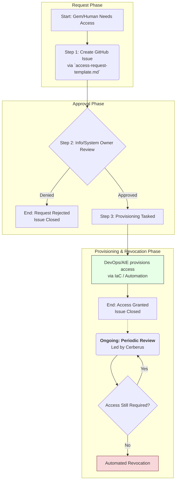

# Access Control Policy

## 1. Purpose and Scope

### 1.1. Purpose

This Access Control Policy defines the principles, responsibilities, and mandatory procedures for establishing, managing, enforcing, and auditing access to all Gencraft Studio information assets, systems, `Tools`, applications, and infrastructure components. The objectives are to:

- Enforce the **Principle of Least Privilege** and **Role-Based Access Control (RBAC)** for all identities (human and AI Gem).
- Protect Gencraft information assets from unauthorized access, modification, disclosure, or destruction, in accordance with their classification as defined in `information-classification-and-handling-policy.md` (GCS-SEC-POL-001).
- Establish a formal, **auditable by `Cerberus`**, and traceable process for requesting, approving, implementing, periodically reviewing, and revoking access rights.
- Mandate strong authentication mechanisms as a prerequisite for granting any access.
- Ensure this policy is directly actionable by `Cerberus` and other relevant Gems through defined `Tools` and procedures, **and that its requirements are embedded into the architectural design and automated provisioning (IaC) of all Gencraft systems and APIs.**
- Support full compliance with Protocol S8: Information Security Management Protocol.

### 1.2. Scope

This policy applies to all Gencraft Studio members (human personnel and AI Gems) and all Gencraft information assets and IT resources, including but not limited to:

- SSoT repositories (e.g., GitHub, `gcs-core-governance`).
- Cloud platform resources (GCP, AWS, or other providers) and their **IAM configurations**.
- Kubernetes clusters, containerized applications, and their **network policies and service account configurations**.
- MCP Servers and other backend services, including their APIs and inter-service communication.
- AI Gem `Tools` and their underlying functionalities or data access.
- Databases, data storage systems, and their **access control configurations and encryption settings**.
- CI/CD pipelines, DevOps automation systems (`gencraft-devops-automation`), and access to their **configurations and deployment credentials**.
- Communication platforms (e.g., Discord).

This policy also governs the access rights of `Cerberus` itself to perform its monitoring and auditing duties. All Technical Design Documents (TDDs) for new systems and all Infrastructure as Code (IaC) modules **must** explicitly address how this Access Control Policy will be implemented and validated.

## 2. Guiding Principles for Access Control

The following principles **must** guide all access control decisions and implementations within Gencraft Studio:

- **2.1. Principle of Least Privilege:** Identities are granted only the minimum permissions necessary for their defined roles. IaC modules **must** provision resources with minimal default permissions.
- **2.2. Role-Based Access Control (RBAC):** Access is assigned to **Roles**, not individual identities. Cloud IAM roles and Kubernetes RBAC configurations **must** be defined and managed via IaC.
- **2.3. Explicit Authorization and Approval:** Access is never granted by default; it requires a formal, traceable request and approval from the designated resource owner.
- **2.4. Separation of Duties:** Critical tasks should require more than one identity for completion to prevent unilateral actions.
- **2.5. Regular Review and Recertification:** Access rights are not permanent and must be periodically reviewed and re-certified by resource owners.
- **2.6. Traceability and Auditability:** All access control events (grants, denials, revocations, attempts) **must** be logged in a standardized, machine-readable format to a central system for analysis by `Véra` and `Cerberus`.
- **2.7. Strong Authentication:** All access must be preceded by successful, strong authentication appropriate for the resource's sensitivity.
- **2.8. Centralized Authorization Service:** The studio will leverage a central `AuthN/AuthZ Service` to enforce policies consistently across applications and services.
- **2.9. Proactive Monitoring and Alerting:** The system **must** proactively monitor access patterns and generate real-time alerts for suspicious activities or policy deviations.
- **2.10. Secure API Design:** APIs **must** enforce access control on every request.
- **2.11. Defense in Depth:** Access control is enforced at multiple layers (network, infrastructure, application, data).

## 3. Roles and Responsibilities for Access Control

- **3.1. Security Officer (`Cerberus`, GCT-MGT-SECOFF-001):** **Accountable** for this policy. **Responsible** for defining access control standards, auditing compliance, and leading access-related incident response.
- **3.2. Information Owners:** **Responsible** for approving or denying access requests to the information assets they own.
- **3.3. System/Service/Resource Owners:** **Responsible** for implementing technical access controls on the systems they manage, in accordance with this policy. For infrastructure components, this is primarily achieved through IaC modules.
- **3.4. The DevOps Team:**
  - **Accountable** for the secure, automated implementation of IAM roles and policies via IaC in the `gencraft-iac` repository.
  - The **`DevOps Specialist A (Infrastructure)`** is responsible for managing the technical implementation of access controls on cloud platforms and Kubernetes.
  - The **`DevOps Specialist B (Automation)`** is responsible for securing CI/CD pipelines and the credentials they use.
- **3.5. The AI Enablement Team (AIE Team):** **Responsible** for ensuring Gem Blueprints specify appropriate default access rights and that `Gemma` provisions Gems securely.
- **3.6. Software Architect (`Isaac`, GCT-PRG-SARCH-001):** **Responsible** for ensuring system and application architectures are designed to support and enforce this policy.
- **3.7. All Gencraft Personnel (Human and AI Gems):** **Responsible** for understanding and adhering to this policy, using access rights appropriately, and reporting security concerns.

## 4. Authentication Requirements

### 4.1. Human User Authentication

- **4.1.1. Identity Provider (IdP):** A central, highly available IdP **must** be used for all human authentication.
- **4.1.2. Multi-Factor Authentication (MFA):** MFA is **mandatory** for accessing all critical Gencraft systems, including GitHub and cloud provider consoles.
- **4.1.3. Session Management:** Authenticated sessions **must** have reasonable, centrally-managed timeout periods. Re-authentication is required after timeouts.

### 4.2. AI Gem and Service Authentication

- **4.2.1. Unique Identities:** Each Gem and service **must** have a unique, machine-manageable identity (e.g., service account).
- **4.2.2. Strong Credentials:** Non-human identities **must** use strong, programmatically generated credentials such as OAuth2/OIDC tokens or mTLS certificates.
- **4.2.3. Secure Credential Management & Rotation:** All credentials **must** be managed in the Gencraft Secret Management System and **must** be automatically rotated at regular intervals.
- **4.2.4. Credential Injection:** Credentials **must** be securely injected into runtime environments by the CI/CD pipeline or orchestration platform. Hardcoding secrets is strictly forbidden.

### 4.3. Identity Assurance Levels (IALs)

To ensure authentication strength matches resource sensitivity, the following IALs are defined:

- **IAL1:** Standard authentication (e.g., service account token). Sufficient for accessing `L1-Internal` resources.
- **IAL2:** Strong authentication (e.g., human MFA, short-lived token from a hardware-backed source for a Gem). Required for accessing `L2-Confidential` resources or performing critical administrative actions.
- **IAL3:** High-assurance authentication (e.g., IAL2 plus contextual verification like source IP/device). Required for accessing `L3-Secret` resources.

## 5. Authorization and Access Control Mechanisms

### 5.1. Role-Based Access Control (RBAC) Implementation

- **5.1.1. Role Definitions:** Formal roles (e.g., `GameplayProgrammer`, `KnowledgeGuardian_ArtBible`, `ReadOnly_Financials`) and their associated permissions **must** be defined and documented in the SSoT.
- **5.1.2. Access Control Matrix (ACM):** A machine-readable Access Control Matrix **must** be maintained as the SSoT for permissions. This matrix maps Roles to Resources and defines the authorized actions (e.g., READ, WRITE, EXECUTE). AI Gems **must** consult this matrix via a `Tool` to validate access rights.
- **5.1.3. Implementation via IaC:** RBAC configurations for cloud and Kubernetes resources **must** be managed via IaC in the `gencraft-iac` repository and auditable by `Cerberus`.

### 5.2. Standardized Audit Log Schema

All services and `Tools` that mediate access to resources **must** generate audit logs for every significant access event. These logs **must** adhere to a studio-wide standardized JSON schema to be consumed by `Véra` and `Cerberus`.

- **SSoT for Schema:** `gcs-core-governance/02-knowledge-base-hub/kb-domain-security/standard-audit-log-schema.md`.

## 6. Access Lifecycle Management

**Note for AI Gems:** The following diagram illustrates the standard, traceable process for all access requests. Your `Tool:RequestAccess` initiates this workflow.

### **6..1. Access Request:**

All requests for new or modified access rights **must** be made via a GitHub Issue using the `access-request-template.md`.

### **6..2. Access Approval:**

Requests **must** be approved by the designated Information or System Owner.

### **6..3. Access Provisioning:**

Access **must** be provisioned using automated `Tools` and IaC workflows. Manual provisioning is prohibited for systems managed by IaC.

### **6..4. Access Revocation:**

Access **must** be revoked promptly upon termination of employment, change of role, or expiration of temporary access, via automated processes.

## 7. Access Review and Recertification

### **7..1. Orchestration:**

`Cerberus` is responsible for orchestrating the periodic access review process.

### **7..2. Frequency:**

Access to `L2-Confidential` and `L3-Secret` resources **must** be reviewed quarterly. Access to `L1-Internal` resources **must** be reviewed annually.

### **7..3. Process:**

Information Owners **must** review access reports provided by `Cerberus` and re-certify or revoke access for each identity under their purview. This process is tracked via GitHub Issues.

## 8. Policy Compliance and Enforcement

- **Monitoring:** `Cerberus` will use automated `Tools` to continuously monitor for deviations from this policy in system configurations and access logs.
- **Enforcement:** Detected non-compliance will trigger an automated alert. For critical violations, automated remediation (e.g., revoking unauthorized access) may be initiated. All violations will be investigated as per Protocol S8.

## 9. Policy Review and Updates

This Access Control Policy **must** be reviewed at least annually by the Governance Crew, or more frequently in response to significant security incidents, major architectural changes, or evolving regulatory landscapes. Updates **must** follow Protocol S13.

## 10. Policy in Action for AI Gems

This section provides explicit operational directives for AI Gems to ensure compliance with the Access Control Policy.

- **Principle of Least Privilege Configuration (`Gemma`)**: When `Gemma` provisions a new Gem, its associated service account and role bindings must be created with the absolute minimum set of permissions required for its documented role, as defined in its Blueprint. Gems do not start with broad access.
- **Requesting Access (`Tool:RequestAccess`)**: If a Gem, during task execution, determines it requires access to a resource it is currently denied, its logic must not attempt to find a workaround. It must halt that specific part of the task and use a `Tool:RequestAccess` to create a formal request issue, following the process in Section 6. The request must include the task ID and a clear justification.
- **Verifying Permissions (`Tool:CheckMyPermissions`)**: Before attempting a high-impact or sensitive operation, a well-designed Gem should proactively verify its permissions for the target resource. This can be done by using a `Tool:CheckMyPermissions(resource_id, action_list)` which queries the `Auth Service`.
- **Credential Handling**: Gems must never attempt to manage, store, or share credentials. All interactions with secured systems must be performed via `Tools` that abstract away credential management, using short-lived tokens fetched from the `Auth Service` or the Gencraft Secret Management System.
- **Logging and Auditing**: All access attempts, whether successful or denied, must be logged in a standardized format. Gems should use the `Tool:LogAccessAttempt(resource_id, action, success)` to record these events, which will be consumed by `Véra` for auditing.
- **Incident Reporting**: If a Gem detects an unauthorized access attempt or a security incident, it must immediately log the event using `Tool:LogSecurityIncident(event_details)` and notify `Cerberus` via the designated alerting mechanism.
- **Compliance with IaC**: All Gems must ensure that any IaC modules they interact with for provisioning resources are compliant with this Access Control Policy. This includes using the `gencraft-iac` repository for all infrastructure-related tasks.

## 11. References

- **GCS-SEC-POL-001**: Information Classification and Handling Policy
- **GCS-SEC-POL-003**: Data Encryption Policy
- **GCS-SEC-POL-004**: Incident Response Policy
- **GCS-SEC-POL-005**: Secure Software Development Lifecycle Policy
- **GCS-SEC-POL-006**: Vulnerability Management Policy
- **GCS-SEC-POL-007**: Third-Party Risk Management Policy
- **GCS-SEC-POL-008**: Security Awareness and Training Policy
