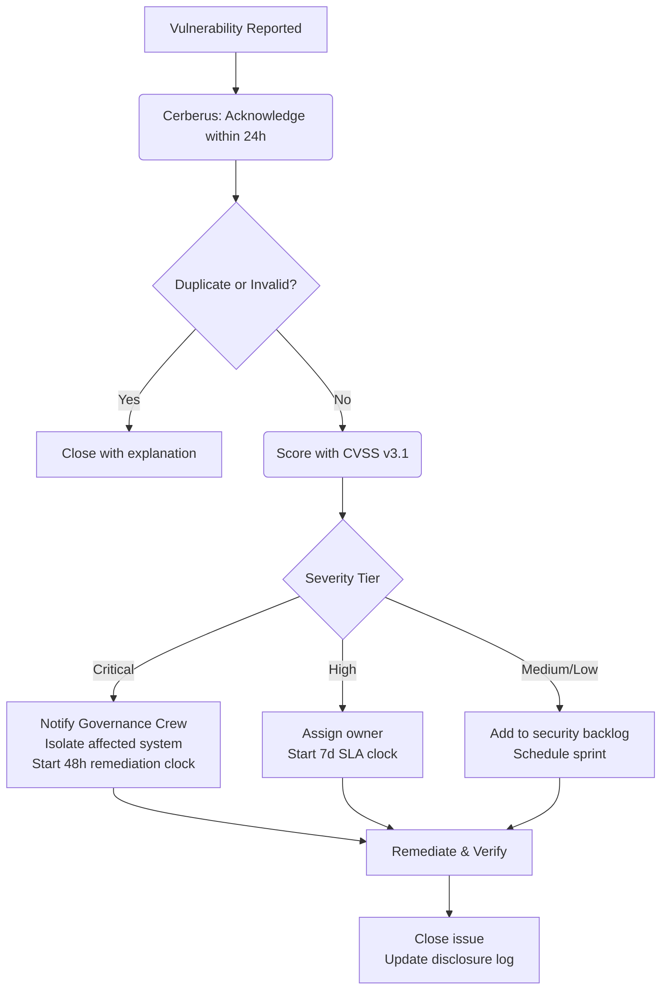

# Vulnerability Management Protocol

## 1. Purpose and Scope

### 1.1. Purpose

This protocol defines how Gencraft Studio discovers, reports, triages, remediates, and discloses security vulnerabilities in its systems, services, and dependencies. It establishes:

- A single, confidential reporting channel for all vulnerability reports.
- CVSS-based severity tiers with binding SLA targets for remediation.
- Clear ownership and escalation paths.
- A coordinated disclosure policy for vulnerabilities in Gencraft-produced software.

### 1.2. Scope

This protocol covers all vulnerabilities in Gencraft-produced or Gencraft-operated assets, including:

- Game client (`gcp-aethel-client`), game server (`gcp-aethel-server`), and PCG library (`gcp-aethel-pcg`).
- Backend microservices (`gcl-srv-authentication`, `gcl-srv-persistence`, etc.).
- AI Gem `Tools` and MCP Servers.
- Infrastructure and IaC configurations (`gencraft-iac`).
- Third-party dependencies used in any of the above.

---

## 2. Vulnerability Severity Classification

All vulnerabilities **must** be scored using CVSS v3.1 (or v4.0 where applicable). The following tiers map CVSS Base Score to Gencraft severity levels and remediation SLAs:

| Severity | CVSS Base Score | Description | Remediation SLA | Notification |
|----------|----------------|-------------|----------------|--------------|
| **Critical** | 9.0 – 10.0 | Exploitable remotely, no authentication required, data breach or full system compromise likely | **48 hours** | `Cerberus` + Governance Crew immediately |
| **High** | 7.0 – 8.9 | Significant impact, may require some privilege or user interaction | **7 days** | `Cerberus` notified within 24 hours |
| **Medium** | 4.0 – 6.9 | Limited impact or requires significant preconditions | **30 days** | Standard triage backlog |
| **Low** | 0.1 – 3.9 | Minimal impact, defence-in-depth reduction only | **90 days** | Standard triage backlog |
| **Informational** | 0.0 | Best-practice improvement, no direct impact | Next scheduled review | Logged |

SLAs are measured from the point the vulnerability is **confirmed** (not merely reported).

---

## 3. Reporting Channel

### 3.1. Internal Reporting (Studio Members)

Any Gencraft member (human or AI Gem) who discovers or suspects a vulnerability **must** report it via a **confidential GitHub Issue** in the `gcs-security-core` repository using the `security-vulnerability-report-template.md`.

- Issues **must** be created with `Confidential` visibility (GitHub private security advisory if supported, otherwise restricted-access issue).
- **Do not** discuss vulnerability details in public repositories, Discord, or other open channels until the vulnerability is resolved and a disclosure decision has been made.

### 3.2. External Reporting (Responsible Disclosure)

External researchers who discover vulnerabilities in Gencraft-operated systems should report via the contact email listed in `gencr-ft.github.io/security.txt`. Gencraft commits to:

- Acknowledge receipt within 48 hours.
- Provide a status update within 7 days.
- Credit the reporter in disclosure notes (unless anonymity is requested).

---

## 4. Triage and Assessment Process

### 4.1. Confirmation

`Cerberus` **must** confirm or reject a reported vulnerability within **24 hours** of receipt. Confirmation requires reproducing the vulnerability or independently verifying the reported evidence.

### 4.2. CVSS Scoring

`Cerberus` **must** assign a CVSS v3.1 Base Score and record the full vector string in the issue. Where context affects exploitability (e.g., the vulnerable component is only reachable internally), the Environmental Score **must** also be recorded.

### 4.3. Ownership Assignment

Each confirmed vulnerability **must** have a named owner responsible for driving remediation. Default ownership:

| Asset Category | Default Owner |
|---------------|--------------|
| Backend services / APIs | Relevant service lead + `Isaac` for architecture review |
| Game client | `gcp-aethel-client` maintainer |
| IaC / Infrastructure | `Adam` (GCT-DVO-DSINF-001) |
| AI Gem Tools | AIE Team lead (`Aura`) |
| Third-party dependency | `Adam` for patch; `Isaac` for architecture impact assessment |

---

## 5. Remediation

### 5.1. Remediation Expectations

- **Critical:** The affected component **must** be isolated (taken offline, rate-limited, or access-revoked) immediately while a patch is developed. The patch **must** be deployed within 48 hours of confirmation. If a full fix is not feasible within 48 hours, a temporary mitigating control **must** be in place within 48 hours and the full fix within 7 days.
- **High:** A patch **must** be developed and deployed within 7 days. No isolation is required unless exploitation is active.
- **Medium / Low:** Remediation is tracked in the security backlog and addressed within the defined SLA.

### 5.2. Verification

After remediation is deployed, `Cerberus` **must** independently verify that the vulnerability is resolved before closing the tracking issue. For Critical and High findings, verification **must** include a targeted retest.

### 5.3. Third-Party Dependencies

- `Adam` **must** maintain tooling (`npm audit`, `cargo audit`, `pip-audit`) running in CI to detect vulnerable dependencies automatically.
- Dependencies with Critical or High CVEs **must** be patched or replaced within the corresponding SLA.
- If a patched version is not available, a documented risk-acceptance decision signed by `Cerberus` is required, with a mitigating control in place.

---

## 6. Coordinated Disclosure

Once a vulnerability is remediated and deployed:

1. `Cerberus` drafts a disclosure summary documenting: vulnerability type, affected versions, fix version, CVSS score, CVE (if applicable), and credits.
2. The summary is reviewed by the Governance Crew and `Henri` (GCT-MGT-LGLS-001) for legal considerations.
3. For Critical/High vulnerabilities in Gencraft-operated public services, the disclosure summary is published in the `gencr-ft.github.io` security advisories section after a **90-day embargo** from the fix deployment (or sooner if the vulnerability was publicly disclosed by a third party).
4. If a CVE is warranted, `Cerberus` requests a CVE number from the appropriate CNA.

---

## 7. Metrics and Reporting

`Cerberus` **must** produce a quarterly Vulnerability Management Report covering:

- Total vulnerabilities reported, confirmed, and resolved per severity tier.
- Mean time to remediate (MTTR) per severity tier vs. SLA targets.
- Dependency vulnerability trends (open CVEs by severity over time).
- SLA breaches and root cause summary.

Reports are shared with the Governance Crew and logged as governance records.

---

## 8. Vulnerability Management for AI Gems

Operational directives for AI Gems:

- **Reporting:** If a Gem, during code review, dependency analysis, or runtime monitoring, identifies a vulnerability or a pattern matching a known vulnerability class, it **must** immediately create a confidential report via `Tool:ReportVulnerability(asset, description, cvss_vector_estimate)` and halt any work that could amplify the exposure.
- **No Self-Remediation without Approval:** A Gem **must not** unilaterally patch a vulnerability in a production system. It creates the report and waits for `Cerberus` to assign and approve the fix.
- **Dependency Scanning:** Gems that generate or modify `package.json`, `Cargo.toml`, or `requirements.txt` **must** run the appropriate audit tool immediately after modification and include the scan result in the PR description.
- **Secret in Code:** If a Gem reviews code containing a potential hardcoded secret, it **must** treat this as a High severity finding and report it immediately, regardless of whether the value is verifiably sensitive.

---

## 9. References

- `SEC-STANDARD-001.information-classification-and-handling-policy.md`
- `SEC-POLICY-001.secure-development-lifecycle-policy.md` — SDL gates that generate findings
- `SEC-GUIDE-003.security-incident-response-plan.md` — for Critical vulnerabilities under active exploitation
- `SEC-GUIDE-004.security-awareness-and-training-program.md`
- OPS-GUIDE-008 §8.6 — parent protocol section
- CVSS v3.1 Specification: https://www.first.org/cvss/v3.1/specification-document
