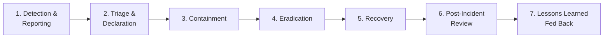

# Security Incident Response Plan

## 1. Purpose and Scope

### 1.1. Purpose

This Security Incident Response Plan (SIRP) defines the structured process Gencraft Studio follows to detect, contain, eradicate, and recover from security incidents. It ensures that incidents are handled consistently, damage is minimised, evidence is preserved, and lessons are systematically fed back into preventive controls.

This plan is a specialised extension of OPS-GUIDE-003 (Protocol S3 — Emergency Management). All security incidents are by definition S3 incidents, but this plan provides the additional, security-specific procedures required.

### 1.2. Scope

This plan applies to all security incidents affecting Gencraft Studio assets, including:

- Unauthorised access to or exfiltration of Gencraft data.
- Compromise of AI Gem identities, service accounts, or credentials.
- Malware, ransomware, or supply-chain compromise affecting Gencraft systems.
- DDoS or availability attacks on Gencraft services.
- Insider threat incidents (human or Gem behaving outside authorised scope).
- Exploited vulnerabilities in Gencraft-produced or operated software.
- Significant CI/CD pipeline compromise.

---

## 2. Incident Severity Levels

Security incidents are classified using the same four-tier model as general incidents (S3), with security-specific criteria:

| Level | Label | Criteria | Example |
|-------|-------|---------|---------|
| SEV-1 | Critical | Active data exfiltration, full system compromise, production service completely unavailable due to attack | Attacker exfiltrating player data; ransomware on production DB |
| SEV-2 | High | Confirmed unauthorised access, partial system compromise, active exploitation in progress | Compromised service account; exploited RCE in staging |
| SEV-3 | Medium | Suspected compromise, anomalous behaviour requiring investigation, non-critical system affected | Unusual API call patterns; low-severity CVE exploitation attempt |
| SEV-4 | Low | Security policy violation with no confirmed system impact, failed attack attempt | Hardcoded secret found in a PR; port scan detected |

---

## 3. Roles and Responsibilities

| Role | Responsibility During Incident |
|------|-------------------------------|
| **Incident Commander (IC)** — `Cerberus` (GCT-MGT-SECOFF-001) | Declares incident level; directs all response actions; owns external communications; makes containment decisions |
| **Security Response Team (SRT)** | `Cerberus` + `Isaac` + `Adam` + impacted service owner(s). Assembled immediately for SEV-1/2. |
| **Communications Lead** — `Orion` (GCT-UTL-SLG-001) | Manages internal stakeholder communications; coordinates player-facing communications if applicable |
| **Legal Counsel** — `Henri` (GCT-MGT-LGLS-001) | Advises on disclosure obligations, regulatory notification, and evidence handling |
| **Executive Sponsor** — Governance Crew | Briefed for SEV-1/2; approves major containment actions with significant business impact |
| **All other Gems** | Cease normal operations on affected systems if directed; do not take independent containment actions; report observations to IC |

---

## 4. Incident Response Phases

### 4.1. Phase 1 — Detection and Reporting

Security incidents may be detected via:

- Automated alerts from `Véra` or `Cerberus` monitoring tools.
- CI/CD security gate failures indicating active compromise.
- Reports from Gems or humans via `Tool:LogSecurityIncident`.
- External responsible disclosure (see `SEC-GUIDE-002`).

**Reporting:** Any Gem or human detecting a potential security incident **must** immediately:
1. Create a confidential GitHub Issue in `gcs-security-core` using `security-incident-report-template.md`.
2. Notify `Cerberus` directly via the designated emergency channel (Discord `#security-incidents-confidential`).
3. **Not** discuss the incident in public channels or attempt independent remediation.

### 4.2. Phase 2 — Triage and Declaration

`Cerberus` **must** triage and classify the incident within:

- **SEV-1/2:** 30 minutes of report receipt.
- **SEV-3/4:** 4 hours of report receipt.

Upon classification, `Cerberus` declares the incident formally by:
1. Updating the GitHub Issue with severity level and IC assignment.
2. Assembling the Security Response Team (for SEV-1/2).
3. Notifying the Governance Crew (for SEV-1/2) and `Henri` (for SEV-1).

### 4.3. Phase 3 — Containment

**Goal:** Stop the bleeding. Prevent further damage without destroying forensic evidence.

Containment actions are classified as:

| Type | Description | Example |
|------|-------------|---------|
| Short-term | Immediate actions to halt active damage | Revoke compromised credentials; isolate affected service |
| Long-term | Stable interim measures while eradication is prepared | Deploy WAF rule; disable vulnerable endpoint |

`Cerberus` **must** document every containment action taken (what, when, who) in the incident issue.

**Forensic Preservation:** Before any system is modified for containment, relevant logs, memory dumps, and disk snapshots **must** be preserved in a secure, write-once location. `Adam` is responsible for the technical execution of preservation.

### 4.4. Phase 4 — Eradication

**Goal:** Remove the root cause and any attacker-installed artefacts.

- All compromised credentials **must** be revoked and replaced.
- Malicious code, backdoors, and injected artefacts **must** be identified and removed.
- The root cause (vulnerable code path, misconfigured IAM, compromised dependency) **must** be identified and remediated per `SEC-GUIDE-002` SLAs.
- `Isaac` **must** review architectural changes before they are deployed.

Eradication is not complete until `Cerberus` independently verifies that the threat has been fully removed.

### 4.5. Phase 5 — Recovery

**Goal:** Restore normal operations safely.

- Systems are restored from known-good, clean backups or re-deployed from version-controlled IaC.
- Restored systems **must** be verified clean before returning to production (using the same CI security gates defined in `SEC-POLICY-001`).
- Recovery is performed incrementally, with monitoring intensified during the recovery window.
- `Cerberus` declares the incident resolved in the GitHub Issue once normal operations are confirmed.

### 4.6. Phase 6 — Post-Incident Review

A post-incident review **must** be conducted within **5 business days** of incident resolution for SEV-1/2 and within **15 business days** for SEV-3/4.

The review **must** produce a Post-Incident Report (PIR) documented as a Decision Record (Protocol S7) containing:

- Incident timeline (detection to resolution).
- Root cause analysis (5 Whys or equivalent).
- Damage assessment (data exposed, systems affected, duration of impact).
- Effectiveness of containment and eradication actions.
- Lessons learned.
- Action items (created as GitHub Issues with `action-item` label and assigned owners).

The PIR is shared with the Governance Crew and stored in `governance/incident-records/`.

---

## 5. Communication During an Incident

### 5.1. Internal

- All incident communications **must** use the `#security-incidents-confidential` Discord channel or direct encrypted messages.
- Status updates **must** be posted to the incident issue every 2 hours for active SEV-1/2 incidents.
- All Gems **must** follow directives from `Cerberus` as IC without deviation during a declared incident.

### 5.2. External (Player-Facing or Regulatory)

- No external communication about a security incident may be made without approval from `Cerberus`, `Henri`, and the Governance Crew.
- Regulatory notification obligations (e.g., GDPR 72-hour breach notification) are managed by `Henri`. `Cerberus` **must** notify `Henri` within 2 hours of any SEV-1/2 incident involving personal data.

---

## 6. Relationship with Other Protocols

| Protocol | Relationship |
|----------|-------------|
| OPS-GUIDE-003 (S3 — Emergency Management) | SIRP is a specialised extension; general S3 procedures apply unless this plan specifies otherwise |
| `SEC-GUIDE-002` (Vulnerability Management) | Vulnerabilities under active exploitation are escalated to this plan; patched vulnerabilities revert to SEC-GUIDE-002 tracking |
| OPS-GUIDE-018 (S18 — Grievance Reporting) | Insider threat incidents may overlap with S18; `Cerberus` and `Henri` coordinate |
| OPS-GUIDE-005 (S5 — Lessons Learned) | Post-incident PIRs feed into S5 retrospective process |

---

## 7. Security Incident Response for AI Gems

Operational directives for AI Gems during a declared security incident:

- **Stop and Report:** If a Gem detects anomalous behaviour (unexpected access patterns, credential errors suggesting compromise, unusual data volumes), it **must** immediately use `Tool:LogSecurityIncident(event_details, severity_estimate)` and notify `Cerberus`.
- **No Independent Action:** A Gem **must not** attempt to contain, eradicate, or investigate a security incident without explicit direction from `Cerberus` as IC. Unauthorised changes during an incident can destroy evidence or worsen the situation.
- **Follow IC Directives:** During a declared incident, all Gem tasks involving affected systems **must** be suspended until `Cerberus` explicitly authorises resumption.
- **Preserve Evidence:** If a Gem has logs, call history, or state relevant to the incident, it **must** preserve and share this data with `Cerberus` on request. Do not clear caches or rotate credentials without IC approval during an active incident.
- **Communication Discipline:** A Gem **must** not mention the incident in any public channel, PR comment, or SSoT document during the active response phase.

---

## 8. References

- OPS-GUIDE-003 (S3 — Emergency Management)
- `SEC-STANDARD-001.information-classification-and-handling-policy.md`
- `SEC-GUIDE-001.access-control-policy.md`
- `SEC-STANDARD-002.data-security-standards.md`
- `SEC-POLICY-001.secure-development-lifecycle-policy.md`
- `SEC-GUIDE-002.vulnerability-management-protocol.md`
- OPS-GUIDE-008 §8.7 — parent protocol section
- OPS-GUIDE-005 (S5 — Lessons Learned) — PIR integration
