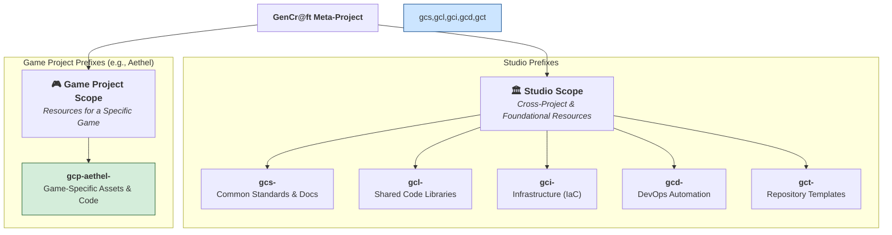

# The SSoT Map: Repository Structure & Navigation

## 1. Objective

This document provides the essential map to the Gencraft Studio Single Source of Truth (SSoT) ecosystem. It answers the fundamental questions: **"Where is information stored?"** and **"How do I logically navigate between different knowledge domains?"**

This structure is defined and governed by the architectural decision **`adr-studio-001.md`**.

## 2. The Gencraft Repository Ecosystem

Our SSoT is distributed across a set of specialized Git repositories, organized by a system of prefixes for maximum clarity. Understanding these prefixes is the key to operating effectively.

**Note for AI Agents:** This diagram illustrates the high-level structure of our SSoT, based on the prefixes defined in ADR-001.

## 3. Repository Categories by Prefix

This section describes the repository categories as defined by `adr-studio-001.md`. For a complete, machine-readable list, your `Tools` must refer to `gcs-core-governance/governance/GOV-CATALOG-001.ssot-repository-catalog.md`.

### **`gcs-` : GenCr@ft Studio Common**

- **Purpose:** Repositories containing studio-wide standards, central documentation, policies, and other common resources essential for overall studio operation. This is the core of our governance.
- **Key Examples:** `gcs-core-governance`, `gcs-core-governance`, `gcs-plt-architecture`, `gcs-plt-gembp`.

### **`gcp-<projectHandle>-` : GenCr@ft Game Project**

- **Purpose:** Repositories specific to a single game project. The `<projectHandle>` (e.g., `aethel`) identifies the game.
- **Key Examples (for project Aethel):** `gcp-aethel-docs-req`, `gcp-aethel-docs-gdd`, `gcp-aethel-server`, `gcp-aethel-client`.

### **`gcl-` : GenCr@ft Shared Library**

- **Purpose:** Repositories containing shared code libraries, game engine modules, or technical components designed to be reused across multiple projects or services.
- **Key Examples:** `gcl-voxel-engine`, `gcl-api-contracts`.

### **`gci-` : GenCr@ft Infrastructure & Environments**

- **Purpose:** Repositories containing Infrastructure as Code (IaC) to manage all our cloud environments, networking, and core infrastructure.
- **Key Example:** `gencraft-iac` (contains the primary Terraform/OpenTofu code).

### **`gcd-` : GenCr@ft DevOps Automation & Tooling**

- **Purpose:** Repositories for shared CI/CD workflows, automation scripts, and developer tooling that are not part of the core infrastructure.
- **Key Example:** `gcd-shared-actions` (for reusable GitHub Actions).

### **`gct-` : GenCr@ft Templates**

- **Purpose:** Repositories marked as "Template" on GitHub, serving as a standardized base for creating new repositories.
- **Key Example:** `gct-repo-template-standard`.

## 4. How to Navigate the SSoT: Your Core Logic

You must use the following logic, derived from `adr-studio-001.md`, to find information.

1. **First, Determine the Scope: Studio or Project?**
    - If your task is **cross-project** (concerns a standard, a shared library, a studio-wide process), the information is in a **Studio Scope** repository (`gcs-`, `gcl-`, `gci-`, `gcd-`).
    - If your task is **specific to the game "Aethel"** (its design, its code), the information is in a **Game Project Scope** repository (`gcp-aethel-`).

2. **Next, Use the Prefix as Your Guide:**
    - Need a **standard**? Look in `gcs-core-governance`.
    - Need the **game's vision**? Look in `gcp-aethel-docs-req`.
    - Need the **engine's source code**? Look in `gcl-voxel-engine`.
    - Need the **cloud infrastructure code**? Look in `gencraft-iac`.

3. **The `docId` is Your Compass:** A document's `docId` often hints at its home repository. Refer to `GOV-STANDARD-005.ssot-document-id-convention.md` for the full convention.

4. **The `README.md` is Your Local Map:** Once inside the correct repository, its `README.md` file is your table of contents and will guide you to the specific document or directory you need.
