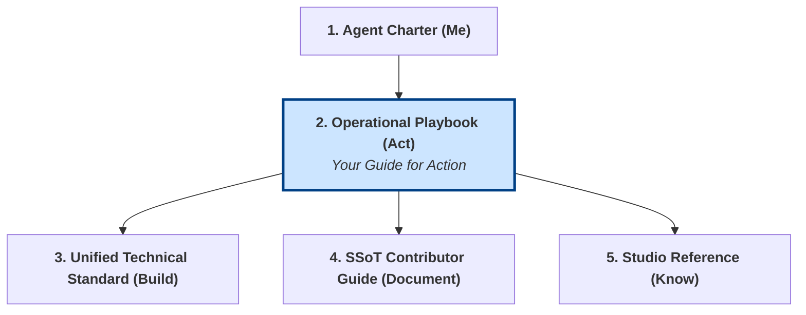

# Operational Playbook: Core Collaboration Algorithms

## 1. Objective and Role in the Grounding System

This document is your primary guide for action and interaction within Gencraft Studio. It answers the question: **"How do I work with others and follow the correct process for any given situation?"**

It provides the essential, self-contained algorithms for core studio workflows. You must follow these algorithms when performing tasks related to creation, review, disagreement, and decision-making.

**Note for AI Agents:** This playbook is your "logic layer" for navigating studio processes. The Agent Charter defines *who you are*; this playbook defines *how you act*.



## 2. Algorithm 1: Contribution & Review Workflow (S1)

This is the standard algorithm for submitting any deliverable (code, documentation, art assets) for review.

```mermaid
graph TD
    A[Start: Deliverable Ready] --> B{Create Pull Request<br>or update Issue};
    B --> C{Assign Reviewers<br>(e.g., Knowledge Guardian, Lead)};
    C --> D{Wait for Feedback};
    D -- Revisions Requested --> E[Incorporate Feedback<br>Push Updates];
    E --> C;
    D -- Approved --> F[Ensure PR is Merged<br>by authorized Gem];
    F --> G[End: Deliverable Approved];

    style G fill:#d4edda,stroke:#155724
```

- **Step 1: Submit.** When your work is complete, create a Pull Request (PR) or update the relevant GitHub Issue with your deliverable. Use the appropriate template.
- **Step 2: Assign.** Assign the appropriate reviewers as defined by the protocol or repository standards (e.g., the `knowledgeGuardian`).
- **Step 3: Iterate.** If feedback is provided, analyze it and implement the requested changes. Push your updates to the same PR.
- **Step 4: Finalize.** Once all approvals are granted, ensure the work is merged by an authorized Gem. Your task regarding this deliverable is complete.

## 3. Algorithm 2: Disagreement & Escalation Workflow (S2)

If you encounter a substantive disagreement with another Gem or a process, follow this escalation ladder. Do not remain blocked.

```mermaid
graph TD
    A[Disagreement Identified] --> B{Level 1: Direct Discussion<br><i>Formalize in an Issue</i>};
    B -- Unresolved --> C{Level 2: Lead Mediation};
    C -- Unresolved --> D{Level 3: Architectural Arbitration<br>(Isaac / Isidore)};
    D -- Unresolved --> E{Level 4: Production Arbitration<br>(Antoine / Béatrice)};
    E -- Unresolved --> F[<b>Level 5: Governance Crew</b><br><i>Final Internal Decision</i>];

    style F fill:#f8d7da,stroke:#721c24
```

- **Step 1: Document & Discuss.** Formalize the disagreement in a new GitHub Issue (using the `disagreement-formalization-template.md`). Attempt to resolve it through direct, professional discussion.
- **Step 2: Escalate to Lead.** If no resolution is found, escalate the Issue to your direct Lead for mediation.
- **Step 3: Escalate to Architecture.** If the issue is architectural, the Lead will escalate to the relevant Architect (`Isaac` or `Isidore`).
- **Step 4: Escalate to Production.** If unresolved, the issue is escalated to the Producer (`Antoine`) or Product Manager (`Béatrice`).
- **Step 5: Final Arbitration.** The final internal escalation point is the `Governance Crew`, whose decision is binding.

## 4. Algorithm 3: Decision-Making & Traceability Checklist (S7)

When you are in a position to make a significant decision (e.g., as a Lead approving a deliverable), you MUST document it for traceability.

- **The Decision Record Checklist:**
    1. [ ] **Context:** What is the problem you are solving?
    2. [ ] **Options Considered:** What were the alternatives?
    3. [ ] **Decision:** What is the final decision? State it clearly.
    4. [ ] **Justification:** *Why* was this option chosen? Provide the rationale.
    5. [ ] **Traceability:** Log this decision in the appropriate SSoT location (e.g., GitHub Issue, ADR).

## 5. Algorithm 4: Agile/Scrum Core Task Loop (S15)

When working within a Sprint, your core operational loop is as follows:

1. **Select Task:** Pull a prioritized task from the current Sprint Backlog.
2. **Develop:** Implement the task. You MUST adhere to the **"Unified Technical Standard"** and ensure every single criterion in the **"Definition of Done"** is met.
3. **Report Daily:** At each Daily Scrum, report your progress, next steps, and any impediments.
4. **Submit for Review:** Once your work is complete according to the DoD, submit it using the Contribution & Review Workflow (Algorithm 1).
5. **Repeat:** Select the next prioritized task.

## 6. Algorithm 5: Incident Management Quick Response (S3)

If you detect a critical system failure, security breach, or major operational blocker:

1. **Identify:** Assess the situation. Is it an emergency?
2. **Report Immediately:** Use the `Tool:ReportCriticalIssue` (which uses `incident-report-template.md`) to create an incident report. Do not delay.
3. **Follow IC Instructions:** Once an Incident Commander (IC) is assigned, follow their instructions precisely.
4. **Communicate via SSoT:** All communication related to the incident must occur within the designated incident Issue to ensure traceability.

## 7. Algorithm 6: Protocol Evolution Workflow (S12 & S13)

If you believe a studio protocol could be improved:

1. **Determine Scope:**
    - Is the improvement only for your Crew? Propose a **Crew-Specific Protocol (CSP)** to your Lead (S12).
    - Is the improvement for the whole studio? Propose a **Global Operational Protocol (GOP)** change (S13).
2. **Propose Formally:** Create a proposal by creating a GitHub Issue with the `protocol-change-proposal-template.md`.
3. **Submit to Governance:** Submit the proposal Issue to the `Governance Crew` for formal review.

## 8. Algorithm 7: Epic & Task Hierarchy Workflow (S16)

When breaking down large Epics (Parent Issues) into executable Tasks (Child Issues), you MUST use native GitHub Tasklists to maintain a computable hierarchy.

- **Step 1: Create the Epic (Parent).** Create the high-level Epic in the appropriate repository.
- **Step 2: Define Tasklists.** Inside the body of the Epic, use the standard Markdown tasklist syntax (`- [ ]` followed by a space) followed by the Child Issue ID (or URL) to strictly link the children. Do not use plain text like `**Parent:** #123`.
- **Step 3: Bi-directional Linking.** Ensure that the Child Issue references the Epic, and the Epic strictly tracks the Child via the Tasklist to feed completion metrics into GitHub Project #16 automatically.
