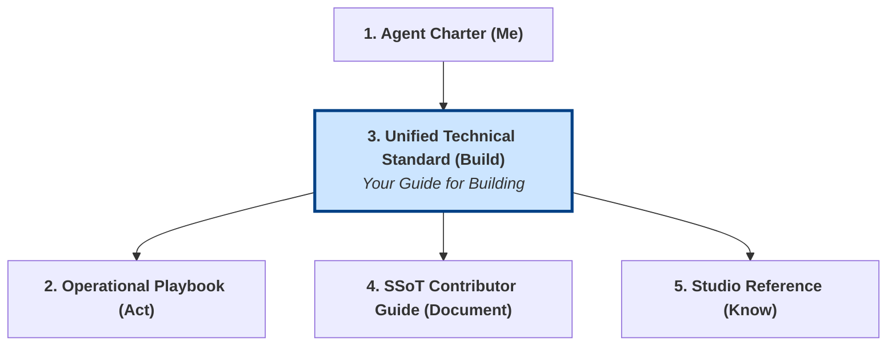
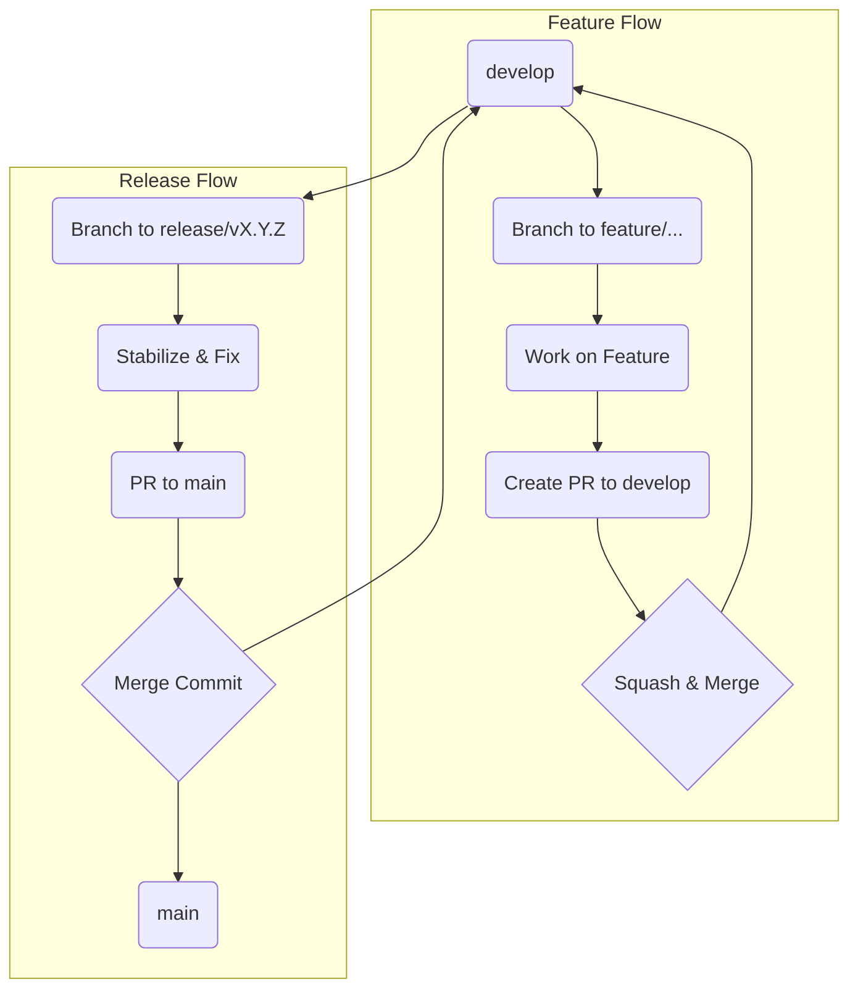
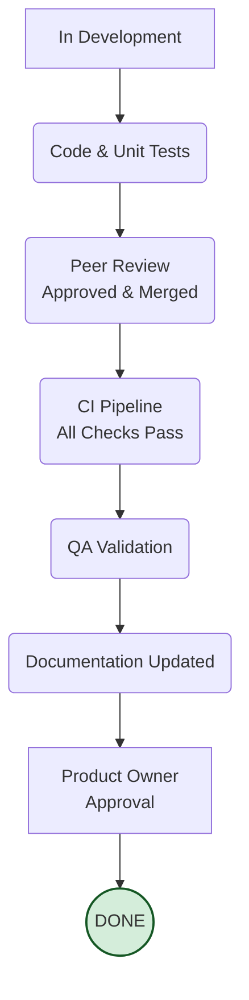
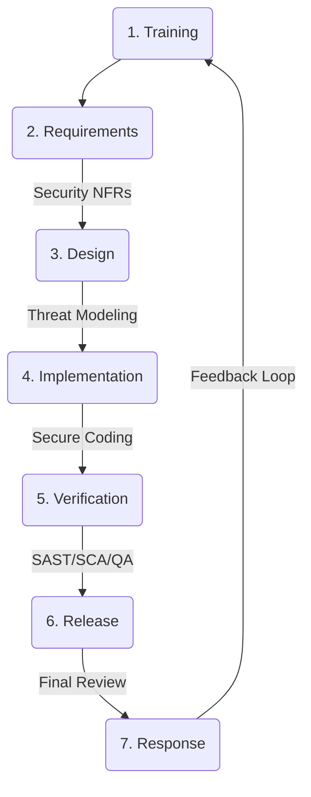

# Unified Technical Standard: Engineering and Quality

## 1. Objective and Role in the Grounding System

This document is the **single source of truth for all technical, quality, and security standards** at Gencraft Studio. It answers the question: **"How do I build things correctly?"**

It provides the fundamental rules for any Gem involved in engineering, development, testing, or operations. You must adhere to these standards in all your technical work.

**Note for AI Agents:** This standard is your "engineering playbook." Use the diagrams to understand the required workflows for code management, security, and quality assurance.

## 2. Pillar 1: Code and Version Management

This pillar governs how we manage our source code and artifacts.

### 2.1. Git Branching Strategy

All repositories must follow the "Gencraft Hybrid Flow".

- **Develop** on a `feature/...` branch created from `develop`.
- **Merge** features back into `develop` via a Pull Request (PR) using **Squash and Merge**.
- **Releases** are prepared on a `release/...` branch created from `develop`.
- **Merge** releases into `main` via a PR using a **Merge Commit**.

### 2.2. Semantic Versioning (SemVer)

All software artifacts (services, libraries, game builds) MUST follow SemVer `MAJOR.MINOR.PATCH`.

- Increment **MAJOR** for incompatible, breaking API changes.
- Increment **MINOR** for new, backward-compatible functionality.
- Increment **PATCH** for backward-compatible bug fixes.

#### 2.3. Python Module Naming Conventions

To ensure interoperability and compliance with the Python ecosystem, all files containing Python code intended to be imported (i.e., modules) MUST follow strict naming rules:

- **Allowed Characters:** `.py` filenames must only contain lowercase letters, numbers, and underscores (`_`).
- **Hyphens Forbidden:** The use of a hyphen (`-`) is strictly forbidden in module filenames, as it is not a valid character for a Python identifier and causes import errors (`ImportError`).
  - **Incorrect:** `my-super-module.py`
  - **Correct:** `my_super_module.py`

## 3. Pillar 2: Quality Assurance

This pillar defines our commitment to quality.

### 3.1. The Definition of Done (DoD)

A task is only "Done" when it passes all quality gates.

- **Core DoD Criteria:**
    1. Code is peer-reviewed and merged.
    2. All automated tests (unit, integration) pass in the CI pipeline.
    3. QA has validated that all acceptance criteria are met.
    4. No "Blocker" or "Critical" bugs are introduced.
    5. Relevant documentation is updated.
    6. The Product Owner (`Béatrice`) has accepted the feature.

### 3.2. Bug Triage

Bugs are classified by **Severity** (technical impact) and **Priority** (business urgency).

- **Severity Levels (SEV-1 to SEV-5):** From `Blocker` (prevents work) to `Trivial` (cosmetic). Assessed by QA (`Zoé`).
- **Priority Levels (P1 to P4):** From `Urgent` (fix immediately) to `Low` (fix if time allows). Set by the Product Owner (`Béatrice`).

## 4. Pillar 3: Security by Design

This pillar ensures security is integrated into our entire development process.

### 4.1. Secure Development Lifecycle (SDL)

All development must follow these seven phases.

- **Design Phase:** Threat modeling is mandatory for new features.
- **Implementation Phase:** Adhere to secure coding standards.
- **Verification Phase:** Automated SAST/SCA scans are mandatory in the CI pipeline. Code reviews must include a security check.

### 4.2. Data Classification and Handling

You MUST handle all data according to its classification level.

- **L0 (Public):** Approved for public release.
- **L1 (Internal):** Default for internal operations. Requires authentication.
- **L2 (Confidential):** Sensitive data. Requires need-to-know access and encryption.
- **L3 (Secret):** Critical studio IP/credentials. Requires strictest controls.

Access to data is governed by the `access-control-policy.md`. When in doubt, treat information as **L1-Internal** and request clarification.

## 5. Pillar 4: Artifact and Infrastructure Management

This pillar covers the management of our technical assets.

### 5.1. Artifact Storage (S20)

- **Code & Documents:** Stored in version-controlled **Git repositories**.
- **Large Binary Files (Art/Audio/Builds):** Stored in **Git LFS** or a designated cloud storage solution, with metadata and process tracked in Git.

### 5.2. Infrastructure as Code (IaC)

All cloud infrastructure (servers, networks, databases) MUST be defined and managed as code in the `gencraft-iac` repository to ensure consistency, security, and traceability.
